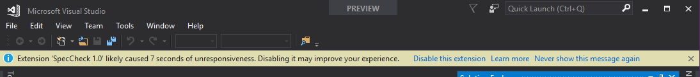
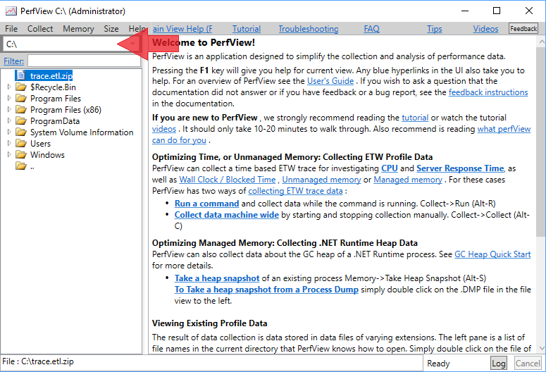
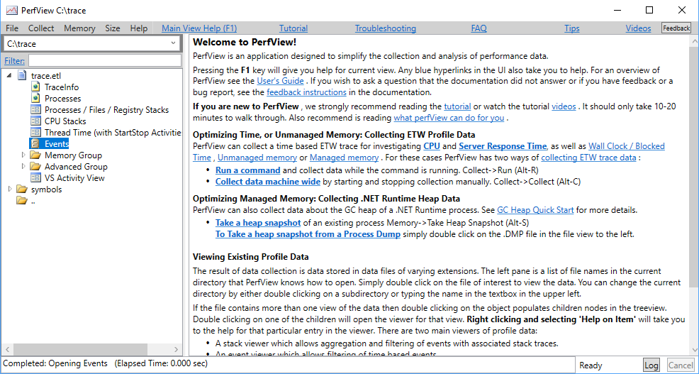
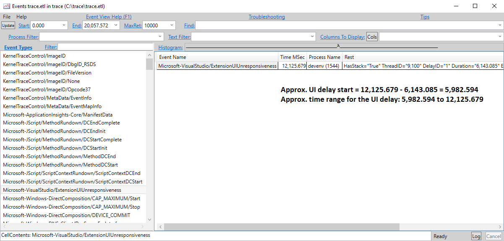
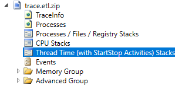
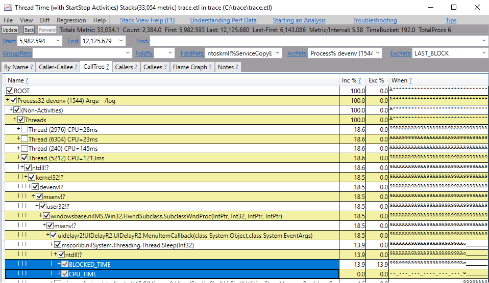
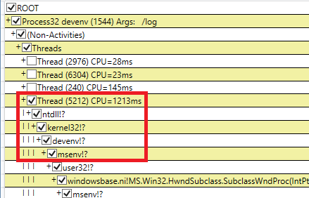
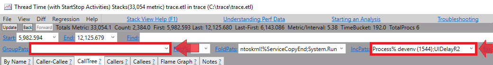

# Diagnose UI delays caused by extensions

When UI becomes unresponsive, Visual Studio examines the call-stack of the UI thread, starting with the leaf and working towards the base. If Visual Studio determines that a call-stack frame belongs to a module that is part of an installed and enabled extension, it shows a notification.



The notification informs the user that the UI delay (that is, the unresponsiveness in the UI) might have been the result of code from an extension. It also provides the user with options to disable the extension or future notifications for that extension.

This document describes how you can diagnose what in your extension code is causing UI delay notifications.

> [!NOTE]
> Do not use the Visual Studio experimental instance to diagnose UI delays. Some parts of the call-stack analysis required for UI delay notifications are turned off when using the experimental instance, meaning that UI delay notifications may not be shown.

An overview of the diagnostic process is as follows:
1. Identify the trigger scenario.
2. Restart VS with activity logging on.
3. Start ETW tracing.
4. Trigger the notification to appear again.
5. Stop ETW tracing.
6. Examine the activity log to get the delay ID.
7. Analyze the ETW trace using delay ID from step 6.

In the following sections, we will go through these steps in more detail.

## Identify the trigger scenario

To do diagnose a UI delay, you first need to identify what (sequence of actions) causes Visual Studio to show the notification. This is in order for you to able to trigger the notification later with logging turned on.

## Restart VS with activity logging on

Visual Studio can generate an "activity log" that provides information helpful when debugging an issue. To turn on activity logging in Visual Studio, open Visual Studio with the `/log` command line option. After Visual Studio starts, the activity log is stored in the following location:

```DOS
%APPDATA%\Microsoft\VisualStudio\<vs_instance_id>\ActivityLog.xml
```

To learn more about how you can find your VS instance ID, see [Tools for detecting and managing Visual Studio instances](../install/tools-for-managing-visual-studio-instances.md). We will use this activity log later to find out more information about UI delays and related notifications.

## Starting ETW tracing

You can use [PerfView](https://github.com/Microsoft/perfview/) to collect an ETW trace. PerfView provides an easy-to-use interface both for collecting an ETW trace and for analyzing it. Use the following command to collect a trace:

```DOS
Perfview.exe collect C:\trace.etl /BufferSizeMB=1024 -CircularMB:2048 -Merge:true -Providers:*Microsoft-VisualStudio:@StacksEnabled=true -NoV2Rundown /kernelEvents=default+FileIOInit+ContextSwitch+Dispatcher
```

This enables the "Microsoft-VisualStudio" provider, which is the provider Visual Studio uses for events related to UI delay notifications. It also specifies the keyword for the kernel provider that PerfView can use to generate the **Thread Time Stacks** view.

## Trigger the notification to appear again

Once PerfView has started trace collection, you can use the trigger action sequence (from step 1) for the notification to appear again. Once the notification is shown, you can stop trace collection for PerfView to process and generate the output trace file.

## Stop ETW tracing

To stop trace collection, simply use the **Stop collection** button on the PerfView window. After you stop trace collection, PerfView will automatically process the ETW events and generates an output trace file.

## Examine the activity log to get the delay ID

As mentioned earlier, you can find the activity log at *%APPDATA%\Microsoft\VisualStudio\<vs_instance_id>\ActivityLog.xml*. Every time Visual Studio detects an extension UI delay, it writes a node to the activity log with `UIDelayNotifications` as the source. This node contains four pieces of information about the UI delay:

- The UI delay ID, a sequential number that uniquely identifies a UI delay in a VS session
- The session ID, which uniquely identifies your Visual Studio session from start to close
- Whether or not a notification was shown for the UI delay
- The extension that likely caused the UI delay

```xml
<entry>
  <record>271</record>
  <time>2018/02/03 12:02:52.867</time>
  <type>Information</type>
  <source>UIDelayNotifications</source>
  <description>A UI delay (Delay ID = 0) has been detected. (Session ID=16e49d4b-26c2-4247-ad1c-488edeb185e0; Blamed extension="UIDelayR2"; Notification shown? Yes.)</description>
</entry>
```

> [!NOTE]
> Not all UI delays result in a notification. Therefore, you should always check the **Notification shown?** value to correctly identify the right UI delay.

After you find the correct UI delay in the activity log, write down the UI delay ID specified in the node. You'll use the ID to look for the corresponding ETW event in the next step.

## Analyze the ETW trace

Next, open the trace file. You can do this either using the same instance of PerfView or by starting a new instance and setting the current folder path in the top-left of the window to the location of the trace file.



Then, select the trace file in the left pane and open it by choosing **Open** from the right-click or context menu.

> [!NOTE]
> By default PerfView outputs a Zip archive. When you open *trace.zip*, it automatically decompresses the archive and opens the trace. You can skip this by unchecking the **Zip** box during trace collection. However, if you are planning to transfer and use traces across different machines, we strongly recommend against unchecking the **Zip** box. Without this option, the required PDBs for Ngen assemblies will not accompany the trace and thus symbols from Ngen assemblies will not be resolved on the destination machine. (See [this blog post](https://devblogs.microsoft.com/devops/creating-ngen-pdbs-for-profiling-reports/) for more information on PDBs for Ngen assemblies.)

It can take several minutes for PerfView to process and open the trace. Once the trace is open, a list of various "views" appear under it.



We will first use the **Events** view to obtain the time-range of the UI delay:

1. Open the **Events** view by selecting `Events` node under the trace and choosing **Open** from the right-click or context menu.
2. Select "`Microsoft-VisualStudio/ExtensionUIUnresponsiveness`" in the left pane.
3. Press Enter

The selection is applied and all `ExtensionUIUnresponsiveness` events are displayed in the right pane.


Each row in the right pane corresponds to a UI delay. The event includes a "Delay ID" value which should match the delay ID in the activity log from the step 6. Since `ExtensionUIUnresponsiveness` is fired at the end of the UI delay, the timestamp of the event (roughly) marks the end time of the UI delay. The event also contains the duration of the delay. We can subtract the duration from the end timestamp to obtain the timestamp of when the UI delay started.



In the previous screenshot, for example, the timestamp of the event is 12,125.679 and the delay duration is 6,143.085 (ms). Thus,
* The delay start is 12,125.679 - 6,143.085 = 5,982.594.
* The UI delay time range is 5,982.594 to 12,125.679.

Once we have the time range, we can close out of the **Events** view and open the **Thread Time (with StartStop Activities) Stacks** view. This view is especially handy because often extensions that are blocking the UI thread are merely waiting on other threads or an I/O-bound operation. Thus, the **CPU Stack** view, which is the go-to option for most cases, may not capture the time the thread spends blocking since it is not using the CPU during that time. The **Thread Time Stacks** solves this problem by properly showing blocked time.



While opening **Thread Time Stacks** view, choose the **devenv** process to start analysis.



In the **Thread Time Stacks** view, in the top-left of the page, you can set the time-range to the values we calculated in the previous step and press **Enter** so the stacks are adjusted to that time range.

> [!NOTE]
> Determining which thread is the UI (startup) thread can be counterintuitive if trace collection is started after Visual Studio is already open. However, the first elements on the stack of the UI (startup) thread are most-likely always operating system DLLs (*ntdll.dll* and *kernel32.dll*) followed by `devenv!?` and then `msenv!?`. This sequence can help identify the UI thread.

 

You can also further filter this view by only including stacks that contain modules from your package.

* Set **GroupPats** to empty text to remove any grouping added by default.
* Set **IncPats** to include part of your assembly name in addition to existing process filter. In this case, it should be **devenv;UIDelayR2**.



PerfView has detailed guidance under the **Help** menu that you can use to identify performance bottlenecks in your code. Additionally, the following links provide more information on how to utilize Visual Studio threading APIs to optimize your code:

* [`https://github.com/Microsoft/vs-threading/blob/main/doc/index.md`](https://github.com/Microsoft/vs-threading/blob/main/doc/index.md)
* [`https://github.com/Microsoft/vs-threading/blob/main/doc/cookbook_vs.md`](https://github.com/Microsoft/vs-threading/blob/main/doc/cookbook_vs.md)

You can also use the new Visual Studio static analyzers for extensions (NuGet package [here](https://www.nuget.org/packages/microsoft.visualstudio.sdk.analyzers)), that provide guidance on best practices for writing efficient extensions. See a list of [VSSDK analyzers](https://github.com/Microsoft/VSSDK-Analyzers/blob/main/doc/index.md) and [threading analyzers](https://github.com/Microsoft/vs-threading/blob/main/doc/analyzers/index.md).

> [!NOTE]
> If you are unable to address the unresponsiveness due to dependencies you do not have control over (for example, if your extension has to call synchronous VS services on the UI thread), we would like to know about it. If you are a member of our Visual Studio Partner program, you can contact us by submitting a developer support request. Otherwise, use the 'Report a Problem' tool to submit your feedback and include `"Extension UI Delay Notifications"` in the title. Please also include a detailed description of your analysis.
