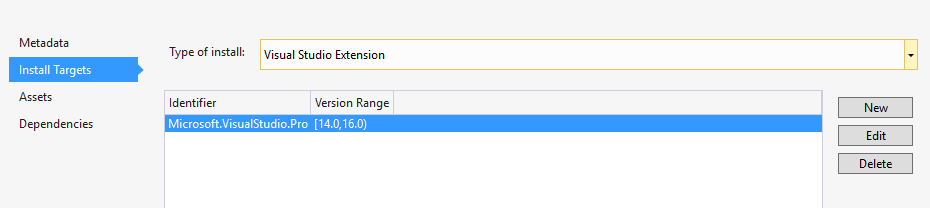
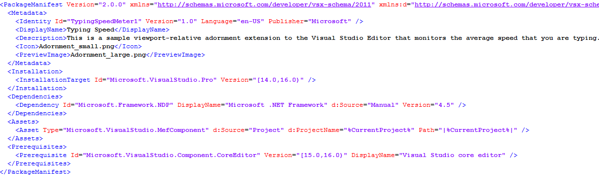
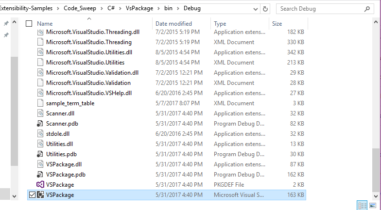

# Make extensions compatible with Visual Studio 2019/2017 and Visual Studio 2015

This document explains how to make extensibility projects round-trip between Visual Studio 2015 and Visual Studio 2019 or Visual Studio 2017. After completing this upgrade, a project will be able to open, build, install, and run in both Visual Studio 2015 and Visual Studio 2019 or 2017. As a reference, some extensions that can round-trip between Visual Studio 2015 and Visual Studio 2019 or 2017 can be found in the [VSSDK extensibility samples](https://github.com/Microsoft/VSSDK-Extensibility-Samples).

If you only intend to build in Visual Studio 2019/2017, but want the output VSIX to run in both Visual Studio 2015 and Visual Studio 2019/2017, then refer to the [Extension migration document](how-to-migrate-extensibility-projects-to-visual-studio-2017.md).

> [!NOTE]
> Due to changes in Visual Studio between versions, some things that worked in one version don't work in another. Ensure that the features you are trying to access are available in both versions or the extension will have unexpected results.

Here is an outline of the steps you'll complete in this document to round-trip a VSIX:

1. Import correct NuGet packages.
2. Update Extension Manifest:
    * Installation target
    * Prerequisites
3. Update CSProj:
    * Update `<MinimumVisualStudioVersion>`.
    * Add the `<VsixType>` property.
    * Add the debugging property `($DevEnvDir)` 3 times.
    * Add conditions for importing build tools and targets.

4. Build and Test

## Environment setup

This document assumes that you have the following installed on your machine:

* Visual Studio 2015 with the VSSDK installed
* Visual Studio 2019 or 2017 with the Extensibility workload installed

## Recommended approach

It is highly recommended to start this upgrade with Visual Studio 2015, instead of Visual Studio 2019 or 2017. The main benefit of developing in Visual Studio 2015 is to ensure that you do not reference assemblies that are not available in Visual Studio 2015. If you do development in Visual Studio 2019 or 2017, there is a risk that you might introduce a dependency on an assembly that only exists in Visual Studio 2019 or 2017.

## Ensure there is no reference to project.json

Later in this document, we will insert conditional import statements in to your **.csproj* file. This won't work if your NuGet references are stored in *project.json*. As such, it is advised to move all NuGet references to the *packages.config* file.
If your project contains a *project.json* file:

* Take a note of the references in *project.json*.
* From the **Solution Explorer**, delete the *project.json* file from the project. This deletes the *project.json* file and removes it from the project.
* Add the NuGet references back in to the project:
  * Right-click on the **Solution** and choose **Manage NuGet Packages for Solution**.
  * Visual Studio automatically creates the *packages.config* file for you.

> [!NOTE]
> If your project contained EnvDTE packages, they may need to be added by right clicking on **References** selecting **Add reference** and adding the appropriate reference. Using NuGet packages may create errors while trying to build your project.

## Add appropriate build tools

We need to be sure to add build tools that will allow us to build and debug appropriately. Microsoft has created an assembly for this called Microsoft.VisualStudio.Sdk.BuildTasks.

To build and deploy a VSIXv3 in both Visual Studio 2015 and 2019/2017, you will require the following NuGet packages:

Version | Built Tools
--- | ---
Visual Studio 2015 | Microsoft.VisualStudio.Sdk.BuildTasks.14.0
Visual Studio 2019 or 2017 | Microsoft.VSSDK.BuildTool

To do so:

* Add the NuGet package Microsoft.VisualStudio.Sdk.BuildTasks.14.0 to your project.
* If your project does not contain Microsoft.VSSDK.BuildTools, add it.
* Ensure the Microsoft.VSSDK.BuildTools version is 15.x or greater.

## Update extension manifest

### 1. Installation targets

We need to tell Visual Studio what versions to target for building a VSIX. Typically, these references are either to version 14.0 (Visual Studio 2015), version 15.0 (Visual Studio 2017), or version 16.0 (Visual Studio 2019). In our case, we want to build a VSIX that will install an extension for both, so we need to target both versions. If you want your VSIX to build and install on versions earlier than 14.0, this can be done by setting the earlier version number; however, version 10.0 and earlier are no longer supported.

* Open the *source.extension.vsixmanifest* file in Visual Studio.
* Open the **Install Targets** tab.
* Change the **Version Range** to [14.0, 17.0). The '[' tells Visual Studio to include 14.0 and all versions past it. The  ')' tells Visual Studio to include all versions up to, but not including, version 17.0.
* Save all changes and close all instances of Visual Studio.



### 2. Adding Prerequisites to the *extension.vsixmanifest* file

We need the Visual Studio Core Editor as a prerequisite. Open Visual Studio and use the updated manifest designer to insert the prerequisites.

To do this manually:

* Navigate to the project directory in File Explorer.
* Open the *extension.vsixmanifest* file with a text editor.
* Add the following tag:

```xml
<Prerequisites>
    <Prerequisite Id="Microsoft.VisualStudio.Component.CoreEditor" Version="[15.0,16.0)" DisplayName="Visual Studio core editor" />
</Prerequisites>
```

* Save and close the file.

> [!NOTE]
> You may need to manually edit the Prerequisite version to ensure it is compatible with all versions of Visual Studio 2019 or 2017. This is because the designer will insert the minimum version as your current version of Visual Studio (for example, 15.0.26208.0). However, since other users may have an earlier version, you will want to manually edit this to 15.0.

At this point, your manifest file should look something like this:



## Modify the project file (myproject.csproj)

It is highly recommended to have a reference to a modified .csproj open while doing this step. You can find several examples [here](https://github.com/Microsoft/VSSDK-Extensibility-Samples). Select any extensibility sample, find the *.csproj* file for reference and execute the following steps:

* Navigate to the project directory in **File Explorer**.
* Open the *myproject.csproj* file with a text editor.

### 1. Update the MinimumVisualStudioVersion

* Set the minimum visual studio version to `$(VisualStudioVersion)` and add a conditional statement for it. Add these tags if they do not exist. Ensure the tags are set as below:

```xml
<VisualStudioVersion Condition="'$(VisualStudioVersion)' == ''">14.0</VisualStudioVersion>
<MinimumVisualStudioVersion>$(VisualStudioVersion)</MinimumVisualStudioVersion>
```

### 2. Add the VsixType property.

* Add the following tag `<VsixType>v3</VsixType>` to a property group.

> [!NOTE]
> It is recommended to add this below the `<OutputType></OutputType>` tag.

### 3. Add the debugging properties

* Add the following property group:

```xml
<PropertyGroup>
    <StartAction>Program</StartAction>
    <StartProgram>$(DevEnvDir)devenv.exe</StartProgram>
    <StartArguments>/rootsuffix Exp</StartArguments>
</PropertyGroup>
```

* Delete all instances of the following code example from the *.csproj* file and any *.csproj.user* files:

```xml
<StartAction>Program</StartAction>
<StartProgram>$(ProgramFiles)\Microsoft Visual Studio 14.0\Common7\IDE\devenv.exe</StartProgram>
<StartArguments>/rootsuffix Exp</StartArguments>
```

### 4. Add conditions to the build tools imports

* Add additional conditional statements to the `<import>` tags that have a Microsoft.VSSDK.BuildTools reference. Insert `'$(VisualStudioVersion)' != '14.0' And` at the front of the condition statement. These statements will appear in the header and footer of the csproj file.

For example:

```xml
<Import Project="packages\Microsoft.VSSDK.BuildTools.15.0.26201…" Condition="'$(VisualStudioVersion)' != '14.0' And Exists(…" />
```

* Add additional conditional statements to the `<import>` tags that have a Microsoft.VisualStudio.Sdk.BuildTasks.14.0. Insert `'$(VisualStudioVersion)' == '14.0' And` at the front of the condition statement. These statements will appear in the header and footer of the csproj file.

For example:

```xml
<Import Project="packages\Microsoft.VisualStudio.Sdk.BuildTasks.14.0.14.0…" Condition="'$(VisualStudioVersion)' == '14.0' And Exists(…" />
```

* Add additional conditional statements to the `<Error>` tags that have a Microsoft.VSSDK.BuildTools reference. Do this by inserting `'$(VisualStudioVersion)' != '14.0' And` at the front of the condition statement. These statements will appear in the footer of the csproj file.

For example:

```xml
<Error Condition="'$(VisualStudioVersion)' != '14.0' And Exists('packages\Microsoft.VSSDK.BuildTools.15.0.26201…" />
```

* Add additional conditional statements to the `<Error>` tags that have a Microsoft.VisualStudio.Sdk.BuildTasks.14.0. Insert `'$(VisualStudioVersion)' == '14.0' And` at the front of the condition statement. These statements will appear in the footer of the csproj file.

For example:

```xml
<Error Condition="'$(VisualStudioVersion)' == '14.0' And Exists('packages\Microsoft.VisualStudio.Sdk.BuildTasks.14.0.14.0…" />
```

* Save the csproj file and close it. 
  * Note that if you are using more than one project in the solution, set this project as Startup Project by using "Set as Startup Project" on the project context menu). This ensures that Visual Studio reopens this project after you unload it.

## Test the extension installs in Visual Studio 2015 and Visual Studio 2019 or 2017

At this point, your project should be ready to build a VSIXv3 that can install on both Visual Studio 2015 and Visual Studio 2017.

* Open your project in Visual Studio 2015.
* Build your project and confirm in the output that a VSIX builds correctly.
* Navigate to your project directory.
* Open the *\bin\Debug* folder.
* Double-click on the VSIX file and install your extension on Visual Studio 2015 and Visual Studio 2019/2017.
* Make sure that you can see the extension in **Tools** > **Extensions and Updates** in the **Installed** section.
* Attempt to run/use the extension to check that it works.



> [!NOTE]
> If your project stops responding with the message **opening the file**, force shut down Visual Studio, navigate to your project directory, show hidden folders, and delete the *.vs* folder.
