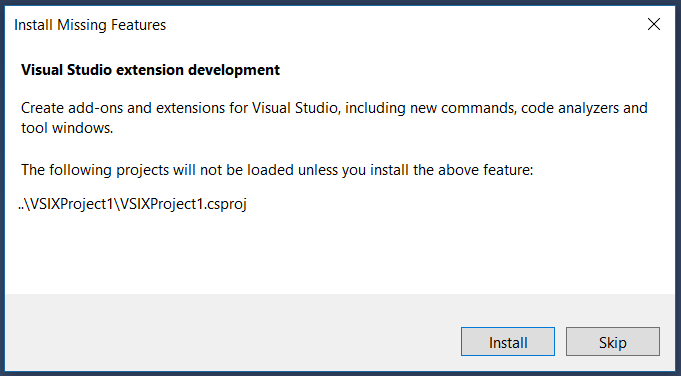

# Install the Visual Studio SDK

The Visual Studio SDK (Software Development Kit) is an optional feature in Visual Studio setup. You can also install the VS SDK later on.

## Install the Visual Studio SDK as part of a Visual Studio installation

To include the VS SDK in your Visual Studio installation, install the **Visual Studio extension development** workload under **Other Toolsets**. This workload will install the Visual Studio SDK and the necessary prerequisites. You can further tune the installation by selecting or unselecting components from the **Summary** view.

## Install the Visual Studio SDK after installing Visual Studio

To install the Visual Studio SDK after completing your Visual Studio installation, rerun the Visual Studio installer and select the **Visual Studio extension development** workload.

## Install the Visual Studio SDK from a solution

If you open a solution with an extensibility project without first installing the VS SDK, you will be prompted by an **Install Missing Feature** dialog to install the **Visual Studio extension development** workload:

## Install the Visual Studio SDK from the command line

As with any Visual Studio workload or component, you can also install the **Visual Studio extension development** workload (ID: Microsoft.VisualStudio.Workload.VisualStudioExtension) from the command line. See [Use command-line parameters to install Visual Studio](../install/use-command-line-parameters-to-install-visual-studio.md) for details on the appropriate command-line switches and general instructions on determining workload or component identifiers.

Note that you must use the Visual Studio installer that matches your installed version of Visual Studio. For example, if you have Visual Studio Enterprise installed on your computer, you must run the Visual Studio Enterprise installer (*vs_enterprise.exe*).
