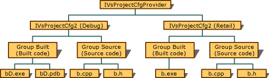

# Project Configuration for Output

Every configuration can support a set of build processes that produce output items such as executable or resource files. These output items are private to the user and can be placed in groups that link related types of output such as executable files (.exe, .dll, .lib) and source files (.idl, .h files).

Output items can be made available through the <xref:Microsoft.VisualStudio.Shell.Interop.IVsOutput2> methods and enumerated with the <xref:Microsoft.VisualStudio.Shell.Interop.IVsEnumOutputs> methods. When you want to group output items, your project should also implement the <xref:Microsoft.VisualStudio.Shell.Interop.IVsOutputGroup> interface.

The construct developed by implementing `IVsOutputGroup` allows projects to group outputs according to usage. For instance, a DLL might be grouped with its program database (PDB).

> [!NOTE]
> A PDB file contains debugging information and it is created when 'Generate Debug Info' option is specified when building the .dll or .exe. The .pdb file is usually generated for Debug project configuration only.

The project must return the same number of groups for each configuration that it supports, even though the number of outputs contained within a group may vary from configuration to configuration. For example, the project Matt's DLL might include mattd.dll and mattd.pdb in Debug configuration, but only include matt.dll in Retail configuration.

The groups also have the same identifier information, such as canonical name, display name, and group information, from configuration to configuration within a project. This consistency allows deployment and packaging to continue to operate even if configurations change.

Groups can also have a key output that allows packaging shortcuts to point to something meaningful. Any group might be empty in a given configuration, so no assumptions should be made about the size of a group. The size (number of outputs) of each group in any configuration can be different from the size of another group in the same configuration. It can also be different from the size of the same group in another configuration.

 
Output groups

The primary use of the <xref:Microsoft.VisualStudio.Shell.Interop.IVsProjectCfg> interface is to provide access to build, deploy and debug management objects and allow projects the freedom to group outputs. For more information on the use of this interface, see [Project Configuration Object](../../extensibility/internals/project-configuration-object.md).

In the previous diagram, Group Built has a key output across configurations (either bD.exe or b.exe) so the user can create a shortcut to Built and know that the shortcut will work regardless of the configuration deployed. Group Source does not have a key output, so the user cannot create a shortcut to it. If the Debug Group Built has a key output, but the Retail Group Built does not, that would be an incorrect implementation. It follows, then, that if any configuration has a group that contains no outputs, and, as a result, no key file, then other configurations with that group that do contain outputs cannot have key files. The installer editors assume that canonical names and display names of groups, plus the existence of a key file, do not change based in configurations.

Note that if a project has an `IVsOutputGroup` that it does not want to package or deploy, it is sufficient to not put that output in a group. The output can still be enumerated normally by implementing the <xref:Microsoft.VisualStudio.Shell.Interop.IVsProjectCfg.EnumOutputs%2A> method that returns all of a configuration's outputs regardless of grouping.

For more information, see the implementation of `IVsOutputGroup` in the Custom Project sample at [MPF for Projects](https://github.com/tunnelvisionlabs/MPFProj10).

## See also

- [Managing Configuration Options](../../extensibility/internals/managing-configuration-options.md)
- [Project Configuration for Building](../../extensibility/internals/project-configuration-for-building.md)
- [Project Configuration Object](../../extensibility/internals/project-configuration-object.md)
- [Solution Configuration](../../extensibility/internals/solution-configuration.md)
