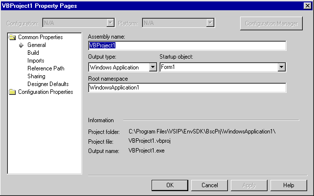

# Property Pages

Users can view and change project configuration-dependent and -independent properties using property pages. A **Property Pages** button is enabled in the **Properties** window or on Solution Explorer toolbar for objects that provide a property page view of the selected object. Property pages are created by the environment and are available for solutions and projects. They can, however, also be made available for project items that make use of configuration-dependent properties. This capability might be used when files within a project require different compiler switch settings to build properly.

## Using Property Pages
 If a property page is already displayed and the selection changes (for example, from a solution to a project), the information displayed in the pages changes to display the properties for the new selection. If there are no properties on the object that support property pages, the property page is empty.

 If multiple objects are selected, the property page displays the intersection of properties for all selected items. If the selected item does not contain configuration-dependent properties and the **Property Pages** button on the Solution Explorer toolbar is clicked, focus changes to the Properties window. For more information relating to the Properties window and selection, see [Extending Properties](../../extensibility/internals/extending-properties.md).

 If properties are displayed for multiple objects and you change a value on a property page, all of the values for the objects are set to the new value even if they were initially different and the page was blank when an individual object's properties were displayed.

 There are two general types of **ProjectProperty Pages** dialog boxes available in Visual Studio. In the first, for Visual Basic projects, for example, the property pages are displayed using a field format, as shown in the following screenshot. In the second, shown later in this section, the property page hosts a properties grid similar to that found in the Properties Window.

 
 
 Project Property Pages dialog box with field format and tree structure

 The tree structure in the Property Pages dialog box is not built using <xref:Microsoft.VisualStudio.Shell.Interop.IVsHierarchy>. The environment, based on the level name passed to it by the <xref:Microsoft.VisualStudio.OLE.Interop.ISpecifyPropertyPages> and the <xref:Microsoft.VisualStudio.Shell.Interop.IVsPropertyPage> interfaces, builds it.

 There are only two top-level categories available on Visual Studio Property pages:

- Common Properties, which displays configuration-independent information for the selected object or objects. As a result, when one of the Common Properties subcategories is selected, the Configuration, Platform, and Configuration Manager options across the top of the dialog box are not available.

- Configuration Properties, which contains configuration-dependent information relating to Debugging, Optimization, and Build parameters for the solution or project.

  You cannot create any additional top-level categories, but you can choose not to display one or the other in your implementation of `IVsPropertyPage`. If, for example, you do not have any configuration-independent properties to display for an object, you can choose not to display the Common Properties category. You display Common properties if `ISpecifyPropertyPages` is implemented from the item's browse object and Configuration properties when you implement `ISpecifyPropertyPages` in the configuration object (the object implementing `IVsCfg`, `IVsProjectCfg`, and related interfaces).

  Each category displayed under a top-level category represents a separate property page. Category and subcategory entries available in the dialog box are determined by your implementation of `ISpecifyPropertyPages` and `IVsPropertyPage`.

  `IDispatch` objects for items in the selection container that have properties to be displayed on property pages implement `ISpecifyPropertyPages` to enumerate a list of class IDs. The class IDs are passed as variables to `ISpecifyPropertyPages` and are used to instantiate the property pages. The list of class IDs is also passed to `IVsPropertyPage` to create the tree structure on the left of the dialog box. The property pages then pass information back to the `IDispatch` object that implements `ISpecifyPropertyPages` and fills in the information for each page.

  The properties of the browse object are retrieved using `IDispatch` for each object in the selection container.

  Implementing `Help::DisplayTopicFromF1Keyword` in your VSPackage provides the functionality for the Help button.

  For further information, see `IDispatch` and `ISpecifyPropertyPages` in the MSDN library.

  The second type of property pages displayed in the samples hosts a form of the properties grid, as shown in the following screenshot.

  
  
  Property Pages dialog box with properties grid

  The interfaces `IVSMDPropertyBrowser` and `IVSMDPropertyGrid` (declared in vsmanaged.h) are used to create and populate the properties grid within a dialog box or window.

  The architecture of projects has changed considerably from past versions of Visual Studio. In particular, the notion of which project is active has changed. In Visual Studio, there is no concept of an active project. In previous development environments, the active project was the project that build and deploy commands would default to regardless of the context. Now, the solution controls and arbitrates which build and deploy commands apply to which projects.

  What was previously an active project is now captured in one of three different ways:

- The Startup project

   You can specify a project or projects from the solution's property page that will be started when the user presses F5 or selects Run from the Build menu. This works in a manner similar to the old active project in the sense that its name is displayed in Solution Explorer with bold font.

   You can retrieve the startup project as a property in the automation model by calling `DTE.Solution.SolutionBuild.StartupProjects`. In a VSPackage, you call the <xref:Microsoft.VisualStudio.Shell.Interop.IVsSolutionBuildManager2.get_StartupProject%2A> or the <xref:Microsoft.VisualStudio.Shell.Interop.IVsSolutionBuildManager2.get_StartupProject%2A> methods. `IVsSolutionBuildManager` is available as a service by `QueryService` on SID_SVsSolutionBuildManager. For more information, see [Project Configuration Object](../../extensibility/internals/project-configuration-object.md) and [Solution Configuration](../../extensibility/internals/solution-configuration.md).

- Active solution build configuration

   Visual Studio has an active solution configuration, available in the automation model by implementing `DTE.Solution.SolutionBuild.ActiveConfiguration`. A solution configuration is a collection that contains one project configuration for each project in the solution (each project can have multiple configurations, on multiple platforms, with dissimilar names). For more information relating to the solution's property pages, see [Solution Configuration](../../extensibility/internals/solution-configuration.md).

- Project currently selected

   Implement the <xref:Microsoft.VisualStudio.Shell.Interop.IVsMonitorSelection.GetCurrentSelection%2A> method to retrieve the project hierarchy and project item or items selected. From DTE, you would use the `SelectedItems.SelectedItem.Project` and `SelectedItems.SelectedItem.ProjectItem` methods. There is sample code under those headings in the core Visual Studio documents.

## See also
- <xref:Microsoft.VisualStudio.Shell.Interop.IVsPropertyPage>
- [Managing Configuration Options](../../extensibility/internals/managing-configuration-options.md)
- [Project Configuration Object](../../extensibility/internals/project-configuration-object.md)
- [Solution Configuration](../../extensibility/internals/solution-configuration.md)
