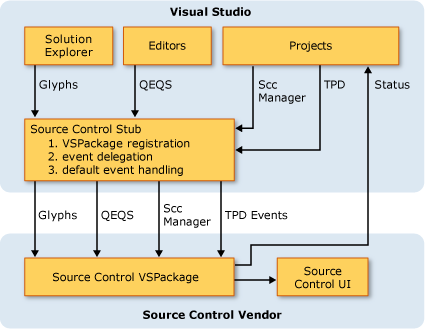

# Source Control VSPackage Architecture

A source-control package is a VSPackage that uses services that the Visual Studio IDE provides. In return, a source-control package provides its functionality as a source control service. Additionally, a source-control package is a more versatile alternative than a source control plug-in for integrating source control into Visual Studio.

 A source control plug-in that implements the Source Control Plug-in API abides by a strict contract. For example, a plug-in cannot replace the default Visual Studio user interface (UI). Moreover, the Source Control Plug-in API does not enable a plug-in to implement its own source control model. A source-control package, however, overcomes both of these limitations. A source-control package has complete control over the source control experience of a Visual Studio user. Additionally, a source-control package can use its own source control model and logic, and it can define all the source control-related user interfaces.

## Source-Control Package Components
 As shown in the architecture diagram, a Visual Studio component named the Source Control Stub is a VSPackage that integrates a source-control package with Visual Studio.

 Source Control Stub handles the following tasks.

- Provides the common UI that is required for source-control package registration.

- Loads a source-control package.

- Sets a source-control package as active/inactive.

  Source Control Stub looks for the active service for the source-control package and routes all incoming service calls from the IDE to that package.

  The Source Control Adapter Package is a special source-control package that Visual Studio provides. This package is the central component for supporting source control plug-ins based on the Source Control Plug-in API. When a source control plug-in is the active plug-in, the Source Control Stub sends its events to the Source Control Adapter Package. In turn, the Source Control Adapter Package communicates with the source control plug-in by using the Source Control Plug-in API and also provides a default UI that is common for all source control plug-ins.

  When a source-control package is the active package, on the other hand, the Source Control Stub directly communicates with the package by using the Visual Studio SDK Source-Control Package interfaces. The source-control package is responsible for hosting its own source control UI.

  

  For a source-control package, Visual Studio does not supply source control code or an API for integration. Contrast this with the approach outlined in [Creating a Source Control Plug-in](../../extensibility/internals/creating-a-source-control-plug-in.md) where the source control plug-in has to implement a rigid set of functions and callbacks.

  Like any VSPackage, a source-control package is a COM object that can be created by using `CoCreateInstance`. The VSPackage makes itself available to the Visual Studio IDE by implementing <xref:Microsoft.VisualStudio.Shell.Interop.IVsPackage>. When an instance has been created, a VSPackage receives a site pointer and an <xref:Microsoft.VisualStudio.OLE.Interop.IServiceProvider> interface that provides the VSPackage access to the available services and interfaces in the IDE.

  Writing a VSPackage-based source-control package requires more advanced programming expertise than writing a Source Control Plug-in API-based plug-in.

## Related content
- <xref:Microsoft.VisualStudio.Shell.Interop.IVsPackage>
- [Getting Started](../../extensibility/internals/getting-started-with-source-control-vspackages.md)
