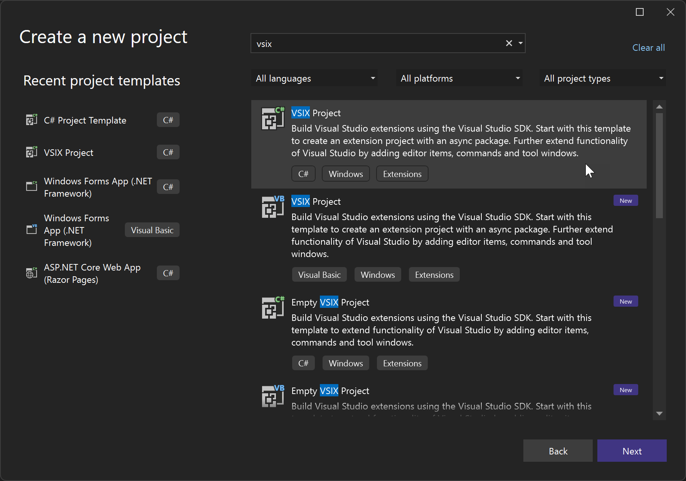

# Customizing editor behavior by using Language Configuration

You can implement customized language-specific syntax in the Visual Studio editor by using Language Configuration to enable language-specific syntax operations. As compared to using a Language Server, using Language Configuration can improve performance, since all of its operations are local.

## What is Language Configuration

Visual Studio offers intelligent editing capabilities for various programming languages through language extensions. Language Configuration supplements the servers that use Language Server Protocol (LSP) and provides declarative data that enables the Visual Studio editor to make formatting, colorization, and completion decisions without the delay of making an asynchronous query to the LSP server. Declarative language features are defined in configuration files. For instance, HTML, CSS, and typescript-basic extensions bundled with Visual Studio offer a subset of the following declarative language features:

- Syntax highlighting
- Snippet completion
- Bracket matching
- Bracket autoclosing
- Comment toggling
- Autoindentation

Visual Studio provides the capability for extensions to define a language configuration for any programming language. The language configuration file controls fundamental editing features such as comment toggling, and bracket matching and surrounding.

Using Language Configuration helps with: 

- Synchronous work on user typing
- Simplicity: Short JSON files with regular expressions are easier to maintain than complex algorithm
- Portability: Require no or minimal changes between Visual Studio Code and Visual Studio

Also, language configuration files provide an easy way to extend Visual Studio to support some basic refactoring features through an easy-to-read JSON file.

## Add Language Configuration support to a Visual Studio extension

There are three parts to adding Language Configuration support to a Visual Studio extension:

1. [Create a VSIX project](#create-a-vsix-project)
1. [Create a Language Configuration file](#create-a-language-configuration-file)
1. [Add a grammar file](#optional-add-a-grammar-file)
1. [Update the pkgdef file](#create-a-pkgdef-file)

You can explore a working sample at [Language Configuration Sample](https://github.com/microsoft/VSExtensibility/tree/main/LSP/Samples/Language%20Configuration%20Setup%20Example).

## Create a VSIX project

To create a language service extension using Language Configuration, first make sure you have the **Visual Studio extension development** Workload installed for your instance of VS.

Next, create a new VSIX project by navigating to **File** > **New Project**, search for "vsix," and look for **VSIX Project**:



## Create a language configuration file

When making your own language configuration file, you can choose which aspects to onboard in the JSON file. For example, you can choose to support comment toggling, autoclosing of braces, or any combination of the available functionality described in this section.

To add support to your extension, you first create a language configuration file. The name of the file must follow a standard: use hyphens to separate the words in the filename, and make sure it ends with `language-configuration.json`.

The following code shows an example language configuration file.

```json
{
    "comments": {
      "lineComment": "***",
      "blockComment": ["{*", "*}"]
    },
    "brackets": [
      ["@", "@"],
      ["#", "#"],
      ["$", "$"],
      ["(", ")"]
    ],
    "autoClosingPairs": [
      { "open": "{", "close": "}" },
      { "open": "@", "close": "@" },
      { "open": "#", "close": "#" },
      { "open": "$", "close": "$" },
      { "open": "(", "close": ")" },
      { "open": "'", "close": "'", "notIn": ["string", "comment"] },
      { "open": "\"", "close": "\"", "notIn": ["string"] },
    ],
    "autoCloseBefore": ";:.,=}])>` \n\t",
    "surroundingPairs": [
      ["@", "@"],
      ["#", "#"],
      ["$", "$"],
      ["[", "]"],
      ["(", ")"],
      ["'", "'"],
      ["\"", "\""],
      ["`", "`"]
    ],
    "wordPattern": "(-?\\d*\\.\\d\\w*)|([^\\`\\~\\!\\@\\#\\%\\^\\&\\*\\(\\)\\-\\=\\+\\[\\{\\]\\}\\\\\\|\\;\\:\\'\\\"\\,\\.\\<\\>\\/\\?\\s]+)",
    "indentationRules": {
      "increaseIndentPattern": "^((?!\\/\\/).)*(\\{[^}\"'`]*|\\([^)\"'`]*|\\[[^\\]\"'`]*)$",
      "decreaseIndentPattern": "^((?!.*?\\/\\*).*\\*/)?\\s*[\\)\\}\\]].*$"
    }
  }
```

### Configuration settings

The following sections describe the settings that are available in the language configuration file.

#### Comment toggling

Language configuration files offer two commands for comment toggling. **Toggle Line Comment** and **Toggle Block Comment**. You can specify `comments.blockComment` and `comments.lineComment` to control how Visual Studio should comment out lines / blocks.

```json
{
  "comments": {
    "lineComment": "//",
    "blockComment": ["/*", "*/"]
  }
}
```

This setting affects the behavior of the Visual Studio text editor when you press **Ctrl**+**K**, **Ctrl**+**C**.

#### Brackets definition

When you move the cursor to a bracket defined here, Visual Studio highlights that bracket together with its matching pair.

```json
{
  "brackets": [["{", "}"], ["[", "]"], ["(", ")"]]
}
```

:::moniker range="visualstudio"

In the **Tools > Options** pane, the relevant setting is the **Enable brace pair colorization** option, located under **All Settings** > **Text Editor** > **General** > **Display**.

:::moniker-end
:::moniker range="<=vs-2022"
      
In the **Tools > Options** dialog, the relevant setting is the **Enable brace pair colorization** option, located under **Text Editor** > **General** > **Display**.

:::moniker-end

#### Autoclosing

When you type `'`, Visual Studio creates a pair of single quotes and puts the cursor in the middle: `'|'`. This section defines such pairs.


```json
{
  "autoClosingPairs": [
    { "open": "{", "close": "}" },
    { "open": "[", "close": "]" },
    { "open": "(", "close": ")" },
    { "open": "'", "close": "'", "notIn": ["string", "comment"] },
    { "open": "\"", "close": "\"", "notIn": ["string"] },
    { "open": "`", "close": "`", "notIn": ["string", "comment"] },
    { "open": "/**", "close": " */", "notIn": ["string"] }
  ]
}
```

The `notIn` key disables this feature in certain code ranges. For example, when you're writing the following code:

```js
// ES6's Template String
`ES6's Template String`;
```

The single quote isn't autoclosed.

Pairs that don't require a `notIn` property can also use a simpler syntax:

```json
{
  "autoClosingPairs": [ ["{", "}"], ["[", "]"] ]
}
```

##### Autoclosing before

By default, Visual Studio only autocloses pairs if there's whitespace right after the cursor. So, when you type `{` in the following JSX code, you don't get autoclose:

```js
const Component = () =>
  <div className={>
                  ^ Does not get autoclosed by default
  </div>
```

However, this definition overrides that behavior:

```json
{
  "autoCloseBefore": ";:.,=}])>` \n\t"
}
```

Now when you enter `{` right before `>`, Visual Studio autocloses it with `}`.

#### Autosurrounding

When you select a range in Visual Studio and enter an opening bracket, Visual Studio surrounds the selected content with a pair of brackets. This feature is called Autosurrounding, and here you can define the autosurrounding pairs for a specific language:

```json
{
  "surroundingPairs": [
    ["{", "}"],
    ["[", "]"],
    ["(", ")"],
    ["'", "'"],
    ["\"", "\""],
    ["`", "`"]
  ]
}
```

:::moniker range="visualstudio"

In the **Tools > Options** pane, the relevant setting is the **Automatically surround selections when typing quotes or brackets** option, located under **All Settings** > **Text Editor** > **General** > **Display**.

:::moniker-end
:::moniker range="<=vs-2022"
      
In the **Tools > Options** dialog, the relevant setting is the **Automatically surround selections when typing quotes or brackets** option, located under **Text Editor** > **General** > **Display**.

:::moniker-end

#### Word pattern

`wordPattern` defines what's considered as a word in the programming language. Code suggestion features use this setting to determine word boundaries if `wordPattern` is set. 

```json
{
  "wordPattern": "(-?\\d*\\.\\d\\w*)|([^\\`\\~\\!\\@\\#\\%\\^\\&\\*\\(\\)\\-\\=\\+\\[\\{\\]\\}\\\\\\|\\;\\:\\'\\\"\\,\\.\\<\\>\\/\\?\\s]+)"
}
```

#### Indentation rules

`indentationRules` defines how the editor should adjust the indentation of current line or next line when you type, paste, and move lines, or when you format text with **Ctrl**+**K**, **Ctrl**+**D** (Format Document) and **Ctrl**+**K**, **Ctrl**+**F** (Format Selection).

```json
{
  "indentationRules": {
    "increaseIndentPattern": "^((?!\\/\\/).)*(\\{[^}\"'`]*|\\([^)\"'`]*|\\[[^\\]\"'`]*)$",
    "decreaseIndentPattern": "^((?!.*?\\/\\*).*\\*/)?\\s*[\\)\\}\\]].*$"
  }
}
```

For example, `if (true) {` matches `increaseIndentPattern`, then if you press **Enter** after the open bracket `{`, the editor will automatically indent once, and your code will end up as:

```javascript
if (true) {
  console.log();
```

In addition to `increaseIndentPattern` and `decreaseIndentPatter`, there are two other indentation rules:

- `indentNextLinePattern` - If a line matches this pattern, then **only the next line** after it should be indented once.
- `unIndentedLinePattern` - If a line matches this pattern, then its indentation shouldn't be changed and it shouldn't be evaluated against the other rules.

If there's no indentation rule set for the programming language, the editor indents when the line ends with an open bracket and unindents when you type a closing bracket. The bracket here's defined by `brackets`.

#### Pressing Enter

`onEnterRules` defines a list of rules to evaluate when **Enter** is pressed in the editor.

```json
{
  "onEnterRules": [{
    "beforeText": "^\\s*(?:def|class|for|if|elif|else|while|try|with|finally|except|async).*?:\\s*$",
    "action": { "indent": "indent" }
  }]
}
```

When pressing Enter, the text before, after, or one line above the cursor is checked against the following properties:

- `beforeText` (mandatory). A regular expression that matches the text before the cursor (limited to the current line).
- `afterText`. A regular expression that matches the text after the cursor (limited to the current line).
- `previousLineText`. A regular expression that matches the text one line above the cursor.

If all the specified properties match, the rule is considered to match and no further `onEnterRules` are evaluated. An `onEnterRule` can specify the following actions:

- `indent` (mandatory). One of `none, indent, outdent, indentOutdent`.
  - `none` means that the new line inherits the indentation of the current line.
  - `indent` means that the new line is indented relative to the current line.
  - `outdent` means that the new line is unindented relative to the current line.
  - `indentOutdent` means that two new lines are inserted, one indented and the second one unindented.
- `appendText`. A string that's appended after the new line and after the indentation.
- `removeText`. The number of characters to remove from the new line's indentation.

### Property settings

In the extension project, make sure that your `language-configuration.json` file has the following property settings:

```
Build Action = Content
Include in VSIX = True
Copy to output = Copy always 
```

## (Optional) Add a grammar file

In addition, you can add a TextMate grammar file to provide syntax coloring for the language. TextMate grammars are a structured collection of regular expressions and are written as a plist (XML) or JSON files. See [Language Grammars](https://macromates.com/manual/en/language_grammars). If you don't provide a language-specific grammar file, a built-in default setting is used.

To add custom TextMate grammar or theme files, follow these steps:

1. Create a folder named "Grammars" inside your extension (or it can be whatever name you choose).

2. Inside the *Grammars* folder, include any *\*.tmlanguage*, *\*.plist*, *\*.tmtheme*, or *\*.json* files you’d like that provide custom colorization.

   > [!TIP]
   > A *.tmtheme* file defines how the scopes map to Visual Studio classifications (named color keys). For guidance, you can reference the global *.tmtheme* file in the *%ProgramFiles(x86)%\Microsoft Visual Studio\\\<version>\\\<SKU>\Common7\IDE\CommonExtensions\Microsoft\TextMate\Starterkit\Themesg* directory.

## Create a pkgdef file

Next, create a `.pkgdef` file. A `.pkgdef` file contains all the registration information that would otherwise be added to the system registry. For more information about `pkgdef` files, see [Registering VSPackages](internals/registering-vspackages.md) and [What is a pkgdef file? And why?](https://devblogs.microsoft.com/visualstudio/whats-a-pkgdef-and-why). In your `pkgdef` file, you should have the path to the `language-configuration.json` file and the path for the language grammar. Language services such as LSP ask for the editor content type and get that through Language Configuration. This information provides the language-specific intelligence inside a server that can communicate with development tooling. When a language service doesn't exist, the Language Configuration engine falls back to the TextMate grammar. Your `.pkgdef` file should look like this:  

```pkgdef
[$RootKey$\TextMate\Repositories]
"AspNetCoreRazor="$PackageFolder$\Grammars

// Defines where the language configuration file for a given
// grammar name is (value of the ScopeName tag in the tmlanguage file).
[$RootKey$\TextMate\LanguageConfiguration\GrammarMapping]
"text.aspnetcorerazor"="$PackageFolder$\language-configuration.json"

// Defines where the language configuration file for a given
// language name is (partial value of the content type name).
[$RootKey$\TextMate\LanguageConfiguration\ContentTypeMapping]
"RazorLSP"="$PackageFolder$\language-configuration.json"

[$RootKey$\TextMate\LanguageConfiguration\GrammarMapping]
"text.html.basic"="$PackageFolder$\html-language-configuration.json"
"source.js"="$PackageFolder$\javascript-language-configuration.json"
"source.css"="$PackageFolder$\css-language-configuration.json"
"source.cs"="$PackageFolder$\csharp-language-configuration.json
```

Make sure that the properties of the `pkgdef` file are set as follows:  

```
Build Action = Content
Include in VSIX = True
Copy to output = Copy always 
```

In order to make the language configuration information accessible for Visual Studio, include the `language-configuration` file in the VSIX package. Including this file means it ships with the Visual Studio Extension. The file lets Visual Studio know that a Language Configuration is available for use. To add the file, edit your `vsixmanifest` to add your PKGDEF def file, for example:

```xml
<Asset Type="Microsoft.VisualStudio.VsPackage" Path="Test.pkgdef"/> 
```

## Related content

- [Language Server Protocol](./language-server-protocol.md)

- [Language Configuration Sample](https://github.com/microsoft/VSExtensibility/tree/main/LSP/Samples/Language%20Configuration%20Setup%20Example)
