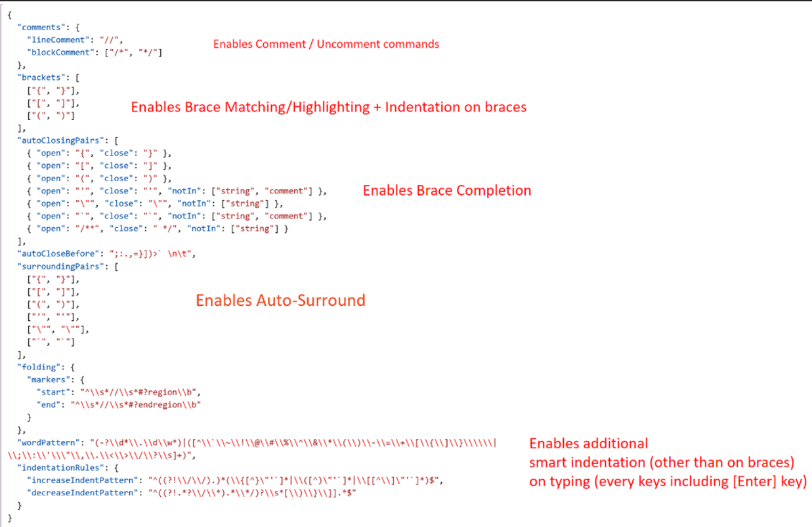

# Add optimized support for language syntax in the editor

You can the performance of and support for language-specific syntax operations in the Visual Studio editor by using Language Configuration.

## What is Language Configuration

Visual Studio offers intelligent editing capabilities for various programming languages through language extensions. Language Configuration supplements the servers that use Language Server Protocol (LSP). This is achieved by providing declarative data that enables the Visual Studio editor to make formatting, colorization, and completion decisions instantaneously, without making an asynchronous query to the LSP server. Declarative language features are defined in configuration files. For instance, HTML, CSS, and typescript-basic extensions bundled with Visual Studio offer a subset of the following declarative language features:

- Syntax highlighting
- Snippet completion
- Bracket matching
- Bracket auto-closing
- Comment toggling
- Auto-indentation
- Folding (by markers)

Visual Studio provides the capability for extensions to define a language configuration for any programming language. The language configuration file controls fundamental editing features such as comment toggling, bracket matching and surrounding, and collapsing sections of code (region folding).

Using Language Configuration helps with: 

- Synchronous work on user typing
- Simplicity: Short JSON file with Regex are easier to maintain than complex algorithm
- Portability: Require no or minimal changes between Visual Studio Code and Visual Studio

Also, Language Configuration files provide an easy way to extend Visual Studio to support some basic refactoring features through an easy-to-read JSON file.

## Add Language Configuration support to a Visual Studio extension

There are three parts to adding Language Configuration support to a Visual Studio extension:

1. [Create a Language Configuration file](#create-a-language-configuration-file)
1. [Add a grammar file](#add-a-grammar-file)
1. [Update the pkgdef file](#Update-the-pkgdef-file)

## Create a Language Configuration file

To create a Language Configuration file, first refer to the guide at [Language Configuration Guide](https://code.visualstudio.com/api/language-extensions/language-configuration-guide).

When making your own language configuration file, you can choose which aspect to onboard in the JSON file.

For example, the following screenshot shows some of the capabilities:



To add support to your extension, you first create a language configuration file. The name of the file must follow a standard: use hyphens to separate the words in the filename, and make sure it ends with `language-config.json`.

## Add a grammar file

In addition, a grammar file is necessary for this process for the language. See [Language Grammars](https://macromates.com/manual/en/language_grammars)

In the extension project, make sure that your `language-config.json` file has the following property settings:

```
Build Action = Content
Include in VSIX = True
Copy to output = Copy always 
```

## Update the pkgdef file

Next, update the extension's `.pkgdef` file. A `.pkgdef` file contains all the registration information that would otherwise be added to the system registry. More information about `pkgdef`, see [What is a pkgdef file? And why?](https://devblogs.microsoft.com/visualstudio/whats-a-pkgdef-and-why). In your `pkgdef` file, you should have the path to the `language-config.json` file and the path for the language grammar. Language services such as LSP will ask for the editor content type and get that through Language Configuration. This information will provide the language-specific intelligence inside a server that can communicate with development tooling. When a language service doesn't exist, the Language Configuration engine falls back to the TextMate grammar. TextMate grammars are a structured collection of regular expressions and are written as a plist (XML) or JSON files. Your `.pkgdef` file should look like this:  

```pkgdef
[$RootKey$\TextMate\Repositories]
"AspNetCoreRazor="$PackageFolder$\Grammars

// Defines where the language configuration file for a given
// grammar name is (value of the ScopeName tag in the tmlanguage file).
[$RootKey$\TextMate\LanguageConfiguration\GrammarMapping]
"text.aspnetcorerazor"="$PackageFolder$\language-configuration.json"

// Defines where the language configuration file for a given
// language name is (partial value of the content type name).
[$RootKey$\TextMate\LanguageConfiguration\ContentTypeMapping]
"RazorLSP"="$PackageFolder$\language-configuration.json"

[$RootKey$\TextMate\LanguageConfiguration\GrammarMapping]
"text.html.basic"="$PackageFolder$\html-language-configuration.json"
"source.js"="$PackageFolder$\javascript-language-configuration.json"
"source.css"="$PackageFolder$\css-language-configuration.json"
"source.cs"="$PackageFolder$\csharp-language-configuration.json
```

Make sure that the properties of the `pkgdef` file are set as the following:  

```
Build Action = Content
Include in VSIX = True
Copy to output = Copy always 
```

In order to have this accessible for Visual Studio, include the `language-config` file in the VSIX package. Including this file means it ships with the Visual Studio Extension. The file lets Visual Studio know that a Language Configuration is available for use. To add the file, edit your `vsixmanifest`` to add your PKGDEF def file, for examle: 

<Asset Type="Microsoft.VisualStudio.VsPackage" Path="Test.pkgdef"/> 

