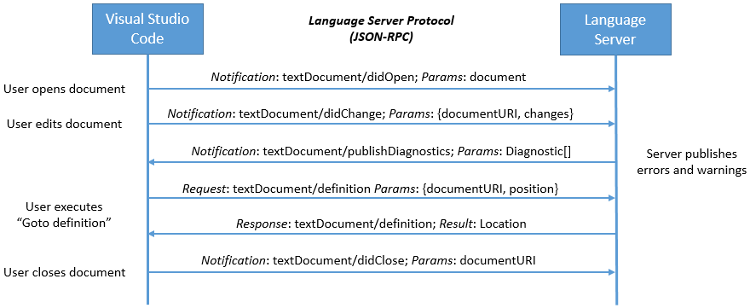
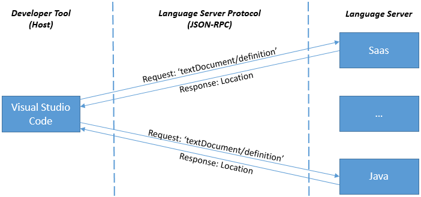

# Language Server Protocol

## What is the Language Server Protocol?

Supporting rich editing features like source code auto-completions or **Go to Definition** for a programming language in an editor or IDE is traditionally very challenging and time consuming. Usually it requires writing a domain model (a scanner, a parser, a type checker, a builder and more) in the programming language of the editor or IDE. For example, the Eclipse CDT plugin, which provides support for C/C++ in the Eclipse IDE is written in Java since the Eclipse IDE itself is written in Java. Following this approach, it would mean implementing a C/C++ domain model in TypeScript for Visual Studio Code, and a separate domain model in C# for Visual Studio.

Creating language-specific domain models are also a lot easier if a development tool can reuse existing language-specific libraries. However, these libraries are usually implemented in the programming language itself (for example, good C/C++ domain models are implemented in C/C++). Integrating a C/C++ library into an editor written in TypeScript is technically possible but hard to do.

### Language servers

Another approach is to run the library in its own process and use inter-process communication to talk to it. The messages sent back and forth form a protocol. The language server protocol (LSP) is the product of standardizing the messages exchanged between a development tool and a language server process. Using language servers or demons is not a new or novel idea. Editors like Vim and Emacs have been doing this for some time to provide semantic auto-completion support. The goal of the LSP was to simplify these sorts of integrations and provide a useful framework for exposing language features to a variety of tools.

Having a common protocol allows the integration of programming language features into a development tool with minimal fuss by reusing an existing implementation of the language's domain model. A language server back-end could be written in PHP, Python, or Java and the LSP lets it be easily integrated into a variety of tools. The protocol works at a common level of abstraction so that a tool can offer rich language services without needing to fully understand the nuances specific to the underlying domain model.

## How work on the LSP started

The LSP has evolved over time and today it is at Version 3.0. It started when the concept of a language server was picked up by OmniSharp to provide rich editing features for C#. Initially, OmniSharp used the HTTP protocol with a JSON payload and has been integrated into several editors including [Visual Studio Code](https://code.visualstudio.com).

Around the same time, Microsoft started to work on a TypeScript language server, with the idea of supporting TypeScript in editors like Emacs and Sublime Text. In this implementation, an editor communicates through stdin/stdout with the TypeScript server process and uses a JSON payload inspired by the V8 debugger protocol for requests and responses. The TypeScript server has been integrated into the TypeScript Sublime plugin and VS Code for rich TypeScript editing.

After having integrated two different language servers, the VS Code team started to explore a common language server protocol for editors and IDEs. A common protocol enables a language provider to create a single language server that can be consumed by different IDEs. A language server consumer only has to implement the client side of the protocol once. This results in a win-win situation for both the language provider and the language consumer.

The language server protocol started with the protocol used by the TypeScript server, expanding it with more language features inspired by the VS Code language API. The protocol is backed with JSON-RPC for remote invocation due to its simplicity and existing libraries.

The VS Code team prototyped the protocol by implementing several linter language servers which respond to requests to lint (scan) a file and return a set of detected warnings and errors. The goal was to lint a file as the user edits in a document, which means that there will be many linting requests during an editor session. It made sense to keep a server up and running so that a new linting process did not need to be started for each user edit. Several linter servers were implemented, including VS Code's ESLint and TSLint extensions. These two linter servers are both implemented in TypeScript/JavaScript and run on Node.js. They share a library that implements the client and server part of the protocol.

## How the LSP works

A language server runs in its own process, and tools like Visual Studio or VS Code communicate with the server using the language protocol over JSON-RPC. Another advantage of the language server operating in a dedicated process is that performance issues related to a single process model are avoided. The actual transport channel can either be stdio, sockets, named pipes, or node ipc if both the client and server are written in Node.js.

Below is an example for how a tool and a language server communicate during a routine editing session:



* **The user opens a file (referred to as a document) in the tool**: The tool notifies the language server that a document is open ('textDocument/didOpen'). From now on, the truth about the contents of the document is no longer on the file system but kept by the tool in memory.

* **The user makes edits**: The tool notifies the server about the document change ('textDocument/didChange') and the semantic information of the program is updated by the language server. As this happens, the language server analyzes this information and notifies the tool with the detected errors and warnings ('textDocument/publishDiagnostics').

* **The user executes "Go to Definition" on a symbol in the editor**: The tool sends a 'textDocument/definition' request with two parameters: (1) the document URI and (2) the text position from where the Go to Definition request was initiated to the server. The server responds with the document URI and the position of the symbol's definition inside the document.

* **The user closes the document (file)**: A 'textDocument/didClose' notification is sent from the tool, informing the language server that the document is now no longer in memory and that the current contents is now up to date on the file system.

This example illustrates how the protocol communicates with the language server at the level of editor features like "Go to Definition", "Find all References". The data types used by the protocol are editor or IDE 'data types' like the currently open text document and the position of the cursor. The data types are not at the level of a programming language domain model which would usually provide abstract syntax trees and compiler symbols (for example, resolved types, namespaces, ...). This simplifies the protocol significantly.

Now let's look at the 'textDocument/definition' request in more detail. Below are the payloads that go between the client tool and the language server for the "Go to Definition" request in a C++ document.

This is the request:

```json
{
    "jsonrpc": "2.0",
    "id" : 1,
    "method": "textDocument/definition",
    "params": {
        "textDocument": {
            "uri": "file:///p%3A/mseng/VSCode/Playgrounds/cpp/use.cpp"
        },
        "position": {
            "line": 3,
            "character": 12
        }
    }
}
```

This is the response:

```json
{
    "jsonrpc": "2.0",
    "id": "1",
    "result": {
        "uri": "file:///p%3A/mseng/VSCode/Playgrounds/cpp/provide.cpp",
        "range": {
            "start": {
                "line": 0,
                "character": 4
            },
            "end": {
                "line": 0,
                "character": 11
            }
        }
    }
}
```

In retrospect, describing the data types at the level of the editor rather than at the level of the programming language model is one of the reasons for the success of the language server protocol. It is much simpler to standardize a text document URI or a cursor position compared with standardizing an abstract syntax tree and compiler symbols across different programming languages.

When a user is working with different languages, VS Code typically starts a language server for each programming language. The example below shows a session where the user works on Java and SASS files.



### Capabilities

Not every language server can support all features defined by the protocol. Therefore, the client and server announces their supported feature set through 'capabilities'. As an example, a server announces that it can handle the 'textDocument/definition' request, but it might not handle the 'workspace/symbol' request. Similarly, clients can announce that they are able to provide 'about to save' notifications before a document is saved, so that a server can compute textual edits to automatically format the edited document.

## Integrating a language server

The actual integration of a language server into a particular tool is not defined by the language server protocol and is left to the tool implementors. Some tools integrate language servers generically by having an extension that can start and talk to any kind of language server. Others, like VS Code, create a custom extension per language server, so that an extension is still able to provide some custom language features.

To simplify the implementation of language servers and clients, there are libraries or SDKs for the client and server parts. These libraries are provided for different languages. For example, there is a [language client npm module](https://www.npmjs.com/package/vscode-languageclient) to ease the integration of a language server into a VS Code extension and another [language server npm module](https://www.npmjs.com/package/vscode-languageserver) to write a language server using Node.js. This is the current [list](https://microsoft.github.io/language-server-protocol/implementors/sdks/) of support libraries.

## Using the Language Server Protocol in Visual Studio

* [Adding a Language Server Protocol extension](adding-an-lsp-extension.md) - Learn about integrating a language server into Visual Studio.
