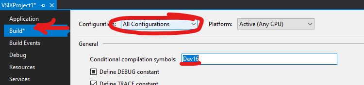

## Using conditional compilation symbols

If you wish to use the same source code, even the same file,
for Dev17 and below you may need to use conditional compilation so
that you can fork your code to adapt to breaking changes.
Conditional compilation is a feature of the C#/VB/C++ languages that
can be used to share most code while accommodating divergent APIs in specific places.

More information on usage of preprocessor directives and conditional
compilation symbols can be found in the Microsoft docs [#if
preprocessor directive - C# Reference | Microsoft
Docs](https://docs.microsoft.com/en-us/dotnet/csharp/language-reference/preprocessor-directives#conditional-compilation).

Your project(s) that target older VS versions will need a conditional compilation symbol
that can then be used to fork the code to use the different APIs.
You can set the conditional compilation symbol in the project
properties page (shown below).



Be sure to set the compilation symbol for *all* configurations,
since by default the symbol you enter may only apply to one configuration.

You can then use that symbol as a pre-processor directive (`#if`)
(shown below).
You can then fork your code to deal with the breaking change between the
different Visual Studio versions.

```cs
    Guid myGuid = new Guid("{633FBA02-719B-40E7-96BF-0899767CD104}");
    uint myFlags = 0;
    IVsShell shell = await AsyncServiceProvider.GlobalProvider.GetServiceAsync<SVsShell, IVsShell>();
#if Dev16
    shell.LoadUILibrary(myGuid, myFlags, out uint ptrLib);
#else
    shell.LoadUILibrary(myGuid, myFlags, out IntPtr ptrLib);
#endif
```

In some cases we can simply use `var` to avoid naming the type,
thus avoiding the need for `#if` regions.
The above snippet can also be written as:

```cs
    Guid myGuid = new Guid("{633FBA02-719B-40E7-96BF-0899767CD104}");
    uint myFlags = 0;
    IVsShell shell = await AsyncServiceProvider.GlobalProvider.GetServiceAsync<SVsShell, IVsShell>();
    shell.LoadUILibrary(myGuid, myFlags, out var ptrLib);
```

When using the `#if` syntax, notice how we can use the language service context dropdown in the document shown below
to change syntax highlighting and the other help the language service offers to focus
attention on one target VS version for our extension vs. another.


## XAML sharing techniques

XAML has no preprocessor to allow customizing content based on preprocessor symbols.
Copying and maintaining two XAML pages where their content must differ between Dev17 and earlier versions may be required.

However in some cases, a reference to a type that exists in distinct assemblies across Dev17 and earlier versions
may still be representable in one XAML file by removing the namespace that references the assembly:

```diff
-xmlns:vsui="clr-namespace:Microsoft.VisualStudio.PlatformUI;assembly=Microsoft.VisualStudio.Shell.14.0"
-Value="{DynamicResource {x:Static vsui:TreeViewColors.SelectedItemActiveBrushKey}}"
+Value="{DynamicResource TreeViewColors.SelectedItemActiveBrushKey}"
```