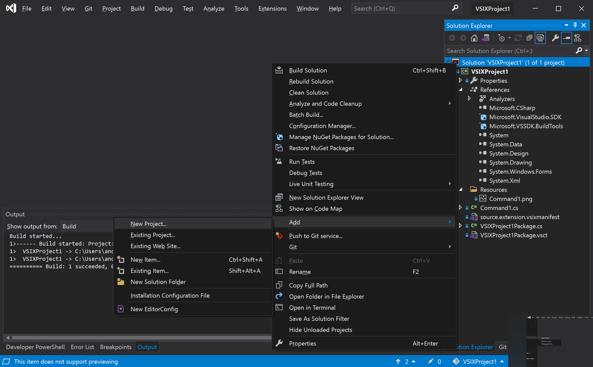
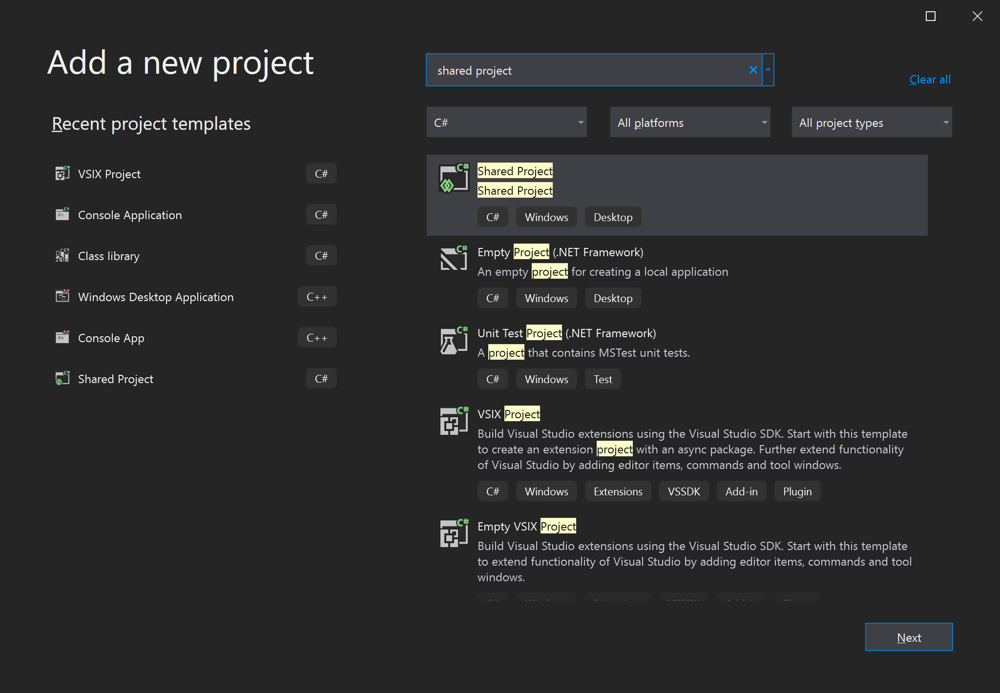
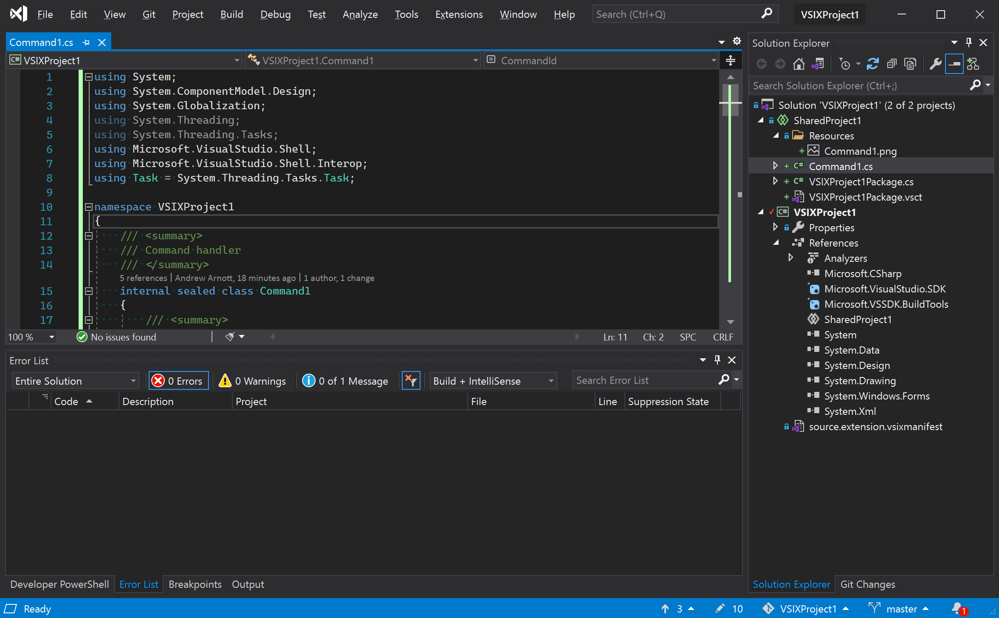
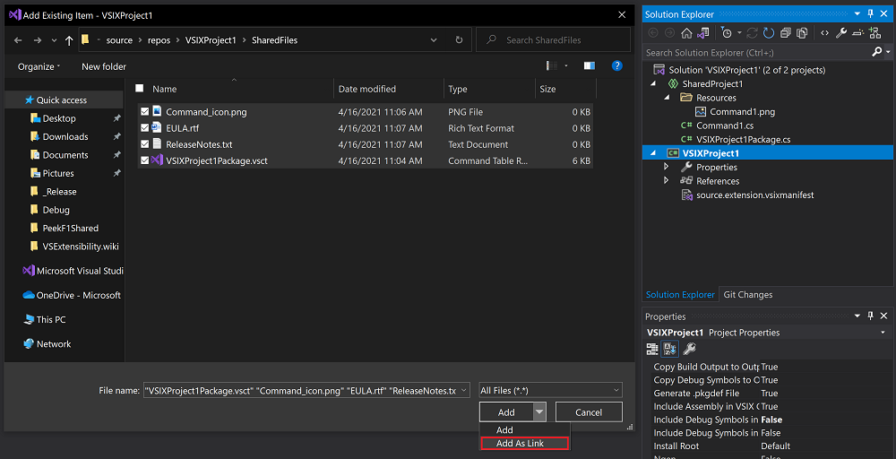
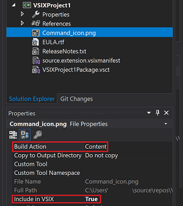
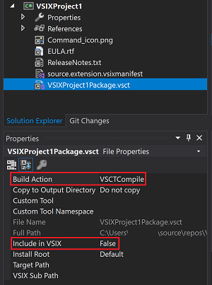
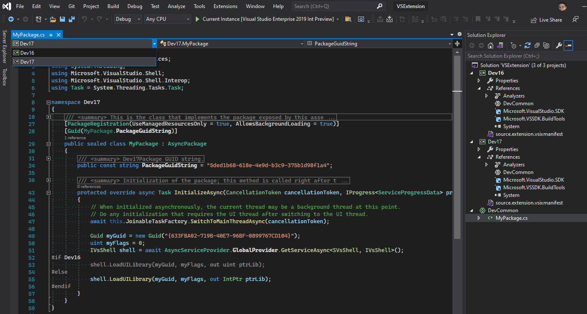
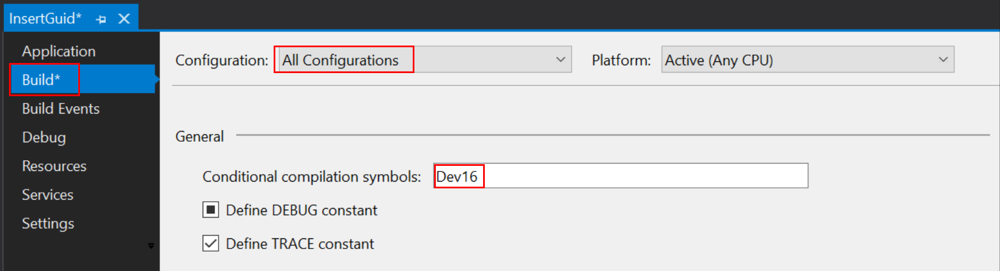
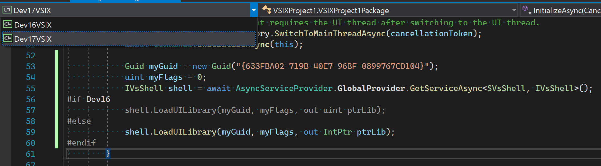

:::moniker range="visualstudio"
# Upgrade extensions for Visual Studio 2026

With the latest Insiders prerelease version of Visual Studio, you can easily install Visual Studio 2022 extensions.

Since there are minimal breaking changes, upgrading your extension should be straightforward. With the prerelease version of Visual Studio, you can test your existing extension and provide us with your feedback.

To install and test your extension:

1. Install the latest [Visual Studio (Insiders)](https://aka.ms/vs/insiders?cid=learn-onpage-download-install-visual-studio-page-cta).

1. Navigate to **Extension Manager**.

1. Use the Search function to find your extension.

1. Install it and confirm that it operates as expected. 

If your extension is an MSI, you might need to modify the installer to allow the installation of Visual Studio 2022 extensions on the latest prerelease version of Visual Studio. 

:::image type="content" alt-text="Screenshot of Visual Studio Extension Manager." source="media/visualstudio/visual-studio-extension.png" lightbox="media/visualstudio/visual-studio-extension.png" :::

For now, there are no instructions for creating extensions specifically for the prerelease Insiders version of Visual Studio. However, you can test and use Visual Studio 2022 extensions with the Insiders prerelease of Visual Studio.

## Breaking changes

The `IntegratedShell` install target has been removed. If your extension targets `IntegratedShell`, the `InstallationTarget` in the VSIX manifest should be updated to target `Microsoft.VisualStudio.Community`. To check or change the `InstallationTarget`, open the VSIX Manifest in the designer, select **Install Targets**. You can open the `.vsixmanifest` file in the XML text editor to inspect the `InstallationTarget` settings.

To learn more about Breaking Changes, see [Breaking changes for Visual Studio Extensibility](https://github.com/microsoft/VSExtensibility/blob/main/docs/breaking_changes.md).

## Feedback and Issue Reporting

If you encounter issues with your extensions in the Insiders prerelease version of Visual Studio, report the problem [here](https://aka.ms/ExtensionFeedback) and include a reference to the ticket.

:::moniker-end

:::moniker range="vs-2022"
# Upgrade a Visual Studio extension for Visual Studio 2022

> [!IMPORTANT]
> The advice in this article can guide developers in upgrading extensions that require major changes to work in both Visual Studio 2019 and Visual Studio 2022 or later. In those cases, we recommend that you have two VSIX projects and conditional compilation.
>
> Many extensions will work in both Visual Studio 2019 and Visual Studio 2022 (or later) with minor changes that won't require following the advice on modernizing your extension in this article. Try your extension in Visual Studio 2022 and evaluate what option is best for your extension.
> 
> For updating a Visual Studio 2022 extension to work with Visual Studio 2026, see [Update an extension to Visual Studio 2026](update-extension.md).

Visual Studio 2022 is a 64-bit application and introduces some breaking changes in the Visual Studio SDK. This article walks you through the steps required to get your extension working with the current preview of Visual Studio 2022. Your extension can then be ready for users to install before Visual Studio 2022 reaches general availability.

## Install Visual Studio and compile extensions

Install Visual Studio 2022 from [Visual Studio 2022 downloads](https://visualstudio.microsoft.com/downloads/?cid=learn-onpage-download-cta).

### Extensions written in a .NET language

The Visual Studio SDK that targets Visual Studio 2022 for managed extensions is exclusively on NuGet:

- The [Microsoft.VisualStudio.Sdk](https://www.nuget.org/packages/Microsoft.VisualStudio.Sdk/) (17.x versions) metapackage brings in most or all of the reference assemblies that you'll need.
- The [Microsoft.VSSDK.BuildTools](https://www.nuget.org/packages/Microsoft.VSSDK.BuildTools/) (17.x versions) package should be referenced from your VSIX project so it can build a Visual Studio 2022-compliant VSIX.

Even if you don't reference any breaking changes, extensions *must* be compiled with the **Any CPU** or **x64** platform. The **x86** platform is incompatible with the 64-bit process in Visual Studio 2022.

### Extensions written in C++

The Visual Studio SDK for extensions compiled with C++ is available with the installed Visual Studio SDK, as usual.

Even if you don't reference any breaking changes, extensions *must* be compiled specifically against the Visual Studio 2022 SDK and for AMD64.

### Extensions with running code

Extensions with running code *must* be compiled specifically for Visual Studio 2022. Visual Studio 2022 will not load any extension that targets an earlier version of Visual Studio.

Learn how to migrate your extensions for earlier Visual Studio versions to Visual Studio 2022:

1. [Modernize your projects](#modernize-your-vsix-project).
1. [Refactor your source code into a shared project](#use-shared-projects-for-multi-targeting) to allow for targeting Visual Studio 2022 and older versions.
1. [Add a Visual Studio 2022-targeted VSIX project](#add-a-visual-studio-2022-target) and a [package/assembly remapping table](migrated-assemblies.md).
1. [Make necessary code adjustments](#handle-breaking-api-changes).
1. [Test your Visual Studio 2022 extension](#test-your-extension).
1. [Publish your Visual Studio 2022 extension](#publish-your-extension).

### Extensions without running code

Extensions that don't contain any running code (for example, project or item templates) are *not* required to follow the preceding steps, including the production of two distinct VSIXs.

Instead, modify the one VSIX so that its `source.extension.vsixmanifest` file declares two installation targets:

```xml
<Installation>
   <InstallationTarget Id="Microsoft.VisualStudio.Community" Version="[15.0,17.0)">
      <ProductArchitecture>x86</ProductArchitecture>
   </InstallationTarget>
   <InstallationTarget Id="Microsoft.VisualStudio.Community" Version="[17.0,18.0)">
      <ProductArchitecture>amd64</ProductArchitecture>
   </InstallationTarget>
</Installation>
```

You can skip the steps in this article about using shared projects and multiple VSIXs. You can proceed with [testing](#test-your-extension).

> [!NOTE]
> If you're authoring a *new* Visual Studio extension by using Visual Studio 2022, and you want to also target Visual Studio 2019 or an earlier version, see [this guide](target-previous-versions.md).

### MSBuild tasks

If you author MSBuild tasks, be aware that in Visual Studio 2022, it's likely that they'll be loaded in a 64-bit MSBuild.exe process. If your task requires a 32-bit process to run, see [Configure targets and tasks](../../msbuild/how-to-configure-targets-and-tasks.md#usingtask-attributes-and-task-parameters) to ensure that MSBuild loads your task in a 32-bit process.

## Modernize your VSIX project

Before you add Visual Studio 2022 support to your extension, we strongly recommend that you clean up and modernize your existing project:

1. [Migrate from packages.config to `PackageReference`](/nuget/consume-packages/migrate-packages-config-to-package-reference).

1. Replace any direct Visual Studio SDK assembly references with `PackageReference` items:

   ```diff
   -<Reference Include="Microsoft.VisualStudio.OLE.Interop" />
   +<PackageReference Include="Microsoft.VisualStudio.OLE.Interop" Version="..." />
   ```

   > [!TIP]
   > You can replace *many* assembly references with just *one* `PackageReference` instance for the metapackage:
   >
   >```diff
   >-<Reference Include="Microsoft.VisualStudio.OLE.Interop" />
   >-<Reference Include="Microsoft.VisualStudio.Interop" />
   >-<Reference Include="Microsoft.VisualStudio.Interop.8.0" />
   >+<PackageReference Include="Microsoft.VisualStudio.Sdk" Version="..." />
   >```

   Be sure to pick package versions that match the minimum version of Visual Studio you're targeting.

Some assemblies that aren't unique to the Visual Studio SDK (for example, *Newtonsoft.Json.dll*) might have been discoverable through a simple `<Reference Include="Newtonsoft.Json" />` reference before Visual Studio 2022. But in Visual Studio 2022, they require a package reference instead. The reason is that some Visual Studio runtime and SDK directories have been removed from the default assembly search path in MSBuild.

In switching from direct assembly references to NuGet package references, you might pick up additional assembly references and analyzer packages because NuGet automatically installs the transitive closure of dependencies. This is generally OK, but it might result in additional warnings during your build. Work through these warnings and resolve as many as you can. Consider using in-code `#pragma warning disable <id>` regions to suppress warnings that you can't resolve.

## Use shared projects for multi-targeting

Shared projects are a project type that was introduced in Visual Studio 2015. Shared projects in Visual Studio enable source code files to be shared between multiple projects and build differently by using conditional compilation symbols and unique sets of references.

Visual Studio 2022 requires a distinct set of reference assemblies from all earlier Visual Studio versions. So we recommend that you use shared projects to conveniently multi-target your extension to Visual Studio 2022, earlier versions, and later versions. This technique will give you code sharing but distinct references.

In the context of Visual Studio extensions, you could have one VSIX project for Visual Studio 2022 and later, and one VSIX project for Visual Studio 2019 and earlier. Each of these projects would contain just a `source.extension.vsixmanifest` instance and the package references to either the 16.x SDK or the 17.x SDK. These VSIX projects would also have a shared project reference to a new shared project that will host all your source code that can be shared across the two Visual Studio versions.

This section assumes that you already have a VSIX project that targets Visual Studio 2019 and that you want your extension to work on Visual Studio 2022.

You can complete all these steps by using Visual Studio 2019:

1. If you haven't already done so, [modernize your projects](#modernize-your-vsix-project) to ease steps later in this update process.

1. Add a new shared project to your solution for each existing project that references the Visual Studio SDK. Right-click the solution, and then select **Add** > **New Project**.

   

1. In the **Add a new project** dialog, search for **shared project**, and then select the **Shared Project** template.

   

1. Add a reference from each Visual Studio SDK-referencing project to its shared project counterpart.

   :::image type="content" source="media/update-visual-studio-extension/add-shared-project-reference.png" alt-text="Screenshot that shows selections for adding a shared project reference." lightbox="media/update-visual-studio-extension/add-shared-project-reference.png":::

1. Move all the source code (including *.cs* and *.resx* files) from each Visual Studio SDK-referencing project to its shared project counterpart.
Leave the *source.extension.vsixmanifest* file in the VSIX project.

   

1. Move metadata files (for example, release notes, license, and icons) and VSCT files to a shared directory. Then add them as linked files to the VSIX project. Note that the shared directory is separate from the shared project.

   

   - For metadata files, set **Build Action** to **Content**. Set **Include in VSIX** to **True**.

     

   - For VSCT files, set **Build Action** to **VSCTCompile**. Set **Include in VSIX** to **False**.

     

     If Visual Studio complains that this setting is not supported, you can manually change the build action by unloading the project and changing `Content` to `VSCTCompile`:

     ```diff
     -<Content Include="..\SharedFiles\VSIXProject1Package.vsct">
     -  <Link>VSIXProject1Package.vsct</Link>
     -</Content>
     +<VSCTCompile Include="..\SharedFiles\VSIXProject1Package.vsct">
     +  <Link>VSIXProject1Package.vsct</Link>
     +  <ResourceName>Menus.ctmenu</ResourceName>
     +</VSCTCompile>
     ```

1. Build your project to confirm that you haven't introduced any errors.

Your project is now ready to add Visual Studio 2022 support.

## Add a Visual Studio 2022 target

This section assumes that you've completed the steps to [factor your Visual Studio extension with shared projects](#use-shared-projects-for-multi-targeting).

Add Visual Studio 2022 support to your extension by using the following steps. You can complete them by using Visual Studio 2019.

1. Add a new VSIX project to your solution. This project will target Visual Studio 2022. Remove any source code that came with the template, but keep the *source.extension.vsixmanifest* file.

1. On your new VSIX project, add a reference to the same shared project that your Visual Studio 2019-targeting VSIX references.

   

1. Verify that the new VSIX project builds properly. You might need to add references to match your original VSIX project to resolve any compiler errors.

1. For managed Visual Studio extensions, update your package references from 16.x (or earlier) to the 17.x package versions in your Visual Studio 2022-targeted project file. Use the NuGet Package Manager or directly edit the project file:

    ```diff
    -<PackageReference Include="Microsoft.VisualStudio.SDK" Version="16.0.206" />
    +<PackageReference Include="Microsoft.VisualStudio.SDK" Version="17.0" />
    -<PackageReference Include="Microsoft.VSSDK.BuildTools" Version="16.10.32" />
    +<PackageReference Include="Microsoft.VSSDK.BuildTools" Version="17.0" />
    ```

   The versions shown in the preceding code are just for demonstration. In your code, use versions that are available from the [NuGet website](https://www.nuget.org/).

   In many cases, package IDs have changed. For a list of changes in Visual Studio 2022, refer to the [package/assembly mapping table](migrated-assemblies.md).

   Extensions written in C++ don't yet have an available SDK to compile with.

1. For C++ projects, extensions must be compiled for AMD64. For managed extensions, consider changing your project from building for **Any CPU** to targeting **x64**. That change ensures that in Visual Studio 2022, your extension always loads in a 64-bit process. **Any CPU** is fine too, but it might produce warnings if you reference any x64-only native binaries.

   Any dependency that your extension might have on a native module will have to be updated from an x86 image to an AMD64 image.

1. Edit your *source.extension.vsixmanifest* file to reflect targeting Visual Studio 2022. Set the `<InstallationTarget>` tag to indicate Visual Studio 2022. Set the `ProductArchitecture` element to indicate an AMD64 payload.

   ```xml
   <InstallationTarget Id="Microsoft.VisualStudio.Community" Version="[17.0,18.0)">
      <ProductArchitecture>amd64</ProductArchitecture>
   </InstallationTarget>
   ```

   > [!IMPORTANT]
   > In Visual Studio 2019, the designer for this file does not expose the new `ProductArchitecture` element. You need to use an XML editor to make this change. To access the XML editor, go to Solution Explorer and select the **Open With** command.
   >
   > The `ProductArchitecture` element is critical. Visual Studio 2022 won't install your extension without it.

   | Element | Value | Description |
   | - | - | - |
   | `ProductArchitecture` | `x86`, `amd64` | The platforms that this VSIX supports. Not case sensitive. Use one platform per element, and one element per `InstallationTarget` instance. For product versions less than 17.0, the default value is `x86` and can be omitted. For product versions 17.0 and later, this element is required, and there is no default value. For Visual Studio 2022, the only valid content for this element is `amd64`. |

1. Make any other adjustments necessary in *source.extension.vsixmanifest* to match the one that targets Visual Studio 2019 (if any).

   If you're publishing two versions of your extension that each target a different version of Visual Studio, make sure that the ID of the VSIX in the `Identity` element of the manifest is different for each extension.

At this point, you have a Visual Studio 2022-targeted extension VSIX. You should build your Visual Studio 2022-targeted VSIX project and [work through any build breaks that appear](#handle-breaking-api-changes). If you don't have build breaks in your Visual Studio 2022-targeted VSIX project, congratulations! You're ready for testing.

## Handle breaking API changes

Breaking API changes might require updates to code that ran on earlier versions of Visual Studio. For tips on how to update your code, see [Breaking API changes in Visual Studio 2022](breaking-api-list.md).

When you're adapting your code, we recommend that you use [conditional compilation](#use-conditional-compilation-symbols). Your code can then continue to support earlier Visual Studio versions while adding support for Visual Studio 2022.

When you get your Visual Studio 2022-targeted extension building, proceed to [testing](#test-your-extension).

## Use conditional compilation symbols

If you want to use the same source code, even the same file, for Visual Studio 2022 and earlier versions, you might need to use conditional compilation. You can then fork your code to adapt to breaking changes. Conditional compilation is a feature of the C#, Visual Basic, and C++ languages. It can be used to share most code while accommodating divergent APIs in specific places.

For more information on usage of preprocessor directives and conditional compilation symbols, see [C# preprocessor directives](/dotnet/csharp/language-reference/preprocessor-directives#conditional-compilation).

Your projects that target earlier Visual Studio versions will need a conditional compilation symbol. This symbol can then be used to fork the code to use the different APIs. You can set the conditional compilation symbol on the project properties page:



Be sure to set the compilation symbol for **All Configurations**. By default, the symbol that you enter might apply to only one configuration.

### C\# techniques

You can use your compilation symbol as a preprocessor directive (`#if`), as shown in the following code. You can then fork your code to deal with a breaking change between Visual Studio versions.

```cs
    Guid myGuid = new Guid("{633FBA02-719B-40E7-96BF-0899767CD104}");
    uint myFlags = 0;
    IVsShell shell = await AsyncServiceProvider.GlobalProvider.GetServiceAsync<SVsShell, IVsShell>();
#if Dev16
    shell.LoadUILibrary(myGuid, myFlags, out uint ptrLib);
#else
    shell.LoadUILibrary(myGuid, myFlags, out IntPtr ptrLib);
#endif
```

In some cases, you can use `var` to avoid naming the type and avoid the need for `#if` regions. The preceding snippet can also be written as:

```cs
    Guid myGuid = new Guid("{633FBA02-719B-40E7-96BF-0899767CD104}");
    uint myFlags = 0;
    IVsShell shell = await AsyncServiceProvider.GlobalProvider.GetServiceAsync<SVsShell, IVsShell>();
    shell.LoadUILibrary(myGuid, myFlags, out var ptrLib);
```

When you're using the `#if` syntax, notice how you can use the dropdown list for language service context to change syntax highlighting. The other dropdown list helps the language service to focus attention on one target Visual Studio version for this extension versus another.



### XAML sharing techniques

XAML has no preprocessor to allow customizing content based on preprocessor symbols. You might need to copy and maintain two XAML pages whose content differs between Visual Studio 2022 and earlier versions.

In some cases, a reference to a type that exists in distinct assemblies across Visual Studio 2022 and earlier versions might still be representable in one XAML file. Remove the namespace that references the assembly:

```diff
-xmlns:vsui="clr-namespace:Microsoft.VisualStudio.PlatformUI;assembly=Microsoft.VisualStudio.Shell.14.0"
-Value="{DynamicResource {x:Static vsui:TreeViewColors.SelectedItemActiveBrushKey}}"
+Value="{DynamicResource TreeViewColors.SelectedItemActiveBrushKey}"
```

## Test your extension

To test an extension that targets Visual Studio 2022, you need to have Visual Studio 2022 installed. You won't be able to run 64-bit extensions on earlier versions of Visual Studio.

You can use Visual Studio 2022 to build and test your extensions whether they target Visual Studio 2022 or an earlier version. When you open a VSIX project from Visual Studio 2022, an experimental instance of Visual Studio opens.

We strongly recommend that you test with each version of Visual Studio that you want the extension to support.

## Publish your extension

You've added a Visual Studio 2022 target to your extension and tested it. Now you're ready to publish the extension for the world to admire.

### Visual Studio Marketplace

Publishing your extension to [Visual Studio Marketplace](https://marketplace.visualstudio.com/) is a great way to get new users to find and install your extension. Whether your extension targets Visual Studio 2022 exclusively or targets older Visual Studio versions too, the Marketplace is there to support you.

In the future, the Marketplace will allow you to upload multiple VSIXs to just one Marketplace listing. You can then upload your Visual Studio 2022-targeted VSIX and a VSIX for an earlier version of Visual Studio. Your users will automatically get the right VSIX for the Visual Studio version they've installed, when they're using the Visual Studio extension manager.

### Custom installer

If you build an MSI or EXE file to install your extension and spawn `vsixinstaller.exe` to install (part of) your extension, know that the VSIX installer in Visual Studio 2022 has been updated. Developers need to use the version of the VSIX installer that comes with Visual Studio 2022 to install extensions to that version of Visual Studio.

The VSIX installer in Visual Studio 2022 also installs applicable extensions that target previous versions of Visual Studio that exist with Visual Studio 2022 on the same machine.

### Network share

You can share your extension over a LAN or any other way. If you target Visual Studio 2022 and earlier versions, you need to share your multiple VSIXs individually. Give them filenames (or place them in unique folders) that help your users know which VSIX to install based on the version of Visual Studio they've installed.

### Dependencies

If your VSIX specifies other VSIXs as dependencies via the
`<dependency>` element, each referenced VSIX needs to be installed in the same targets and product architectures as your VSIX. If a dependent VSIX does not support the targeted installation of Visual Studio, your VSIX will fail.

It's OK for the dependent VSIX to support more targets and architectures than yours, just not less. This restriction means that the deployment and distribution approach of a VSIX with dependencies should mirror that of its dependents.

## Q & A

**Q**: My extension doesn't require any interoperability changes because it just provides data (for example, templates). Can I create a single extension that also includes Visual Studio 2022?

**A**: Yes! See [Extensions without running code](#extensions-without-running-code) for info about this.

**Q**: A NuGet dependency is bringing in old interoperability assemblies and causing clashing classes. What should I do?

**A**: Add the following line to your *.csproj* file to avoid duplicate assemblies:

```xml
    <PackageReference Include="<Name of offending assembly>" ExcludeAssets="compile" PrivateAssets="all" />
```

This code will prevent package references from importing the old version of the assembly from other dependencies.

**Q**: My commands and hotkeys stopped working in Visual Studio after I switched my source files to a shared project. What should I do?

**A**: [Step 2.4](samples.md#step-2---refactor-source-code-into-a-shared-project) of the Image Optimizer sample shows how to add VSCT files as linked items so that they're compiled into your VSCT file.

## Related content

Follow a step-by-step example, [ImageOptimizer](samples.md), with links to the project and code changes for each step.

:::moniker-end
