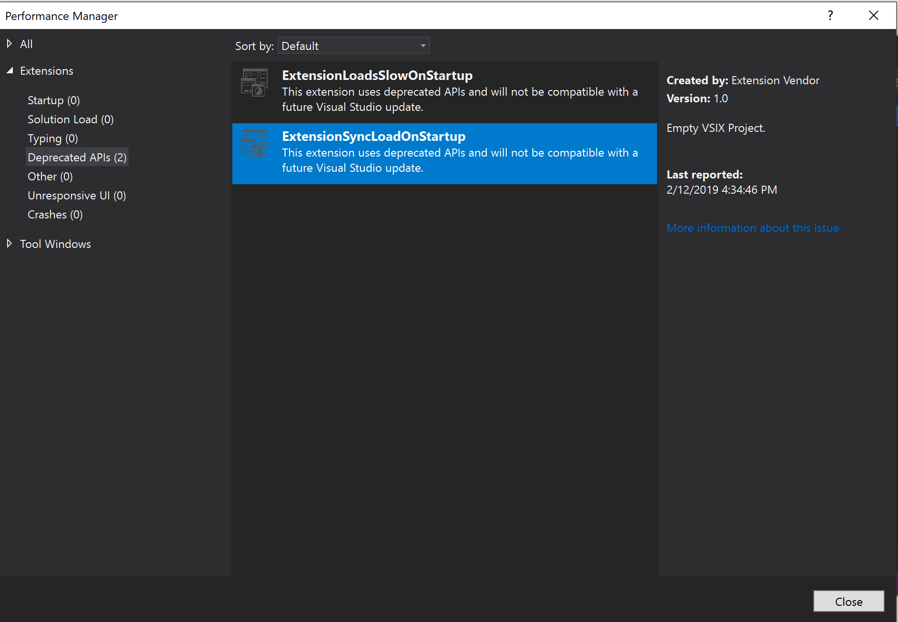

# Synchronously autoloaded extensions

Synchronously autoloaded extensions have a negative impact on the performance of Visual Studio and should be converted to use asynchronous autoload instead. By default, Visual Studio 2019 blocks synchronously autoloaded packages from any extension and notifies the user.

You can:

- Click on **Allow synchronous autoload** to allow extensions to autoload. To change this setting in Visual Studio options, click Environment, then click Extensions, and then select the checkbox "Allow synchronous autoload of extensions". 

- Click on **Manage performance** to open the [Performance Manager dialog](#performance-manager-dialog) that shows performance issues with extensions and tool windows.

- Click on **Don't show this message for current extensions** to dismiss the notification and prevent future notifications from existing installed extensions. If you add a new extension that autoloads synchronously, this notification will be displayed again. You will continue to get notifications about other Visual Studio features.

## Performance Manager dialog

All extensions that synchronously loaded any packages in any user sessions appear in the **Deprecated APIs** tab.

* Click on the **More information about this issue** to gather more information about the deprecated APIs.
* Contact their extension vendors for the migration progress.

## Specify synchronous autoload settings using group policy

Administrators can enable a Group Policy to allow synchronous autoload. To do so, set a registry-based policy on the following key:

**HKEY_LOCAL_MACHINE\SOFTWARE\Policies\Microsoft\VisualStudio\SynchronousAutoload**

Entry = **Allowed**

Value = (DWORD)
* **0** is synchronous autoload not allowed
* **1** is synchronous autoload allowed

## Extension authors
Extension authors can find instructions for migrating packages to asynchronous autoload at [Migrate to AsyncPackage](https://github.com/Microsoft/VSSDK-Extensibility-Samples/tree/master/AsyncPackageMigration).

## Related content
For more information about synchronous autoload settings in Visual Studio 2019, see the [Synchronous Autoload Behavior](https://devblogs.microsoft.com/visualstudio/updates-to-synchronous-autoload-of-extensions-in-visual-studio-2019/) page.
