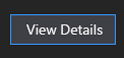
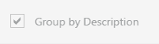
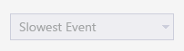
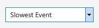
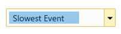

# Color value reference for Visual Studio

This topic is a reference for creating new color tokens. When you're creating new UI, you can use similar colors from existing UI to choose the colors for each main theme and the system color name for that element for High Contrast themes.

For implementation information about creating new color tokens, see [Color theming tools](../../extensibility/internals/color-theming-tools.md).

For color tokens to use with existing UI, see [Shared colors for Visual Studio](../../extensibility/ux-guidelines/shared-colors-for-visual-studio.md).

When using this reference guide, remember:

- **Always copy both foreground and background hues together.** Don't choose a foreground from one UI element and a background from another just because you like the hues.

- **These are hex codes, not color tokens.** You can't use the actual color token names of these UI elements because you can't control how the tokens might be changed in the future. Instead, create tokens within your own category and use the hue values shown in the tables. Color tokens for existing UI can be found in [Shared colors for Visual Studio](../../extensibility/ux-guidelines/shared-colors-for-visual-studio.md).

- **High Contrast swatches are shown for comparison only.** Use the system color name for High Contrast UI, and do not use an eyedropper or color picker on these swatches. High Contrast swatches in this topic reflect the High Contrast #1 theme in Windows. The colors will look different in other High Contrast themes.

- **For best results, pair color sets with UI similar to the example.**

## Properties window

 Properties window in the Light, Dark, and Blue themes

> [!NOTE]
> **High Contrast swatches are shown for comparison only.** Use the system color name for High Contrast UI, and do not use an eyedropper or color picker on these swatches. High Contrast swatches in this topic reflect the High Contrast #1 theme in Windows. The colors will look different in other High Contrast themes.

### Divider lines

| | Light theme | Dark theme | Blue theme | High Contrast |
| --- | :---: | :---: | :---: | :---: |
| Default |  `#FFEEEEF2` |  `#FF2D2D30` |  `#FFEEEEF2` |  `ControlDark` |

### Expander glyph

| | Light theme | Dark theme | Blue theme | High Contrast |
| --- | :---: | :---: | :---: | :---: |
| Foreground | `#FF1E1E1E` |  `#FFF1F1F1` |  `#FF1E1E1E` |  `ControlText` |
| Background |  `#FFF5F5F5` |  `#FF252526` |  `#FFF6F6F6` |  `Window`|
| Foreground: hover |  `#FF007ACC` |  `#FF007ACC` | `#FF007ACC` | `HighlightText` |
| Background: hover |  `#FFC9DEF5` |  `#FF3E3E40` |  `#FFFFFCF4` |  `Highlight` |
| Border |  `#FFF5F5F5` |  `#FF252526` |  `#FFF6F6F6` |  `Window` |
| Border:  hover |  `#FFC9DEF5` |  `#FF3E3E40` |  `#FFE5C365` | `WindowFrame` |

### Embedded tab control: body

| | Light theme | Dark theme | Blue theme | High Contrast |
| --- | :---: | :---: | :---: | :---: |
| Foreground |  `#FF1E1E1E` |  `#FFF1F1F1` |  `#FF1E1E1E` |  `ControlText` |
| Background |  `#FFE7E8EC` |  `#FF1B1B1C` |  `#FFE7E8EC` |  `Control` |
| Border |  `#FFE7E8EC` |  `#FF1B1B1C` |  `#FFE7E8EC` |  `WindowFrame` |

### Embedded tab control: active tab

| | Light theme | Dark theme | Blue theme | High Contrast |
| --- | :---: | :---: | :---: | :---: |
| Foreground |  `#FF1E1E1E` |  `#FFF1F1F1` |  `#FF1E1E1E` | `ControlText` |
| Background |  `#FFE7E8EC` |  `#FF1B1B1C` |  `#FFE7E8EC` |  `Highlight` |
| Border |  `#FFE7E8EC` |  `#FF1B1B1C` |  `#FFE7E8EC` |  `WindowFrame` |

### Embedded tab control: inactive tab

| | Light theme | Dark theme | Blue theme | High Contrast |
| --- | :---: | :---: | :---: | :---: |
| Foreground |  `#FF1E1E1E` |  `#FFF1F1F1` |  `#FF1E1E1E` |  `ControlText` |
| Background |  `#FFF5F5F5` |  `#FF252526` |  `#FFF6F6F6` |  `Control` |
| Foreground: hover |  `#FF1E1E1E` |  `#FFF1F1F1` |  `#FF1E1E1E` |  `HighlightText` |
| Background: hover |  `#FFC9DEF5` |  `#FF3E3E40` |  `#FFFEFEFE` |  `Highlight` |
| Foreground: disabled |  `#FFA2A4A5` |  `#FF656565` |  `#FFA2A4A5` |  `GrayText` |
| Background: disabled |  `#FFF5F5F5` |  `#FF252526` |  `#FFF6F6F6` |  `Control` |
| Border |  `#FFF5F5F5` |  `#FF252526` |  `#FFF6F6F6` |  `WindowFrame` |
| Border: hover |  `#FFC9DEF5` |  `#FF3E3E40` |  `#FFFEFEFE` |  `WindowFrame` |
| Border: disabled |  `#FFF5F5F5` |  `#FF252526` |  `#FFF6F6F6` |  `WindowFrame` |

### Section header

| | Light theme | Dark theme | Blue theme | High Contrast |
| --- | :---: | :---: | :---: | :---: |
| Foreground |  `#FF1E1E1E` |  `#FFF1F1F1` |  `#FF1E1E1E` |  `ControlText` |
| Foreground: hover |  `#FF1E1E1E` |  `#FFF1F1F1` |  `#FF1E1E1E` |  `HighlightText` |
| Background |  `#FFEEEEF2` |  `#FF292929` |  `#FFEEEEF2` |  `Control` |
| Background: hover |  `#FFC9DEF5` |  `#FF3E3E40` |  `#FFFFFCF4` |  `Highlight` |
| Border | None | None | None | None |
| Border: hover |  `#FFC9DEF5` |  `#FF3E3E40` |  `#FFE5C365` |  `WindowFrame` |

### Category group

| | Light theme | Dark theme | Blue theme | High Contrast |
| --- | :---: | :---: | :---: | :---: |
| Body foreground |  `#FF1E1E1E` |  `#FFF1F1F1` |  `#FF1E1E1E` |  `ControlText` |
| Body background |  `#FFF5F5F5` |  `#FF252526` |  `#FFF6F6F6` |  `Control` |
| Glyph foreground |  `#FF1E1E1E` |  `#FFF1F1F1` |  `#FF1E1E1E` |  `WindowText` |
| Glyph foreground: hover |  `#FF007ACC` |  `#FF007ACC` |  `#FF007ACC` |  `WindowText` |

### Toggle buttons

| | Light theme | Dark theme | Blue theme | High Contrast |
| --- | :---: | :---: | :---: | :---: |
| Foreground |  `#FF1E1E1E` |  `#FFF1F1F1` |  `#FF1E1E1E` |  `WindowText` |
| Background |  `#FFF5F5F5` |  `#FF252526` |  `#FFF6F6F6` |  `Window` |
| Foreground: hover |  `#FF1E1E1E` |  `#FFF1F1F1` |  `#FF1E1E1E` |  `HighlightText` |
| Background: hover |  `#FFC9DEF5` |  `#FF3E3E40` |  `#FFFFFCF4` |  `Highlight` |
| Foreground: selected |  `#FF1E1E1E` |  `#FFF1F1F1` |  `#FF1E1E1E` |  `HighlightText` |
| Background: selected |  `#FFF5F5F5` |  `#FF252526` |  `#FFFDF4BF` |  `Highlight` |
| Foreground: disabled |  `#FFA2A4A5` |  `#FF656565` |  `#FFA2A4A5` |  `ControlText` |
| Background: disabled |  `#FFF5F5F5` |  `#FF252526` |  `#FFF6F6F6` |  `Window` |
| Border |  `#FFCCCEDB` |  `#FF3F3F46` |  `#FFCCCEDB` |  `Window` |
| Border: hover |  `#FFC9DEF5` |  `#FF3E3E40` |  `#FFE5C365` |  `WindowFrame` |
| Border: selected |  `#FF007ACC` |  `#FF007ACC` |  `#FFE5C365` |  `WindowFrame` |
| Border: disabled |  `#FFF5F5F5` |  `#FF252526` |  `#FFF6F6F6` |  `WindowFrame` |

### Input fields

| | Light theme | Dark theme | Blue theme | High Contrast |
| --- | :---: | :---: | :---: | :---: |
| Foreground |  `#FF1E1E1E` |  `#FFF1F1F1` |  `#FF1E1E1E` |  `ControlText` |
| Background |  `#FFFFFFFF` |  `#FF333337` |  `#FFFCFCFC` |  `Control` |
| Foreground: disabled |  `#FFA2A4A5` |  `#FF656565` |  `#FFA2A4A5` |  `GrayText` |
| Background: disabled |  `#FFF5F5F5` |  `#FF252526` |  `#FFF6F6F6` |  `Control` |
| Border |  `#FFCCCEDB` |  `#FF434346` |  `#FFCCCEDB` |  `ControlDark` |
| Border: disabled |  `#FFCCCEDB` |  `#FF434346` |  `#FFC6C6C6` |  `ControlDark` |

### List items

| | Light theme | Dark theme | Blue theme | High Contrast |
| --- | :---: | :---: | :---: | :---: |
| Foreground |  `#FF1E1E1E` |  `#FFF1F1F1` |  `#FF1E1E1E` |  `ControlText` |
| Foreground: hover |  `#FF1E1E1E` |  `#FFF1F1F1` |  `#FF1E1E1E` |  `HighlightText` |
| Background: hover |  `#FFC9DEF5` |  `#72555555` |  `#FFFDF4BF` |  `Highlight` |
| Foreground: selected |  `#FFFFFFFF` |  `#FFFFFFFF` |  `#FFFFFFFF` |  `HighlightText` |
| Background: selected |  `#FF3399FF` |  `#FF3399FF` |  `#FF3399FF` |  `Highlight` |
| Foreground: disabled |  `#FFA2A4A5` |  `#FF656565` |  `#FFA2A4A5` |  `GrayText` |
| Border: hover |  `#FFC9DEF5` |  `#72555555` |  `#FFFDF4BF` |  `WindowFrame` |
| Border: selected |  `#FFCCCEDB` |  `#FF3399FF` |  `#FF3399FF` |  `WindowFrame` |

### Command buttons

| | Light theme | Dark theme | Blue theme | High Contrast |
| --- | :---: | :---: | :---: | :---: |
| Foreground |  `#FF1E1E1E` |  `#FFF1F1F1` |  `#FF1E1E1E` |  `ControlText` |
| Background: hover |  `#FFC9DEF5` |  `#FF3E3E40` |  `#FFFEFEFE` |  `Highlight` |
| Foreground: selected |  `#FFFFFFFF` |  `#FFFFFFFF` |  `#FFFFFFFF` |  `HighlightText` |
| Background: pressed |  `#FF007ACC` |  `#FF007ACC` |  `#FF007ACC` |  `Highlight` |
| Foreground: disabled |  `#FFA2A4A5` |  `#FF656565` |  `#FFA2A4A5` |  `GrayText` |
| Background: disabled |  `#FFF5F5F5` |  `#FF252526` |  `#FFF6F6F6` |  `Window` |
| Border: hover |  `#FFC9DEF5` |  `#FF3E3E40` |  `#FFFEFEFE` |  `HighlightText` |
| Border: pressed |  `#FF007ACC` |  `#FF007ACC` |  `#FF007ACC` |  `HighlightText` |
| Border: disabled |  `#FFCCCEDB` |  `#FF434346` |  `#FFC6C6C6` |  `WindowFrame` |

## Properties grid control elements

 Properties grid in Light, Dark, and Blue themes

> [!NOTE]
> **High Contrast swatches are shown for comparison only.** Use the system color name for High Contrast UI, and do not use an eyedropper or color picker on these swatches. High Contrast swatches in this topic reflect the High Contrast #1 theme in Windows. The colors will look different in other High Contrast themes.

### Content

| | Light theme | Dark theme | Blue theme | High Contrast |
| --- | :---: | :---: | :---: | :---: |
| Foreground |  `#FF1E1E1E` |  `#FFF1F1F1` |  `#FF000000` |  `WindowText` |
| Background |  `#FFF5F5F5` |  `#FF252526` |  `#FFFFFFFF` |  `Control` |
| Foreground: selected, focused |  `#FFFFFFFF` |  `#FFFFFFFF` |  `#FFFFFFFF` |  `HighlightText` |
| Background: selected, focused |  `#FF3399FF` |  `#FF3399FF` |  `#FF3399FF` |  `Highlight` |
| Foreground: selected, unfocused |  `#FF1E1E1E` |  `#FFF1F1F1` |  `#FF000000` |  `WindowText` |
| Background: selected, unfocused |  `#FFEEEEF2` |  `#FF2D2D30` |  `#FFEEEEF2` |  `ControlDark` |
| Divider lines |  `#FFEEEEF2` |  `#FF2D2D30` |  `#FFEEEEF2` |  `ControlDark` |

### Header

| | Light theme | Dark theme | Blue theme | High Contrast |
| --- | :---: | :---: | :---: | :---: |
| Foreground |  `#FF1E1E1E` |  `#FFF1F1F1` |  `#FF000000` |  `WindowText` |
| Background |  `#FFEEEEF2` |  `#FF2D2D30` |  `#FFEEEEF2` |  `ControlDark` |

## CodeLens UI

> [!NOTE]
> CodeLens UI colors are the same for Light, Dark, and Blue themes.

> [!NOTE]
> **High Contrast swatches are shown for comparison only.** Use the system color name for High Contrast UI, and do not use an eyedropper or color picker on these swatches. High Contrast swatches in this topic reflect the High Contrast #1 theme in Windows. The colors will look different in other High Contrast themes.

### Body

| | Light theme | Dark theme | Blue theme | High Contrast |
| --- | :---: | :---: | :---: | :---: |
| Foreground |  `#FF1E1E1E` |  `#FF1E1E1E` |  `#FF1E1E1E` |  `WindowText` |
| Background |  `#FFFCFCFC` |  `#FFFCFCFC` |  `#FFFCFCFC` |  `Window` |
| Foreground: selected |  `#FFFFFFFF` |  `#FFFFFFFF` |  `#FFFFFFFF` |  `HighlightText` |
| Background: selected |  `#FF3399FF` |  `#FF3399FF` |  `#FF3399FF` |  `Highlight` |
| Background: highlighted |  `#FFFDFBAC` |  `#FFFDFBAC` |  `#FFFDFBAC` |  `HotTrack` |
| Border |  `#FF6FC2E9` |  `#FF6FC2E9` |  `#FF6FC2E9` |  `WindowFrame` |

### Hyperlink and separator

| | Light theme | Dark theme | Blue theme | High Contrast |
| --- | :---: | :---: | :---: | :---: |
| Hyperlink foreground |  `#FF0E70C0` |  `#FF0E70C0` |  `#FF0E70C0` |  `HotTrack` |
| Separator foreground |  `#FF9C9C9C` |  `#FF9C9C9C` |  `#FF9C9C9C` |  `HotTrack` |

## Grid control

 Grid control in Light (top), Dark (center), and Blue (bottom) themes

> [!NOTE]
> **High Contrast swatches are shown for comparison only.** Use the system color name for High Contrast UI, and do not use an eyedropper or color picker on these swatches. High Contrast swatches in this topic reflect the High Contrast #1 theme in Windows. The colors will look different in other High Contrast themes.

### Body

| | Light theme | Dark theme | Blue theme | High Contrast |
| --- | :---: | :---: | :---: | :---: |
| Foreground |  `#FF1E1E1E` |  `#FFF1F1F1` |  `#FF000000` |  `WindowText` |
| Foreground: selected |  `#FFFFFFFF` |  `#FFFFFFFF` |  `#FFFFFFFF` |  `HighlightText` |

### Subsection header

| | Light theme | Dark theme | Blue theme | High Contrast |
| --- | :---: | :---: | :---: | :---: |
| Foreground |  `#FF717171` |  `#FF999999` |  `#FF717171` |  `GrayText` |
| Background |  `#FFF5F5F5` |  `#FF252526` |  `#FFFFFFFF` |  `Window` |
| Background: selected |  `#FF3399FF` |  `#FF3399FF` |  `#FF3399FF` |  `Highlight` |

### Grid lines

| | Light theme | Dark theme | Blue theme | High Contrast |
| --- | :---: | :---: | :---: | :---: |
| Items (foreground) |  `#FFF0F0F0` |  `#FF000000` |  `#FFF0F0F0` |  `ScrollBar` |
| Header (foreground) |  `#FFE0E3E6` |  `#FF333337` |  `#FFBEC3CB` |  `ControlDark` |

## Manifest Designer

 Manifest Designer in Light (top), Dark (center), and Blue (bottom) themes

> [!NOTE]
> **High Contrast swatches are shown for comparison only.** Use the system color name for High Contrast UI, and do not use an eyedropper or color picker on these swatches. High Contrast swatches in this topic reflect the High Contrast #1 theme in Windows. The colors will look different in other High Contrast themes.

### Body

| | Light theme | Dark theme | Blue theme | High Contrast |
| --- | :---: | :---: | :---: | :---: |
| Foreground |  `#FF1E1E1E` |  `#FFF1F1F1` |  `#FF1E1E1E` |  `ControlText` |
| Background |  `#FFF5F5F5` |  `#FF252526` |  `#FFF6F6F6` |  `Control` |

### Active tab

| | Light theme | Dark theme | Blue theme | High Contrast |
| --- | :---: | :---: | :---: | :---: |
| Foreground |  `#FF1E1E1E` |  `#FFF1F1F1` |  `#FF1E1E1E` |  `ActiveCaptionText` |
| Background |  `#FFF5F5F5` |  `#FF252526` |  `#FFF6F6F6` | `ActiveCaption` |

### Inactive tab

| | Light theme | Dark theme | Blue theme | High Contrast |
| --- | :---: | :---: | :---: | :---: |
| Foreground |  `#FF1E1E1E` |  `#FFF1F1F1` |  `#FF1E1E1E` |  `InactiveCaptionText` |
| Background |  `#FFFEFEFE` |  `#FF333337` |  `#FFFEFEFE` |  `HighlightText` |
| Foreground: hover |  `#FF1E1E1E` |  `#FFF1F1F1` |  `#FF1E1E1E` |  `InactiveCaption` |
| Background: hover |  `#FFCCCEDB` |  `#FF3F3F46` |  `#FFCCCEDB` |  `Highlight` |

### Watermark text

| | Light theme | Dark theme | Blue theme | High Contrast |
| --- | :---: | :---: | :---: | :---: |
| Foreground |  `#FF999999` |  `#FF999999` |  `#FF717171` |  `GrayText` |
| Background |  `#FFF5F5F5` |  `#FF252526` |  `#FFF6F6F6` |  `Control` |

### Description pane

| | Light theme | Dark theme | Blue theme | High Contrast |
| --- | :---: | :---: | :---: | :---: |
| Foreground |  `#FF1E1E1E` |  `#FFF1F1F1` |  `#FF1E1E1E` |  `ControlText` |
| Background |  `#FFEEEEF2` |  `#FF252526` |  `#FFFFFFFF` |  `Control` |

## TFS tagging

 TFS tagging in Light (top), Dark (center), and Blue (bottom) themes

> [!NOTE]
> **High Contrast swatches are shown for comparison only.** Use the system color name for High Contrast UI, and do not use an eyedropper or color picker on these swatches. High Contrast swatches in this topic reflect the High Contrast #1 theme in Windows. The colors will look different in other High Contrast themes.

### Tags

| | Light theme | Dark theme | Blue theme | High Contrast |
| --- | :---: | :---: | :---: | :---: |
| Foreground (text) |  `#FF1E1E1E` |  `#FFFFFFFF` |  `#FF1E1E1E` |  `ActiveCaptionText` |
| Background |  `#FFE1E6F1` |  `#FF424242` |  `#FFE9ECEE` |  `ActiveCaption` |
| Foreground (text): hover |  `#FF1E1E1E` |  `#FFFFFFFF` |  `#FF1E1E1E` |  `HighlightText` |
| Background: hover |  `#FFC9DEF5` |  `#FF606060` |  `#FFFDF4BF` |  `Highlight` |
| Foreground (text): pressed |  `#FFFFFFFF` |  `#FFFFFFFF` |  `#FFFFFFFF` |  `HighlightText` |
| Background: pressed |  `#FF3399FF` |  `#FF3399FF` |  `#FF3399FF` |  `Highlight` |
| Foreground (text): selected |  `#FFFFFFFF` |  `#FFFFFFFF` |  `#FFFFFFFF` |  `HighlightText` |
| Background: selected |  `#FF3399FF` |  `#FF3399FF` |  `#FF3399FF` |  `Highlight` |

### Glyph on hover

| | Light theme | Dark theme | Blue theme | High Contrast |
| --- | :---: | :---: | :---: | :---: |
| Glyph |  `#FF1E1E1E` |  `#FFFFFFFF` |  `#FF1E1E1E` |  `HighlightText` |
| Background |  `#FFF7F7F9` |  `#FF393939` |  `#FFFFFCF4` |  `HighlightText` |
| Border |  `#FFF7F7F9` |  `#FF393939` |  `#FFE5C365` |  `HighlightText` |
| Glyph (press and hover) |  `#FFFFFFFF` |  `#FFFFFFFF` |  `#FFFFFFFF` |  `Highlight` |
| Background (press and hover) |  `#FF0E6198` |  `#FF007ACC` |  `#FFFDF4BF` |  `HighlightText` |
| Border (press and hover) |  `#FF0E6198` |  `#FF007ACC` |  `#FFE5C365` |  `HighlightText` |

### Selected glyph

| | Light theme | Dark theme | Blue theme | High Contrast |
| --- | :---: | :---: | :---: | :---: |
| Glyph |  `#FFFFFFFF` |  `#FFFFFFFF` |  `#FFFFFFFF` |  `HighlightText` |
| Background |  `#FF52B0EF` |  `#FF52B0EF` |  `#FF52B0EF` |  `HighlightText` |
| Border |  `#FF52B0EF` |  `#FF52B0EF` |  `#FF52B0EF` |  `HighlightText` |
| Glyph (press and hover) |  `#FFFFFFFF` |  `#FFFFFFFF` |  `#FFFFFFFF` |  `Highlight` |
| Background (press and hover) |  `#FF0E6198` |  `#FF0E6198` |  `#FF0E6198` |  `HighlightText` |
| Border (press and hover) |  `#FF0E6198` |  `#FF0E6198` |  `#FF0E6198` |  `HighlightText` |

## Button controls

> [!NOTE]
> **High Contrast swatches are shown for comparison only.** Use the system color name for High Contrast UI, and do not use an eyedropper or color picker on these swatches. High Contrast swatches in this topic reflect the High Contrast #1 theme in Windows. The colors will look different in other High Contrast themes.

### Default

| | Light theme | Dark theme | Blue theme | High Contrast |
| --- | :---: | :---: | :---: | :---: |
| Appearance |  |  |  |  |
| Foreground |  `#1E1E1E` |  `#F1F1F1` |  `#1E1E1E` |  `ControlText` |
| Background |  `#ECECF0` |  `#3F3F46` |  `#ECECF0` |  `Control` |
| Border |  `#CCCEDB` |  `#555555` |  `#CCCEDB` |  `ControlDark` |

### Disabled

| | Light theme | Dark theme | Blue theme | High Contrast |
| --- | :---: | :---: | :---: | :---: |
| Appearance |  |  |  |  |
| Foreground |  `#A2A4A5` |  `#656565` |  `#A2A4A5` |  `InactiveCaptionText` |
| Background |  `#F5F5F5` |  `#2D2D30` |  `#F5F5F5` |  `InactiveCaption` |
| Border |  `#CCCEDB` |  `#3F3F46` |  `#CCCEDB` |  `InactiveBorder` |

### Hover

| | Light theme | Dark theme | Blue theme | High Contrast |
| --- | :---: | :---: | :---: | :---: |
| Appearance |  |  |  |  |
| Foreground |  `#1E1E1E` |  `#F1F1F1` |  `#1E1E1E` |  `ActiveCaptionText` |
| Background |  `#C9DEF5` |  `#3F3F46` |  `#C9DEF5` |  `ActiveCaption` |
| Border |  `#CCCEDB` |  `#007ACC` |  `#3399FF` |  `ActiveBorder` |

### Pressed

| | Light theme | Dark theme | Blue theme | High Contrast |
| --- | :---: | :---: | :---: | :---: |
| Appearance |  |  |  |  |
| Foreground |  `#FFFFFF` |  `#F1F1F1` |  `#FFFFFF` |  `HighlightText` |
| Background |  `#007ACC` |  `#007ACC` |  `#007ACC` |  `Highlight` |
| Border |  `#007ACC` |  `#007ACC` |  `#007ACC` |  `HighlightText` |

### Focused

| | Light theme | Dark theme | Blue theme | High Contrast |
| --- | :---: | :---: | :---: | :---: |
| Appearance |  |  |  |  |
| Foreground |  `#1E1E1E` |  `#F1F1F1` |  `#1E1E1E` |  `HighlightText` |
| Background |  `#C9DEF5` |  `#3F3F46` |  `#C9DEF5` |  `Highlight` |
| Border |  `#3399FF` |  `#007ACC` |  `#3399FF` |  `HighlightText` |

## Check box controls

> [!NOTE]
> **High Contrast swatches are shown for comparison only.** Use the system color name for High Contrast UI, and do not use an eyedropper or color picker on these swatches. High Contrast swatches in this topic reflect the High Contrast #1 theme in Windows. The colors will look different in other High Contrast themes.

### Default

| | Light theme | Dark theme | Blue theme | High Contrast |
| --- | :---: | :---: | :---: | :---: |
| Appearance |  |  |  |  |
| Background |  `#FEFEFE` |  `#252526` |  `#FEFEFE` |  `Control` |
| Border |  `#717171` |  `#999999` |  `#717171` |  `ControlDark` |
| Text |  `#1E1E1E` |  `#F1F1F1` |  `#1E1E1E` |  `ControlText` |
| Glyph |  `#1E1E1E` |  `#F1F1F1` |  `#1E1E1E` |  `ControlText` |

### Disabled

| | Light theme | Dark theme | Blue theme | High Contrast |
| --- | :---: | :---: | :---: | :---: |
| Appearance |  |  |  |  |
| Background |  `#F6F6F6` |  `#2D2D30` |  `#F6F6F6` |  `InactiveCaption` |
| Border |  `#C6C6C6` |  `#434346` |  `#C6C6C6` |  `InactiveBorder` |
| Text |  `#A2A4A5` |  `#656565` |  `#A2A4A5` |  `InactiveCaption` |
| Glyph |  `#A2A4A5` |  `#656565` |  `#A2A4A5` |  `InactiveCaptionText` |

### Hover

| | Light theme | Dark theme | Blue theme | High Contrast |
| --- | :---: | :---: | :---: | :---: |
| Appearance |  |  |  |  |
| Background |  `#F3F9FF` |  `#1F1F20` |  `#FDF4BF` |  `Highlight` |
| Border |  `#3399FF` |  `#007ACC` |  `#E5C365` |  `HighlightText` |
| Text |  `#1E1E1E` |  `#F1F1F1` |  `#1E1E1E` |  `HighlightText` |
| Glyph |  `#1E1E1E` |  `#F1F1F1` |  `#424242` |  `HighlightText` |

### Pressed

| | Light theme | Dark theme | Blue theme | High Contrast |
| --- | :---: | :---: | :---: | :---: |
| Appearance |  |  |  |  |
| Background |  `#007ACC` |  `#007ACC` |  `#E5C365` |  `Highlight` |
| Border |  `#007ACC` |  `#007ACC` |  `#E5C365` |  `HighlightText` |
| Text |  `#1E1E1E` |  `#F1F1F1` |  `#1E1E1E` |  `HighlightText` |
| Glyph |  `#FFFFFF` |  `#F1F1F1` |  `#1E1E1E` |  `HighlightText` |

### Focused

| | Light theme | Dark theme | Blue theme | High Contrast |
| --- | :---: | :---: | :---: | :---: |
| Appearance |  |  |  |  |
| Background |  `#FDF4BF` |  `#1F1F20` |  `#FDF4BF` |  `Highlight` |
| Border |  `#3399FF` |  `#007ACC` |  `#E5C365` |  `HighlightText` |
| Text |  `#1E1E1E` |  `#F1F1F1` |  `#1E1E1E` |  `HighlightText` |
| Glyph |  `#1E1E1E` |  `#F1F1F1` |  `#424242` |  `HighlightText` |

## Drop-down/combo box controls

> [!NOTE]
> **High Contrast swatches are shown for comparison only.** Use the system color name for High Contrast UI, and do not use an eyedropper or color picker on these swatches. High Contrast swatches in this topic reflect the High Contrast #1 theme in Windows. The colors will look different in other High Contrast themes.

### Initial appearance

#### Default

| | Light theme | Dark theme | Blue theme | High Contrast |
| --- | :---: | :---: | :---: | :---: |
| Appearance |  |  |  |  |
| Background |  `##007ACC` |  `#333337` |  `#FCFCFC` |  `Control` |
| Border |  `#CCCEDB` |  `#434346` |  `#8591A2` |  `ControlLight` |
| Separator |  `#FFFFFF` |  `#333337` |  `#FCFCFC` |  `ControlLight` |
| Glyph |  `#717171` |  `#999999` |  `#1B293E` |  `ControlText` |
| Glyph background |  `#FFFFFF` |  `#333337` |  `#FCFCFC` |  `#Control` |

#### Disabled

| | Light theme | Dark theme | Blue theme | High Contrast |
| --- | :---: | :---: | :---: | :---: |
| Appearance |  |  |  |  |
| Background |  `#EEEEF2` |  `#2D2D30` |  `#DFE7F3` |  `InactiveCaption` |
| Border |  `#CCCEDB` |  `#434346` |  `#A4ADBA` |  `InactiveBorder` |
| Text |  `#A2A4A5` |  `#656565` |  `#A2A4A5` |  `InactiveCaptionText` |
| Separator |  `#EEEEF2` |  `#2D2D30` |  `#D5DCE8` |  `InactiveBorder` |
| Glyph |  `#CCCEDB` |  `#656565` |  `#A2A4A5` |  `InactiveCaptionText` |
| Glyph background |  `#EEEEF2` |  `#2D2D30` |  `#D5DCE8` |  `InactiveCaption` |

#### Hover

| | Light theme | Dark theme | Blue theme | High Contrast |
| --- | :---: | :---: | :---: | :---: |
| Appearance |  |  |  |  |
| Background |  `#007ACC` |  `#3F3F46` |  `#FCFCFC` |  `Highlight` |
| Border |  `#007ACC` |  `#007ACC` |  `#E5C365` |  `HighlightText` |
| Text |  `#1E1E1E` |  `#007ACC` |  `#000000` |  `HighlightText` |
| Separator |  `#007ACC` |  `#007ACC` |  `#E5C365` |  `HighlightText` |
| Glyph |  `#1E1E1E` |  `#007ACC` |  `#000000` |  `HighlightText` |
| Glyph background |  `#C9DEF5` |  `#1F1F20` |  `#FDF4BF` |  `Highlight` |

#### Pressed

| | Light theme | Dark theme | Blue theme | High Contrast |
| --- | :---: | :---: | :---: | :---: |
| Appearance |  |  |  |  |
| Background |  `#FFFFFF` |  `#3F3F46` |  `#FCFCFC` |  `Highlight` |
| Border |  `#007ACC` |  `#007ACC` |  `#E5C365` |  `HighlightText` |
| Text |  `#1E1E1E` |  `#FFFFFF` |  `#000000` |  `HighlightText` |
| Separator |  `#007ACC` |  `#007ACC` |  `#E5C365` |  `HighlightText` |
| Glyph |  `#FFFFFF` |  `#FFFFFF` |  `#000000` |  `HighlightText` |
| Glyph background |  `#007ACC` |  `#007ACC` |  `#E5C365` |  `Highlight` |

#### Focused

| | Light theme | Dark theme | Blue theme | High Contrast |
| --- | :---: | :---: | :---: | :---: |
| Appearance |  |  |  |  |
| Background |  `#FFFFFF` |  `#3F3F46` |  `#FCFCFC` |  `Highlight` |
| Border |  `#007ACC` |  `#007ACC` |  `#E5C365` |  `HighlightText` |
| Text |  `#1E1E1E` |  `#FFFFFF` |  `#000000` |  `HighlightText` |
| Separator |  `#007ACC` |  `#007ACC` |  `#E5C365` |  `HighlightText` |
| Glyph |  `#1E1E1E` |  `#007ACC` |  `#000000` |  `HighlightText` |
| Glyph background |  `#C9DEF5` |  `#3F3F46` |  `#FCFCFC` |  `Highlight` |

### List (appears on press)

| Light theme | Dark theme | Blue theme | High Contrast |
| :---: | :---: | :---: | :---: |
|  |  |  |  |

#### Default

| | Light theme | Dark theme | Blue theme | High Contrast |
| --- | :---: | :---: | :---: | :---: |
| Background |  `#F6F6F6` |  `#1B1B1C` |  `#EFEFEF` |  `Menu` |
| Border |  `#CCCEDB` |  `#3F3F46` |  `#98A7B7`|  `MenuText` |
| Text |  `#1E1E1E` |  `#FFFFFF` |  `#000000` |  `MenuText` |
| Background shadow |  `#19000000` |  `#19000000` |  `#19000000` |  `ControlDark` |

#### Hover

| | Light theme | Dark theme | Blue theme | High Contrast |
| --- | :---: | :---: | :---: | :---: |
| Background |  `#C9DEF5` |  `#3F3F46` |  `#FDF4BF` |  `Highlight` |
| Border |  `#CCCEDB` | `#3F3F46` |  `#FDF4BF` |  `HighlightText` |
| Text | `#1E1E1E` | `#FFFFFF` | `#000000` |  `HighlightText` |

#### Pressed

| | Light theme | Dark theme | Blue theme | High Contrast |
| --- | :---: | :---: | :---: | :---: |
| Background | `#C9DEF5` | `#3F3F46` |  `#FDF4BF` |  `Highlight` |
| Border |  `#CCCEDB` | `#3F3F46` |  `#FDF4BF` |  `HighlightText` |
| Text | `#1E1E1E` |  `#FFFFFF` |  `#000000` |  `HighlightText` |

#### Focused

| | Light theme | Dark theme | Blue theme | High Contrast |
| --- | :---: | :---: | :---: | :---: |
| Background |  `#F6F6F6` | `#3F3F46` |  `#FDF4BF` |  `Highlight` |
| Border |  `#C9DEF5` | `#3F3F46` | `#FDF4BF` |  `HighlightText` |
| Text |  `#1E1E1E` |  `#FFFFFF` | `#000000` |  `HighlightText` |

### Text input selection

| | Light theme | Dark theme | Blue theme | High Contrast |
| --- | :---: | :---: | :---: | :---: |
| Appearance |  |  |  |  |
| Text input selection |  `#66007ACC` |  `#66007ACC` |  `#66007ACC` |  `HighlightText` |

## Color swatches by function

| Light | Dark | Blue | Used for ... |
| :---: | :---: | :---: | --- |
|  `#FFC9DEF5` |  `#FF2D2D30` |  `#FFFDF4BF` | Action buttons, combo box items, command bar buttons, drop-down buttons, and menu items: background |
|  `#FFCCCEDB` |  `#FF3F3F46` |  `#FF465A7D` | Auto-hide tab border |
|  `#FFEEEEF2` |  `#FF2D2D30` |  `#FF293955` | Auto-hide tab default and hover backgrounds |
|  `#FF444444` |  `#FFD0D0D0` |  `#FFFFFFFF` | Auto-hide tab text, unfocused tool window title bar text, and tool window tab text |
|  `#FF0E70C0` |  `#FF0097FB` |  `#FFFFFFFF` | Auto-hide tab text: hover |
|  `#FF1C97EA` |  `#FF1C97EA` |  `#FF5B7199` | Background document tabs: background and border on hover |
|  `#FFFFFFFF` |  `#FF333337` |  `#FFFFFFFF` | Combo box and search box input field: default background |
|  `#FFFFFFFF` |  `#FF333337` |  `#FFFFFFFF` | Combo box and some drop-down list menu items: background on hover and mouse down |
|  `#FF007ACC` |  `#FF1F1F20` |  `#FFFDF4BF` | Combo box buttons: background on hover |
|  `#FFCCCEDB` |  `#FF434346` |  `#FFA4ADBA` | Combo box, drop-down list, search control, and text box: disabled border |
|  `#FFEEEEF2` |  `#FF2D2D30` |  `#FFD5DCE8` | Combo box, drop-down, and text box: disabled backgrounds |
|  `#FF717171` |  `#FFF1F1F1` |  `#FF1B293E` | Combo box: default glyph |
|  `#FFC9DEF5` |  `#72555555` |  `#FFFDF4BF` | Command bar options: background on hover |
|  `#FF717171` |  `#FF999999` |  `#FF1B293E` | Command bar options: default glyph |
|  `#FF007ACC` |  `#FF007ACC` |  `#FF1B293E` | Command bar options: hover glyph |
|  `#FFFFFFFF` |  `#FFFFFFFF` |  `#FF1B293E` | Command bar options: mouse down glyph |
|  `#FF1E1E1E` |  `#FFF1F1F1` |  `#FF1B293E` | Command bar text, drop-down, and combo box menu item text |
|  `#FF1E1E1E` |  `#FFF1F1F1` |  `#FF000000` | Command bar: hover, mouse down, and selected text |
|  `#FFCCCEDB` |  `#FF222222` |  `#FF8591A2` | Command bar: tool bar separator |
|  `#FFF5F5F5` |  `#FF46464A` |  `#FFD6DBE9` | Command bar: tool bar separator highlight |
|  `#FFEEEEF2` |  `#FF2D2D30` |  `#FFD6DBE9` | Command shelf background |
|  `#FFCCCEDB` |  `#FF434346` |  `#FF8591A2` | Default borders and command bar separators |
|  `#FFCCCEDB` |  `#FF434346` |  `#FF8591A2` | Default drop-down list and combo box selection/input field border |
|  `#FF717171` |  `#FF999999` |  `#FF000000` | Default menu and submenu glyphs |
|  `#FFF6F6F6` |  `#FF1B1B1C` |  `#FFEAF0FF` | Default menu background |
|  `#FF007ACC` |  `#FF007ACC` |  `#FF007ACC` | Default status bar background |
|  `#FFA2A4A5` |  `#FF656565` |  `#FFA2A4A5` | Disabled text |
|  `#FFE7E8EC` |  `#FF1B1B1C` |  `#FFFFFFFF` | Dock target background |
|  `#FFCCCEDB` |  `#FF333337` |  `#FF636871` | Dock target border |
|  `#FFF5F5F5` |  `#FF252526` |  `#FFF5F8FB` | Dock target button background |
|  `#FFF5F5F5` |  `#FF252526` |  `#FFFDE8A7` | Dock target glyph background |
|  `#FF52B0EF` |  `#FF52B0EF` |  `#FFFFFCF4` | Document and tool window buttons: active backgrounds on hover |
|  `#FF007ACC` |  `#FF007ACC` |  `#FFE5C365` | Drop-down button and command bar button backgrounds on mouse down |
|  `#FFC9DEF5` |  `#FF1F1F20` |  `#FFFDF4BF` | Drop-down buttons: background on hover |
|  `#FFF6F6F6` |  `#FF1B1B1C` |  `#FFEFEFEF` | Drop-down list and combo box drop-down menu background |
|  `#FFFFFFFF` |  `#FF3F3F46` |  `#FFFCFCFC` | Drop-down list, combo box, and search control drop-down menu: background on hover and mouse down |
|  `#FF1E1E1E` |  `#FF007ACC` |  `#FF000000` | Drop-down list, combo box, search control, menu, and submenu glyphs on hover |
|  `#FF717171` |  `#FF999999` |  `#FF1B293E` | Drop-down list, menu, and split button: default glyphs |
|  `#FF007ACC` |  `#FF434346` |  `#FFE5C365` | Drop-down list: border on hover and mouse down |
|  `#FFFFFFFF` |  `#FF333337` |  `#FFFCFCFC` | Drop-down list: default background |
|  `#FF0E70C0` |  `#FF0097FB` |  `#FF0E70C0` | Drop-down menu link text |
|  `#FFC9DEF5` |  `#FF1F1F20` |  `#FFFDF4BF` | Focused combo box drop-down button background |
|  `#FF007ACC` |  `#FF007ACC` |  `#FF293955` | Focused tool window title bar and document window tab background |
|  `#FF007ACC` |  `#FF007ACC` |  `#FFFFF29D` | Focused tool window title bar and document window tab border |
|  `#FFFFFFFF` |  `#FFFFFFFF` |  `#FFFFFFFF` | Glyphs that appear against dark surfaces |
|  `#FFEEEEF2` |  `#FF2D2D30` |  `#FF293955` | IDE and unselected preview tab backgrounds |
|  `#FFEEEEF2` |  `#FF2D2D30` |  `#FF35496A` | IDE background gradient |
|  `#FFA2A4A5` |  `#FF656565` |  `#FF808080` | Inactive command bar and menu text |
|  `#D8FFFFFF` |  `#72555555` |  `#FFFFFCF4` | Main window and rafted window buttons: background on hover |
|  `#D8FFFFFF` |  `#72555555` |  `#FFE5C365` | Main window and rafted window buttons: border on hover |
|  `#FFE0E3E6` |  `#FF333337` |  `#FFCCCEDB` | Menu bar menu group separators |
|  `#FFF6F6F6` |  `#FF1B1B1C` |  `FFF2F4FE` | Menu icon channel background |
|  `#FFC9DEF5` |  `#FF333334` |  `#FFFDF4BF` | Menu items: background on hover |
|  `#FF1E1E1E` |  `#FFF1F1F1` |  `#FF1B293E` | Menu: mouse down glyph |
|  `#FFC9DEF5` |  `#FF3E3E40` |  `#FFFDF4BF` | Most backgrounds and borders on hover |
|  `#FF007ACC` |  `#FF007ACC` |  `#FFE5C365` | Most borders and separators on mouse down and hover |
|  `#FF1E1E1E` |  `#FFF1F1F1` |  `#FF1E1E1E` | Most text |
|  `#FF6A6A6A` |  `#FFEFEBEF` |  `#FF6A6A6A` | Pressed scrollbar thumb |
|  `#FF442359` |  `#FF442359` |  `#FFFDF4BF` | Provisional document tab buttons, selected or background: background on mouse down |
|  `#FF68217A` |  `#FF68217A` |  `#FF3399FF` | Provisional document tab: active background and border |
|  `#FFF5F5F5` |  `#FF3E3E42` |  `#FFE8E8EC` | Scroll bar and scroll bar arrows: default, disabled, hover, and mouse down backgrounds |
|  `#FF1C97EA` |  `#FF1C97EA` |  `#FF1C97EA` | Scroll bar arrow glyphs on hover |
|  `#FF007ACC` |  `#FF007ACC` |  `#FF007ACC` | Scroll bar arrows: glyph on mouse down |
|  `#FF888888` |  `#FF9E9E9E` |  `#FF888888` | Scroll bar thumb: background and border on hover |
|  `#FF6A6A6A` |  `#FFEFEBEF` |  `#FF6A6A6A` | Scroll bar thumb: background and border on mouse down |
|  `#FFDEDFE7` |  `#FF686868` |  `#FFD0D1D7` | Scroll bar thumb: default background and border |
|  `#FF0E70C0` |  `#FF0097FB` |  `#FF0E70C0` | Search control "clear" glyph |
|  `#FFC9DEF5` |  `#FF2D2D30` |  `#FFFDF4BF` | Search control drop-down button: focused background |
|  `#FFC9DEF5` |  `#72555555` |  `#FFFDF4BF` | Search drop-down menu items: background and border on hover and mouse down |
|  `#FFC9DEF5` |  `#FF3E3E40` |  `#FFFFFCF4` | Selected icons: background on hover |
|  `#FF3399FF` |  `#FF3399FF` |  `#FF3399FF` | Selected items: backgrounds and/or borders |
|  `#FF9B4F96` |  `#FF9B4F96` |  `#FFFFFCF4` | Selected, focused provisional document tab buttons: background on hover |
|  `#FFB7B9C5` |  `#FF1B1B1C` |  `#FFFDF4BF` | Selected, unfocused document and provisional tab buttons: background on mouse down |
|  `#FFE6E7ED` |  `#FF555555` |  `#FFFFFCF4` | Selected, unfocused document and provisional tabs: background on hover |
|  `#FFE6E7ED` |  `#FF555555` |  `#FFE5C365` | Selected, unfocused document and provisional tabs: border on hover |
|  `#FFCCCEDB` |  `#FF3F3F46` |  `#FFCCCEDB` | Selected, unfocused tree view background |
|  `#FFE0E3E6` |  `#FF333337` |  `#FFCCCEDB` | Separators: menu bar menu group, split button, and search control drop-down menu section |
|  `#FF717171` |  `#FF999999` |  `#FF717171` | Some instances of unfocused text |
|  `#FFFFFFFF` |  `#FFFFFFFF` |  `#FFFFFFFF` | Status bar, selected, and active text |
|  `#FFE51400` |  `#FFE51400` |  `#FFE51400` | Stop, error |
|  `#FF999999` |  `#FF46464A` |  `#FF4D6082` | Title bar drag handle |
|  `#FF525252` |  `#FF999999` |  `#FF000000` | Title bar text for main window and floating document windows |
|  `#FFEEEEF2` |  `#FF2D2D30` |  `#FFD6DBE9` | Title bar, menu bar, and command bar backgrounds |
|  `#FFFFFFFF` |  `#FFFFFFFF` |  `#FF000000` | Tool window and document tab buttons: default, hover, and mouse down glyphs |
|  `#FF0E6198` |  `#FF0E6198` |  `#FFFFE8A6` | Tool window and selected document window buttons: background and border on mouse down |
|  `#FFF5F5F5` |  `#FF252526` |  `#FFFFFFFF` | Tool window backgrounds |
|  `#FFCCCEDB` |  `#FF3F3F46` |  `#FF8E9BBC` | Tool window border |
|  `#FF0E70C0` |  `#FF0097FB` |  `#FF000000` | Tool window selected tab text |
|  `#FF007ACC` |  `#FF007ACC` |  `#FFFFF29D` | Tool window title bars and document window tabs: focused background and border |
|  `#FFC9DEF5` |  `#FF3E3E40` |  `#FF4B5C74` | Tool window unselected tab: default and hover background |
|  `#FFEEEEF2` |  `#FF2D2D30` |  `#FF4B5C74` | Tool window unselected tab: default border |
|  `#FFC9DEF5` |  `#FF3E3E40` |  `#FF4B5C74` | Tool window unselected tab: hover border |
|  `#FFCCCEDB` |  `#FF3F3F46` |  `#FF4B5C74` | Tool window unselected tab: separator |
|  `#FFEEEEF2` |  `#FF2D2D30` |  `#FFCFD6E5` | Toolbar background |
|  `#FFEEEEF2` |  `#FF2D2D30` |  `#FFDCE0EC` | Toolbar border |
|  `#FFEEEEF2` |  `#FF2D2D30` |  `#FFDCE0EC` | Toolbar options background |
|  `#FF007ACC` |  `#FF007ACC` |  `#FF007ACC` | Tree view: default or selected, unfocused glyph on hover |
|  `#FFEEEEF2` |  `#FF2D2D30` |  `#FF4D6082` | Unfocused document tab, preview tab, and tool window title bar background |
|  `#FFCCCEDB` |  `#FF3F3F46` |  `#FF4D6082` | Unfocused document tab, preview tab, and tool window title bar border |
|  `#FFF7F7F9` |  `#FF393939` |  `#FFFFFCF4` | Unfocused tool window buttons: background on hover |
|  `#FFEEEEF2` |  `#FF2D2D30` |  `#FF364E6F` | Unselected document window tab background |
|  `#FFB064AB` |  `#FFB064AB` |  `#FFFFFCF4` | Unselected provisional document tab buttons: background on hover |
|  `#FF68217A` |  `#FFFFFFFF` |  `#FF68217A` | Visual Studio logo |