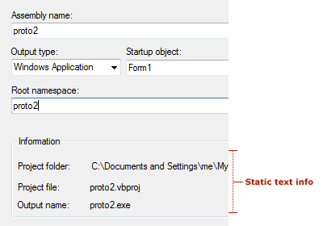
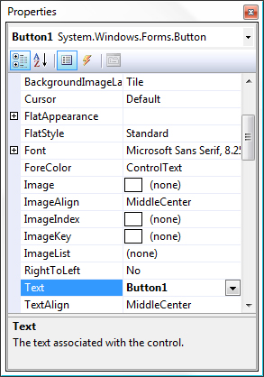
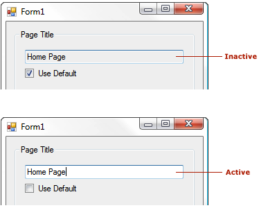
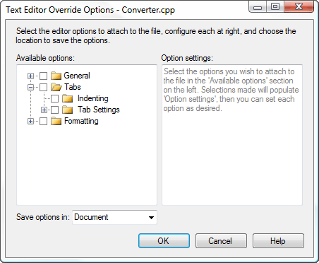

# Common Control Patterns for Visual Studio

##  Common controls

Common controls make up the majority of the user interface in Visual Studio. Most common controls used in the Visual Studio interface should follow the [Windows Desktop interaction guidelines](/windows/desktop/uxguide/controls). This topic is specific to Visual Studio and covers special situations or details that augment those Windows guidelines.

#### Common controls in this topic

- [Scroll bars](../../extensibility/ux-guidelines/common-control-patterns-for-visual-studio.md#BKMK_Scrollbars)

- [Input fields](../../extensibility/ux-guidelines/common-control-patterns-for-visual-studio.md#BKMK_InputFields)

- [Combo boxes and drop-down lists](../../extensibility/ux-guidelines/common-control-patterns-for-visual-studio.md#BKMK_ComboBoxesAndDropDowns)

- [Check boxes](../../extensibility/ux-guidelines/common-control-patterns-for-visual-studio.md#BKMK_CheckBoxes)

- [Radio buttons](../../extensibility/ux-guidelines/common-control-patterns-for-visual-studio.md#BKMK_RadioButtons)

- [Group frames](../../extensibility/ux-guidelines/common-control-patterns-for-visual-studio.md#BKMK_GroupFrames)

- [Text controls](../../extensibility/ux-guidelines/common-control-patterns-for-visual-studio.md#BKMK_TextControls)

- [Buttons and hyperlinks](../../extensibility/ux-guidelines/common-control-patterns-for-visual-studio.md#BKMK_ButtonsAndHyperlinks)

- [Tree views](../../extensibility/ux-guidelines/common-control-patterns-for-visual-studio.md#BKMK_TreeViews)

#### Visual style
The first thing to consider when styling controls is whether the controls will be used in themed UI. Controls in standard UI are non-themed UI and must follow [normal Windows Desktop style](/windows/desktop/uxguide/controls), meaning that they are not re-templated and should appear in their default control appearance.

- **Standard (utility) dialogs:** not themed. Don't re-template. Use basic control style defaults.

- **Tool windows, document editors, design surfaces and themed dialogs:** Use specialized themed appearance using the color service.

###  Scroll bars
 Scroll bars should follow [common interaction patterns for Windows scroll bars](/windows/desktop/Controls/about-scroll-bars) unless they're augmented with content information, like in the code editor.

###  Input fields
 For typical interaction behavior, follow the [Windows Desktop guidelines for text boxes](/windows/desktop/uxguide/ctrl-text-boxes).

#### Visual style

- Input fields shouldn't be styled in utility dialogs. Use the basic style intrinsic to the control.

- Themed input fields should only be used in themed dialogs and tool windows.

#### Specialized interactions

- Read-only fields will have a gray (disabled) background but default (active) foreground.

- Required fields should have **\<Required>** as watermarks within them. You should not change the color of the background except in rare situations.

- Error validation: See [Notifications and Progress for Visual Studio](../../extensibility/ux-guidelines/notifications-and-progress-for-visual-studio.md)

- Input fields should be sized to fit the content, not to fit the width of the window in which they are shown, nor to arbitrarily match the length of a long field, like a path. Length might be an indication to the user of limitations as to how many characters are allowed in the field.

      Incorrect input field length: it's unlikely that the name will be this long.

      Correct input field length: the input field is a reasonable width for the expected content.

###  Combo boxes and drop-down lists
For typical interaction behavior, follow the [Windows Desktop guidelines for drop-down lists and combo boxes](/windows/desktop/uxguide/ctrl-drop).

#### Visual style

- In utility dialogs, don't re-template the control. Use the basic style intrinsic to the control.

- In themed UI, combo boxes and drop-downs follow the standard theming for the controls.

#### Layout
Combo boxes and drop-downs should be sized to fit the content, not to fit the width of the window in which they are shown, nor to arbitrarily match the length of a long field, like a path.

 Incorrect: the drop-down width is too long for the content that will be displayed.

 Correct: the drop-down is sized to allow for translation growth, but not unnecessarily long.

###  Check boxes
For typical interaction behavior, follow the [Windows Desktop guidelines for check boxes](/windows/desktop/uxguide/ctrl-check-boxes).

#### Visual style

- In utility dialogs, don't re-template the control. Use the basic style intrinsic to the control.

- In themed UI, check boxes follow the standard theming for the controls.

#### Specialized interactions

- Interaction with a check box must never pop a dialog or navigate to another area.

- Align check boxes with the baseline of the first line of text.

      Incorrect: the check box is centered on the text.

      Correct: the check box is aligned with the first line of the text.

###  Radio buttons
For typical interaction behavior, follow the [Windows Desktop guidelines for radio buttons](/windows/desktop/uxguide/ctrl-radio-buttons).

#### Visual style
In utility dialogs, do not style radio buttons. Use the basic style intrinsic to the control.

#### Specialized interactions
It's not necessary to use a group frame to enclose radio choices, unless you need to maintain group distinction in a tight layout.

###  Group frames
For typical interaction behavior, follow the [Windows Desktop guidelines for group frames](/windows/desktop/uxguide/ctrl-group-boxes).

#### Visual style
In utility dialogs, don't style group frames. Use the basic style intrinsic to the control.

#### Layout

- It's not necessary to use a group frame to enclose radio choices, unless you need to maintain group distinction in a tight layout.

- Never use a group frame for a single control.

- It's sometimes acceptable to use a horizontal rule instead of a group frame container.

##  Text controls

### Static text fields

A static text field presents read-only information and cannot be selected by the user. Avoid using it for any text the user might want to copy to the clipboard. However, read-only static text can change to reflect a change in state. In the example below, the Output Name static text under the Information group changes to reflect any changes made to the Root Namespace text box above it.

There are two ways to display static text information.

Static text can be on its own in a dialog without any containment when there is no grouping conflict. Decide if the extra lines of a box are really necessary. An example is the display of a directory path under a section created by a group line, as shown below:

 Static text info in text controls

In a dialog where other grouped areas exist and containment of the information would help readability, and when a section can be hidden or shown (as in the **Properties window** description pane) or you want to be consistent with similar UI, place the static text inside a box. This group box should be a single rule and colored with the `ButtonShadow`:

 Static text in the Properties window

### Read-only text box

This allows the user to select the text inside the field but not edit it. These text boxes are bordered by the usual 3-D chisel with a `ButtonShadow` fill.

A text box can become active (editable) when a user alters an associated control, such as checking/unchecking a check box or selecting/deselecting a radio button. For example, in the **Tools &gt; Options** page shown below, the **Home Page** text box becomes active when the **Use Default** check box is unchecked.

 Read-only text box, showing inactive and active states

### Using text in dialogs

Key guidelines for text in dialogs:

- Labels for text boxes, list boxes, and frames in unthemed dialogs start with a verb, have an initial capital on the first word only, and end with a colon.

    > Text controls in themed dialogs follow [Windows desktop UX guidelines](/windows/desktop/uxguide/top-violations) and do not take end punctuation, with the exception of question marks in Help links.

- Labels for check boxes and option buttons start with a verb, an initial capital on the first word only, and have no ending punctuation.

- Labels for buttons, menus, menu items, and tabs have initial capitals on each word (title case).

- Label terminology should be consistent with similar labels in other dialogs.

- If possible, have a writer/editor write or approve the text before it goes to the developer for implementation.

- All controls should have labels except in special circumstances in which tabbing is sufficient.
Use helper text when appropriate.

### Helper text

Included in dialogs to help the user understand the dialog's purpose or to indicate which action to take. Helper text should be used only when needed to avoid cluttering simple dialogs. The two variations of helper text are dialog and watermark.

Follow common locations for helper text and be selective in introducing new areas. Common scenarios for helper text are:

- Helper text in dialogs, to give additional direction about how to interact with a complex dialog.

- Watermark text in empty tool windows or dialogs, to explain why no content is visible.

- A description pane, like at the bottom of the **Properties window**.

- Watermark text in an empty editor, to explain what action the user should take to get started.

### Dialog helper text

A user experience designer may help determine when helper text is appropriate. The designer can define where helper text appears as well as its general content. User assistance can write/edit the actual text.

### Watermarks

Dialogs benefit from slightly different watermark guidelines. Because a dialog can appear busy with many UI elements (labels, hint text, buttons and other container controls with text), particularly when those appear in black, watermarks stand out better in dark gray (VSColor: `ButtonShadow`). Typically a watermark appears inside a control like a list box with a white background (VSColor: `Window`).

- The text appears in dark gray (VSColor: `ButtonShadow`). However, if the watermark appears on a medium gray or other-colored (VSColor: `ButtonFace`) background and there is concern about its readability, go with black text (VSColor: `WindowText`).

- Watermarks can be centered or flush left. Apply standard design rules when making alignment decisions. The watermark cannot be selected on the background.

 Watermark text example

### Context-specific (dynamic) text

Dynamic text can be used one of two ways in a dialog or modeless UI: either as a dynamic label or as dynamic content.

- Dynamic label: a common use of dynamic text is in descriptive panels that offer more information for the selected item, such as in a dialog which contains a list of elements and properties for those elements displayed in a grid to the right. The label for the property grid may be dynamic so that when an item is selected on the left, the grid to the right shows information for that specific item.

- Dynamic text: can be useful in instances where you need to display specific information and not general information in this way, but care should be taken to not overuse.

If you want users to have the ability to copy the info, dynamic text should be in a read-only text field.

##  Buttons and hyperlinks

Buttons and link controls (hyperlinks) should follow [basic Windows Desktop guidance on hyperlinks](/windows/desktop/uxguide/ctrl-links) for usage, wording, sizing, and spacing.

### Choosing between buttons and links
Traditionally, buttons have been used for actions and hyperlinks have been reserved for navigation. Buttons may be used in all cases, but the role of links has been expanded in Visual Studio so that buttons and links are more interchangeable in some conditions.

When to use command buttons:

- Primary commands

- Displaying windows used to gather input or making choices, even if they are secondary commands

- Destructive or irreversible actions

- Commitment buttons within wizards and page flows

Avoid command buttons in tool windows, or if you need more than two words for the label. Links can have longer labels.

 When to use links:

- Navigation to another window, document, or web page

- Situations that require a longer label or short sentence to describe the intent of the action

- Tight spaces where a button would overwhelm the UI, provided that the action is not destructive or irreversible

- De-emphasizing secondary commands in situations where there are many commands

#### Examples
 Command links used in the InfoBar following a status message

 Links used in the CodeLens popup

 Links used for secondary commands where buttons would attract too much attention

### Common buttons

#### Text
Follow the writing guidelines in [UI text and terminology](../../extensibility/ux-guidelines/ui-text-and-help-for-visual-studio.md#BKMK_UITextAndTerminology).

#### Visual style

##### Standard (unthemed)
Most buttons in Visual Studio will appear in utility dialogs and should not be styled. They should reflect the standard appearance of buttons as dictated by the operating system.

##### Themed
In some instances, buttons may be used within styled UI and these buttons must be styled appropriately. See [Dialogs](../../extensibility/ux-guidelines/application-patterns-for-visual-studio.md#BKMK_Dialogs) for information on themed controls.

### Special buttons

#### Browse... buttons
**[Browse...]** buttons are used in grids, dialogs, and tool windows and other modeless UI elements. They display a picker that assists the user in filling a value into a control. There are two variations of this button, long and short.

![The long [Browse...] button](../../extensibility/ux-guidelines/media/070703-04_browselong.gif "070703-04_BrowseLong") The long [Browse...] button

![The ellipsis-only short [...] button](../../extensibility/ux-guidelines/media/070703-05_browseshort.gif "070703-05_BrowseShort") The ellipsis-only short [...] button

When to use the ellipsis-only short button:

- If there is more than one long **[Browse...]** button in a dialog, like when several fields allow for browsing. Use the short **[...]** button for each to avoid the confusing access keys created by this situation (**&Browse** and **B&rowse** in the same dialog).

- In a tight dialog, or when there is no reasonable place to put the long button.

- If the button will appear in a grid control.

Guidelines for using the button:

- Don't use an access key. To access it using the keyboard, the user must tab from the adjacent control. Ensure that the tab order is such that any browse button falls immediately after the field that it will fill. Never use an underscore below the first period.

- Set the Microsoft Active Accessibility (MSAA) **Name** property to **Browse...** (including the ellipsis) so that screen readers will read it as "Browse" and not "dot-dot-dot" or "period-period-period." For managed controls, this means setting the **AccessibleName** property.

- Never use an ellipsis **[...]** button for anything except a browse action. For example, if you need a **[New...]** button but don't have enough room for the text, then the dialog needs to be redesigned.

##### Sizing and spacing
![Sizing [Browse...] buttons: standard version is 75x23 pixels, short version is 26x23 pixels](../../extensibility/ux-guidelines/media/070703-06_browsesizing.png "070703-06_BrowseSizing") Sizing [Browse...] buttons

![Spacing [Browse...] buttons: spacing between related control and standard Browse button 7 pixels, spacing between related control and short Browse button 5 pixels](../../extensibility/ux-guidelines/media/070703-07_browsespacing.png "070703-07_BrowseSpacing") Spacing [Browse...] buttons

#### Graphical buttons
Some buttons should always use a graphical image and never include text to conserve space and avoid localization problems. These are often used in field pickers and other sortable lists.

> [!NOTE]
> Users have to tab to these buttons (there are no access keys), so place them in a sensible order. Map the `name` property of the button to the action that it takes so that screen readers correctly interpret the button action.

| Function | Button |
| --- | --- |
| Add |  |
| Remove |  |
| Add All |  |
| Remove All |  |
| Move Up |  |
| Move Down |  |
| Delete |  |

##### Sizing and spacing
Sizing for graphical buttons is the same as for the short version of the **[Browse...]** button (26x23 pixels):

 Appearance of a graphical image on button, with and without transparent color showing

### Hyperlinks
Hyperlinks are well suited to navigation-based actions, like opening a Help topic, modal dialog, or wizard. If a hyperlink is used for a command, it should always display a visible and noticeable change to the UI. In general, actions that commit to an action (like Save, Cancel, and Delete) are better communicated using a button.

#### Writing style
Follow the [Windows Desktop guidance for user interface text](/windows/desktop/uxguide/text-ui). Don't use "Learn more about," "Tell me more about," or "Get help with this" phrasing. Instead, phrase Help link text in terms of the primary question answered by the Help content. For example, "**How do I add a server to the Server Explorer?**"

#### Visual style

- Hyperlinks should always use [The VSColor Service](../../extensibility/ux-guidelines/colors-and-styling-for-visual-studio.md#BKMK_TheVSColorService). If a hyperlink is not styled correctly, it flashes red when active or shows a different color after being visited.

- Don't include underlines at the control resting state unless the link is a sentence fragment within a full sentence, like in a watermark.

- Underlines shouldn't appear on hover. Instead, the feedback to the user that the link is active is a slight color change and the appropriate link cursor.

##  Tree views

Tree views provide a way to organize complex lists into parent-child groups. A user can expand or collapse parent groups to reveal or hide underlying child items. Each item within a tree view can be selected to provide further action.

###  Tree view visual style

#### Expanders
Tree view controls should conform to the expander design used by Windows and Visual Studio. Each node uses an expander control to reveal or hide underlying items. Using an expander control provides consistency for users who might encounter different tree views within Windows and Visual Studio.

 Correct: proper style of tree view node using an expander control

 Incorrect: improper style of tree view node

#### Selection
When a node is selected within the tree view, the highlight should expand to the full width of the tree view control. This helps users clearly identify which item they have selected. Selection colors should reflect the current Visual Studio theme.

 Correct: highlight of the selected node fits the entire width of the tree view control.

 Incorrect: highlight of the selected node doesn't fit the entire width of the tree view control.

#### Icons
Icons should only be used in tree view controls if they assist in visually identifying differences between items. In general, icons should be used only in heterogeneous lists in which the Icons carry information to differentiate the types of elements. In a homogeneous list using icons can frequently be seen as noise and should be avoided. In that case the group icon (parent) can convey the type of items within it. The exception to this rule would be if the icon is dynamic and is used to indicate state.

#### Scroll bars
Scroll bars should always be hidden if the content fits within the tree view control. It is acceptable for scrollbars to be hidden, or semi-transparent in a scrollable window and appear when the window containing the tree view has focus, or upon hover of the tree view itself.

 Both vertical and horizontal scroll bars are displayed because the contents have exceeded the limits of the tree view control.

###  Tree view interactions

#### Context menus
A tree view node can reveal submenu options in a context menu. Typically, this occurs when a user has right-clicked an item or pressed the Menu key on a Windows keyboard with the item selected. It's important that the node gains focus and is selected. This helps the user identify which item the submenu belongs to.

 The item that has generate the context menu gains focus to notify the user which item has been selected.

#### Keyboard
The tree view should provide the ability to select items and expand/collapse nodes using the keyboard. This ensures that navigation meets our accessibility requirements.

##### Tree view control
Visual Studio tree controls should follow common keyboard navigation:

- **Up Arrow:** Select items by moving up the tree

- **Down Arrow:** Select items by moving down the tree

- **Right Arrow:** Expand a node in the tree

- **Left Arrow:** Collapse a node in the tree

- **Enter key:** Initiate, load, execute selected item

##### Trid (tree view and grid view)
A trid control is a complex control that contains a tree view within a grid. Expanding, collapsing, and navigating the tree should respect the same keyboard commands as a tree view, with the following additions:

- **Right Arrow:** Expand a node. After the node is expanded, it should continue navigating to the nearest column on the right. Navigation should stop at the end of the row.

- **Tab:** Navigates to the nearest cell on the right.  At the end of the row, navigation continues to the next row.

- **Shift + Tab:** Navigates to the nearest cell on the left.  At the beginning of the row, navigation continues to the rightmost cell in the previous row.

 A trid control in Visual Studio
