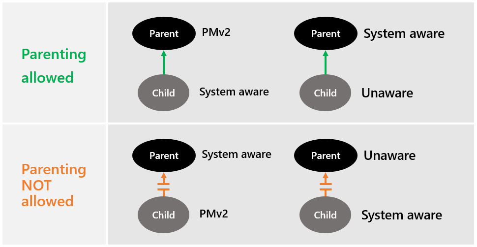

# Per-Monitor Awareness support for Visual Studio extenders
Versions prior to Visual Studio 2019 had their DPI awareness context set to system aware, rather than per-monitor DPI aware (PMA). Running in system awareness resulted in a degraded visual experience (e.g. blurry fonts or icons) whenever Visual Studio had to render across monitors with different scale factors or remote into machines with different display configurations (e.g. different Windows scaling).

The DPI awareness context of Visual Studio 2019 is set as PMA, when the environment supports it, allowing Visual Studio to render according to the configuration of the display where it's hosted rather than a single system defined configuration. Ultimately translating into an always crisp UI for surface areas that support PMA mode.

Refer to the [High DPI Desktop Application Development on Windows](https://docs.microsoft.com/windows/desktop/hidpi/high-dpi-desktop-application-development-on-windows) documentation for more information about the terms and overall scenario covered in this document.

## Quickstart
- Ensure Visual Studio is running in PMA mode (See **Enabling PMA**)

- Validate your extension works correctly across a set of common scenarios (See **Testing your extensions for PMA issues**)

- If you find issues, you can use the strategies/recommendations discussed in this document to diagnose and fix those issues. You’ll also need to add the new [Microsoft.VisualStudio.DpiAwareness](https://www.nuget.org/packages/Microsoft.VisualStudio.DpiAwareness/) NuGet package to your project to access the required APIs.

## Enabling PMA
To enable PMA in Visual Studio, the following requirements need to be met:
1) Windows 10 April 2018 Update (v1803, RS4) or later
2) .NET Framework 4.8 RTM or greater (currently ships as standalone preview or bundle with recent Windows Insider builds)
3) Visual Studio 2019 with the ["Optimize rendering for screens with different pixel densities"](https://docs.microsoft.com/visualstudio/ide/reference/general-environment-options-dialog-box?view=vs-2019) option enabled

Once these requirements are met, Visual Studio will automatically enable PMA mode across the process.

> [!NOTE]
> Windows Forms content in VS (for example Property Browser) will support PMA only when you have Visual Studio 2019 Update #1.

## Testing your extensions for PMA issues

Visual Studio officially supports the WPF, Windows Forms, Win32, and HTML/JS UI frameworks. When Visual Studio is put into PMA mode, each UI stack behaves differently. Therefore, regardless of UI framework, it's recommended that a test pass is performed to ensure all UI is compliant with PMA mode.

It's recommended you validate the following common scenarios:

1. Changing the scale factor of a single monitor environment while the application is running*
    - This scenario helps test that UI is responding to the dynamic Windows DPI change

2. Docking/undocking a laptop where an attached monitor is set to the primary and the attached monitor has a different scale factor than the laptop while the application is running.
    - This scenario helps test that UI is responding to the display DPI change as well as handling displays dynamically being added or removed

3. Having multiple monitors with different scale factors and moving the application between them.
    - This scenario helps test that UI is responding to the display DPI change
    
4. Remoting into a machine when the local and remote machines have different scale factors for the primary monitor.
    - This scenario helps test that UI is responding to the dynamic Windows DPI change

A good preliminary test for whether your UI might have problems is whether the code utilizes the *Microsoft.VisualStudio.Utilities.Dpi.DpiHelper*, *Microsoft.VisualStudio.PlatformUI.DpiHelper*, or *VsUI::CDpiHelper* classes. These old DpiHelper classes only support System DPI awareness and won’t always function correctly when the process is PMA.

Typical usage of these DpiHelpers will look like:

```cs
Point screenTopRight = logicalBounds.TopRight.LogicalToDeviceUnits();

POINT screenIntTopRight = new POINT
{
    x = (int)screenTopRIght.X,
    y = (int)screenTopRIght.Y
}

// Declared via P/Invoke
IntPtr monitor = MonitorFromPoint(screenIntTopRight, MONITOR_DEFAULTTONEARST);
```

In the previous example, a rectangle representing the logical bounds of a window is converted to device units so that it can be passed to the native method MonitorFromPoint that expects device coordinates in order to return back an accurate monitor pointer.

### Classes of issues
When PMA mode is enabled for Visual Studio, the UI could replicate issues in several common ways. Most, if not all, of these issues can happen in any of Visual Studio's supported UI frameworks. Additionally, these issues can also happen when a piece of UI is being hosted in mixed-mode DPI scaling scenarios (refer to the Windows [documentation](https://docs.microsoft.com/windows/desktop/hidpi/high-dpi-desktop-application-development-on-windows) to learn more). 

#### Win32 window creation
When creating windows with CreateWindow() or CreateWindowEx(), a common pattern is to create the window at coordinates (0,0) (the top/left corner of the primary display), then move it to its final position. However, doing so can cause the window to trigger a DPI changed message or event, which can retrigger other UI messages or events, and eventually lead to undesired behavior or rendering.

#### WPF element placement
When moving WPF elements using the old Microsoft.VisualStudio.Utilities.Dpi.DpiHelper, top-left coordinates might not be calculated correctly whenever elements are on a non-primary DPI.

#### Serialization of UI element sizes or positions
When UI size or position (if saved as device units) is restored at a different DPI context than what it was stored at, it will be positioned and sized incorrectly. This happens because device units have an inherent DPI relationship.

#### Incorrect scaling
UI elements created on the primary DPI will scale correctly, however when moved to a display with a different DPI, they don't rescale and thus, their content ends up being too large or too small.

#### Incorrect bounding
Similarly, to the scaling problem, UI elements will calculate their bounds correctly on their primary DPI context, however when moved to a non-primary DPI, they won't calculate the new bounds correctly. As such, the content window ends up being too small or too large compared to the hosting UI, which results in empty space or clipping.

#### Drag & drop
Whenever inside mixed-mode DPI scenarios (e.g. different UI elements rendering in different DPI awareness modes), drag and drop coordinates could be miscalculated, resulting in the final drop position end up incorrect.

#### Out-of-process UI
Some UI is created out-of-process and if the creating external process is in a different DPI awareness mode than Visual Studio, this can introduce any of the previous rendering issues.

#### Windows Forms controls, images or layouts rendered incorrectly
Not all of the Windows Forms content support PMA mode. As a result, you may see rendering issue with incorrect layouts or scaling. A possible solution in this case is to explicitly render Windows Forms content in "System Aware"  DpiAwarenessContext ( refer to [Forcing a control into a specific DpiAwarenessContext](#forcing-a-control-into-a-specific-dpiawarenesscontext)).

#### Windows Forms controls or windows not displaying
One of the main causes for this issue is developers trying to reparent a control or window with one DpiAwarenessContext to a window with a different DpiAwarenessContext.

The following pictures show the current **default** Windows operating system restrictions in parenting windows:



> [!Note]
> You can change this behaviour by setting the Thread Hosting Behaviour (refer to [DpiHostinBehaviour](https://docs.microsoft.com/windows/desktop/api/windef/ne-windef-dpi_hosting_behavior)).

As a result, if you set parent-child relationship between unsupported modes, it will fail, and the control or window may not be rendered as expected.

### Diagnosing issues
There are many factors to consider when identifying PMA-related issues: 

1. Does the UI or API expect logical or device values.
    - WPF UI and APIs typically use logical values (but not always)
    - Win32 UI and APIs typically use device values

2. Where are the values coming from?
    - If receiving values from other UI or API, is it passing device or logical values.
    - If receiving values from multiple sources, do they all use/expect the same types of values or do conversions need to be mixed and matched?

3. Are UI constants in use and what form are they in?

4. Is the thread in the correct DPI context for the values it's receiving?
    - The changes to enable mixed DPI hosting should generally put code paths in the right context, however, work done outside the main message loop or event flow might execute in the wrong DPI context.

5. Do values cross DPI context boundaries?
    - Drag & drop is a common situation where coordinates can cross DPI contexts. Window tries to do the right thing, but in some cases, the host UI may need to do conversion work to ensure matching context boundaries.

### PMA NuGet package
The new DpiAwarness libraries can be found on the [Microsoft.VisualStudio.DpiAwareness](https://www.nuget.org/packages/Microsoft.VisualStudio.DpiAwareness/) NuGet package.

### Recommended tools
The following tools can help debug PMA-related issues across some of the different UI stacks supported by Visual Studio.

#### Snoop
Snoop is a XAML debugging tool that has some extra functionality that the built-in Visual Studio XAML tools doesn’t have. Additionally, Snoop doesn’t need to actively debug Visual Studio to be able to view and tweak its WPF UI. The two main ways Snoop can be useful for diagnosing PMA issues is for validating logical placement coordinates or size bounds, and for validating the UI has the right DPI.
 
#### Visual Studio XAML tools
Like Snoop, the XAML tools in Visual Studio can help diagnose PMA issues. Once a likely culprit is found, you can set breakpoints, and use the Live Visual Tree window as well as the debug windows, to inspect UI bounds and current DPI.

## Strategies for fixing PMA issues
### Replacing DpiHelper calls
In most cases, fixing UI issues in PMA mode boils down to replacing calls in managed code to the old
*Microsoft.VisualStudio.Utilities.Dpi.DpiHelper* and *Microsoft.VisualStudio.PlatformUI.DpiHelper* classes, with calls to the new *Microsoft.VisualStudio.Utilities.DpiAwareness* helper class. 

```cs
// Remove this kind of use:
Point deviceTopLeft = new Point(window.Left, window.Top).LogicalToDeviceUnits();

// Replace with this use:
Point deviceTopLeft = window.LogicalToDevicePoint(new Point(window.Left, window.Top));
```

For native code, it will entail replacing calls to the old *VsUI::CDpiHelper* class with calls to the new *VsUI::CDpiAwareness* class. 

```cpp
// Remove this kind of use:
int cx = VsUI::DpiHelper::LogicalToDeviceUnitsX(m_cxS);
int cy = VsUI::DpiHelper::LogicalToDeviceUnitsY(m_cyS);

// Replace with this use:
int cx = m_cxS;
int cy = m_cyS;
VsUI::CDpiAwareness::LogicalToDeviceUnitsX(m_hwnd, &cx);
VsUI::CDpiAwareness::LogicalToDeviceUnitsY(m_hwnd, &cy);
```

The new DpiAwareness and CDpiAwareness classes offer the same unit conversion helpers as the DpiHelper classes but require an additional input parameter: the UI element to use as a reference for the conversion operation. It's important to note that the image scaling helpers do not exist in the new DpiAwareness/CDpiAwareness helpers, and if needed, the [ImageService](https://docs.microsoft.com/visualstudio/extensibility/image-service-and-catalog?view=vs-2019) should be used instead.

The managed DpiAwareness class offers helpers for WPF Visuals, Windows Forms Controls, and Win32 HWNDs and HMONITORs (both in the form of IntPtrs), while the native CDpiAwareness class offers HWND and HMONITOR helpers.

### Windows Forms dialogs, windows, or controls displayed in the wrong DpiAwarenessContext
Even after a successful parenting of windows with different DpiAwarenessContexts (because of Windows default behavior), users may still see scaling issues as windows with different DpiAwarenessContexts scale differently. As a result, users may see alignment/blurry text or image issues on the UI.

The solution is to set the correct DpiAwarenessContext scope for all the windows and controls in the application.

### Top-level mixed mode (TLMM) dialogs
When creating top-level windows such as modal dialogs, it’s important to make sure the thread is in the correct state prior to the window (and its handle) being created. The thread can be put into System awareness by using the CDpiScope helper in native or the DpiAwareness.EnterDpiScope helper in managed. (TLMM should generally be used on non-WPF dialogs/windows.)

### Child-level mixed mode (CLMM)
By default, child windows receive the current thread DPI awareness context if created without a parent, or the parent's DPI awareness context when created with a parent. To create a child with a different DPI awareness context than its parent, the thread can be put into the desired DPI awareness context. Then the child can be created without a parent and manually reparented to the parent window.

#### CLMM issues
Most of the UI calculation work that happens as part of the main messaging loop or event chain should already be running in the right DPI awareness context. However, if coordinate or sizing calculations are done outside these main workflows (such as during an idle time task, or off the UI thread, then the current DPI awareness context might be incorrect leading to UI misplacement or mis-sizing issues. Putting the thread into the correct state for the UI work generally fixes the problem.
 
#### Opting out of CLMM
If a non-WPF tool window is being migrated to fully support PMA, it will need to opt out of CLMM. To do so, a new interface needs to be implemented: IVsDpiAware.

C#:
```cs
[InterfaceType(ComInterfaceType.InterfaceIsIUnknown)]
public interface IVsDpiAeware
{
    [ComAliasName("Microsoft.VisualStudio.Shell.Interop.VSDPIMode")]
    uint Mode {get;}
}
```
 
C++:
```cpp
IVsDpiAware : public IUnknown
{
    public:
        HRRESULT STDMETHODCALLTYPE get_Mode(__RCP__out VSDPIMODE *dwMode);
};
```

For managed languages, the best place to implement this interface is in the same class that derives from *Microsoft.VisualStudio.Shell.ToolWindowPane*. For C++, the best place to implement this interface is in the same class that implements *IVsWindowPane* from vsshell.h.

The value returned by the Mode property on the interface is a __VSDPIMODE (and cast to a uint in managed):

```cs
enum __VSDPIMODE
{
    VSDM_Unaware    = 0x01,
    VSDM_System     = 0x02,
    VSDM_PerMonitor = 0x03,
}
```

- Unaware means the tool window needs to handle 96 DPI, Windows will handle scaling it for all other DPIs. Resulting on content being slightly blurry.
- System means the tool window needs to handle the DPI for the primary display DPI. Any display with a matching DPI will look crisp, but if the DPI is different or changes during the session, Windows will handle the scaling and it will be slightly blurry.
- PerMonitor means the tool window needs to handle all DPIs on all displays and whenever the DPI changes.

> [!NOTE]
> Visual Studio only supports PerMonitorV2 awareness, so the PerMonitor enum value translates to the Windows value of DPI_AWARENESS_CONTEXT_PER_MONITOR_AWARE_V2.

#### Forcing a control into a specific DpiAwarenessContext
Legacy UI that is not being updated to support PMA mode, may still need minor tweaks to work while Visual Studio is running in PMA mode. One such fix involves making sure the UI is being created in the right DpiAwarenessContext. To force your UI into a particular DpiAwarenessContext, you can enter a DPI scope with the following code:

C#:
```cs
using (DpiAwareness.EnterDpiScope(DpiAwarenessContext.SystemAware))
{
    Form form = new MyForm();
    form.ShowDialog();
}
```

C++:
```cpp
void MyClass::ShowDialog()
{
    VsUI::CDpiScope dpiScope(DPI_AWARENESS_CONTEXT_SYSTEM_AWARE);
    HWND hwnd = ::CreateWindow(...);
}
```

> [!NOTE]
> Forcing the DpiAwarenessContext only works on non-WPF UI and top-level WPF dialogs. When creating WPF UI that is to be hosted inside tool windows or designers, as soon as the content is inserted into the WPF UI tree, it gets converted to the current process DpiAwarenessContext.

## Known issues
### Windows Forms

To optimize for the new mixed-mode scenarios, Windows Forms changed how it creates controls and windows whenever their parent was not explicitly set. Earlier, controls without an explicit parent used an internal "Parking Window" as a temporary parent to the control or window being created. 

Prior to .NET 4.8, there was a single "Parking Window" that gets its DpiAwarenessContext from the current thread DPI awareness context at the window's creation time. Any unparented control inherits the same DpiAwarenessContext as the Parking Window when the control's handle is created and would be reparented to the final/expected parent by the application developer. This would cause timing-based failures if the "Parking Window" had a higher DpiAwarenessContext than the final parent window.

As of .NET 4.8, there is now a "Parking Window" for every DpiAwarenessContext that's been encountered. The other major difference is that the DpiAwarenessContext used for the control is cached when the control is created, not when the handle is created. This means the overall end behavior is the same, but can turn what used to be a timing-based issue into a consistent issue. It also gives the application developer more deterministic behavior for writing their UI code and scoping it correctly.
