# Shared colors for Visual Studio

When you're designing UI that uses common Visual Studio shell elements, or you'd like your interface element to be consistent with similar features, use existing token names in package definition files to choose and assign colors. This ensures that your UI stays consistent with the overall Visual Studio environment and that it updates automatically when themes are added or updated.

This article describes common UI elements and the token names that they use, which you can reference when building similar UI. For specific information about how to access these color tokens, see [The VSColor Service](../../extensibility/ux-guidelines/colors-and-styling-for-visual-studio.md#BKMK_TheVSColorService).

Make sure to use token names correctly:

- **Use token names based on function, not on the color itself.** The common shared colors are associated with specific interface elements and are only intended to be used for the same or similar features. For example, don't reuse the color of a pressed combo box for a spinning progress animation just because you like the color. The functions of the combo box and the animation are different, and if the color associated with the combo box changes, it might no longer be an appropriate color for your animation element. Consistent use of color helps orient your users and prevent confusion.

- **Use background and text colors in the correct combination.** Background colors that are intended to be used with text will have an associated text color. Don't use text colors other than what is specified for that background. If there isn't an associated text color, don't use that background color for any surface on which you expect to display text. Other combinations of text and background colors might result in an unreadable interface.

- **Use control colors that are appropriate for their location.** In certain states, some Visual Studio controls don't have separate border and background colors. Instead, they pick up those colors from the surfaces behind them. Make sure that you always use the token names that are appropriate for the location where you are placing the control.

> [!IMPORTANT]
> Don't use tokens found in the categories "Start Page" or "Cider."

## Common shared controls

When you use a standard Visual Studio command bar in your feature, you'll have access to styled shell controls. You shouldn't re-template these common controls. However, if you need to build a custom command bar, you might need to build custom controls as well. In that case, make sure to use the correct token names for each of the following controls so that your UI is consistent with the rest of Visual Studio.

### Button controls

| Use ... | Don't use ... |
| --- | --- |
| ... for buttons in the document well that you want to integrate with Visual Studio themes (Light, Dark, Blue, or a system High Contrast theme). | ... for buttons that will display against a custom background that is not part of a Visual Studio theme. |

**Button: standard state**

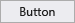 Standard button

| Element | Token name: Category.color |
| --- | --- |
| Button | `CommonControls.Button` |
| Button border | `CommonControls.ButtonBorder` |

**Button: default state**

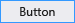 Default button

| Element | Token name: Category.color |
| --- | --- |
| Button | `CommonControls.ButtonDefault` |
| Button border | `CommonControls.ButtonBorderDefault` |

**Button: disabled state**

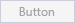 Disabled button

| Element | Token name: Category.color |
| --- | --- |
| Button | `CommonControls.ButtonDisabled` |
| Button border | `CommonControls.ButtonBorderDisabled` |

**Button: hover state**

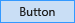 Button on hover

| Element | Token name: Category.color |
| --- | --- |
| Button | `CommonControls.ButtonHover` |
| Button border | `CommonControls.ButtonBorderHover` |

**Button: pressed state**

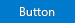 Pressed button

| Element | Token name: Category.color |
| --- | --- |
| Button | `CommonControls.ButtonPressed` |
| Button border | `CommonControls.ButtonBorderPressed` |

**Button: focused state**

 Focused button

| Element | Token name: Category.color |
| --- | --- |
| Button | `CommonControls.ButtonFocused` |
| Button border | `CommonControls.ButtonBorderFocused` |

### Check box controls
 Check box (redline)

| Use ... | Don't use ... |
| --- | --- |
| ... for check box controls contained within the document well. | ... for any UI that isn't a check box control. |

**Check box: default state**

 Default check box

| Element | Token name: Category.color |
| --- | --- |
| Background | `CommonControls.CheckBoxBackground` |
| Border | `CommonControls.CheckBoxBorder` |
| Text | `CommonControls.CheckBoxText` |
| Glyph | `CommonControls.CheckBoxGlyph` |

**Check box: disabled state**

 Disabled check box

| Element | Token name: Category.color |
| --- | --- |
| Background | `CommonControls.CheckBoxBackgroundDisabled` |
| Border | `CommonControls.CheckBoxBorderDisabled` |
| Text | `CommonControls.CheckBoxTextDisabled` |
| Glyph | `CommonControls.CheckBoxGlyphDisabled` |

**Check box: hover state**

  Check box on hover

| Element | Token name: Category.color |
| --- | --- |
| Background | `CommonControls.CheckBoxBackgroundHover` |
| Border | `CommonControls.CheckBoxBorderHover` |
| Text | `CommonControls.CheckBoxTextHover` |
| Glyph | `CommonControls.CheckBoxGlyphHover` |

**Check box: pressed state**

 Pressed check box

| Element | Token name: Category.color |
| --- | --- |
| Background | `CommonControls.CheckBoxBackgroundPressed` |
| Border | `CommonControls.CheckBoxBorderPressed` |
| Text | `CommonControls.CheckBoxTextPressed` |
| Glyph | `CommonControls.CheckBoxGlyphPressed` |

**Check box: focused state**

 Focused check box

| Element | Token name: Category.color |
| --- | --- |
| Background | `CommonControls.CheckBoxBackgroundFocused` |
| Border | `CommonControls.CheckBoxBorderFocused` |
| Text | `CommonControls.CheckBoxTextFocused` |
| Glyph | `CommonControls.CheckBoxGlyphFocused` |

### Drop-downs and combo boxes
 Drop-down/combo box (redline)

| Use ... | Don't use ... |
| --- | --- |
| ... for drop-downs and combo boxes in the document well. | ... for any UI that isn't a drop-down or combo box. |
| | ... for command bar [drop-downs](../../extensibility/ux-guidelines/shared-colors-for-visual-studio.md#BKMK_CommandDropDown) or [combo boxes](../../extensibility/ux-guidelines/shared-colors-for-visual-studio.md#BKMK_CommandComboBox). |

**Drop-downs and combo boxes: default state**

 Default drop-down/combo box

| Element | Token name: Category.color |
| --- | --- |
| Background | `CommonControls.ComboBoxBackground` |
| Border | `CommonControls.ComboBoxBorder` |
| Text | `CommonControls.ComboBoxText` |
| Separator | `CommonControls.ComboBoxSeparator` |
| Glyph | `CommonControls.ComboBoxGlyph` |
| Glyph background | `CommonControls.ComboBoxGlyphBackground` |

**Drop-downs and combo boxes: disabled state**

 Disabled drop-down/combo box

| Element | Token name: Category.color |
| --- | --- |
| Background | `CommonControls.ComboBoxBackgroundDisabled` |
| Border | `CommonControls.ComboBoxBorderDisabled` |
| Text | `CommonControls.ComboBoxTextDisabled` |
| Separator | `CommonControls.ComboBoxSeparatorDisabled` |
| Glyph | `CommonControls.ComboBoxGlyphDisabled` |
| Glyph background | `CommonControls.ComboBoxGlyphBackgroundDisabled` |

**Drop-downs and combo boxes: hover state**

 Drop-down/combo box on hover

| Element | Token name: Category.color |
| --- | --- |
| Background | `CommonControls.ComboBoxBackgroundHover` |
| Border | `CommonControls.ComboBoxBorderHover` |
| Text | `CommonControls.ComboBoxTextHover` |
| Separator | `CommonControls.ComboBoxSeparatorHover` |
| Glyph | `CommonControls.ComboBoxGlyphHover` |
| Glyph background | `CommonControls.ComboBoxGlyphBackgroundHover` |

**Drop-downs and combo boxes: pressed state**

 Pressed drop-down/combo box

| Element | Token name: Category.color |
| --- | --- |
| Background | `CommonControls.ComboBoxBackgroundPressed` |
| Border | `CommonControls.ComboBoxBorderPressed` |
| Text | `CommonControls.ComboBoxTextPressed` |
| Separator | `CommonControls.ComboBoxSeparatorPressed` |
| Glyph | `CommonControls.ComboBoxGlyphPressed` |
| Glyph background | `CommonControls.ComboBoxGlyphBackgroundPressed` |

**Drop-downs and combo boxes list item view: pressed state**

  Drop-down/combo box pressed list item view

| Element | Token name: Category.color |
| --- | --- |
| Background | `CommonControls.ComboBoxListBackground` `CommonControls.ComboBoxListBackgroundHover` `CommonControls.ComboBoxListItemBackgroundPressed` `CommonControls.ComboBoxListItemBackgroundFocused` |
| Border | `CommonControls.ComboBoxListBorder` `CommonControls.ComboBoxListBorderHover` `CommonControls.ComboBoxListBorderPressed` `CommonControls.ComboBoxListBorderFocused` |
| Item text | `CommonControls.ComboBoxListItemText`  `CommonControls.ComboBoxListItemTextHover` `CommonControls.ComboBoxListItemTextPressed` `CommonControls.ComboBoxListItemTextFocused` |
| Background shadow | `CommonControls.ComboBoxListBackgroundShadow` |

**Drop-downs and combo boxes: focused state**

 Drop-down/combo box with focus

| Element | Token name: Category.color |
| --- | --- |
| Background | `CommonControls.ComboBoxBackgroundFocused` |
| Border | `CommonControls.ComboBoxBorderFocused` |
| Text | `CommonControls.ComboBoxTextFocused` |
| Separator | `CommonControls.ComboBoxSeparatorFocused` |
| Glyph | `CommonControls.ComboBoxGlyphFocused` |
| Glyph background | `CommonControls.ComboBoxGlyphBackgroundFocused` |

**Drop-downs and combo boxes: text input selection**

 Drop-down/combo box text input selection

| Element | Token name: Category.color |
| --- | --- |
| Highlight | `CommonControls.ComboBoxTextInputSelection` |

### Tabular data (grid) controls
Tabular data controls, also known as grid controls, are common controls for Visual Studio that can be used to present large amounts of data in multiple columns. Standard tabular data controls can be found in multiple places within Visual Studio: the Error List tool window, IntelliTrace reports, and memory heap view, among others. Always use the standard tabular data controls provided. In some rare instances, you might not have access to the standard tabular data controls. In these situations, use the following token names to ensure that your UI is consistent with other tabular data controls in Visual Studio.

 Tabular data/grid control (redline)

| Use ... | Don't use ... |
| --- | --- |
| ... for tabular or grid controls. | ... for any UI that is not a tabular or grid control. |

#### Column headers
Column headers consist of a background, a border, the title text, and an optional glyph usually used when a grid is sorted by that column.

**Column header: default state**

| Element | Token name: Category.color |
| --- | --- |
| Background | `Header.Default` |
| Foreground (Text) | `Environment.CommandBarTextActive` |
| Foreground (Glyph) | `Header.Glyph` |
| Border | `Header.SeparatorLine` |

**Column header: hover state**

| Element | Token name: Category.color |
| --- | --- |
| Background | `Header.MouseOver` |
| Foreground (Text) | `Environment.CommandBarTextHover` |
| Foreground (Glyph) | `Header.MouseOverGlyph` |
| Border | `Header.SeparatorLine` |

**Column header: pressed state**

| Element | Token name: Category.color |
| --- | --- |
| Background | `CommonControls.CheckBoxBackgroundPressed` |
| Foreground (Text) | `CommonControls.CheckBoxBorderPressed` |
| Foreground (Glyph) | `CommonControls.CheckBoxTextPressed` |
| Border | `CommonControls.CheckBoxGlyphPressed` |

#### List view items
 List view items consist of a background and the content. The content can be text, an icon, or both.

**List view items: default state**

| Element | Token name: Category.color |
| --- | --- |
| Background | Transparent |
| Foreground (Text) | `Environment.CommandBarTextActive` |
| Border | None |

**List view items: active state**

| Element | Token name: Category.color |
| --- | --- |
| Background | `TreeView.SelectedItemActive` |
| Foreground (Text) | `TreeView.SelectedItemActiveText` |
| Border | None |

**List view items: inactive state**

| Element | Token name: Category.color |
| --- | --- |
| Background | `TreeView.SelectedItemInactive` |
| Foreground (Text) | `TreeView.SelectedItemInactiveText` |
| Border | None |

### UI text

#### Instructional text
Instructional text gives a prominent main explanation of what to do in a dialog or document page.

 Default instructional text

| Element | Token name: Category.color |
| --- | --- |
| Foreground (text) | `Environment.ControlText` |

#### Secondary instructional text
In document pages with lots of text and controls, some instructional text uses a different color value. This helps to convey which information is most important and lessen the overall density of the UI elements. (See also the below section on hint text.)

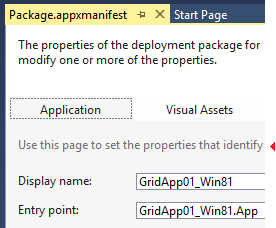 Secondary instructional text

| Element | Token name: Category.color |
| --- | --- |
| Foreground (text) | `Environment.ControlEditHintText` |

#### Hint text
Hint text appears in an empty control, below a control, or on an empty document surface to show the user what to do next. You can use hint text with either Window or Control backgrounds.

**Default hint text**

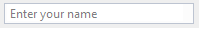 Default hint text

| Element | Token name: Category.color |
| --- | --- |
| Foreground (text) | `Environment.ControlEditHintText` |

**Required hint text**

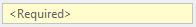 Required hint text

| Element | Token name: Category.color |
| --- | --- |
| Foreground (text) | `Environment.ControlRequiredHintText` |
| Background | `Environment.ControlRequiredBackground` |

**Search box control text**

> See [Search boxes](../../extensibility/ux-guidelines/shared-colors-for-visual-studio.md#BKMK_SearchBoxes) for other color tokens related to the Search control.

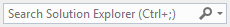 Search box control text

| Element | Token name: Category.color |
| --- | --- |
| Foreground (text) | `SearchControl.UnfocusedWatermarkText` |

### Hyperlink
The hyperlink is one control that doesn't have a foreground/background pair. In all cases, use the foreground hyperlink color, which will appear correctly on dark, gray, and white backgrounds. If you don't use the color token for the hyperlink control, you will see the default system color for "pressed," which will flash red. That's the signal that the control isn't using the correct environment color token.

 Hyperlink (redline)

| Use ... | Don't use ... |
| --- | --- |
| ... when you need to create a custom hyperlink. | ... for anything that isn't a hyperlink. |

**Hyperlink: default state**

 Default hyperlink

| Element | Token name: Category.color |
| --- | --- |
| Foreground (Text) | `Environment.PanelHyperlink` |

**Hyperlink: hover state**

 Hyperlink on hover

| Element | Token name: Category.color |
| --- | --- |
| Foreground (Text) | `Environment.PanelHyperlinkHover` |

**Hyperlink: pressed state**

 Pressed hyperlink

| Element | Token name: Category.color |
| --- | --- |
| Foreground (Text) | `Environment.PanelHyperlinkPressed` |

**Hyperlink: disabled state**

 Disabled hyperlink

| Element | Token name: Category.color |
| --- | --- |
| Foreground (Text) | `Environment.PanelHyperlinkDisabled` |

### Infobars
Infobars are used to provide more information about a given context and always appear at the top of a document window or tool window.

 Infobar (redline)

| Use ... | Don't use ... |
| --- | --- |
| ... when creating custom infobars. | ... for UI elements that aren't similar to an infobar. |

**Infobar: default state**

 Default infobar

| Element | Token name: Category.color |
| --- | --- |
| Background | `InfoBar.InfoBarBackground` |
| Foreground (Text) | `InfoBar.InfoBar` |
| Border | `InfoBar.InfoBarBorder` |

**Infobar Close (&times;) button: default state**

 Default infobar Close (&times;) button

| Element | Token name: Category.color |
| --- | --- |
| Background | `InfoBar.CloseButton` |
| Border | `InfoBar.CloseButtonBorder` |
| Glyph | `InfoBar.CloseButtonGlyph` |

**Infobar Close (&times;) button: hover state**

 Infobar Close (&times;) button on hover

| Element | Token name: Category.color |
| --- | --- |
| Background | `InfoBar.CloseButtonHover` |
| Border | `InfoBar.CloseButtonHoverBorder` |
| Glyph | `InfoBar.CloseButtonHoverGlyph` |

**Infobar Close (&times;) button: pressed state**

 Pressed infobar Close (&times;) button

| Element | Token name: Category.color |
| --- | --- |
| Background | `InfoBar.CloseButtonDown` |
| Border | `InfoBar.CloseButtonDownBorder` |
| Glyph | `InfoBar.CloseButtonDownGlyph` |

**Infobar hyperlink button: default state**

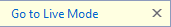 Default infobar hyperlink button

| Element | Token name: Category.color |
| --- | --- |
| Foreground (text) | `InfoBar.Hyperlink` |

**Infobar hyperlink button: hover state**

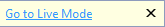 Infobar hyperlink button on hover

| Element | Token name: Category.color |
| --- | --- |
| Foreground (text) | `Infobar.HyperlinkMouseOver` (With underline) |

**Infobar hyperlink button: pressed state**

 Pressed infobar hyperlink button

| Element | Token name: Category.color |
| --- | --- |
| Foreground (text) | `Infobar.HyperlinkMouseDown` (With underline) |

**Infobar inline hyperlink (within a sentence): default state**

 Default inline infobar hyperlink button

| Element | Token name: Category.color |
| --- | --- |
| Foreground (text) | `InfoBar.Hyperlink` |

**Infobar inline hyperlink (within a sentence): hover state**

 Infobar inline hyperlink button on hover

| Element | Token name: Category.color |
| --- | --- |
| Foreground (text) | `Infobar.HyperlinkMouseOver` (With underline) |

**Infobar inline hyperlink (within a sentence): pressed state**

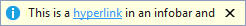 Pressed infobar inline hyperlink button

| Element | Token name: Category.color |
| --- | --- |
| Foreground (text) | `Infobar.HyperlinkMouseDown` (With underline) |

**Infobar button: default state**

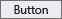 Default infobar button

| Element | Token name: Category.color |
| --- | --- |
| Background | `InfoBar.Button` |
| Foreground (text) | `InfoBar.Button` |
| Border | `InfoBar.ButtonBorder` |

**Infobar button: hover state**

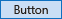 Infobar button on hover

| Element | Token name: Category.color |
| --- | --- |
| Background | `InfoBar.ButtonMouseOver` |
| Foreground (text) | `InfoBar.ButtonMouseOver` |
| Border | `InfoBar.ButtonMouseOverBorder` |

**Infobar button: pressed state**

 Pressed infobar button

| Element | Token name: Category.color |
| --- | --- |
| Background | `InfoBar.ButtonMouseDown` |
| Foreground (text) | `InfoBar.ButtonMouseDown` |
| Border | `InfoBar.ButtonMouseDownBorder` |

**Infobar button: disabled state**

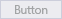 Disabled infobar button

| Element | Token name: Category.color |
| --- | --- |
| Background | `InfoBar.ButtonDisabled` |
| Foreground (text) | `InfoBar.ButtonDisabled` |
| Border | `InfoBar.ButtonDisabledBorder` |

**Infobar button: focused state**

 Focused infobar button

| Element | Token name: Category.color |
| --- | --- |
| Background | `InfoBar.ButtonFocus` |
| Foreground (text) | `InfoBar.ButtonFocus` |
| Border | `InfoBar.ButtonFocusBorder` |

### Scroll bars
Scroll bars are styled by the Visual Studio environment, and won't need to be themed. However, you might decide that you want to leverage the colors used in scroll bars so that your UI always appears consistent with this part of the Visual Studio environment.

 Scroll bar (redline)

| Use ... | Don't use ... |
| --- | --- |
| ... when you're creating UI that you want to match Visual Studio scroll bars. | ... for anything you don't want to always match scroll bar UI. |

**Scroll bar: default state**

 Default scroll bar

| Element | Token name: Category.color |
| --- | --- |
| Scroll bar | `Environment.ScrollBarBackground` |
| Foreground (Thumb) | `Environment.ScrollBarThumbBackground` |

**Scroll bar: hover state**

 Scroll bar on hover

| Element | Token name: Category.color |
| --- | --- |
| Scroll bar | `Environment.ScrollBarBackground` |
| Foreground (Thumb) | `Environment.ScrollBarThumbMouseOverBackground` |

*Scroll bar: pressed state**

 Pressed scroll bar

| Element | Token name: Category.color |
| --- | --- |
| Scroll bar | `Environment.ScrollBarBackground` |
| Foreground (Thumb) | `Environment.ScrollBarThumbPressedBackground` |

**Scroll bar arrow: default state**

 Default scroll bar arrow

| Element | Token name: Category.color |
| --- | --- |
| Background | `Environment.ScrollBarArrowBackground` (Set to same color as scroll bar.) |
| Foreground (Glyph) | `Environment.ScrollBarArrowGlyph` |

**Scroll bar arrow: hover state**

 Scroll bar arrow on hover

| Element | Token name: Category.color |
| --- | --- |
| Background | `Environment.ScrollBarArrowMouseOverBackground` (Set to same color as scroll bar.) |
| Foreground (Glyph) | `Environment.ScrollBarArrowGlyphMouseOver` |

**Scroll bar arrow: pressed state**

 Pressed scroll bar arrow

| Element | Token name: Category.color |
| --- | --- |
| Background | `Environment.ScrollBarArrowPressedBackground` (Set to same color as scroll bar.) |
| Foreground (Glyph) | `Environment.ScrollBarArrowGlyphPressed` |

### Search boxes
Whenever possible, use the common search control provided by the Visual Studio environment. Search box colors are found in the "SearchControl" category in the **ShellColors.pkgdef** file, which contains token names for the input field, action button, drop-down button, and drop-down menu.

A search box can be one of several states, some of which are mutually exclusive:

- "Focused" or "unfocused" refers to whether or not the cursor is in the text box.

- "Active" or "inactive" refers to whether the user has input a search query in the text box.

- "Hover" means that the user has moused over the search box with the mouse (this state overrides all other states).

- "Disabled" means that search functionality is turned off for the current context.

 Search box (redline)

| Use ... | Don't use ... |
| --- | --- |
| ... when you're designing a custom search box. | ... for anything that isn't a search box. |
| | ... for anything that you don't want to always match the search box UI. |

**Focused search input field**

 Focused search input field

| Element | Token name: Category.color |
| --- | --- |
| Background | `SearchControl.FocusedBackground` |
| Foreground (Text) | `SearchControl.FocusedBackground` |
| Border | `SearchControl.FocusedBorder` |
| Separator | `SearchControl.FocusedDropDownSeparator` |

**Unfocused, active search input field**

 Unfocused, active search input field

| Element | Token name: Category.color |
| --- | --- |
| Background | `SearchControl.SearchActiveBackground` |
| Foreground (Text) | `SearchControl.SearchActiveBackground` |
| Border | `SearchControl.UnfocusedBorder` |
| Separator | `SearchControl.DropDownSeparator` |

**Unfocused, inactive search input field**

 Unfocused, inactive search input field

| Element | Token name: Category.color |
| --- | --- |
| Background | `SearchControl.Unfocused` |
| Foreground (Text) | `SearchControl.Unfocused` |
| Border | `SearchControl.UnfocusedBorder` |
| Separator | `SearchControl.DropDownSeparator` |

**Highlighted search input field (text only)**

 Highlighted search input field

| Element | Token name: Category.color |
| --- | --- |
| Background | `SearchControl.Selection` |
| Foreground (Text) | `SearchControl.FocusedBackground` |
| Border | None |
| Separator | `SearchControl.FocusedDropDownSeparator` |

**Disabled search input field**

 Disabled search input field

| Element | Token name: Category.color |
| --- | --- |
| Background | `SearchControl.Disabled` |
| Foreground (Text) | `SearchControl.Disabled` |
| Border | `SearchControl.DisabledBorder` |
| Separator | `SearchControl.DropDownSeparator` |

**Focused search action button**

 Focused search action button

| Element | Token name: Category.color |
| --- | --- |
| Background | None |
| Foreground (Search glyph) | `SearchControl.SearchGlyph` |
| Foreground (Stop glyph) | `SearchControl.StopGlyph` |
| Foreground (Clear glyph) | `SearchControl.ClearGlyph` |
| Border | N/A |

**Unfocused search action button**

 Unfocused search action button

| Element | Token name: Category.color |
| --- | --- |
| Background | N/A |
| Foreground (Search glyph) | `SearchControl.SearchGlyph` |
| Foreground (Stop glyph) | `SearchControl.StopGlyph` |
| Foreground (Clear glyph) | `SearchControl.ClearGlyph` |
| Border | N/A |

**Pressed search action button**

 Pressed search action button

| Element | Token name: Category.color |
| --- | --- |
| Background | `SearchControl.ActionButtonMouseDown` |
| Foreground (Glyph) | `SearchControl.ActionButtonMouseDownGlyph` |
| Border | `SearchControl.ActionButtonMouseDownBorder` |

**Disabled search action button**

 Disabled search action button

| Element | Token name: Category.color |
| --- | --- |
| Background | None |
| Foreground (Glyph) | `SearchControl.ActionButtonDisabledGlyph` |
| Border | None |

**Focused search drop-down button**

 Focused search drop-down button

| Element | Token name: Category.color |
| --- | --- |
| Background | `SearchControl.FocusedDropDownButton` |
| Foreground (Glyph) | `SearchControl.FocusedDropDownButtonGlyph` |
| Border | `SearchControl.FocusedDropDownButtonBorder` |

**Unfocused search drop-down button**

 Unfocused search drop-down button

| Element | Token name: Category.color |
| --- | --- |
| Background | `SearchControl.UnfocusedDropDownButton` |
| Foreground (Glyph) | `SearchControl.UnfocusedDropDownButtonGlyph` |
| Border | `SearchControl.UnfocusedDropDownButtonBorder` |

**Pressed search drop-down button**

 Pressed search drop-down button

| Element | Token name: Category.color |
| --- | --- |
| Background | `SearchControl.MouseDownDropDownButton` |
| Foreground (Glyph) | `SearchControl.MouseDownDropDownButtonGlyph` |
| Border | `SearchControl.MouseDownDropDownButtonBorder` |

**Disabled search drop-down button**

 Disabled search drop-down button

| Element | Token name: Category.color |
| --- | --- |
| Background | None |
| Foreground (Glyph) | `SearchControl.DisabledDownButtonGlyph` |
| Border | None |

#### Search drop-down lists
The search box drop-down menu has the potential to be slightly more complex than other drop-down menus in Visual Studio. The "suggested searches" and "search options" sections can appear alone or together in the menu, and each one is colored separately. A line also separates these two sections when they appear together and a border surrounds the entire dropdown menu.

 Search drop-down list (redline)

| Use ... | Don't use ... |
| --- | --- |
| ... when you're creating a custom search drop-down list. | ... for drop-down lists that appear in other contexts. |
| ... the correct token names for the correct list components. | ... in any background/foreground combination other than specified. |

**Search drop-down list elements**

| Element | Token name: Category.color |
| --- | --- |
| Border | `SearchControl.PopupBorder` |
| Separator | `SearchControl.PopupSectionHeaderSeparator` |
| Shadow | `Environment.DropShadowBackground` |

**Suggested searches: default state**

 Default suggested searches

| Element | Token name: Category.color |
| --- | --- |
| Background | `SearchControl.PopupItemsListBackgroundGradientBegin` (Gradient stops for this token not used in themed UI.) |
| Foreground (Text) | `SearchControl.PopupItemText` |

**Suggested searches: hover state**

 Suggested searches on hover

| Element | Token name: Category.color |
| --- | --- |
| Background | `SearchControl.PopupControlMouseOverBackgroundGradientBegin` (Gradient stops for this token not used in themed UI.) |
| Foreground (Text) | `SearchControl.PopupMouseOverItemText` |
| Border | `SearchControl.PopupControlMouseOverBorder` |

**Search options: default state**

 Default search options (check box)

 Default search options (link)

| Element | Token name: Category.color |
| --- | --- |
| Background | `SearchControl.PopupSectionBackgroundGradientBegin` (Gradient stops for this token not used in themed UI.) |
| Foreground (Check box text) | `SearchControl.PopupCheckboxText` |
| Foreground (Link text) | `SearchControl.PopupButtonText` |
| Header background | `SearchControl.PopupSectionHeaderGradientBegin` (Gradient stops for this token not used in themed UI.) |
| Foreground (Header text) | `SearchControl.PopupSectionHeaderText` |

**Search options: hover state**

 Search options (check box) on hover

 Search options (link) on hover

| Element | Token name: Category.color |
| --- | --- |
| Background | `SearchControl.PopupControlMouseOverBackgroundGradientBegin` (Gradient stops for this token not used in themed UI.) |
| Foreground (Check box text) | `SearchControl.PopupCheckboxMouseDownText` |
| Foreground (Link text) | `SearchControl.PopupButtonMouseDownText` |
| Border | `SearchControl.PopupControlMouseOverBorder` |

**Search options: pressed state**

 Pressed search options (check box)

 Pressed search options (link)

| Element | Token name: Category.color |
| --- | --- |
| Check box background | `SearchControl.PopupControlMouseDownBackgroundGradientBegin` `SearchControl.PopupControlMouseDownBackgroundGradientEnd` (Gradient stops for this token not used in themed UI.) |
| Foreground (Check box text) | `SearchControl.PopupCheckboxMouseDownText` |
| Link background | `SearchControl.PopupButtonMouseDownBackgroundGradientBegin` (Gradient stops for this token not used in themed UI.) |
| Foreground (Link text) | `SearchControl.PopupButtonMouseDownText` |

###  Tree views
Several tool windows, including the Solution Explorer, Server Explorer, and Class View, implement a hierarchical organizational scheme whose colors are controlled by color names in the `TreeView` category. All items in a tree view have background and text colors. Items that have nested child elements also have glyphs that indicate whether the item is expanded or collapsed.

 Tree view (redline)

| Use ... | Don't use ... |
| --- | --- |
| ... anywhere you need to implement a hierarchical organizational view. | ... for anything that isn't similar to a tree view. |
| | ... in any background/foreground combination other than specified. |

**Tree view item: default state**

 Default tree view item

| Element | Token name: Category.color |
| --- | --- |
| Background | `TreeView.Background` |
| Foreground (Text) | `TreeView.Background` |
| Foreground (Glyph) | `TreeView.Glyph` |
| Border | None |

**Tree view item: hover state**

 Tree view item on hover

| Element | Token name: Category.color |
| --- | --- |
| Background | `TreeView.Background` |
| Foreground (Text) | `TreeView.Background` |
| Foreground (Glyph) | `TreeView.GlyphMouseOver` |
| Border | None |

**Tree view item: drag over state**

 Tree view item on drag over

| Element | Token name: Category.color |
| --- | --- |
| Background | `TreeView.DragOverItem` |
| Foreground (Text) | `TreeView.DragOverItem` |
| Foreground (Glyph) | `TreeView.DragOverItemGlyph` |
| Border | None |

**Tree view item: selected, focused state**

 Selected and focused tree view item

| Element | Token name: Category.color |
| --- | --- |
| Background | `TreeView.SelectedItemActive` |
| Foreground (Text) | `TreeView.SelectedItemActive` |
| Foreground (Glyph) | `TreeView.SelectedItemActiveGlyph` |
| Border | `TreeView.FocusVisualBorder` |

**Tree view item: selected, unfocused state**

 Selected and unfocused tree view item

| Element | Token name: Category.color |
| --- | --- |
| Background | `TreeView.SelectedItemInactive` |
| Foreground (Text) | `TreeView.SelectedItemInactive` |
| Foreground (Glyph) | `TreeView.SelectedItemInactiveGlyph` |
| Border | None |

**Tree view item: hovered, selected, and focused state**

 Selected and focused tree view item on hover

| Element | Token name: Category.color |
| --- | --- |
| Background | `TreeView.SelectedItemActive` |
| Foreground (Text) | `TreeView.SelectedItemActive` |
| Foreground (Glyph) | `TreeView.SelectedItemActiveGlyphMouseOver` |
| Border | `TreeView.FocusVisualBorder` |

**Tree view item: hovered, selected, and unfocused state**

 Selected and unfocused tree view item on hover

| Element | Token name: Category.color |
| --- | --- |
| Background | `TreeView.SelectedItemInactive` |
| Foreground (Text) | `TreeView.SelectedItemInactive` |
| Foreground (Glyph) | `TreeView.SelectedItemActiveGlyphMouseOver` |
| Border | None |

## Shell appearance

### Background
The environment background consists of two layers. The bottom layer is a solid color that covers the entire IDE. The top layer fits under the command shelf and between the tool window auto-hide channels on the left and right edges of the IDE. The top and bottom background layers are set to the same color in the Light and Dark themes.

 Visual Studio shell background (redline)

| Use ... | Don't use ... |
| --- | --- |
| ... for places where you want to match the background of the Visual Studio environment. | ... as a fill for places that aren't background surfaces. |
| | ... as a background to place foreground elements on. |

**Bottom layer shell appearance**

| Element | Token name: Category.color |
| --- | --- |
| Background | `Environment.EnvironmentBackground` |

**Top layer shell appearance**

> Gradient stops set to the same color value in Visual Studio 2013 Light and Dark themes.

| Element | Token name: Category.color |
| --- | --- |
| Background | `Environment.EnvironmentBackgroundGradientBegin` `Environment.EnvironmentBackgroundGradientEnd` `Environment.EnvironmentBackgroundGradientMiddle1` `Environment.EnvironmentBackgroundGradientMiddle2` |

### Command shelf
Two sets of token names are used for the command shelf backgrounds: one set for where the menu bar sits and one for where the command bars sit. An individual command bar group has its own background color values, which are discussed in more detail in the "command bar" section. Menu bar and command bar text is discussed in the menu and command bar sections, respectively.

 Visual Studio command shelf (redline)

| Use ... | Don't use ... |
| --- | --- |
| ... for areas where you place menus or toolbars. | ... for areas that aren't similar to a command shelf. |
|... with the correct background/foreground token name combination. | |

**Command shelf menu bar**

> Gradient stops set to the same color value in Visual Studio 2013 Light and Dark themes.

| Element | Token name: Category.color |
| --- | --- |
| Background | `Environment.CommandShelfHighlightGradientBegin`  `Environment.CommandShelfHighlightGradientMiddle` `Environment.CommandShelfHighlightGradientEnd` |

**Command shelf command bar**

> Gradient stops set to the same color value in Visual Studio 2013 Light and Dark themes.

| Element | Token name: Category.color |
| --- | --- |
| Background | `Environment.CommandShelfBackgroundGradientBegin` `Environment.CommandShelfBackgroundGradientMiddle` `Environment.CommandShelfBackgroundGradientEnd` |

## Manifest Designer
The Manifest Designer was designed as a way to make it easier to edit the manifest file in Windows 8 and Windows Phone 8 projects. While there is no shared framework available for consumption, it might be appropriate for you to match the design layout and colors of the orientation/navigation tabs and overall structure. For more information about layout details, see [Layout for Visual Studio](../../extensibility/ux-guidelines/layout-for-visual-studio.md).

 Manifest Designer (redline)

| Use ... | Don't use ... |
| --- | --- |
| ... for designers that are similar to the Manifest Designer. | ... if you have more than six tabs. |
| ... in place of using common tab controls at the top of an editor within the document well. | ... for any UI that isn't structured like the Manifest Designer. |

**Manifest Designer selected tab: default state**

| Element | Token name: Category.color |
| --- | --- |
| Background | `ManifestDesigner.TabActive` |
| Border | None |

**Manifest Designer selected description pane: default state**

| Element | Token name: Category.color |
| --- | --- |
| Background | `ManifestDesigner.DescriptionPane` |

**Manifest Designer selected content page: default state**

| Element | Token name: Category.color |
| --- | --- |
| Background | `ManifestDesigner.Background` |
| Dialog helper text | `ManifestDesigner.WatermarkText` (This token name doesn't match its function.) |

**Manifest Designer tab: unselected state**

| Element | Token name: Category.color |
| --- | --- |
| Background | `ManifestDesigner.Tab.Inactive` |

**Manifest Designer tab: hover state**

| Element | Token name: Category.color |
| --- | --- |
| Background | `ManifestDesigner.Tab.Mouseover` |

## Command structures

###  Menus
Menus can occur at several places within Visual Studio: the main menu bar, embedded in document or tool windows, or on right-click in various locations throughout the IDE. Implementations of menus associated with other UI elements are discussed in the section for the respective element. You should always use the standard menu implementation provided by the Visual Studio environment. However, in some rare instances you might not have access to the standard Visual Studio menus. In these situations, use the following token names to ensure that your UI is consistent with other menus in Visual Studio.

 Visual Studio menu (redline)

| Use ... | Don't use ... |
| --- | --- |
| ... when you need to create a custom menu.| ... the background color alone. Always use the background/foreground combination as specified. |
| ... when you have a new UI component that you want to match the Visual Studio menus.| |

#### Menu titles
Menu titles consist of a background, a border, and the title text, as well as an optional glyph, usually when the menu is found in a command bar.

 Menu title (redline)

| Use ... | Don't use ... |
| --- | --- |
| ... whenever you're creating a custom menu title. | ... for anything that you don't want to always match the menu title. |
| | ... in any background/foreground combination other than specified. |

**Menu title: default state**

 Default menu title

 Default menu title with glyph

| Element | Token name: Category.color |
| --- | --- |
| Background | None |
| Foreground (text) | `Environment.CommandBarTextActive` |
| Foreground (glyph) | `Environment.CommandBarMenuGlyph` |
| Border | None |

**Menu title: hover state**

 Menu title on hover

 Menu title with glyph on hover

| Element | Token name: Category.color |
| --- | --- |
| Background | `Environment.CommandBarMouseOverBackgroundBegin` (Gradient stops for this token not used in themed UI.) |
| Foreground (text) | `Environment.CommandBarTextHover` |
| Foreground (glyph) | `Environment.CommandBarMenuMouseOverGlyph` |
| Border | `Environment.CommandBarBorder` |

**Menu title: pressed state**

 Pressed menu title

 Pressed menu title with glyph

| Element | Token name: Category.color |
| --- | --- |
| Background | `Environment.CommandBarMenuBackgroundGradientBegin` (Gradient stops for this token not used in themed UI.) |
| Foreground (Text) | `Environment.CommandBarTextActive` |
| Foreground (Glyph) | `Environment.CommandBarMenuMouseDownGlyph` |
| Border | `Environment.CommandBarMenuBorder` (Only left, top, and right sides.) |

**Menu title: disabled state**

 Disabled menu title with glyph

| Element | Token name: Category.color |
| --- | --- |
| Background | None |
| Foreground (Text) | `Environment.CommandBarTextInactive` |
| Foreground (Glyph) | `Environment.CommandBarTextInactive` |
| Border | None |

#### Menu items
An individual menu item consists of the menu text and an optional icon, check box, or submenu glyph. Its background and text color change on hover. This color token is a background/foreground pair.

| Use ... | Don't use ... |
|---|---|
| ... for any drop-down list that's launched from a menu bar or command bar. | ... for any drop-down list in another context. |
| | ... in any background/foreground combination other than specified. |

**Menu items: default state**

 Default menu items

| Element | Token name: Category.color |
| --- | --- |
| Background | `Environment.CommandBarMenuBackgroundGradientBegin` (Gradient stops for this token not used in themed UI.) |
| Foreground (Text) | `Environment.CommandBarTextActive` |
| Foreground (Submenu glyph) | `Environment.CommandBarMenuSubmenuGlyph` |
| Border | `Environment.CommandBarMenuBorder` |
| Icon channel background | `Environment.CommandBarMenuIconBackground` |
| Separator | `Environment.CommandBarMenuSeparator` |
| Shadow | `Environment.DropShadowBackground` |

**Menu items: checked and selected states**

 Checked menu item

 Selected menu item

| Element | Token name: Category.color |
| --- | --- |
| Check mark | `Environment.CommandBarCheckBox` |
| Check mark background | `Environment.CommandBarSelectedIcon` |
| Icon background | `Environment.CommandBarSelected` |
| Icon border | `Environment.CommandBarSelectedBorder` |

**Menu items: hover state**

 Menu item on hover

 Checked menu item on hover

 Selected menu item on hover

| Element | Token name: Category.color |
| --- | --- |
| Background | `Environment.CommandBarMenuItemMouseOver` |
| Foreground (Text) | `Environment.CommandBarMenuItemMouseOverText` |
| Foreground (Submenu glyph) | `Environment.CommandBarMenuMouseOverSubmenuGlyph` |
| Check mark | `Environment.CommandBarCheckBoxMouseOver` |
| Check mark background | `Environment.CommandBarHoverOverSelectedIcon` |
| Icon background | `Environment.CommandBarHoverOverSelected` |
| Icon border | `Environment.CommandBarHoverOverSelectedIconBorder` |

**Menu items: disabled state**

 Disabled menu item

 Disabled menu item with check mark

| Element | Token name: Category.color |
| --- | --- |
| Foreground (Text) | `Environment.CommandBarTextInactive` |
| Foreground (Submenu glyph) | `Environment.CommandBarMenuSubmenuGlyph` |
| Check mark | `Environment.CommandBarCheckBoxDisabled` |
| Check mark background | `Environment.CommandBarSelectedIconDisabled` |

### Command bars
A command bar can appear in multiple places within the Visual Studio IDE, most notably the command shelf and embedded in tool or document windows.

In general, always use the standard command bar implementation provided by the Visual Studio environment. Using the standard mechanism ensures that all visual details will appear correctly and that interactive elements, will behave consistently with other Visual Studio command bar controls. However, if it is necessary for you to build your own command bar, make sure you style it correctly using the following token names.

 Command bar (redline)

 Overflow button (redline)

| Use ... | Don't use ... |
| --- | --- |
| ... in places where you need an embedded command bar, but are unable to use the standard Visual Studio command bar implementation. | ... for UI elements that aren't similar to a command bar. |
| | ... for command bar components other than the ones for which token names are specified. |

#### Command bar groups
A command bar group consists of a related set of command bar controls and might contain any number of buttons, split buttons, drop-down menus, combo boxes, or menus. Colors for those controls are regulated by separate token names and are discussed individually elsewhere in this guide. A separator line is used to divide a command bar group into related subgroups.

 Command bar group (redline)

| Use ... | Don't use ... |
| --- | --- |
| ... in places where you need an embedded command bar, but are unable to use the standard Visual Studio command bar implementation. | ... for UI elements that aren't similar to a command bar. |
| | ... for command bar components other than the ones for which token names are specified. |

**Command bar group: default state**

| Element | Token name: Category.color |
| --- | --- |
| Background | `Environment.CommandBarGradientBegin` (Gradient stops for this token not used in themed UI.) |
| Border | `Environment.CommandBarToolBarBorder` |
| Drag handle | `Environment.CommandBarDragHandle` |
| Separator | `Environment.CommandBarToolBarSeparator` `Environment.CommandBarToolBarSeparatorHighlight` |

#### Command icons
 Command icon (redline)

 Command icon with text (redline)

| Use ... | Don't use ... |
| --- | --- |
| ... for any buttons that will be placed on a command bar. | ... for controls that have their own token names. |
| | ... in any background/foreground combination other than specified. |

**Command icon: default state**

 Default command icon

| Element | Token name: Category.color |
| --- | --- |
| Background | N/A (inherits from command bar background) |
| Foreground (Text) | `Environment.CommandBarTextActive` |
| Border | N/A |

**Command icon: default state, selected**

 Default, selected command icon

| Element | Token name: Category.color |
| --- | --- |
| Background | `Environment.CommandBarSelected` |
| Foreground (Text) | `Environment.CommandBarTextSelected` |
| Border | `Environment.CommandBarSelectedBorder` |

**Command icon: hover or focus states**

 Command icon on hover or focus

| Element | Token name: Category.color |
| --- | --- |
| Background | `Environment.CommandBarMouseOverBackgroundBegin` (Gradient stops for this token not used in themed UI.) |
| Foreground (Text) | `Environment.CommandBarTextHover` |
| Border | `Environment.CommandBarBorder` |

**Command icon: hover or focus states, selected**

 Selected command icon on hover or focus

| Element | Token name: Category.color |
| --- | --- |
| Background | `Environment.CommandBarHoverOverSelected` |
| Foreground (Text) | `Environment.CommandBarTextHoverOverSelected` |
| Border | `Environment.CommandBarHoverOverSelectedIconBorder` |

 **Command icon: pressed state**

 Pressed command icon

| Element | Token name: Category.color |
| --- | --- |
| Background | `Environment.CommandBarMouseDownBackgroundBegin` (Gradient stops for this token not used in themed UI.) |
| Foreground (Text) | `Environment.CommandBarTextMouseDown` |
| Border | `Environment.CommandBarBorder` |

**Command icon: disabled state**

 Disabled command icon

| Element | Token name: Category.color |
| --- | --- |
| Background | N/A (inherits from command bar background) |
| Foreground (Text) | `Environment.CommandBarTextInactive` |
| Border | N/A |

####  Command bar combo boxes

> [!IMPORTANT]
> Combo boxes are similar to drop-downs, but include an editable text region. If your drop-down does not include an editable text region, use the color tokens for [command bar drop-downs](../../extensibility/ux-guidelines/shared-colors-for-visual-studio.md#BKMK_CommandDropDown).

 Command bar combo box (redline)

| Use ... | Don't use ... |
| --- | --- |
| ... when building custom combo boxes. | ... for anything you don't want always to match the command bar UI. |
| ... when creating a command bar control that's similar to a combo box. | ... when you have access to a styled combo box. |

**Command bar combo box input field: default state**

 Command bar combo box input field

| Element | Token name: Category.color |
| --- | --- |
| Background | `Environment.ComboBoxBackground` |
| Foreground (Text) | `Environment.ComboBoxText` |
| Border | `Environment.ComboBoxBorder` |
| Separator | No separator |

**Command bar drop-down button: default state**

 Command bar drop-down button

| Element | Token name: Category.color |
| --- | --- |
| Background | N/A (inherits from command bar background) |
| Foreground (Glyph) | `Environment.ComboBoxGlyph` |

**Command bar drop-down list: default state**

 Command bar drop-down list

| Element | Token name: Category.color |
| --- | --- |
| Background | `Environment.ComboBoxPopupBackgroundBegin` (Gradient stops for this token not used in themed UI.) |
| Foreground (Text) | `Environment.ComboBoxItemText` |
| Border | `Environment.ComboBoxPopupBorder` |

**Command bar combo box input field: hover state**

 Command bar combo box input field on hover

| Element | Token name: Category.color |
| --- | --- |
| Background | `Environment.ComboBoxMouseOverBackgroundBegin` (Gradient stops for this token not used in themed UI.) |
| Foreground (Text) | `Environment.ComboBoxMouseOverText` |
| Border | `Environment.ComboBoxMouseOverBorder` |
| Separator | `Environment.ComboBoxMouseOverSeparator` |

 **Command bar drop-down button: hover state**

 Command bar drop-down button on hover

| Element | Token name: Category.color |
| --- | --- |
| Background | `Environment.ComboBoxButtonMouseOverBackground` |
| Foreground (Glyph) | `Environment.ComboBoxMouseOverGlyph` |

**Command bar drop-down list: hover state**

  Command bar drop-down list on hover

| Element | Token name: Category.color |
| --- | --- |
| Background (Menu item) | `Environment.ComboBoxItemMouseOverBackground` |
| Foreground (Text) | `Environment.ComboBoxItemMouseOverText` |
| Border (Menu item) | `Environment.ComboBoxItemMouseOverBorder` |

 **Command bar combo box input field: focused state**

 Focused command bar combo box input field

| Element | Token name: Category.color |
| --- | --- |
| Background | `Environment.ComboBoxFocusedBackground` |
| Foreground (Text) | `Environment.ComboBoxFocusedText` |
| Border | `Environment.ComboBoxFocusedBorder` |
| Separator | `Environment.ComboBoxFocusedButtonSeparator` |

**Command bar drop-down button: focused state**

 Focused command bar drop-down button

| Element | Token name: Category.color |
| --- | --- |
| Background | `Environment.ComboBoxFocusedButtonBackground` |
| Foreground (Glyph) | `Environment.ComboBoxFocusedGlyph` |

 **Command bar combo box input field: pressed state**

 Pressed command bar combo box input field

| Element | Token name: Category.color |
| --- | --- |
| Background | `Environment.ComboBoxMouseDownBackground` |
| Foreground (Text) | `Environment.ComboBoxMouseDownText` |
| Border | `Environment.ComboBoxMouseDownBorder` |
| Separator | `Environment.ComboBoxMouseDownSeparator` |

**Command bar drop-down button: pressed state**

 Pressed command bar drop-down button

| Element | Token name: Category.color |
| --- | --- |
| Background | `Environment.ComboBoxButtonMouseDownBackground` |
| Foreground (Glyph) | `Environment.ComboBoxMouseDownGlyph` |

**Command bar combo box input field: disabled state**

 Disabled command bar combo box input field

| Element | Token name: Category.color |
| --- | --- |
| Background | `Environment.ComboBoxDisabledBackground` |
| Foreground (Text) | `Environment.ComboBoxDisabledText` |
| Border | `Environment.ComboBoxDisabledBorder` |
| Separator | No separator |

**Command bar drop-down button: disabled state**

 Disabled command bar drop-down button

| Element | Token name: Category.color |
| --- | --- |
| Background | None |
| Foreground (Glyph) | `Environment.ComboBoxDisabledGlyph` |

####  Command bar drop-downs

> [!IMPORTANT]
> Drop-downs are similar to combo boxes, but lack editable text regions. If your drop-down includes an editable text region, use the color tokens for [command bar combo boxes](../../extensibility/ux-guidelines/shared-colors-for-visual-studio.md#BKMK_CommandComboBox).

 Command bar drop-down (redline)

| Use ... | Don't use ... |
| --- | --- |
| ... when you're creating custom drop-down list controls. | ... for anything that isn't similar to a drop-down list. |
| | ... for combo boxes or split buttons. |

**Command bar drop-down selection field: default state**

 Default command bar drop-down selection field

| Element | Token name: Category.color |
| --- | --- |
| Background | `Environment.DropDownBackground` |
| Foreground (Text) | `DropDownText` |
| Border | `DropDownBorder` |
| Separator | No separator |

**Command bar drop-down button: default state**

 Default command bar drop-down button

| Element | Token name: Category.color |
| --- | --- |
| Background | None |
| Foreground (Glyph) | `Environment.DropDownGlyph` |

**Command bar drop-down list: default state**

 Default command bar drop-down list

| Element | Token name: Category.color |
| --- | --- |
| Background | `Environment.DropDownPopupBackgroundBegin` (Gradient stops for this token not used in themed UI.) |
| Foreground (Text) | `Environment.ComboBoxItemText` |
| Border | `Environment.DropDownPopupBorder` |
| Shadow | `Environment.DropShadowBackground` |

**Command bar drop-down selection field: hover state**

 Command bar drop-down selection field on hover

| Element | Token name: Category.color |
| --- | --- |
| Background | `Environment.DropDownMouseOverBackgroundBegin` (Gradient stops for this token not used in themed UI.) |
| Foreground (Text) | `Environment.DropDownMouseOverText` |
| Border | `Environment.DropDownMouseOverBorder` |
| Separator | `Environment.DropDownButtonMouseOverSeparator` |

**Command bar drop-down button: hover state**

 Command bar drop-down button on hover

| Element | Token name: Category.color |
| --- | --- |
| Background | `Environment.DropDownButtonMouseOverBackground` |
| Foreground (Glyph) | `Environment.DropDownMouseOverGlyph` |

**Command bar drop-down list: hover state**

 Command bar drop-down list on hover

| Element | Token name: Category.color |
| --- | --- |
| Background (Menu item) | `Environment.ComboBoxItemMouseOverBackground` |
| Foreground (Text) | `Environment.ComboBoxItemMouseOverText` |
| Border (Menu item) | `Environment.ComboBoxItemMouseOverBorder` |

 **Command bar drop-down selection field: pressed state**

 Pressed command bar drop-down selection field

| Element | Token name: Category.color |
| --- | --- |
| Background | `Environment.DropDownMouseDownBackground` |
| Foreground (Text) | `Environment.DropDownMouseDownText` |
| Border | `Environment.DropDownMouseDownBorder` |
| Separator | `Environment.DropDownButtonMouseDownSeparator` |

**Command bar drop-down button: pressed state**

 Pressed command bar drop-down button

| Element | Token name: Category.color |
| --- | --- |
| Background | `Environment.DropDownButtonMouseDownBackground` |
| Foreground (Glyph) | `Environment.DropDownMouseDownGlyph` |

**Command bar drop-down selection field: disabled state**

 Disabled command bar drop-down selection field

| Element | Token name: Category.color |
| --- | --- |
| Background | `Environment.DropDownDisabledBackground` |
| Foreground (Text) | `Environment.DropDownDisabledText` |
| Border | `Environment.DropDownDisabledBorder` |
| Separator | No separator |

**Command bar drop-down button: disabled state**

 Disabled command bar drop-down button

| Element | Token name: Category.color |
| --- | --- |
| Background | N/A |
| Foreground (Glyph) | `Environment.DropDownDisabledGlyph` |

#### Command bar split buttons
Split buttons share many token names with other command bar controls, such as buttons, menus, and command bar text. All necessary action and drop-down button token names are repeated here for convenience. Split button drop-down lists are implementations of [command bar menus](../../extensibility/ux-guidelines/shared-colors-for-visual-studio.md#BKMK_CommandMenus).

 Command bar split button (redline)

| Use ... | Don't use ... |
| --- | --- |
| ... when you're creating a custom split button. | ... for other kinds of buttons. |
| | ... in any background/foreground combination other than specified. |

**Command bar split button: default state**

 Default command bar split button

| Element | Token name: Category.color |
| --- | --- |
| Background | None |
| Foreground (Text) | `Environment.CommandBarTextActive` |
| Foreground (Glyph) | `Environment.CommandBarSplitButtonGlyph` |
| Border | N/A |
| Separator | N/A |

**Command bar split button: hover state**

 Command bar split button on hover

| Element | Token name: Category.color |
| --- | --- |
| Background | `Environment.CommandBarMouseOverBackgroundBegin` (Gradient stops for this token not used in themed UI.) |
| Foreground (Text) | `Environment.CommandBarTextHover` |
| Foreground (Glyph) | `Environment.CommandBarSplitButtonMouseOverGlyph` |
| Border | `Environment.CommandBarBorder` |
| Separator | `Environment.CommandBarSplitButtonSeparator` |

**Command bar split button: pressed state**

 Pressed command bar split button

| Element | Token name: Category.color |
| --- | --- |
| Background | `Environment.CommandBarMouseDownBackgroundBegin` (Gradient stops for this token not used in themed UI.) |
| Foreground (Text) | `Environment.CommandBarTextMouseDown` |
| Foreground (Glyph) | `Environment.CommandBarSplitButtonMouseDownGlyph` |
| Border | `Environment.CommandBarBorder` |
| Separator | N/A |

**Command bar split button: disabled state**

 Disabled command bar split button

| Element | Token name: Category.color |
| --- | --- |
| Background | N/A |
| Foreground (Text) | `Environment.ComboBoxItemTextInactive` |
| Foreground (Glyph) | `Environment.CommandBarTextInactive` |
| Border | N/A |
| Separator | N/A |

#### Command bar 'More options' and 'Overflow' buttons
The "More options" button is used when a command bar group is customizable by either adding or removing related command bar buttons. The "Overflow" button appears when a command bar is truncated due to lack of horizontal space, and on click shows a menu containing the command bar buttons that cannot be displayed. Colors for these two buttons are controlled by the same set of token names.

 Command bar 'More options' button (redline)

| Use ... | Don't use ... |
| --- | --- |
| ... for custom 'More options' or 'Overflow' buttons. | ... for buttons that don't have similar functionality to a 'More options' or 'Overflow' button. |

**Command bar 'More options' and 'Overflow' buttons: default state**

 Default command bar 'More options' button

 Default command bar 'Overflow' button

| Element | Token name: Category.color |
| --- | --- |
| Background | `Environment.CommandBarOptionsBackground` |
| Foreground (Glyph) | `Environment.CommandBarOptionsGlyph` |

**Command bar 'More options' and 'Overflow' buttons: hover state**

 Command bar 'More options' button on hover

 Command bar 'Overflow' button on hover

| Element | Token name: Category.color |
| --- | --- |
| Background | `Environment.CommandBarOptionsMouseOverBackgroundBegin` (Gradient stops for this token not used in themed UI.) |
| Foreground (Glyph) | `Environment.CommandBarOptionsMouseDownGlyph` |

**Command bar 'More options' and 'Overflow' buttons: pressed state**

 Pressed command bar 'More options' button

 Pressed command bar 'Overflow' button

| Element | Token name: Category.color |
| --- | --- |
| Background | `Environment.CommandBarOptionsMouseDownBackgroundBegin` (Gradient stops for this token not used in themed UI.) |
| Foreground (Glyph) | `Environment.CommandBarOptionsMouseDownGlyph` |

## Document windows
There's no need to replicate document windows, because they're provided by the Visual Studio environment. However, you might decide that you want to leverage the colors used in document windows so that your UI always appears consistent with this part of the Visual Studio environment.

When using document window color tokens, be careful to use them only for similar elements, and always in pairs. If you don't do that, you might get unexpected results in your UI.

### Document window frames
Document windows can be either docked in the IDE or floating as a separate window. When a document window is floating outside the IDE, it still sits in a document well, and has background, border, text, and tab colors that are the same as when it's part of the IDE. However, the document sits inside a frame that has its own background, border, and text colors. When tool windows are docked in the document well, they inherit the behavior and color for their tabs from document window token names.

 Docked document window (redline)

 Floating document window (redline)

| Use ... | Don't use ... |
| --- | --- |
| ... anywhere you're creating UI that you want to match the document window. | ...  for any UI that you don't want automatically to change if the shell has a theme update. |

**Docked or floating document window: default state**

| Element | Token name: Category.color |
| --- | --- |
| Background | Depends on document type |
| Foreground (Text) | Depends on document type |
| Border | `Environment.ToolWindowBorder` |

**Focused, floating document window frame: default state**

 Default focused, floating document window frame

| Element | Token name: Category.color |
| --- | --- |
| Background | `Environment.ToolWindowFloatingFrame` |
| Foreground (Text) | `Environment.ToolWindowFloatingFrame` |
| Foreground (Glyph) | `Environment.RaftedWindowButtonActiveGlyph` |
| Border | `Environment.MainWindowActiveDefaultBorder` |
| Border (Glyph) | `Environment.RaftedWindowButtonActiveBorder` (Set to transparent) |

**Unfocused, floating document window frame: default state**

 Default unfocused, floating document window frame

| Element | Token name: Category.color |
| --- | --- |
| Background | `Environment.ToolWindowFloatingFrameInactive` |
| Foreground (Text) | `Environment.ToolWindowFloatingFrameInactive` |
| Foreground (Glyph) | `Environment.RaftedWindowButtonInactiveGlyph` |
| Border | `Environment.MainWindowInactiveBorder` |
| Border (Glyph) | `Environment.RaftedWindowButtonInactiveBorder` (Set to transparent) |

**Focused, floating document window frame: hover state**

 Focused, floating document window frame on hover

| Element | Token name: Category.color |
| --- | --- |
| Background (Glyph) | `Environment.RaftedWindowButtonHoverActive` |
| Foreground (Glyph) | `Environment.RaftedWindowButtonHoverActiveGlyph` |
| Border (Glyph) | `Environment.RaftedWindowButtonHoverActiveBorder` |

**Unfocused, floating document window frame: hover state**

 Unfocused, floating document window frame on hover

| Element | Token name: Category.color |
| --- | --- |
| Background (Glyph) | `EnvironmentRaftedWindowButtonHoverInactive` |
| Foreground (Glyph) | `Environment.RaftedWindowButtonHoverInactiveGlyph` |
| Border (Glyph) | `Environment.RaftedWindowButtonHoverInactiveBorder` |

**Focused, floating document window frame: pressed state**

 Focused, floating document window frame on press

| Element | Token name: Category.color |
| --- | --- |
| Background (Glyph) | `Environment.RaftedWindowButtonDown` |
| Foreground (Glyph) | `Environment.RaftedWindowButtonDownGlyph` |
| Border (Glyph) | `Environment.RaftedWindowButtonDownBorder` |

### Document tabs
Document tabs sit in the tab channel to indicate which documents are currently open, along with which one is the current selected or active document. Tool windows can also be docked in the document tab channel if the user places them there. In this situation, they use the same tab colors as document windows. If you are creating UI that you want to always match the document window colors (including theme updates or if new themes are installed), then reference these color tokens.

 Document tabs (redline)

| Use ... | Don't use ... |
| --- | --- |
| ... anywhere you're creating UI that you want to match document tabs and automatically pick up theme updates or new theme colors. | ... for any UI that you don't want to change automatically when the shell has a theme update. |

#### Open document tabs
Each open document has a tab in the document tab channel that displays its name. Documents can be either selected or open in the background, and their tabs reflect these states:

- The selected tab represents the document that is currently displayed in the document well. A selected tab has a document border that extends across the top edge of the document well.

- Background tabs are any document tabs that are not the currently selected tab. Once clicked, they become the selected tab and acquire all background, border, and text colors from those token names.

 Open document tab (redline)

| Use ... | Don't use ... |
| --- | --- |
| ... when you're creating custom document tabs. | ... for provisional (preview) tabs. |
| | ... for any UI that you don't want to change automatically if the shell has a theme update. |

**Selected, focused document tab**

 Selected, focused document tab

| Element | Token name: Category.color |
| --- | --- |
| Background | `Environment.FileTabSelectedGradientTop` (Gradient stops for this token not used in themed UI.) |
| Foreground (Text) | `Environment.FileTabSelectedText` |
| Border | `Environment.FileTabSelectedBorder` (Set to same color as background.) |
| Document border | `Environment.FileTabDocumentBorderBackground` |

**Selected, unfocused document tab**

 Selected, unfocused document tab

| Element | Token name: Category.color |
| --- | --- |
| Background | `Environment.FileTabInactiveGradientTop` (Gradient stops for this token not used in themed UI.) |
| Foreground (Text) | `Environment.FileTabInactiveText` |
| Border | `Environment.FileTabInactiveBorder` (Set to same color as background.) |
| Document border | `Environment.FileTabInactiveDocumentBorderBackground` |

**Background document tab: default state**

 Default background document tab

| Element | Token name: Category.color |
| --- | --- |
| Background | `Environment.FileTabBackground` |
| Foreground (Text) | `Environment.FileTabText` |
| Border | `Environment.FileTabBorder` (Set to same color as background.) |

**Background document tab: hover state**

 Background document tab on hover

| Element | Token name: Category.color |
| --- | --- |
| Background | `Environment.FileTabHotGradientTop` (Gradient stops for this token not used in themed UI.) |
| Foreground (Text) | `Environment.FileTabHotText` |
| Border | `Environment.FileTabHotBorder` (Set to same color as background.) |

#### Preview tab
Also called a "provisional" tab. The preview tab appears on the right side of the document tab channel when the user clicks an item in the Solution Explorer tool window. It acts as a preview of the document and also gives the user the option to keep the document open on the left side of the document tab channel. Only one preview tab open can be open at a time. Preview tabs have both background and selected states, like open tabs, and can be focused or unfocused in their active state.

 Preview tab (redline)

| Use ... | Don't use ... |
| --- | --- |
| ... anywhere you're creating provisional preview and want some element to match the current preview tab color. | ... for any kind of document or tab that is not provisional (preview). |
| | ... for any UI that you don't want to change automatically if the shell has a theme update. |

**Focused, selected preview tab**

 Focused, selected preview tab

| Element | Token name: Category.color |
| --- | --- |
| Background | `Environment.FileTabProvisionalSelectedActive` |
| Foreground (Text) | `Environment.FileTabProvisionalSelectedActiveForeground` |
| Border | `Environment.FileTabProvisionalSelectedActiveBorder` (Set to same color as background.) |
| Document border | `Environment.FileTabProvisionalSelectedActiveBorder` |

**Unfocused, selected preview tab**

 Unfocused, selected preview tab

| Element | Token name: Category.color |
| --- | --- |
| Background | `Environment.FileTabProvisionalSelectedInactive` |
| Foreground (Text) | `Environment.FileTabProvisionalSelectedInactiveForeground` |
| Border | `Environment.FileTabProvisionalSelectedInactiveBorder` |
| Document border | `Environment.FileTabProvisionalSelectedInactiveBorder` |

**Background preview tab: default state**

 Default background preview tab

| Element | Token name: Category.color |
| --- | --- |
| Background | `Environment.FileTabProvisionalInactive` |
| Foreground (Text) | `Environment.FileTabProvisionalInactiveForeground` |
| Border | `Environment.FileTabProvisionalInactiveBorder` (Set to same color as background.) |

**Background preview tab: hover state**

 Background preview tab on hover

| Element | Token name: Category.color |
| --- | --- |
| Background | `Environment.FileTabProvisionalHover` |
| Foreground (Text) | `Environment.FileTabProvisionalHoverForeground` |
| Border | `Environment.FileTabProvisionalHoverBorder` (Set to same color as background.) |

#### Document overflow button
The document overflow button is present if there are one or more documents open, regardless of whether there is vertical space in the current configuration to fit all document tabs. The document overflow drop-down menu, which is controlled by the [command bar menu](../../extensibility/ux-guidelines/shared-colors-for-visual-studio.md#BKMK_CommandMenus) colors, displays a list of all open documents, both visible and hidden, and the overflow glyph changes depending on whether all the open documents are displayed in the tab channel.

 Document overflow button (redline)

| Use ... | Don't use ... |
| --- | --- |
| ... when you're creating a custom document overflow button. | ... for UI that isn't similar to an overflow button. |
| | ... for command bar overflow buttons. |

**Document overflow button: default state**

 Default document overflow button

| Element | Token name: Category.color |
| --- | --- |
| Background | `Environment.DocWellOverflowButtonBackground` |
| Foreground (Glyph) | `Environment.DocWellOverflowButtonGlyph` |
| Border | N/A |

**Document overflow button: hover state**

 Document overflow button on hover

| Element | Token name: Category.color |
| --- | --- |
| Background | `Environment.DocWellOverflowButtonMouseOverBackground` |
| Foreground (Glyph) | `Environment.DocWellOverflowButtonMouseOverGlyph` |
| Border | `Environment.DocWellOverflowButtonMouseOverBorder` |

**Document overflow button: pressed state**

 Document overflow button on press

| Element | Token name: Category.color |
| --- | --- |
| Background | `Environment.DocWellOverflowButtonMouseDownBackground` |
| Foreground (Glyph) | `Environment.DocWellOverflowButtonMouseDownGlyph` |
| Border | `Environment.DocWellOverflowButtonMouseDownBorder` |

### Tagging
Visual Studio supports tagging, which allows a user to declare searchable keywords for tracking purposes. For example, project managers and developers can use Team Foundation Server (TFS) to tag work items. The tables below give color names for both the tag itself and the "close icon" glyph that appears in hover and selected states.

 Tagging in Visual Studio (redline)

| Use ... | Don't use ... |
| --- | --- |
| ... for UI that supports tagging. | ... for any other type of UI. |

#### Tags

**Tag: default state**

 Default tag

| Element | Token name: Category.color |
| --- | --- |
| Background | `Tag.Background` |
| Foreground (Text) | `Tag.Background` |

**Tag: hover state**

 Tag on hover

| Element | Token name: Category.color |
| --- | --- |
| Background | `Tag.HoverBackground` |
| Foreground (Text) | `Tag.HoverBackgroundText` |

**Tag: pressed state**

 Pressed tag

| Element | Token name: Category.color |
| --- | --- |
| Background | `Tag.PressedBackground` |
| Foreground (Text) | `Tag.PressedBackgroundText` |

**Tag: selected state**

 Selected tag

| Element | Token name: Category.color |
| --- | --- |
| Background | `Tag.SelectedBackground` |
| Foreground (Text) | `Tag.SelectedBackgroundText` |

#### Close (&times;) tag glyph

**Close (&times;) tag glyph: default state**

 Default Close (&times;) tag glyph

| Element | Token name: Category.color |
| --- | --- |
| Background | N/A |
| Foreground (Glyph) | `Tag.TagHoverGlyph` |

**Close (&times;) tag glyph: hover state**

 Close (&times;) tag glyph on hover

| Element | Token name: Category.color |
| --- | --- |
| Background | `Tag.TagHoverGlyphHoverBackground` |
| Foreground (Glyph) | `Tag.TagHoverGlyphHover` |
| Border | `Tag.TagHoverGlyphHoverBorder` |

**Close (&times;) tag glyph: pressed state**

 Pressed Close (&times;) tag glyph

| Element | Token name: Category.color |
| --- | --- |
| Background | `Tag.TagHoverGlyphPressedBackground` |
| Foreground (Glyph) | `Tag.TagHoverGlyphPressed` |
| Border | `Tag.TagHoverGlyphPressedBorder` |

**Selected tag with Close (&times;) glyph: default state**

 Default selected tag with Close (&times;) glyph

| Element | Token name: Category.color |
| --- | --- |
| Background | N/A |
| Foreground (Glyph) | `Tag.TagSelectedGlyph` |

**Selected tag with Close (&times;) glyph: hover state**

 Selected tag with Close (&times;) glyph on hover

| Element | Token name: Category.color |
| --- | --- |
| Background | `Tag.TagSelectedGlyphHoverBackground` |
| Foreground (Glyph) | `Tag.TagSelectedGlyphHover` |
| Border | `Tag.TagSelectedGlyphHoverBorder` |

**Selected tag with Close (&times;) glyph: pressed state**

 Selected, pressed tag with Close (&times;) glyph

| Element | Token name: Category.color |
| --- | --- |
| Background | `Tag.TagSelectedGlyphPressedBackground` |
| Foreground(Glyph) | `Tag.TagSelectedGlyphPressed` |
| Border | `Tag.TagSelectedGlyphPressedBorder` |

## Tool windows
There's no need to replicate tool windows, because they're provided by the Visual Studio environment. However, you might decide that you want to leverage the colors used in tool windows so that your UI always appears consistent with this part of the Visual Studio environment.

 Tool window (redline)

| Use ... | Don't use ... |
| --- | --- |
| ... anywhere you're creating UI that you want to match tool windows. | ... for any UI that you don't want to change automatically if the shell has a theme update. |

### Tool window frame
Tool windows in Visual Studio are used for many different tasks, and can exist in one of several different states. If a tool window is open, it can be assigned to any of the four sides of the document area. Tool windows can also float outside of the IDE, which allows them to be repositioned anywhere within the user's screen. Floating windows always sit on top of the IDE. Finally, tool windows can be docked as document windows and appear as a tab in the document well. Tool windows that have been docked as document windows are colored in part using document window token names.

 Tool window frame (redline)

| Use ... | Don't use ... |
| --- | --- |
| ...  anywhere you're creating UI that you want to match tool windows. | ... for any UI that you don't want to change automatically if the shell has a theme update. |

**Docked tool window**

 Docked tool window

| Element | Token name: Category.color |
| --- | --- |
| Background | `Environment.ToolWindowBackground` |
| Border | `Environment.ToolWindowBorder` |

**Floating, focused tool window**

 Floating, focused tool window

| Element | Token name: Category.color |
| --- | --- |
| Background | `Environment.ToolWindowBackground` |
| Border | `Environment.MainWindowActiveDefaultBorder` |

**Floating, unfocused tool window**

 Floating, unfocused tool window

| Element | Token name: Category.color |
| --- | --- |
| Background | `Environment.ToolWindowBackground` |
| Border | `Environment.MainWindowInactiveBorder` |

### Toolbox-like windows
The toolbox is one of the most frequently used common tool windows in Visual Studio. It's essentially a tree control with a special theme and styling applied.

 Toolbox-like window (redline)

| Use ... | Don't use ... |
| --- | --- |
| ... when you're designing a tool window that you want to always be consistent with the shell toolbox. | ... for anything that isn't similar to the toolbox UI, or if you're unsure whether your UI will have problems if the shell toolbox colors change. |

**Toolbox nodes: default state**

 Default toolbox parent node

 Default toolbox child node

| Element | Token name: Category.color |
| --- | --- |
| Background | `Environment.ToolboxContent` (Headings) |
| Background | `Environment.ToolWindowBackground` (Individual items, or entire window if no available controls) |
| Border | None |
| Foreground (Glyph) | `Environment.ToolboxContent` |
| Foreground (Text) | `Environment.ToolboxContent` |

**Toolbox child nodes: hover state**

 Toolbox child node on hover

| Element | Token name: Category.color |
| --- | --- |
| Background | `Environment.ToolboxContentMouseOver` (Individual items only) |
| Border | None |
| Foreground (Text) | `Environment.ToolboxContentMouseOver` (Individual items only) |

**Selected toolbox nodes: focused state**

 Focused, selected toolbox parent node

 Focused, selected toolbox child node

| Element | Token name: Category.color |
| --- | --- |
| Background | `TreeView.SelectedItemActive` From [Tree view](../../extensibility/ux-guidelines/shared-colors-for-visual-studio.md#BKMK_TreeView) category |
| Border | `TreeView.FocusVisualBorder` From [Tree view](../../extensibility/ux-guidelines/shared-colors-for-visual-studio.md#BKMK_TreeView) category |
| Foreground (Glyph) | `TreeView.SelectedItemActive` From [Tree view](../../extensibility/ux-guidelines/shared-colors-for-visual-studio.md#BKMK_TreeView) category |
| Foreground (Text) | `TreeView.SelectedItemActive` From [Tree view](../../extensibility/ux-guidelines/shared-colors-for-visual-studio.md#BKMK_TreeView) category |

**Selected toolbox nodes: unfocused state**

 Selected, unfocused toolbox parent node

 Selected, unfocused toolbox child node

| Element | Token name: Category.color |
| --- | --- |
| Background | `TreeView.SelectedItemInactive` From [Tree view](../../extensibility/ux-guidelines/shared-colors-for-visual-studio.md#BKMK_TreeView) category |
| Border | None |
| Foreground (Glyph) | `TreeView.SelectedItemInactive` From [Tree view](../../extensibility/ux-guidelines/shared-colors-for-visual-studio.md#BKMK_TreeView) category |
| Foreground (Text) | `TreeView.SelectedItemInactive` From [Tree view](../../extensibility/ux-guidelines/shared-colors-for-visual-studio.md#BKMK_TreeView) category |

### Tool window title bar
The title bar border isn't a true border, it's a thick line across the top of the title bar. It doesn't have a token name for its unfocused state.

 Tool window title bar (redline)

| Use ... | Don't use ... |
| --- | --- |
| ... anywhere you're creating UI that you want to match tool windows. | ... for any UI that you don't want to change automatically if the shell has a theme update. |

**Focused title bar**

 Focused title bar

| Element | Token name: Category.color |
| --- | --- |
| Background | `Environment.TitleBarActiveGradientBegin` (Gradient stops for this token not used in themed UI.) |
| Foreground (Text) | `Environment.TitleBarActiveText` |
| Border | `Environment.TitleBarActiveBorder` (Set to same color as background.) |
| Drag handle | `Environment.TitleBarDragHandleActive` |

**Unfocused title bar**

 Unfocused title bar

| Element | Token name: Category.color |
| --- | --- |
| Background | `Environment.TitleBarInactiveGradientBegin` (Gradient stops for this token not used in themed UI.) |
| Foreground (Text) | `Environment.TitleBarInactiveText` |
| Border | N/A |
| Drag handle | `Environment.TitleBarDragHandle` |

#### Tool window title bar buttons
 Title bar button (redline)

| Use ... | Don't use ... |
| --- | --- |
| ... for buttons that appear in UI that uses color tokens from the tool window title bars. | ... for buttons that appear in other locations. |
| | ... in any background/foreground combination other than specified. |

**Focused title bar buttons: default state**

 Default, focused title bar buttons

| Element | Token name: Category.color |
| --- | --- |
| Background | N/A |
| Foreground (Glyph) | `Environment.ToolWindowButtonActiveGlyph` |
| Border | N/A |

**Unfocused title bar buttons: default state**

 Default, unfocused title bar buttons

| Element | Token name: Category.color |
| --- | --- |
| Background | N/A |
| Foreground (Glyph) | `Environment.ToolWindowButtonInactiveGlyph` |
| Border | N/A |

**Focused title bar buttons: hover state**

 Focused title bar buttons on hover

| Element | Token name: Category.color |
| --- | --- |
| Background | `Environment.ToolWindowButtonHoverActive` |
| Foreground (Glyph) | `Environment.ToolWindowButtonHoverActiveGlyph` |
| Border | `Environment.ToolWindowButtonHoverActiveBorder` |

**Unfocused title bar buttons: hover state**

 Unfocused title bar buttons on hover

| Element | Token name: Category.color |
| --- | --- |
| Background | `Environment.ToolWindowButtonHoverInactive` |
| Foreground (Glyph) | `Environment.ToolWindowButtonHoverInactiveGlyph` |
| Border | `Environment.ToolWindowButtonHoverInactiveBorder` |

**Focused title bar buttons: pressed state**

 Focused title bar buttons on press

| Element | Token name: Category.color |
| --- | --- |
| Background | `Environment.ToolWindowButtonDown` |
| Foreground (Glyph) | `Environment.ToolWindowButtonDownActiveGlyph` |
| Border | `Environment.ToolWindowButtonDownBorder` |

**Unfocused title bar buttons: pressed state**

 Unfocused title bar buttons on press

| Element | Token name: Category.color |
| --- | --- |
| Background | `Environment.ToolWindowButtonDown` |
| Foreground (Glyph) | `Environment.ToolWindowButtonDownInactiveGlyph` |
| Border | `Environment.ToolWindowButtonDownBorder` |

### Tool window tabs
 Tool window tab (redline)

| Use ... | Don't use ... |
| --- | --- |
| ... anywhere you're creating UI that you want to match tool windows. | ... for any UI that you don't want to change automatically if the shell has a theme update. |

**Selected, focused tool window tab**

 Selected, focused tool window tab

| Element | Token name: Category.color |
| --- | --- |
| Background | `Environment.ToolWindowTabSelectedTab` |
| Foreground (Text) | `Environment.ToolWindowTabSelectedActiveText` |
| Border | `Environment.ToolWindowTabSelectedBorder` (Set to same color as background.) |

**Selected, unfocused tool window tab**

 Selected, unfocused tool window tab

| Element | Token name: Category.color |
| --- | --- |
| Background | `Environment.ToolWindowTabSelectedTab` |
| Foreground (Text) | `Environment.ToolWindowTabSelectedText` |
| Border | `Environment.ToolWindowTabSelectedBorder` (Set to same color as background.) |

**Background tool window tab: default state**

 Default background tool window tab

| Element | Token name: Category.color |
| --- | --- |
| Background | `Environment.ToolWindowTabGradientBegin` `Environment.ToolWindowTabGradientEnd` (Gradient stops set to the same color value in Visual Studio 2013.) |
| Foreground (Text) | `Environment.ToolWindowTabText` |
| Border | `Environment.ToolWindowTabBorder` |

**Background tool window tab: hover state**

 Background tool window tab on hover

| Element | Token name: Category.color |
| --- | --- |
| Background | `Environment.ToolWindowTabMouseOverBackgroundBegin` `Environment.ToolWindowTabMouseOverBackgroundEnd` (Gradient stops set to the same color value in Visual Studio 2013.) |
| Foreground (Text) | `Environment.ToolWindowTabMouseOverText` |
| Border | `Environment.ToolWindowTabMouseOverBorder` (Set to same color as background.) |

### Auto-hide tabs

Auto-hide tabs (redline)

| Use ... | Don't use ... |
| --- | --- |
| ... anywhere you're creating UI that you want to match auto-hidden tool window tabs. | ... for any UI that you don't want to change automatically if the shell has a theme update. |

**Auto-hide tabs: default state**

 Default auto-hide tab

| Element | Token name: Category.color |
| --- | --- |
| Background | `Environment.AutoHideTabBackgroundBegin` (Gradient stops for this token not used in themed UI.) |
| Foreground (Text) | `Environment.AutoHideTabText` |
| Border | `Environment.AutoHideTabBorder` |

**Auto-hide tabs: hover state**

 Auto-hide tab on hover

| Element | Token name: Category.color |
| --- | --- |
| Background | `Environment.AutoHideTabMouseOverBackgroundBegin` (Gradient stops for this token not used in themed UI.) |
| Foreground (Text) | `Environment.AutoHideTabMouseOverText` |
| Border | `Environment.AutoHideTabMouseOverBorder` |
