# Visual Studio theme color tokens

Visual Studio uses semantic color tokens to define the appearance of every UI surface. These tokens are part of the Fluent design system introduced in Visual Studio 2026. Instead of referencing specific hex colors, each control and surface references a named token. Themes provide values for these tokens, and the entire IDE updates accordingly.

This reference lists every available theme color token, its intended usage, and its default values in the Light, Dark, and High Contrast themes. Use this reference when creating custom themes or overriding individual tokens in your settings.

## How theme tokens work

Each token is a semantic name that maps to a color value. Tokens are organized into two categories:

- **Shell** (`ShellColors`) — tokens for common controls and surfaces, derived from the [Windows 11 Fluent design system](/windows/apps/develop/platform/xaml/xaml-theme-resources#light-and-dark-theme-colors). These cover buttons, text boxes, backgrounds, borders, status indicators, and more. Use these tokens for general UI styling.
- **Shell internal** (`ShellInternalColors`) — tokens for IDE chrome surfaces like the main window, title bar, status bar, and tool window headers. These are exposed for theme overrides but aren't intended for extension control styling.

### Color value format

Colors are specified in `#AARRGGBB` format (alpha, red, green, blue). For example, `#B2FFFFFF` is white at ~70% opacity.

High Contrast values are system color indices (for example, `00000008` = `WindowText`). Visual Studio resolves these to the user's current High Contrast color scheme at runtime.

## Shell colors

These tokens style common controls and surfaces across Visual Studio. They follow the same naming conventions as Windows 11 Fluent theme resources.

### Accent

Tokens for accent-colored elements like primary buttons, selected checkboxes, and active indicators.

| Token | Description | Light | Dark | High Contrast |
|:------|:------------|:------|:-----|:--------------|
| `AccentFillAlt` | Alternative accent background, used when a different hue from Default is needed |  `#FF3F3682` | 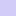 `#FFD2CCF8` | `0000000D` |
| `AccentFillDefault` | Default accent background for interactive elements, calls to action, and selected states |  `#FF5649B0` | 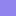 `#FF9184EE` | `0000000D` |
| `AccentFillDisabled` | Disabled accent background |  `#37000000` |  `#28FFFFFF` | `00000010` |
| `AccentFillSecondary` | Accent background indicating hover state |  `#E55649B0` |  `#E59184EE` | `0000000D` |
| `AccentFillSelectedTextBackground` | Background for selected text in active text fields |  `#FF0078D4` |  `#FF005FB7` | `0000000D` |
| `AccentFillSelectedTextBackgroundSubtle` | Subtle selected text background, used when foreground text color can't be inverted |  `#4D0078D4` |  `#6660CDFF` | `0000000D` |
| `AccentFillSenary` | Subtle accent background for states beyond Tertiary |  `#1F5649B0` |  `#1F9184EE` | `0000000E` |
| `AccentFillTertiary` | Accent background indicating pressed state |  `#CC5649B0` |  `#CC9184EE` | `0000000D` |
| `AccentTextFillDisabled` | Disabled accent text and glyph color |  `#5C000000` |  `#5DFFFFFF` | `00000011` |
| `AccentTextFillPrimary` | Primary accent text color for foreground text and glyphs requiring emphasis |  `#FF3F3682` |  `#FFD2CCF8` | `00000002` |
| `AccentTextFillSecondary` | Accent text indicating hover state |  `#FF221D46` |  `#FFD2CCF8` | `00000002` |
| `AccentTextFillTertiary` | Accent text indicating pressed state |  `#FF5649B0` | 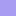 `#FFA79CF1` | `00000002` |

### Card

Tokens for card-like surfaces — content blocks that sit on page or layer backgrounds.

| Token | Description | Light | Dark | High Contrast |
|:------|:------------|:------|:-----|:--------------|
| `CardBackgroundFillDefault` | Default card background |  `#B2FFFFFF` |  `#0DFFFFFF` | `00000005` |
| `CardBackgroundFillSecondary` | Card background indicating hover state |  `#80F6F6F6` |  `#08FFFFFF` | `00000005` |
| `CardBackgroundFillTertiary` | Card background indicating pressed state |  `#FFFFFFFF` |  `#12FFFFFF` | `00000005` |
| `CardStrokeDefault` | Default card border |  `#0F000000` |  `#1A000000` | `00000010` |
| `CardStrokeDefaultSolid` | Solid card border, used when semi-transparent strokes cause visibility problems |  `#FFEBEBEB` |  `#FF1C1C1C` | `00000010` |
| `CardStrokeDefaultSolidAlt` | Alternative solid card border |  `#FFDADADA` |  `#FF0A0A0A` | `00000010` |

### Control

Tokens for standard interactive controls like buttons, text boxes, and combo boxes.

| Token | Description | Light | Dark | High Contrast |
|:------|:------------|:------|:-----|:--------------|
| `ControlAltFillDisabled` | Disabled alternative control background |  `#00FFFFFF` |  `#00FFFFFF` | `0000000F` |
| `ControlAltFillQuaternary` | Fourth-level alternative control background |  `#18000000` |  `#12FFFFFF` | `0000000E` |
| `ControlAltFillSecondary` | Second-level alternative control background |  `#06000000` |  `#1A000000` | `0000000E` |
| `ControlAltFillTertiary` | Third-level alternative control background |  `#0F000000` |  `#0BFFFFFF` | `0000000E` |
| `ControlAltFillTransparent` | Transparent alternative control background |  `#00FFFFFF` |  `#00FFFFFF` | `0000000E` |
| `ControlFillActiveInput` | Control background during active text input |  `#FFFFFFFF` |  `#B21E1E1E` | `0000000F` |
| `ControlFillDefault` | Default control background (rest state) |  `#B2FFFFFF` |  `#0FFFFFFF` | `0000000F` |
| `ControlFillDisabled` | Disabled control background | 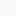 `#4DF9F9F9` |  `#0BFFFFFF` | `0000000F` |
| `ControlFillQuaternary` | Fourth-level control background |  `#C2F3F3F3` |  `#0FFFFFFF` | `0000000E` |
| `ControlFillSecondary` | Second-level control background (hover) |  `#80F9F9F9` |  `#15FFFFFF` | `0000000E` |
| `ControlFillTertiary` | Third-level control background (pressed) |  `#4DF9F9F9` |  `#08FFFFFF` | `0000000E` |
| `ControlFillTransparent` | Transparent control background |  `#00FFFFFF` |  `#00FFFFFF` | `0000000F` |
| `ControlOnImageFillDefault` | Default control background when placed on an image |  `#C9FFFFFF` |  `#B21C1C1C` | `0000000F` |
| `ControlOnImageFillDisabled` | Disabled control background when placed on an image |  `#00FFFFFF` |  `#001E1E1E` | `0000000F` |
| `ControlOnImageFillSecondary` | Hover control background when placed on an image |  `#FFF3F3F3` |  `#FF1A1A1A` | `0000000E` |
| `ControlOnImageFillTertiary` | Pressed control background when placed on an image |  `#FFEBEBEB` |  `#FF131313` | `0000000E` |
| `ControlSolidFillDefault` | Solid control background, used when transparency causes visibility problems |  `#FFFFFFFF` |  `#FF454545` | `0000000F` |
| `ControlStrokeDefault` | Default control border (rest state) |  `#0F000000` |  `#12FFFFFF` | `00000010` |
| `ControlStrokeForStrongFillWhenOnImage` | Control border for strong fills placed on images |  `#59FFFFFF` |  `#6B000000` | `0000000A` |
| `ControlStrokeOnAccentDefault` | Default border for controls on accent backgrounds |  `#14FFFFFF` |  `#14FFFFFF` | `0000000B` |
| `ControlStrokeOnAccentDisabled` | Disabled border for controls on accent backgrounds |  `#0F000000` |  `#33000000` | `0000000B` |
| `ControlStrokeOnAccentSecondary` | Hover border for controls on accent backgrounds |  `#66000000` |  `#24000000` | `0000000B` |
| `ControlStrokeOnAccentTertiary` | Pressed border for controls on accent backgrounds |  `#37000000` |  `#37000000` | `0000000B` |
| `ControlStrokeSecondary` | Second-level control border |  `#0F000000` |  `#12FFFFFF` | `00000008` |
| `ControlStrokeTransparent` | Transparent control border |  `#00FFFFFF` |  `#00FFFFFF` | `0000000F` |
| `ControlStrongFillDefault` | Strong control fill for high-contrast elements like scroll bars |  `#72000000` |  `#8BFFFFFF` | `0000000A` |
| `ControlStrongFillDisabled` | Disabled strong control fill |  `#51000000` |  `#3FFFFFFF` | `0000000F` |
| `ControlStrongStrokeDefault` | Strong control border for checkboxes and radio buttons |  `#9C000000` |  `#9AFFFFFF` | `00000008` |
| `ControlStrongStrokeDisabled` | Disabled strong control border |  `#37000000` |  `#28FFFFFF` | `0000000B` |

### Divider

| Token | Description | Light | Dark | High Contrast |
|:------|:------------|:------|:-----|:--------------|
| `DividerStrokeDefault` | Default divider and separator stroke |  `#14000000` |  `#15FFFFFF` | `00000011` |

### Focus

| Token | Description | Light | Dark | High Contrast |
|:------|:------------|:------|:-----|:--------------|
| `FocusStrokeInner` | Inner focus indicator stroke |  `#FFFFFFFF` |  `#B2000000` | `00000005` |
| `FocusStrokeOuter` | Outer focus indicator stroke |  `#E4000000` |  `#FFFFFFFF` | `00000008` |

### Hyperlink

| Token | Description | Light | Dark | High Contrast |
|:------|:------------|:------|:-----|:--------------|
| `HyperlinkFillDisabled` | Disabled hyperlink text color |  `#5C000000` |  `#5DFFFFFF` | `00000013` |
| `HyperlinkFillPrimary` | Primary hyperlink text color (rest) |  `#FF003E92` |  `#FF99EBFF` | `0000001A` |
| `HyperlinkFillSecondary` | Hyperlink text color (hover) |  `#FF001A68` |  `#FF60CDFF` | `0000001A` |
| `HyperlinkFillTertiary` | Hyperlink text color (pressed) |  `#FF005FB8` |  `#E560CDFF` | `0000001A` |

### Layer and surface

Tokens for backgrounds, layered surfaces, and page-level containers.

| Token | Description | Light | Dark | High Contrast |
|:------|:------------|:------|:-----|:--------------|
| `LayerFillAlt` | Alternative layer fill for surfaces |  `#FFFFFFFF` |  `#0EFFFFFF` | `00000005` |
| `LayerFillDefault` | Default layer fill for surfaces and scroll bars |  `#80FFFFFF` |  `#4D3A3A3A` | `00000005` |
| `SolidBackgroundFillBase` | Base solid background for page surfaces |  `#FFF3F3F3` |  `#FF202020` | `00000005` |
| `SolidBackgroundFillBaseAlt` | Alternative base solid background |  `#FFDADADA` |  `#FF0A0A0A` | `00000005` |
| `SolidBackgroundFillSecondary` | Secondary solid background (one level above Base) |  `#FFEEEEEE` |  `#FF1C1C1C` | `00000005` |
| `SolidBackgroundFillTertiary` | Tertiary solid background |  `#FFF9F9F9` |  `#FF282828` | `00000005` |
| `SolidBackgroundFillQuaternary` | Fourth-level solid background |  `#FFFFFFFF` |  `#FF2C2C2C` | `00000005` |
| `SolidBackgroundFillQuinary` | Fifth-level solid background |  `#FFFDFDFD` |  `#FF333333` | `00000005` |
| `SolidBackgroundFillSenary` | Sixth-level solid background |  `#FFFFFFFF` |  `#FF373737` | `00000005` |
| `SurfaceBackgroundFillDefault` | Default background for discrete surfaces above base |  `#FFF9F9F9` |  `#FF2C2C2C` | `00000005` |
| `SurfaceStrokeDefault` | Default surface border |  `#66757575` |  `#66757575` | `0000000A` |
| `SurfaceStrokeFlyout` | Flyout surface border |  `#0F000000` |  `#33000000` | `0000000A` |

### Shadow and smoke

| Token | Description | Light | Dark | High Contrast |
|:------|:------------|:------|:-----|:--------------|
| `ShadowFlyout` | Shadow color for flyout surfaces like popups, tooltips, and context menus |  `#24000000` |  `#42000000` | `00000005` |
| `SmokeFillDefault` | Smoke overlay color for dimming background surfaces |  `#4D000000` |  `#4D000000` | `0000000F` |
| `SmokeFillInverse` | Inverse smoke overlay color |  `#C9FFFFFF` |  `#B21C1C1C` | `0000000F` |

### Subtle

Tokens for controls with minimal visual weight, like toolbar buttons and menu items.

| Token | Description | Light | Dark | High Contrast |
|:------|:------------|:------|:-----|:--------------|
| `SubtleFillDisabled` | Disabled subtle control fill |  `#00000000` |  `#00FFFFFF` | `00000005` |
| `SubtleFillSecondary` | Subtle control fill (hover) |  `#0F000000` |  `#0FFFFFFF` | `0000000F` |
| `SubtleFillTertiary` | Subtle control fill (pressed) |  `#0A000000` |  `#0BFFFFFF` | `0000000F` |
| `SubtleFillTransparent` | Transparent subtle control fill |  `#00FFFFFF` |  `#00FFFFFF` | `00000005` |

### System status

Tokens for status indicators — attention, caution, critical, success, and neutral.

| Token | Description | Light | Dark | High Contrast |
|:------|:------------|:------|:-----|:--------------|
| `SystemFillAttention` | Attention indicator border and stroke (informational) |  `#FF005FB7` |  `#FF60CDFF` | `00000002` |
| `SystemFillAttentionBackground` | Attention indicator background |  `#80F6F6F6` |  `#08FFFFFF` | `00000018` |
| `SystemFillCaution` | Warning indicator border and stroke | 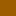 `#FF9D5D00` | 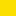 `#FFFCE100` | `00000002` |
| `SystemFillCautionBackground` | Warning indicator background | 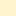 `#FFFFF4CE` | 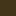 `#FF433519` | `00000018` |
| `SystemFillCritical` | Error indicator border and stroke |  `#FFC42B1C` | 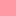 `#FFFF99A4` | `00000002` |
| `SystemFillCriticalBackground` | Error indicator background | 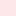 `#FFFDE7E9` | 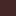 `#FF442726` | `00000018` |
| `SystemFillNeutral` | Neutral system fill |  `#72000000` |  `#8BFFFFFF` | `00000002` |
| `SystemFillNeutralBackground` | Neutral system background |  `#06000000` |  `#08FFFFFF` | `00000018` |
| `SystemFillSolidAttentionBackground` | Solid attention background, used when transparency causes visibility problems |  `#FFF7F7F7` |  `#FF2E2E2E` | `00000018` |
| `SystemFillSolidNeutral` | Solid neutral indicator fill |  `#FF8A8A8A` |  `#FF8A8A8A` | `00000002` |
| `SystemFillSolidNeutralBackground` | Solid neutral background |  `#FFF3F3F3` |  `#FF2E2E2E` | `00000018` |
| `SystemFillSuccess` | Success indicator border and stroke |  `#FF0F7B0F` | 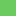 `#FF6CCB5F` | `00000002` |
| `SystemFillSuccessBackground` | Success indicator background | 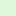 `#FFDFF6DD` |  `#FF393D1B` | `00000018` |

### Text

| Token | Description | Light | Dark | High Contrast |
|:------|:------------|:------|:-----|:--------------|
| `TextFillDisabled` | Disabled text color |  `#5C000000` |  `#5DFFFFFF` | `00000011` |
| `TextFillPrimary` | Primary text color for general content |  `#E4000000` |  `#FFFFFFFF` | `00000008` |
| `TextFillSecondary` | Secondary text color for supplementary content and hints |  `#9E000000` |  `#C8FFFFFF` | `00000008` |
| `TextFillTertiary` | Tertiary text color (low contrast — don't use for primary content at rest) |  `#72000000` |  `#8BFFFFFF` | `00000008` |
| `TextOnAccentFillDisabled` | Disabled text on accent backgrounds |  `#B2FFFFFF` |  `#80000000` | `00000003` |
| `TextOnAccentFillPrimary` | Primary text on accent backgrounds |  `#FFFFFFFF` |  `#FF000000` | `0000000E` |
| `TextOnAccentFillSecondary` | Secondary text on accent backgrounds |  `#B2FFFFFF` |  `#80000000` | `0000000E` |
| `TextOnAccentFillSelectedText` | Text color for selected text on accent backgrounds |  `#FFFFFFFF` |  `#FFFFFFFF` | `0000000E` |

## Shell internal colors

These tokens control IDE chrome surfaces — the main window frame, tool window headers, tabs, status bar, and other shell-level elements. They're the primary tokens theme authors use to change the overall feel of the IDE.

### Environment

Tokens that control the main window and shell chrome surfaces.

| Token | Description | Light | Dark | High Contrast |
|:------|:------------|:------|:-----|:--------------|
| `EnvironmentBackground` | Main window background and floating tool windows |  `#FFEEEEEE` |  `#FF1C1C1C` | `00000005` |
| `EnvironmentBadge` | Solution Info Badge background (for example, Live Share indicator) |  `#B2FFFFFF` |  `#0FFFFFFF` | `0000000F` |
| `EnvironmentBody` | Body/content area background of the main shell window |  `#FFEEEEEE` |  `#FF1C1C1C` | `00000005` |
| `EnvironmentBodyText` | Text color in the body/content area of the main shell window |  `#E4000000` |  `#FFFFFFFF` | `00000008` |
| `EnvironmentBorder` | Active main window border |  `#FF5649B0` |  `#FF9184EE` | `0000000A` |
| `EnvironmentBorderInactive` | Inactive main window border and internal dividers |  `#FFADADAD` |  `#FF454545` | `00000003` |
| `EnvironmentHeader` | Background for active header areas |  `#FFF9F9F9` |  `#FF282828` | `00000005` |
| `EnvironmentHeaderInactive` | Background for inactive header areas |  `#FFF9F9F9` |  `#FF282828` | `00000005` |
| `EnvironmentIndicator` | Border or indicator for auto-hidden tabs |  `#66757575` |  `#66757575` | `0000000A` |
| `EnvironmentLayeredBackground` | Background for layered elements like InfoBars and tab groups |  `#80FFFFFF` |  `#4D3A3A3A` | `00000005` |
| `EnvironmentLayeredBorder` | Border for layered elements like InfoBars and badges |  `#0F000000` |  `#80000000` | `00000010` |
| `EnvironmentLogo` | Visual Studio logo fill in the system menu |  `#FF5649B0` |  `#FF9184EE` | `0000000D` |
| `EnvironmentTab` | Tab element background |  `#FFF9F9F9` |  `#FF282828` | `00000005` |
| `EnvironmentTabInactive` | Inactive tab element background |  `#FFF9F9F9` |  `#FF282828` | `00000005` |

### Caption

Tokens for the window close button specifically.

| Token | Description | Light | Dark | High Contrast |
|:------|:------------|:------|:-----|:--------------|
| `CaptionControlCloseFillPrimary` | Close button background (hover) |  `#FFC42B1C` |  `#FFC42B1C` | `0000000D` |
| `CaptionControlCloseFillSecondary` | Close button background (pressed) |  `#E6C42B1C` |  `#E6C42B1C` | `0000000D` |
| `CaptionControlCloseTextFillPrimary` | Close button icon color (hover) |  `#FFFFFFFF` |  `#FFFFFFFF` | `00000009` |
| `CaptionControlCloseTextFillSecondary` | Close button icon color (pressed) |  `#B3FFFFFF` |  `#B3FFFFFF` | `00000009` |

### Status bar

Tokens for the status bar across its different modes.

| Token | Description | Light | Dark | High Contrast |
|:------|:------------|:------|:-----|:--------------|
| `StatusBarBackgroundFillBuilding` | Status bar background when building |  `#FF5649B0` |  `#FF3F3682` | `00000005` |
| `StatusBarBackgroundFillDebugging` | Status bar background when debugging |  `#FFBC4B09` |  `#FF7A2101` | `00000005` |
| `StatusBarBackgroundFillRest` | Status bar background in default state |  `#8B000000` |  `#4D000000` | `00000005` |
| `StatusBarBackgroundFillSolutionLoading` | Status bar background when loading a solution |  `#FF005BA1` |  `#FF003B6A` | `00000005` |
| `StatusBarControlFillSecondary` | Secondary control fill on the status bar |  `#33000000` |  `#20FFFFFF` | `0000000E` |
| `StatusBarTextFillBuilding` | Status bar text when building |  `#FFFFFFFF` |  `#FFFFFFFF` | `00000008` |
| `StatusBarTextFillDebugging` | Status bar text when debugging |  `#FFFFFFFF` |  `#FFFFFFFF` | `00000008` |
| `StatusBarTextFillDisabled` | Disabled status bar text |  `#90FFFFFF` |  `#5DFFFFFF` | `00000011` |
| `StatusBarTextFillRest` | Status bar text in default state |  `#FFFFFFFF` |  `#FFFFFFFF` | `00000008` |
| `StatusBarTextFillSolutionLoading` | Status bar text when loading a solution |  `#FFFFFFFF` |  `#FFFFFFFF` | `00000008` |

## High Contrast system color reference

High Contrast values are system color indices. Visual Studio maps these to the user's active High Contrast color scheme. Common indices:

| Index | System color |
|:------|:-------------|
| `00000001` | `ActiveCaption` |
| `00000002` | `ActiveCaptionText` |
| `00000003` | `ActiveBorder` |
| `00000005` | `Window` |
| `00000008` | `WindowText` |
| `00000009` | `HotTrackColor` |
| `0000000A` | `InactiveBorder` |
| `0000000B` | `InactiveCaption` |
| `0000000D` | `Highlight` |
| `0000000E` | `HighlightText` |
| `0000000F` | `ButtonFace` |
| `00000010` | `ButtonShadow` |
| `00000011` | `GrayText` |
| `00000013` | `InactiveCaptionText` |
| `00000018` | `GradientActiveCaption` |
| `0000001A` | `HotLight` |

## See also

- [Color theming tools](../internals/color-theming-tools.md)
- [Modernize theme colors](../migration/modernize-theme-colors.md)
- [Matching Visual Studio themes in Visual Studio extensions](../vsix/recipes/use-themes.md)
- [Change fonts, colors, and themes in Visual Studio](../../ide/how-to-change-fonts-and-colors-in-visual-studio.md)

