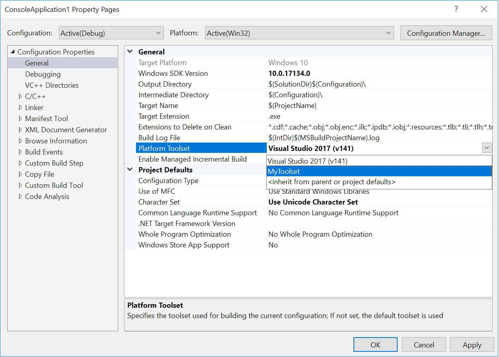
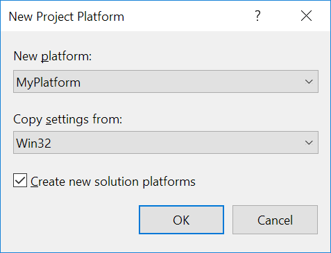

# Visual Studio C++ Project system extensibility and toolset integration

The Visual C++ project system is used for .vcxproj files. It's based on the [Visual Studio Common Project System (CPS)](https://github.com/Microsoft/VSProjectSystem/blob/master/doc/Index.md) and provides additional, C++ specific extensibility points for easy integration of new toolsets, build architectures, and target platforms.

## C++ MSBuild targets structure

All .vcxproj files import these files:

```xml
<Import Project="$(VCTargetsPath)\Microsoft.Cpp.Default.props" />
<Import Project="$(VCTargetsPath)\Microsoft.Cpp.props" />
<Import Project="$(VCTargetsPath)\Microsoft.Cpp.targets" />
```

These files define little by themselves. Instead, they import other files based on these property values:

- `$(ApplicationType)`

   Examples: Windows Store, Android, Linux

- `$(ApplicationTypeRevision)`

   This must be a valid version string, of the form major.minor[.build[.revision]].

   Examples: 1.0, 10.0.0.0

- `$(Platform)`

   The build architecture, named "Platform" for historical reasons.

   Examples: Win32, x86, x64, ARM

- `$(PlatformToolset)`

   Examples: v140, v141, v141_xp, llvm

These property values specify folder names under the `$(VCTargetsPath)` root folder:

> `$(VCTargetsPath)`\\ \
&nbsp;&nbsp;&nbsp;&nbsp;*Application Type*\\ \
&nbsp;&nbsp;&nbsp;&nbsp;&nbsp;&nbsp;&nbsp;&nbsp;`$(ApplicationType)`\\ \
&nbsp;&nbsp;&nbsp;&nbsp;&nbsp;&nbsp;&nbsp;&nbsp;&nbsp;&nbsp;&nbsp;&nbsp;`$(ApplicationTypeRevision)`\\ \
&nbsp;&nbsp;&nbsp;&nbsp;&nbsp;&nbsp;&nbsp;&nbsp;&nbsp;&nbsp;&nbsp;&nbsp;&nbsp;&nbsp;&nbsp;&nbsp;*Platforms*\\ \
&nbsp;&nbsp;&nbsp;&nbsp;&nbsp;&nbsp;&nbsp;&nbsp;&nbsp;&nbsp;&nbsp;&nbsp;&nbsp;&nbsp;&nbsp;&nbsp;&nbsp;&nbsp;&nbsp;&nbsp;`$(Platform)`\\ \
&nbsp;&nbsp;&nbsp;&nbsp;&nbsp;&nbsp;&nbsp;&nbsp;&nbsp;&nbsp;&nbsp;&nbsp;&nbsp;&nbsp;&nbsp;&nbsp;&nbsp;&nbsp;&nbsp;&nbsp;&nbsp;&nbsp;&nbsp;&nbsp;*PlatformToolsets*\\ \
&nbsp;&nbsp;&nbsp;&nbsp;&nbsp;&nbsp;&nbsp;&nbsp;&nbsp;&nbsp;&nbsp;&nbsp;&nbsp;&nbsp;&nbsp;&nbsp;&nbsp;&nbsp;&nbsp;&nbsp;&nbsp;&nbsp;&nbsp;&nbsp;&nbsp;&nbsp;&nbsp;&nbsp;`$(PlatformToolset)` \
&nbsp;&nbsp;&nbsp;&nbsp;*Platforms*\\ \
&nbsp;&nbsp;&nbsp;&nbsp;&nbsp;&nbsp;&nbsp;&nbsp;`$(Platform)`\\ \
&nbsp;&nbsp;&nbsp;&nbsp;&nbsp;&nbsp;&nbsp;&nbsp;&nbsp;&nbsp;&nbsp;&nbsp;*PlatformToolsets*\\ \
&nbsp;&nbsp;&nbsp;&nbsp;&nbsp;&nbsp;&nbsp;&nbsp;&nbsp;&nbsp;&nbsp;&nbsp;&nbsp;&nbsp;&nbsp;&nbsp;`$(PlatformToolset)`

The `$(VCTargetsPath)`\\*Platforms*\\ folder is used when `$(ApplicationType)` is empty, for Windows Desktop projects.

### Add a new platform toolset

To add a new toolset, for example, "MyToolset" for the existing Win32 platform, create a *MyToolset* folder under `$(VCTargetsPath)`*\\Platforms\\Win32\\PlatformToolsets\\*, and create *Toolset.props* and *Toolset.targets* files in it.

Each folder name under *PlatformToolsets* appears in the **Project Properties** dialog as an available **Platform Toolset** for the specified platform, as shown here:



Create similar *MyToolset* folders and *Toolset.props* and *Toolset.targets* files in each existing platform folder this toolset supports.

### Add a new platform

To add a new platform, for example, "MyPlatform", create a *MyPlatform* folder under `$(VCTargetsPath)`*\\Platforms\\*, and create *Platform.default.props*, *Platform.props*, and *Platform.targets* files in it. Also create a `$(VCTargetsPath)`*\\Platforms\\*<strong><em>MyPlatform</em></strong>*\\PlatformToolsets\\* folder, and create at least one toolset in it.

All folder names under the *Platforms* folder for each `$(ApplicationType)` and `$(ApplicationTypeRevision)` appear in the IDE as available **Platform** choices for a project.



### Add a new Application Type

To add a new application type, create a *MyApplicationType* folder under `$(VCTargetsPath)`*\\Application Type\\* and create a *Defaults.props* file in it. At least one revision is required for an application type, so also create a `$(VCTargetsPath)`*\\Application Type\\MyApplicationType\\1.0* folder, and create a *Defaults.props* file in it. You should also create a `$(VCTargetsPath)`*\\ApplicationType\\MyApplicationType\\1.0\\Platforms* folder and create at least one platform in it.

`$(ApplicationType)` and `$(ApplicationTypeRevision)` properties aren't visible in the user interface. They are defined in the project templates and cannot be changed after the project is created.

## The .vcxproj import tree

A simplified tree of imports for Microsoft C++ props and targets files looks like:

> `$(VCTargetsPath)`\\*Microsoft.Cpp.Default.props* \
&nbsp;&nbsp;&nbsp;&nbsp;`$(MSBuildExtensionsPath)`\\`$(MSBuildToolsVersion)`\\*Microsoft.Common.props* \
&nbsp;&nbsp;&nbsp;&nbsp;`$(VCTargetsPath)`\\*ImportBefore*\\*Default*\\\*.*props* \
&nbsp;&nbsp;&nbsp;&nbsp;`$(VCTargetsPath)`\\*Application Type*\\`$(ApplicationType)`\\*Default.props* \
&nbsp;&nbsp;&nbsp;&nbsp;`$(VCTargetsPath)`\\*Application Type*\\`$(ApplicationType)`\\`$(ApplicationTypeRevision)`\\*Default.props* \
&nbsp;&nbsp;&nbsp;&nbsp;`$(VCTargetsPath)`\\*Application Type*\\`$(ApplicationType)`\\`$(ApplicationTypeRevision)`\\*Platforms*\\`$(Platform)`\\*Platform.default.props* \
&nbsp;&nbsp;&nbsp;&nbsp;`$(VCTargetsPath)`\\*ImportAfter*\\*Default*\\\*.*props*

Windows Desktop projects don't define `$(ApplicationType)`, so they only import

> `$(VCTargetsPath)`\\*Microsoft.Cpp.Default.props* \
&nbsp;&nbsp;&nbsp;&nbsp;`$(MSBuildExtensionsPath)`\\`$(MSBuildToolsVersion)`\\*Microsoft.Common.props* \
&nbsp;&nbsp;&nbsp;&nbsp;`$(VCTargetsPath)`\\*ImportBefore*\\*Default*\\\*.*props* \
&nbsp;&nbsp;&nbsp;&nbsp;`$(VCTargetsPath)`\\*Platforms*\\`$(Platform)`\\*Platform.default.props* \
&nbsp;&nbsp;&nbsp;&nbsp;`$(VCTargetsPath)`\\*ImportAfter*\\*Default*\\\*.*props*

We'll use the `$(_PlatformFolder)` property to hold the `$(Platform)` platform folder locations. This property is

> `$(VCTargetsPath)`\\*Platforms*\\`$(Platform)`

for Windows Desktop apps, and

> `$(VCTargetsPath)`\\*Application Type*\\`$(ApplicationType)`\\`$(ApplicationTypeRevision)`\\*Platforms*\\`$(Platform)`

for everything else.

The props files are imported in this order:

> `$(VCTargetsPath)`\\*Microsoft.Cpp.props* \
&nbsp;&nbsp;&nbsp;&nbsp;`$(_PlatformFolder)`\\*Platform.props* \
&nbsp;&nbsp;&nbsp;&nbsp;&nbsp;&nbsp;&nbsp;&nbsp;`$(VCTargetsPath)`\\*Microsoft.Cpp.Platform.props* \
&nbsp;&nbsp;&nbsp;&nbsp;&nbsp;&nbsp;&nbsp;&nbsp;&nbsp;&nbsp;&nbsp;&nbsp;`$(_PlatformFolder)`\\*ImportBefore*\\\*.*props* \
&nbsp;&nbsp;&nbsp;&nbsp;&nbsp;&nbsp;&nbsp;&nbsp;&nbsp;&nbsp;&nbsp;&nbsp;`$(_PlatformFolder)`\\*PlatformToolsets*\\`$(PlatformToolset)`\\*Toolset.props* \
&nbsp;&nbsp;&nbsp;&nbsp;&nbsp;&nbsp;&nbsp;&nbsp;&nbsp;&nbsp;&nbsp;&nbsp;`$(_PlatformFolder)`\\*ImportAfter*\\\*.*props*

The targets files are imported in this order:

> `$(VCTargetsPath)`\\*Microsoft.Cpp.targets* \
&nbsp;&nbsp;&nbsp;&nbsp;`$(VCTargetsPath)`\\*Microsoft.Cpp.Current.targets* \
&nbsp;&nbsp;&nbsp;&nbsp;&nbsp;&nbsp;&nbsp;&nbsp;`$(_PlatformFolder)`\\*Platform.targets* \
&nbsp;&nbsp;&nbsp;&nbsp;&nbsp;&nbsp;&nbsp;&nbsp;&nbsp;&nbsp;&nbsp;&nbsp;`$(VCTargetsPath)`\\*Microsoft.Cpp.Platform.targets* \
&nbsp;&nbsp;&nbsp;&nbsp;&nbsp;&nbsp;&nbsp;&nbsp;&nbsp;&nbsp;&nbsp;&nbsp;&nbsp;&nbsp;&nbsp;&nbsp;`$(_PlatformFolder)`\\*ImportBefore*\\\*.*targets* \
&nbsp;&nbsp;&nbsp;&nbsp;&nbsp;&nbsp;&nbsp;&nbsp;&nbsp;&nbsp;&nbsp;&nbsp;&nbsp;&nbsp;&nbsp;&nbsp;`$(_PlatformFolder)`\\*PlatformToolsets*\\`$(PlatformToolset)`\\*Toolset.target* \
&nbsp;&nbsp;&nbsp;&nbsp;&nbsp;&nbsp;&nbsp;&nbsp;&nbsp;&nbsp;&nbsp;&nbsp;&nbsp;&nbsp;&nbsp;&nbsp;`$(_PlatformFolder)`\\*ImportAfter*\\\*.*targets*

If you need to define some default properties for your toolset, you can add files to the appropriate ImportBefore and ImportAfter folders.

## Author Toolset.props and Toolset.targets files

*Toolset.props* and *Toolset.targets* files have full control over what happens during a build when this toolset is used. They can also control the available debuggers, some of the IDE user interface, such as the content in the **Property Pages** dialog, and some other aspects of project behavior.

Although a toolset can override the entire build process, usually you just want your toolset to modify or add some build steps, or to use different build tools, as part of an existing build process. To accomplish this goal, there are a number of common props and targets files your toolset can import. Depending on what you want your toolset to do, these files may be useful to use as imports or as examples:

- `$(VCTargetsPath)`\\*Microsoft.CppCommon.targets*

  This file defines the main parts of the native build process, and also imports:

  - `$(VCTargetsPath)`\\*Microsoft.CppBuild.targets*

  - `$(VCTargetsPath)`\\*Microsoft.BuildSteps.targets*

  - `$(MSBuildToolsPath)`\\*Microsoft.Common.Targets*

- `$(VCTargetsPath)`\\*Microsoft.Cpp.Common.props*

   Sets defaults for toolsets that use the Microsoft compilers and target Windows.

- `$(VCTargetsPath)`\\*Microsoft.Cpp.WindowsSDK.props*

   This file determines the Windows SDK location, and defines some important properties for apps targeting Windows.

### Integrate toolset-specific targets with the default C++ build process

The default C++ build process is defined in *Microsoft.CppCommon.targets*. The targets there don’t call any specific build tools; they specify the main build steps, their order and dependencies.

The C++ build has three main steps, which are represented by the following targets:

- `BuildGenerateSources`

- `BuildCompile`

- `BuildLink`

Because each build step may be executed independently, targets running in one step can't rely on the item groups and properties defined in the targets that run as a part of a different step. This division allows certain build performance optimizations. Although it's not used by default, you're still encouraged to honor this separation.

The targets that are run inside each step are controlled by these properties:

- `$(BuildGenerateSourcesTargets)`

- `$(BuildCompileTargets)`

- `$(BeforeBuildLinkTargets)`

Each step also has Before and After properties.

```xml
<Target
  Name="_BuildGenerateSourcesAction"
  DependsOnTargets="$(CommonBuildOnlyTargets);$(BeforeBuildGenerateSourcesTargets);$(BuildGenerateSourcesTargets);$(AfterBuildGenerateSourcesTargets)" />

<Target
  Name="\_BuildCompileAction"
  DependsOnTargets="$(CommonBuildOnlyTargets);$(BeforeBuildCompileTargets);$(BuildCompileTargets);$(AfterBuildCompileTargets)" />

<Target
  Name="\_BuildLinkAction"
  DependsOnTargets="$(CommonBuildOnlyTargets);$(BeforeBuildLinkTargets);$(BuildLinkTargets);$(AfterBuildLinkTargets)" />
```

See the *Microsoft.CppBuild.targets* file for examples of the targets that are included in each step:

```xml
<BuildCompileTargets Condition="'$(ConfigurationType)'\!='Utility'">
  $(BuildCompileTargets);
  _ClCompile;
  _ResGen;
  _ResourceCompile;
  $(BuildLibTargets);
</BuildCompileTargets>
```

If you look at the targets, such as `_ClCompile`, you'll see they don't do anything directly by themselves, but instead depend on other targets, including `ClCompile`:

```xml
<Target Name="_ClCompile"
  DependsOnTargets="$(BeforeClCompileTargets);$(ComputeCompileInputsTargets);MakeDirsForCl;ClCompile;$(AfterClCompileTargets)" >
</Target>
```

`ClCompile` and other build tool-specific targets are defined as empty targets in *Microsoft.CppBuild.targets*:

```xml
<Target Name="ClCompile"/>
```

Because the `ClCompile` target is empty, unless it is overridden by a toolset, no real build action is performed. The toolset targets can override the `ClCompile` target, that is, they can contain another `ClCompile` definition after importing *Microsoft.CppBuild.targets*:

```xml
<Target Name="ClCompile"
  Condition="'@(ClCompile)' != ''"
  DependsOnTargets="SelectClCompile">
  <!-- call some MSBuild tasks -->
</Target>
```

Despite its name, which was created before Visual Studio implemented cross-platform support, the `ClCompile` target doesn't have to call CL.exe. It can also call Clang, gcc, or other compilers by using appropriate MSBuild tasks.

The `ClCompile` target should not have any dependencies except the `SelectClCompile` target, which is required for the single file compile command to work in the IDE.

## MSBuild tasks to use in toolset targets

To invoke an actual build tool, the target needs to call an MSBuild task. There is a basic [Exec task](../msbuild/exec-task.md) that allows you to specify a command line to run. However, build tools usually have many options, inputs, and outputs to track for incremental builds, so it makes more sense to have special tasks for them. For instance, the `CL` task translates MSBuild properties into CL.exe switches, writes them into a response file, and calls CL.exe. It also tracks all input and output files for later incremental builds. For more information, see [Incremental builds and up-to-date checks](#incremental-builds-and-up-to-date-checks).

The Microsoft.Cpp.Common.Tasks.dll implements these tasks:

- `BSCMake`

- `CL`

- `ClangCompile` (clang-gcc switches)

- `LIB`

- `LINK`

- `MIDL`

- `Mt`

- `RC`

- `XDCMake`

- `CustomBuild` (like Exec but with input and output tracking)

- `SetEnv`

- `GetOutOfDateItems`

If you have a tool that performs the same action as an existing tool, and that has similar command-line switches (as clang-cl and CL do), you can use the same task for both of them.

If you need to create a new task for a build tool, you can choose from the following options:

1. If you use this task rarely, or if a few seconds don't matter for your build, you can use MSBuild 'inline' tasks:

   - Xaml task (a custom build rule)

     For one example of a Xaml task declaration, see `$(VCTargetsPath)`\\*BuildCustomizations*\\*masm.xml*, and for its usage, see `$(VCTargetsPath)`\\*BuildCustomizations*\\*masm.targets*.

   - [Code task](../msbuild/msbuild-inline-tasks.md)

1. If you want better task performance or just need more complex functionality, use the regular MSBuild [task writing](../msbuild/task-writing.md) process.

   If not all inputs and outputs of the tool are listed on the tool command line, as in the `CL`, `MIDL`, and `RC` cases, and if you want automatic input and output file tracking and .tlog file creation, derive your task from the `Microsoft.Build.CPPTasks.TrackedVCToolTask` class. At present, while there is documentation for the base [ToolTask](/dotnet/api/microsoft.build.utilities.tooltask) class, there are no examples or documentation for the details of the `TrackedVCToolTask` class. If this would be of particular interest, add your voice to a request on [Developer Community](https://aka.ms/feedback/suggest?space=62).

## Incremental builds and up-to-date checks

The default MSBuild incremental build targets use `Inputs` and `Outputs` attributes. If you specify them, MSBuild calls the target only if any of the inputs has a newer timestamp than all outputs. Because source files often include or import other files, and build tools produce different outputs depending on the tool options, it is hard to specify all possible inputs and outputs in MSBuild targets.

To manage this problem, the C++ build uses a different technique to support incremental builds. Most targets don't specify inputs and outputs, and as a result, always run during the build. The tasks called by targets write information about all inputs and outputs into *tlog* files that have a .tlog extension. The .tlog files are used by later builds to check what has changed and needs to be rebuilt, and what is up-to-date. The .tlog files are also the only source for the default build up-to-date check in the IDE.

To determine all the inputs and outputs, native tool tasks use tracker.exe and the [FileTracker](/dotnet/api/microsoft.build.utilities.filetracker) class provided by MSBuild.

Microsoft.Build.CPPTasks.Common.dll defines the `TrackedVCToolTask` public abstract base class. Most of the native tool tasks are derived from this class.

Starting in Visual Studio 2017 update 15.8, you can use the `GetOutOfDateItems` task implemented in Microsoft.Cpp.Common.Tasks.dll to produce .tlog files for custom targets with known inputs and outputs.
Alternatively, you can create them by using the `WriteLinesToFile` task. See the `_WriteMasmTlogs` target in `$(VCTargetsPath)`\\*BuildCustomizations*\\*masm.targets* as an example.

## .tlog files

There are three types of .tlog files: *read*, *write*, and *command-line*. Read and write .tlog files are used by incremental builds and by the up-to-date check in the IDE. Command-line .tlog files are only used in incremental builds.

MSBuild provides these helper classes to read and write .tlog files:

- [CanonicalTrackedInputFiles](/dotnet/api/microsoft.build.utilities.canonicaltrackedinputfiles)

- [CanonicalTrackedOutputFiles](/dotnet/api/microsoft.build.utilities.canonicaltrackedoutputfiles)

The [FlatTrackingData](/dotnet/api/microsoft.build.utilities.flattrackingdata) class can be used to access both read and write .tlog files and identify inputs that are newer than outputs, or if an output is missing. It's used in the up-to-date check.

Command-line .tlog files contain information about command lines used in the build. They are only used for incremental builds, not up-to-date checks, so the internal format is determined by the MSBuild task that produces them.

### Read .tlog format

*Read* .tlog files (\*.read.\*.tlog) contain information about source files and their dependencies.

A caret (**^**) at the beginning of a line indicates one or more sources. Sources that share the same dependencies are separated by a vertical bar (**\|**).

Dependency files are listed after the sources, each on its own line. All file names are full paths.

For example, assume your project sources are found in *F:\\test\\ConsoleApplication1\\ConsoleApplication1*. If your source file, *Class1.cpp*, has these includes,

```cpp
#include "stdafx.h" //precompiled header
#include "Class1.h"
```

then the *CL.read.1.tlog* file contains the source file followed by its two dependencies:

```tlog
^F:\TEST\CONSOLEAPPLICATION1\CONSOLEAPPLICATION1\CLASS1.CPP
F:\TEST\CONSOLEAPPLICATION1\CONSOLEAPPLICATION1\DEBUG\CONSOLEAPPLICATION1.PCH
F:\TEST\CONSOLEAPPLICATION1\CONSOLEAPPLICATION1\CLASS1.H
```

It isn't required to write file names in upper case, but it's a convenience for some tools.

### Write .tlog format

*Write* .tlog (\*.write.\*.tlog) files connect sources and outputs.

A caret (**^**) at the beginning of a line indicates one or more sources. Multiple sources are separated by a vertical bar (**\|**).

The output files built from the sources should be listed after the sources, each on its own line. All file names must be full paths.

For example, for a simple ConsoleApplication project that has an additional source file *Class1.cpp*, the *link.write.1.tlog* file may contain:

```tlog
^F:\TEST\CONSOLEAPPLICATION1\CONSOLEAPPLICATION1\DEBUG\CLASS1.OBJ|F:\TEST\CONSOLEAPPLICATION1\CONSOLEAPPLICATION1\DEBUG\CONSOLEAPPLICATION1.OBJ|F:\TEST\CONSOLEAPPLICATION1\CONSOLEAPPLICATION1\DEBUG\STDAFX.OBJ
F:\TEST\CONSOLEAPPLICATION1\DEBUG\CONSOLEAPPLICATION1.ILK
F:\TEST\CONSOLEAPPLICATION1\DEBUG\CONSOLEAPPLICATION1.EXE
F:\TEST\CONSOLEAPPLICATION1\DEBUG\CONSOLEAPPLICATION1.PDB
```

## Design-time build

In the IDE, .vcxproj projects use a set of MSBuild targets to get additional information from the project and to regenerate output files. Some of these targets are only used in design-time builds, but many of them are used in both regular builds and design-time builds.

For general information about design-time builds, see the CPS documentation for [Design-time builds](https://github.com/dotnet/project-system/blob/main/docs/design-time-builds.md). This documentation is only partly applicable to Visual C++ projects.

The `CompileDesignTime` and `Compile` targets mentioned in the design-time builds documentation never run for .vcxproj projects. Visual C++ .vcxproj projects use different design-time targets to get IntelliSense information.

### Design-time targets for IntelliSense information

The design-time targets used in .vcxproj projects are defined in `$(VCTargetsPath)`\\*Microsoft.Cpp.DesignTime.targets*.

The `GetClCommandLines` target collects compiler options for IntelliSense:

```xml
<Target
  Name="GetClCommandLines"
  Returns="@(ClCommandLines)"
  DependsOnTargets="$(DesignTimeBuildInitTargets);$(ComputeCompileInputsTargets)">
```

- `DesignTimeBuildInitTargets` – design-time only targets, required for design-time build initialization. Among other things, these targets disable some of the regular build functionality to improve performance.

- `ComputeCompileInputsTargets` – a set of targets that modifies compiler options and items. These targets run in both design-time and regular builds.

The target calls the `CLCommandLine` task to create the command line to use for IntelliSense. Again, despite its name, it can handle not only CL options, but Clang and gcc options as well. The type of the compiler switches is controlled by the `ClangMode` property.

Currently, the command line produced by the `CLCommandLine` task always uses CL switches (even in Clang mode) because they're easier for the IntelliSense engine to parse.

If you're adding a target that runs before compilation, whether regular or design-time, make sure it doesn't break design-time builds or affect performance. The simplest way to test your target is to open a Developer command prompt and run this command:

```
msbuild /p:SolutionDir=*solution-directory-with-trailing-backslash*;Configuration=Debug;Platform=Win32;BuildingInsideVisualStudio=true;DesignTimebuild=true /t:\_PerfIntellisenseInfo /v:d /fl /fileloggerparameters:PerformanceSummary \*.vcxproj
```

This command produces a detailed build log, *msbuild.log*, that has a performance summary for the targets and tasks at the end.

Make sure to use `Condition ="'$(DesignTimeBuild)' != 'true'"` in all operations that only make sense for regular builds and not for design-time builds.

### Design-time targets that generate sources

*This feature is disabled by default for Desktop native projects and is not currently supported on cached projects*.

If `GeneratorTarget` metadata is defined for a project item, the target is run automatically both when the project is loaded and when the source file is changed.

For instance, to automatically generate .cpp or .h files from .xaml files, the `$(VSInstallDir)`\\*MSBuild*\\*Microsoft*\\*WindowsXaml*\\*v16.0*\\\*\\*Microsoft.Windows.UI.Xaml.CPP.Targets* files define these entities:

```xml
<ItemDefinitionGroup>
  <Page>
    <GeneratorTarget>DesignTimeMarkupCompilation</GeneratorTarget>
  </Page>
  <ApplicationDefinition>
    <GeneratorTarget>DesignTimeMarkupCompilation</GeneratorTarget>
  </ApplicationDefinition>
</ItemDefinitionGroup>
<Target Name="DesignTimeMarkupCompilation">
  <!-- BuildingProject is used in Managed builds (always true in Native) -->
  <!-- DesignTimeBuild is used in Native builds (always false in Managed) -->
  <CallTarget Condition="'$(BuildingProject)' != 'true' Or $(DesignTimeBuild) == 'true'" Targets="DesignTimeMarkupCompilationCT" />
</Target>
```

To use `Task.HostObject` to get the unsaved content of source files, the targets and task should be registered as [MsbuildHostObjects](/dotnet/api/microsoft.visualstudio.shell.interop.ivsmsbuildhostobject?view=visualstudiosdk-2017&preserve-view=true) for the given projects in a pkgdef:

```reg
\[$RootKey$\\Projects\\{8BC9CEB8-8B4A-11D0-8D11-00A0C91BC942}\\MSBuildHostObjects\]
\[$RootKey$\\Projects\\{8BC9CEB8-8B4A-11D0-8D11-00A0C91BC942}\\MSBuildHostObjects\\DesignTimeMarkupCompilationCT;CompileXaml\]
@="{83046B3F-8984-444B-A5D2-8029DEE2DB70}"
```

## Visual C++ project extensibility in the Visual Studio IDE

The Visual C++ project system is based on the [VS Project System](https://github.com/Microsoft/VSProjectSystem/blob/master/doc/Index.md), and uses its extensibility points. However, the project hierarchy implementation is specific to Visual C++ and not based on CPS, so hierarchy extensibility is limited to project items.

### Project property pages

For general design information, see [Framework Multi-Targeting for VC++ Projects](https://devblogs.microsoft.com/visualstudio/framework-multi-targeting-for-vc-projects/).

In simple terms, the property pages you see in the **Project Properties** dialog for a C++ project are defined by *rule* files. A rule file specifies a set of properties to show on a property page, and how and where they should be saved in the project file. Rule files are .xml files that use Xaml format. The types used to serialize them are described in [Microsoft.Build.Framework.XamlTypes](/dotnet/api/microsoft.build.framework.xamltypes). For more information about the use of rule files in projects, see [Property Page XML rule files](/cpp/build/reference/property-page-xml-files).

The rule files must be added to the `PropertyPageSchema` item group:

```xml
<ItemGroup>
  <PropertyPageSchema Include="$(VCTargetsPath)$(LangID)\general.xml;"/>
  <PropertyPageSchema Include="$(VCTargetsPath)$(LangID)\general_file.xml">
    <Context>File</Context>
  </PropertyPageSchema>
</ItemGroup>
```

`Context` metadata limits rule visibility, which is also controlled by rule type, and can have one of these values:

`Project` | `File` | `PropertySheet`

CPS supports other values for context type, but they aren't used in Visual C++ projects.

If the rule should be visible in more than one context, use semi-colons (**;**) to separate the context values, as shown here:

```xml
<PropertyPageSchema Include="$(MyFolder)\MyRule.xml">
  <Context>Project;PropertySheet</Context>
</PropertyPageSchema>
```

#### Rule format and main types

The rule format is straightforward, so this section only describes the attributes that affect how the rule looks in the user interface.

```xml
<Rule
  Name="ConfigurationGeneral"
  DisplayName="General"
  PageTemplate="generic"
  Description="General"
  xmlns="http://schemas.microsoft.com/build/2009/properties">
```

The `PageTemplate` attribute defines how the rule is displayed in the **Property Pages** dialog. The attribute can have one of these values:

| Attribute | Description |
|------------| - |
| `generic` | All properties are shown on one page under Category headings<br/>The rule can be visible for `Project` and `PropertySheet` contexts, but not `File`.<br/><br/> Example: `$(VCTargetsPath)`\\*1033*\\*general.xml* |
| `tool` | Categories are shown as subpages.<br/>The rule can be visible in all contexts: `Project`, `PropertySheet` and `File`.<br/>The rule is visible in Project Properties only if the project has items with the `ItemType` defined in `Rule.DataSource`, unless the rule name is included in the `ProjectTools` item group.<br/><br/>Example: `$(VCTargetsPath)`\\*1033*\\*clang.xml* |
| `debugger` | The page is shown as a part of the Debugging page.<br/>Categories are currently ignored.<br/>The rule name should match the Debug Launcher MEF object's `ExportDebugger` attribute.<br/><br/>Example: `$(VCTargetsPath)`\\*1033*\\*debugger\_local\_windows.xml* |
| *custom* | Custom template. The name of the template should match the `ExportPropertyPageUIFactoryProvider` attribute of the `PropertyPageUIFactoryProvider` MEF object. See **Microsoft.VisualStudio.ProjectSystem.Designers.Properties.IPropertyPageUIFactoryProvider**.<br/><br/> Example: `$(VCTargetsPath)`\\*1033*\\*userMacros.xml* |

If the rule uses one of the Property Grid-based templates, it can use these extensibility points for its properties:

- [Property value editors](https://github.com/Microsoft/VSProjectSystem/blob/master/doc/extensibility/property_value_editors.md)

- [Dynamic enum values provider](https://github.com/Microsoft/VSProjectSystem/blob/master/doc/extensibility/IDynamicEnumValuesProvider.md)

#### Extend a rule

If you want to use an existing rule, but need to add or remove (that is, hide) just a few properties, you can create an [Extension rule](https://github.com/Microsoft/VSProjectSystem/blob/master/doc/extensibility/extending_rules.md).

#### Override a rule

Perhaps you want your toolset to use most of the project default rules, but to replace just one or a few of them. For example, say you only want to change the C/C++ rule to show different compiler switches. You can provide a new rule with the same name and display name as the existing rule, and include it in the `PropertyPageSchema` item group after the import of default cpp targets. Only one rule with a given name is used in the project, and the last one included into the `PropertyPageSchema` item group wins.

#### Project items

The *ProjectItemsSchema.xml* file defines the `ContentType` and `ItemType` values for Items that are treated as Project Items, and defines `FileExtension` elements to determine which Item group a new file is added to.

The default ProjectItemsSchema file is found in `$(VCTargetsPath)`\\*1033*\\*ProjectItemsSchema.xml*. To extend it, you must create a schema file with a new name, such as *MyProjectItemsSchema.xml*:

```xml
<ProjectSchemaDefinitions xmlns="http://schemas.microsoft.com/build/2009/properties">

  <ItemType Name="MyItemType" DisplayName="C/C++ compiler"/>

  <ContentType
    Name="MyItems"
    DisplayName="My items"
    ItemType=" MyItemType ">
  </ContentType>

  <FileExtension Name=".abc" ContentType=" MyItems"/>

</ProjectSchemaDefinitions>
```

Then in the targets file, add:

```xml
<ItemGroup>
  <PropertyPageSchema Include="MyProjectItemsSchema.xml"/>
</ItemGroup>
```

Example: `$(VCTargetsPath)`\\*BuildCustomizations*\\*masm.xml*

### Debuggers

The Debug service in Visual Studio supports extensibility for the Debug engine. For more information, see these samples:

- [MIEngine, open source project that supports lldb debugging](https://github.com/Microsoft/MIEngine)

- [Visual Studio debug engine sample](https://code.msdn.microsoft.com/windowsdesktop/Visual-Studio-Debug-Engine-c2e21c0e)

To specify the Debug engines and other properties for the debug session, you must implement a [Debug Launcher](https://github.com/Microsoft/VSProjectSystem/blob/master/doc/extensibility/IDebugLaunchProvider.md) MEF component, and add a `debugger` rule. For an example, see the `$(VCTargetsPath)`\\1033\\debugger\_local\_windows.xml file.

### Deploy

.vcxproj projects use the Visual Studio Project System extensibility for [Deploy Providers](https://github.com/Microsoft/VSProjectSystem/blob/master/doc/extensibility/IDeployProvider.md).

### Build up-To-date check

By default, the build up-to-date check requires read .tlog and write .tlog files to be created in the `$(TlogLocation)` folder during build for all build inputs and outputs.

To use a custom up-to-date check:

1. Disable the default up-to-date check by adding the `NoVCDefaultBuildUpToDateCheckProvider` capability in the *Toolset.targets* file:

   ```xml
   <ItemGroup>
     <ProjectCapability Include="NoVCDefaultBuildUpToDateCheckProvider" />
   </ItemGroup>
   ```

1. Implement your own [IBuildUpToDateCheckProvider](https://github.com/Microsoft/VSProjectSystem/blob/master/doc/extensibility/IBuildUpToDateCheckProvider.md).

## Project upgrade

### Default .vcxproj project upgrader

The default .vcxproj project upgrader changes the `PlatformToolset`, `ApplicationTypeRevision`, MSBuild toolset version and .NET Framework. The last two are always changed to the Visual Studio version defaults, but `PlatformToolset` and `ApplicationTypeRevision` can be controlled by special MSBuild properties.

The upgrader uses these criteria to decide whether a project can be upgraded or not:

1. For projects that define `ApplicationType` and `ApplicationTypeRevision`, there's a folder with a higher revision number than the current one.

1. The property `_UpgradePlatformToolsetFor_<safe_toolset_name>` is defined for the current toolset, and its value is not equal to the current toolset.

   In these property names, *\<safe_toolset_name>* represents the toolset name with all non-alphanumeric characters replaced by an underscore (**\_**).

When a project can be upgraded, it participates in *Solution Retargeting*. For more information, see [IVsTrackProjectRetargeting2](/dotnet/api/microsoft.visualstudio.shell.interop.ivstrackprojectretargeting2).

If you want to adorn project names in **Solution Explorer** when projects use a specific toolset, define a `_PlatformToolsetShortNameFor_<safe_toolset_name>` property.

For examples of `_UpgradePlatformToolsetFor_<safe_toolset_name>` and `_PlatformToolsetShortNameFor_<safe_toolset_name>` property definitions, see the *Microsoft.Cpp.Default.props* file. For examples of usage, see the `$(VCTargetPath)`\\*Microsoft.Cpp.Platform.targets* file.

### Custom project upgrader

To use a custom project upgrader object, implement an MEF component, as shown here:

```csharp
/// </summary>
[Export("MyProjectUpgrader", typeof(IProjectRetargetHandler))]
[Export(typeof(IProjectRetargetHandler))]
[ExportMetadata("Name", "MyProjectUpgrader")]
[OrderPrecedence(20)]
[PartMetadata(ProjectCapabilities.Requires, ProjectCapabilities.VisualC)]

internal class MyProjectUpgrader: IProjectRetargetHandler
{
    // ...
}
```

Your code can import and call the default .vcxproj upgrader object:

```csharp
// ...
[Import("VCDefaultProjectUpgrader")]
// ...
    IProjectRetargetHandler Lazy<IProjectRetargetHandler>
    VCDefaultProjectUpgrader { get; set; }
// ...
```

`IProjectRetargetHandler` is defined in *Microsoft.VisualStudio.ProjectSystem.VS.dll* and is similar to `IVsRetargetProjectAsync`.

Define the `VCProjectUpgraderObjectName` property to tell the project system to use your custom upgrader object:

```xml
<PropertyGroup>
  <VCProjectUpgraderObjectName>MyProjectUpgrader</VCProjectUpgraderObjectName>
</PropertyGroup>
```

#### Disable project upgrade

To disable project upgrades, use a `NoUpgrade` value:

```xml
<PropertyGroup>
  <VCProjectUpgraderObjectName>NoUpgrade</VCProjectUpgraderObjectName>
</PropertyGroup>
```

## Project cache and extensibility

To improve performance when working with large C++ solutions in Visual Studio 2017, the [project cache](https://devblogs.microsoft.com/cppblog/faster-c-solution-load-with-vs-15/) was introduced. It's implemented as a SQLite database populated with project data, and then used to load projects without loading MSBuild or CPS projects into memory.

Because there are no CPS objects present for .vcxproj projects loaded from cache, the extension's MEF components that import `UnconfiguredProject` or `ConfiguredProject` can't be created. To support extensibility, the project cache isn't used when Visual Studio detects whether a project uses (or is likely to use) MEF extensions.

These project types are always fully loaded and have CPS objects in memory, so all MEF extensions are created for them:

- Startup projects

- Projects that have a custom project upgrader, that is, they define a `VCProjectUpgraderObjectName` property

- Projects that don't target Desktop Windows, that is, they define an `ApplicationType` property

- Shared Items projects (.vcxitems) and any projects that reference them by import of .vcxitems projects.

If none of these conditions are detected, a project cache is created. The cache includes all the data from the MSBuild project required to answer `get` queries on `VCProjectEngine` interfaces. This means all modifications at the MSBuild props and targets file level done by an extension should just work in projects loaded from cache.

## Shipping your extension

For information on how to create VSIX files, see [Shipping Visual Studio Extensions](../extensibility/shipping-visual-studio-extensions.md). For information on how to add files to special install locations, for example, to add files under `$(VCTargetsPath)`, see [Installing outside the extensions folder](../extensibility/set-install-root.md).

## Additional resources

The Microsoft Build System ([MSBuild](../msbuild/msbuild.md)) provides the build engine and the extensible XML-based format for project files. You should be familiar with basic [MSBuild concepts](../msbuild/msbuild-concepts.md) and with how [MSBuild for Visual C++](/cpp/build/reference/msbuild-visual-cpp-overview) works in order to extend the Visual C++ project system.

The Managed Extensibility Framework ([MEF](/dotnet/framework/mef/)) provides the extension APIs that are used by CPS and the Visual C++ project system. For an overview of how MEF is used by CPS, see [CPS and MEF](https://github.com/Microsoft/VSProjectSystem/blob/master/doc/overview/mef.md#cps-and-mef) in the [VSProjectSystem overview of MEF](https://github.com/Microsoft/VSProjectSystem/blob/master/doc/overview/mef.md).

You can customize the existing build system to add build steps or new file types. For more information, see [MSBuild (Visual C++) Overview](/cpp/build/reference/msbuild-visual-cpp-overview) and [Working with project properties](/cpp/build/working-with-project-properties).
