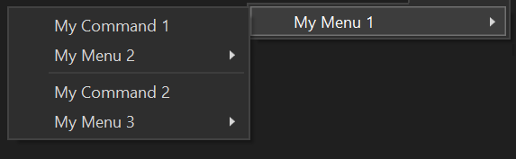
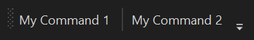

# Menus and Toolbars overview

Menus and toolbars are the way users access commands in your extension. They're convenient graphical ways to present your commands to users. Typically, related commands are clustered together on the same menu or toolbar.

## Work with menus and toolbars

This overview covers these top scenarios for working with menus and toolbars:

- [Create a menu](#create-a-menu)
- [Place items on a menu](#place-items-on-a-menu)
- [Create a toolbar](#create-a-toolbar)
- [Place items on a toolbar](#place-items-on-a-toolbar)
- [Create a group](#create-a-group)
- [Place items on a group](#place-items-on-a-group)
- [Place groups on a menu or toolbar](#place-groups-on-a-menu-or-toolbar)
- [Placement ordering (Priority)](#placement-ordering-priority)

## Create a menu

To create a menu with the new Extensibility Model, add a static [`MenuConfiguration`](/dotnet/api/microsoft.visualstudio.extensibility.commands.menuconfiguration) property, adorning the class with the [`VisualStudioContribution`](/dotnet/api/microsoft.visualstudio.extensibility.visualstudiocontributionattribute) attribute. This static property can be placed on any class in your Extension project. In the new Extensibility Model samples, they exist on the [`Extension`](/dotnet/api/microsoft.visualstudio.extensibility.extension) class for simplicity. Menus without any visible children won't be visible in the UI.

```csharp
[VisualStudioContribution]
public class ExtensionEntrypoint : Extension
{
  [VisualStudioContribution]
  public static MenuConfiguration MyMenu => new("%MyMenu.DisplayName%");
}
```

### MenuConfiguration class

The [`MenuConfiguration`](/dotnet/api/microsoft.visualstudio.extensibility.commands.menuconfiguration) class has a few parameters that you should become familiar with:

| Parameter | Type | Required | Description |
| --------- |----- | -------- | ----------- |
| [DisplayName](/dotnet/api/microsoft.visualstudio.extensibility.commands.controlcontainerconfiguration.displayname) | String | Yes | The default display name of your menu. Surround this string with the '%' character to enable localizing this string. See at [Localize metadata](localize-metadata.md). |
| [TooltipText](/dotnet/api/microsoft.visualstudio.extensibility.commands.controlcontainerconfiguration.tooltiptext) | String | No | The text to display as the tooltip when the menu is hovered or focused. Surround this string with the '%' character to enable localizing this string. See at [Localize metadata](localize-metadata.md). |
| [Placements](/dotnet/api/microsoft.visualstudio.extensibility.commands.controlcontainerconfiguration.placements) | CommandPlacement[] | No | Specifies the existing Groups within Visual Studio that the menu will be parented to. See at [Place a menu in the IDE](#place-a-menu-in-the-ide). |
| [Children](/dotnet/api/microsoft.visualstudio.extensibility.commands.controlcontainerconfiguration-1.children) | MenuChild[] | No | Describes the set of commands, menus and groups that should be parented to this menu. The order that these items are defined in the array represent the order that they'll appear visually in the IDE. See at [Place items on a menu](#place-items-on-a-menu) |

## Place a menu in the IDE

Menus are placed in the IDE the same way commands are. See [Place a command in the IDE](command.md#place-a-command-in-the-ide).

```csharp
public override MenuConfiguration MyMenu => new("%MyMenu.DisplayName%")
{
    Placements = new CommandPlacement[]
    {
        CommandPlacement.KnownPlacements.ToolsMenu
    },
};
```

## Place items on a menu

Placing on item on a menu is done by adding items to the `Children` array on the [`MenuConfiguration`](/dotnet/api/microsoft.visualstudio.extensibility.commands.menuconfiguration). The order that items are added to this array dictate how these items will be displayed visually in the IDE.

### Placing commands on a menu

Placing commands on a menu is done using the `MenuChild.Command<T>` method, replacing the template argument with the class name of the [`Command`](/dotnet/api/microsoft.visualstudio.extensibility.commands.command).

```csharp
[VisualStudioContribution]
public static MenuConfiguration MyMenu => new("%MyMenu.DisplayName%")
{
    Children = new[]
    {
        MenuChild.Command<MyCommand>(),
    },
};
```

### Placing menus on a menu

Placing menus on a menu is done using the [`MenuChild.Menu`](/dotnet/api/microsoft.visualstudio.extensibility.commands.menuchild.menu) method, passing in another [`MenuConfiguration`](/dotnet/api/microsoft.visualstudio.extensibility.commands.menuconfiguration) as a parameter.


```csharp
[VisualStudioContribution]
public static MenuConfiguration MyChildMenu => new("My Child Menu!");

[VisualStudioContribution]
public static MenuConfiguration MyParentMenu => new("My Parent Menu!")
{
    Children = new[]
    {
        MenuChild.Menu(MyChildMenu),
    },
};
```

### Separating menu items into groups

Items within a menu can be grouped together by having a `MenuChild.Separator` between items. Visually, this will look like a thin line placed between two items.

```csharp
[VisualStudioContribution]
public static MenuConfiguration MyMenu1 => new("%MyMenu.DisplayName%")
{
    Children = new[]
    {
        MenuChild.Command<MyCommand1>(), // Assuming there is a `Command` defined in the extension called `MyCommand1`
        MenuChild.Menu(MyMenu2), // Assuming there is a `MenuConfiguration` defined in the extension called `MyMenu2`
        MenuChild.Separator,
        MenuChild.Command<MyCommand2>(), // Assuming there is a `Command` defined in the extension called `MyCommand2`
        MenuChild.Menu(MyMenu3), // Assuming there is a `MenuConfiguration` defined in the extension called `MyMenu3`
    },
};
```

This can also be accomplished by using the `MenuChild.Group` method to define a group inline. You would then use the `GroupChild` class to parent items to the group.

```csharp
[VisualStudioContribution]
public static MenuConfiguration MyMenu1 => new("%MyMenu.DisplayName%")
{
    Children = new[]
    {
        MenuChild.Group(
            GroupChild.Command<MyCommand1>(), // Assuming there is a `Command` defined in the extension called `MyCommand1`
            GroupChild.Menu(MyMenu2)), // Assuming there is a `MenuConfiguration` defined in the extension called `MyMenu2`
        MenuChild.Group(
            GroupChild.Command<MyCommand2>(), // Assuming there is a `Command` defined in the extension called `MyCommand2`
            GroupChild.Menu(MyMenu3)), // Assuming there is a `MenuConfiguration` defined in the extension called `MyMenu3`
    },
};
```

In the two previous examples, the resulting menu would be identical in the IDE. The menu `MyMenu1` would look like the menu in the following screenshot:



## Create a toolbar

To create a toolbar with the new Extensibility Model, add a static [`ToolbarConfiguration`](/dotnet/api/microsoft.visualstudio.extensibility.commands.toolbarconfiguration) property, adorning the class with the [`VisualStudioContribution`](/dotnet/api/microsoft.visualstudio.extensibility.visualstudiocontributionattribute) attribute. This static property can be placed on any class in your Extension project. In the new Extensibility Model samples they exist on the [`Extension`](/dotnet/api/microsoft.visualstudio.extensibility.extension) class for simplicity.

```csharp
[VisualStudioContribution]
public class ExtensionEntrypoint : Extension
{
  [VisualStudioContribution]
  public static ToolbarConfiguration MyToolbar => new("%MyToolbar.DisplayName%");
}
```

Leaving the `Placement` property of the [`ToolbarConfiguration`](/dotnet/api/microsoft.visualstudio.extensibility.commands.toolbarconfiguration) as `null` will place the toolbar on the Standard Toolbar Bar and can be made visible by selecting the toolbar in the `View -> Toolbars` menu.

### ToolbarConfiguration class

The [`ToolbarConfiguration`](/dotnet/api/microsoft.visualstudio.extensibility.commands.toolbarconfiguration) class has a few properties that you should become familiar with:

| Property | Type | Required | Description |
| --------- |----- | -------- | ----------- |
| [DisplayName](/dotnet/api/microsoft.visualstudio.extensibility.commands.controlcontainerconfiguration.displayname) | String | Yes | The default display name of your toolbar. Surround this string with the '%' character to enable localizing this string. See at [Localize metadata](localize-metadata.md). |
| [TooltipText](/dotnet/api/microsoft.visualstudio.extensibility.commands.controlcontainerconfiguration.tooltiptext) | String | No | The text to display as the tooltip when the toolbar is hovered or focused. Surround this string with the '%' character to enable localizing this string. See at [Localize metadata](localize-metadata.md). |
| [Placements](/dotnet/api/microsoft.visualstudio.extensibility.commands.controlcontainerconfiguration.placements) | CommandPlacement[] | No | Specifies the existing Groups within Visual Studio that the toolbar will be parented to. See at [Place a command in the IDE](command.md#place-a-command-in-the-ide). Leaving this property as `null` will place the toolbar on the Standard Toolbar Bar and can be made visible by selecting the toolbar in the `View -> Toolbars` menu |
| [Children](/dotnet/api/microsoft.visualstudio.extensibility.commands.controlcontainerconfiguration-1.children) | ToolbarChild[] | No | Describes the set of commands, menus and groups that should be parented to this toolbar. The order that these items are defined in the array represent the order that they'll appear visually in the IDE. See at [Place items on a toolbar](#place-items-on-a-toolbar) |

## Place items on a toolbar

Placing commands on a toolbar is done using the `ToolbarChild.Command<T>` method, replacing the template argument with the class name of the `Command`.

```csharp
[VisualStudioContribution]
public static ToolbarConfiguration MyToolbar => new("%MyToolbar.DisplayName%")
{
    Children = new[]
    {
        ToolbarChild.Command<MyCommand>(),
    },
};
```

### Separating toolbar items into groups

Items within a toolbar can be grouped together by having a `ToolbarChild.Separator` between items. Visually, this will look like a thin line placed between two items.

```csharp
[VisualStudioContribution]
public static ToolbarConfiguration MyToolbar => new("%MyToolbar.DisplayName%")
{
    Children = new[]
    {
        ToolbarChild.Command<MyCommand1>(), // Assuming there is a `Command` defined in the extension called `MyCommand1`
        ToolbarChild.Separator,
        ToolbarChild.Command<MyCommand2>(), // Assuming there is a `Command` defined in the extension called `MyCommand2`
    },
};
```

This can also be accomplished by using the `ToolbarChild.Group` method to define a group inline. You would then use the [`ToolbarChild`](/dotnet/api/microsoft.visualstudio.extensibility.commands.toolbarchild) class to parent items to the group.

```csharp
[VisualStudioContribution]
public static ToolbarConfiguration MyToolbar => new("%MyToolbar.DisplayName%")
{
    Children = new[]
    {
        ToolbarChild.Group(
            GroupChild.Command<MyCommand1>(), // Assuming there is a `Command` defined in the extension called `MyCommand1`
        ToolbarChild.Group(
            GroupChild.Command<MyCommand2>(), // Assuming there is a `Command` defined in the extension called `MyCommand2`
    },
};
```

In the two examples here, the resulting toolbar would be identical in the IDE. The toolbar `MyToolbar` would look like the toolbar in the screenshot below:



## Create a group

A group is a visual grouping of items where a separator will be placed in between the last and first items of adjacent groups. In the sections above, it describes how to create groups inside of the context of the `Children` property of a [`MenuConfiguration`](/dotnet/api/microsoft.visualstudio.extensibility.commands.menuconfiguration) or [`ToolbarConfiguration`](/dotnet/api/microsoft.visualstudio.extensibility.commands.toolbarconfiguration). It is also possible to define groups inside of their own [`CommandGroupConfiguration`](/dotnet/api/microsoft.visualstudio.extensibility.commands.commandgroupconfiguration). This is useful when you would like to parent a group to an existing menu or toolbar in Visual Studio without defining you're own menu or toolbar. It can also be useful if you would like to format your code in a way that separates your group definitions from your menu and toolbar definitions.

To create a group with the new Extensibility Model, add a static [`CommandGroupConfiguration`](/dotnet/api/microsoft.visualstudio.extensibility.commands.commandgroupconfiguration) property. This static property can be placed on any class in your Extension project. In the new Extensibility Model samples they exist on the [`Extension`](/dotnet/api/microsoft.visualstudio.extensibility.extension) class for simplicity. If a `CommandGroupConfiguration` specifies a `Placement`, it should also be adorned with the [`VisualStudioContribution`](/dotnet/api/microsoft.visualstudio.extensibility.visualstudiocontributionattribute) attribute.

```csharp
public static CommandGroupConfiguration MyGroup => new();

[VisualStudioContribution]
private static CommandGroupConfiguration MyGroupWithPlacement => new(GroupPlacement.KnownPlacements.ToolsMenu);
```

### CommandGroupConfiguration class

The [`CommandGroupConfiguration`](/dotnet/api/microsoft.visualstudio.extensibility.commands.commandgroupconfiguration) class has a few parameters that you should become familiar with:

| Parameter | Type | Required | Description |
| --------- |----- | -------- | ----------- |
| [Placement](/dotnet/api/microsoft.visualstudio.extensibility.commands.commandgroupconfiguration.placements) | GroupPlacement | No | Specifies the existing menu or toolbar within Visual Studio that the group will be parented to. See at [Place a group in the IDE](#place-a-group-in-the-ide). |
| [Children](/dotnet/api/microsoft.visualstudio.extensibility.commands.commandgroupconfiguration.children) | GroupChild[] | No | Describes the set of commands and menus that should be parented to this group. The order that these items are defined in the array represent the order that they'll appear visually in the IDE. See at [Place items on a group](#place-items-on-a-group) |

### Place a group in the IDE

There is a set of well-defined places in Visual Studio where commands can be placed. These placements are defined by the property [`CommandPlacement.KnownPlacements`](/dotnet/api/microsoft.visualstudio.extensibility.commands.commandplacement.knownplacements) on the class [`Commands.GroupPlacement`](/dotnet/api/microsoft.visualstudio.extensibility.commands.groupplacement). The current set of `KnownPlacements` is:

- `ToolsMenu` - The command will be placed in a group under the top-level "Tools" menu in Visual Studio.
- `ViewOtherWindowsMenu` - The command will be placed in a group under the top-level "View" -> "Other Windows" menu in Visual Studio.
- `ExtensionsMenu` - The command will be placed in a group under the top-level "Extensions" menu in Visual Studio.

```csharp
[VisualStudioContribution]
public static CommandGroupConfiguration MyGroup1 => new(GroupPlacement.KnownPlacements.ToolsMenu);

[VisualStudioContribution]
public static CommandGroupConfiguration MyGroup2 => new(GroupPlacement.KnownPlacements.ExtensionsMenu.WithPriority(0x100));
```

## Place items on a group

Commands and menus can be placed onto groups using the `Children` array property on the [`CommandGroupConfiguration`](/dotnet/api/microsoft.visualstudio.extensibility.commands.commandgroupconfiguration).

### Place commands on a group

Placing commands on a group is done using the `GroupChild.Command<T>` method, replacing the template argument with the class name of the `Command`.

```csharp
[VisualStudioContribution]
public static CommandGroupConfiguration MyGroup => new(GroupPlacement.KnownPlacements.ToolsMenu)
{
    Children = new[]
    {
        GroupChild.Command<MyCommand>(),
    },
};
```

### Place menus on a group

Placing menus on a group is done using the `GroupChild.Menu` method, passing in a [`MenuConfiguration`](/dotnet/api/microsoft.visualstudio.extensibility.commands.menuconfiguration) as a parameter.

```csharp
[VisualStudioContribution]
public static MenuConfiguration MyMenu => new("%MyMenu.DisplayName%");

[VisualStudioContribution]
public static CommandGroupConfiguration MyGroup => new(GroupPlacement.KnownPlacements.ToolsMenu)
{
    Children = new[]
    {
        GroupChild.Menu(MyMenu),
    },
};
```

## Place groups on a menu or toolbar

Placing a group on a menu is done using the `MenuChild.Group` method, passing in a [`CommandGroupConfiguration`](/dotnet/api/microsoft.visualstudio.extensibility.commands.commandgroupconfiguration) as a parameter. Placing a group on a toolbar is done using the `ToolbarChild.Group`  method, passing in a `CommandGroupConfiguration` as a parameter. Groups parented to menus or toolbars in this way can't have the `Placement` property of the `CommandGroupConfiguration` set to any value except `null`, and it shouldn't be adorned with the [`VisualStudioContribution`](/dotnet/api/microsoft.visualstudio.extensibility.visualstudiocontributionattribute) attribute.

```csharp
private static CommandGroupConfiguration MyGroup => new()
{
    Children = new[]
    {
        GroupChild.Command<MyCommand1>(), // Assuming there is a `Command` defined in the extension called `MyCommand1`
        GroupChild.Command<MyCommand2>(), // Assuming there is a `Command` defined in the extension called `MyCommand2`
    },
};

[VisualStudioContribution]
public static MenuConfiguration MyMenu => new("%MyMenu.DisplayName%")
{
    Children = new[]
    {
        MenuChild.Group(MyGroup),
    },
};
```

```csharp
private static CommandGroupConfiguration MyGroup => new()
{
    Children = new[]
    {
        GroupChild.Command<MyCommand1>(), // Assuming there is a `Command` defined in the extension called `MyCommand1`
        GroupChild.Command<MyCommand2>(), // Assuming there is a `Command` defined in the extension called `MyCommand2`
    },
}

[VisualStudioContribution]
public static ToolbarConfiguration MyToolbar => new("%MyToolbar.DisplayName%")
{
    Children = new[]
    {
        ToolbarChild.Group(MyGroup),
    },
};
```

## Placement ordering (Priority)

Placements are ordered based on the value of their [`Priority`](/dotnet/api/microsoft.visualstudio.extensibility.commands.commandplacement.priority) property when parented to a control defined in VSCT, relative to other items parented to the same group, menu, or toolbar. The `Priority` property is an `unsigned short`. The default `Priority` value for a [`CommandPlacement`](/dotnet/api/microsoft.visualstudio.extensibility.commands.commandplacement) and [`GroupPlacement`](/dotnet/api/microsoft.visualstudio.extensibility.commands.groupplacement) is `0` and can be modified by calling the `CommandPlacement.WithPriority` or `GroupPlacement.WithPriority` methods, passing in the desired `Priority` value. The `Priority` can also be set by using the `CommandPlacement.VsctParent` and `GroupPlacement.VsctParent` methods and passing in the desired `Priority` directly.

The `Priority` property is not involved when parenting items to controls defined via configuration objects using the VisualStudio.Extensibility model (i.e. the group, menu, or toolbar being parented to was defined using [`CommandGroupConfiguration`](/dotnet/api/microsoft.visualstudio.extensibility.commands.commandgroupconfiguration), [`MenuConfiguration`](/dotnet/api/microsoft.visualstudio.extensibility.commands.menuconfiguration), or [`ToolbarConfiguration`](/dotnet/api/microsoft.visualstudio.extensibility.commands.toolbarconfiguration)).

### GroupPlacement

```csharp
GroupPlacement.KnownPlacements.ToolsMenu.WithPriority(0x0500);
```

```csharp
// Parenting a group to the "Help" top level menu
GroupPlacement.VsctParent(new Guid("{d309f791-903f-11d0-9efc-00a0c911004f}"), id: 0x0088, priority: 0x0500);
```

### CommandPlacement

```csharp
CommandPlacement.KnownPlacements.ToolsMenu.WithPriority(0x0500);
```

```csharp
// Parenting a command to the "Help -> About" group
CommandPlacement.VsctParent(new Guid("{d309f791-903f-11d0-9efc-00a0c911004f}"), id: 0x016B, priority: 0x0801);
```
