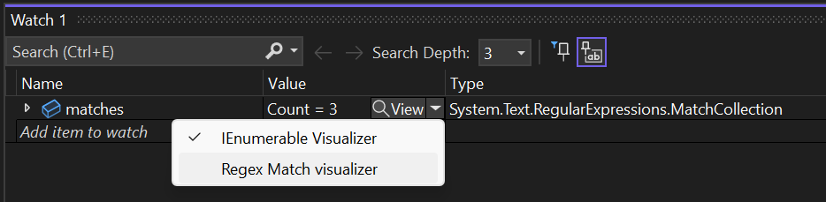

# Create Visual Studio debugger visualizers

Debugger visualizers are a Visual Studio feature that provides a custom visualization for variables or objects of a specific .NET type during a debug session.

Debugger visualizers are accessible from the *DataTip* that appears when hovering over a variable, or from the *Autos*, *Locals*, and *Watch* windows:



## Get started

Follow the [Create the extension project](./../get-started/create-your-first-extension.md) section in the Getting Started section.

Then, add a class extending [`DebuggerVisualizerProvider`](/dotnet/api/microsoft.visualstudio.extensibility.debuggervisualizers.debuggervisualizerprovider) and apply the [`VisualStudioContribution`](/dotnet/api/microsoft.visualstudio.extensibility.visualstudiocontributionattribute) attribute to it:

```csharp
/// <summary>
/// Debugger visualizer provider class for <see cref="System.String"/>.
/// </summary>
[VisualStudioContribution]
internal class StringDebuggerVisualizerProvider : DebuggerVisualizerProvider
{
    /// <summary>
    /// Initializes a new instance of the <see cref="StringDebuggerVisualizerProvider"/> class.
    /// </summary>
    /// <param name="extension">Extension instance.</param>
    /// <param name="extensibility">Extensibility object.</param>
    public StringDebuggerVisualizerProvider(StringDebuggerVisualizerExtension extension, VisualStudioExtensibility extensibility)
        : base(extension, extensibility)
    {
    }

    /// <inheritdoc/>
    public override DebuggerVisualizerProviderConfiguration DebuggerVisualizerProviderConfiguration => new("My string visualizer", typeof(string));

    /// <inheritdoc/>
    public override async Task<IRemoteUserControl> CreateVisualizerAsync(VisualizerTarget visualizerTarget, CancellationToken cancellationToken)
    {
        string targetObjectValue = await visualizerTarget.ObjectSource.RequestDataAsync<string>(jsonSerializer: null, cancellationToken);

        return new MyStringVisualizerControl(targetObjectValue);
    }
}
```

The previous code defines a new debugger visualizer, which applies to objects of type `string`:

- The [`DebuggerVisualizerProviderConfiguration`](/dotnet/api/microsoft.visualstudio.extensibility.debuggervisualizers.debuggervisualizerproviderconfiguration) property defines the visualizer display name and the supported .NET type.
- The [`CreateVisualizerAsync`](/dotnet/api/microsoft.visualstudio.extensibility.debuggervisualizers.debuggervisualizerprovider.createvisualizerasync) method is invoked by Visual Studio when the user requests the display of the debugger visualizer for a certain value. `CreateVisualizerAsync` uses the [`VisualizerTarget`](/dotnet/api/microsoft.visualstudio.extensibility.debuggervisualizers.visualizertarget) object to retrieve the value to be visualized and passes it to a custom remote user control (reference the [Remote UI](./../inside-the-sdk/remote-ui.md) documentation). The remote user control is then returned and will be shown in a popup window in Visual Studio.

## Targeting multiple types

The configuration property allows the visualizer to target multiple types when convenient. A perfect example of this is the [DataSet Visualizer](/visualstudio/debugger/view-data-in-tabular-visualizer#dataset-visualizer) which supports the visualization of `DataSet`, `DataTable`, `DataView`, and `DataViewManager` objects. This capability eases extension development since similar types can share the same UI, view models, and [visualizer object source](#the-visualizer-object-source).

```csharp
    /// <inheritdoc/>
    public override DebuggerVisualizerProviderConfiguration DebuggerVisualizerProviderConfiguration => new DebuggerVisualizerProviderConfiguration(
        new VisualizerTargetType("DataSet Visualizer", typeof(System.Data.DataSet)),
        new VisualizerTargetType("DataTable Visualizer", typeof(System.Data.DataTable)),
        new VisualizerTargetType("DataView Visualizer", typeof(System.Data.DataView)),
        new VisualizerTargetType("DataViewManager Visualizer", typeof(System.Data.DataViewManager)));

    /// <inheritdoc/>
    public override async Task<IRemoteUserControl> CreateVisualizerAsync(VisualizerTarget visualizerTarget, CancellationToken cancellationToken)
    {
        ...
    }
```

## The visualizer object source

The *visualizer object source* is a .NET class that is loaded by the debugger in the process being debugged. The debugger visualizer can retrieve data from the visualizer object source using methods exposed by [`VisualizerTarget.ObjectSource`](/dotnet/api/microsoft.visualstudio.extensibility.debuggervisualizers.visualizertarget.objectsource).

The default visualizer object source allows debugger visualizers to retrieve the value of the object to be visualized by calling the [`RequestDataAsync<T>(JsonSerializer?, CancellationToken)`](/dotnet/api/microsoft.visualstudio.extensibility.debuggervisualizers.visualizerobjectsourceclient.requestdataasync#microsoft-visualstudio-extensibility-debuggervisualizers-visualizerobjectsourceclient-requestdataasync-1(newtonsoft-json-jsonserializer-system-threading-cancellationtoken)) method. The default visualizer object source uses [Newtonsoft.Json](https://www.nuget.org/packages/Newtonsoft.Json) to serialize the value, and the VisualStudio.Extensibility libraries also use Newtonsoft.Json for the deserialization. Alternatively you can use [`RequestDataAsync(CancellationToken)`](/dotnet/api/microsoft.visualstudio.extensibility.debuggervisualizers.visualizerobjectsourceclient.requestdataasync#microsoft-visualstudio-extensibility-debuggervisualizers-visualizerobjectsourceclient-requestdataasync(system-threading-cancellationtoken)) to retrieve the serialized value as a `JToken`.

If you want to visualize a .NET type that is natively supported by Newtonsoft.Json, or you want to visualize your own type and you can make it serializable, the previous instructions are sufficient to create a simple debugger visualizer. Read on if you want to support more complex types or to use more advanced features.

## Use a custom visualizer object source

If the type to be visualized can't be automatically serialized by Newtonsoft.Json, you can create a custom visualizer object source to handle the serialization.

- Create a new .NET class library project targeting `netstandard2.0`. You can target a more specific version of .NET Framework or .NET (for example, `net472` or `net6.0`) if necessary to serialize the object to be visualized.
- Add a package reference to [`DebuggerVisualizers`](https://www.nuget.org/packages/Microsoft.VisualStudio.DebuggerVisualizers) version 17.6 or newer.
- Add a class extending [`VisualizerObjectSource`](/dotnet/api/microsoft.visualstudio.extensibility.debuggervisualizers.visualizerobjectsourcetype) and override `GetData` writing the serialized value of `target` to the `outgoingData` stream.

```csharp
public class MyObjectSource : VisualizerObjectSource
{
    /// <inheritdoc/>
    public override void GetData(object target, Stream outgoingData)
    {
        MySerializableType result = Convert(match);
        SerializeAsJson(outgoingData, result);
    }

    private static MySerializableType Convert(object target)
    {
        // Add your code here to convert target into a type serializable by Newtonsoft.Json
        ...
    }
}
```

### Use custom serialization

You can use the `VisualizerObjectSource.SerializeAsJson` method to serialize an object using Newtonsoft.Json to a `Stream` without adding a reference to Newtonsoft.Json to your library. Invoking `SerializeAsJson` will load, via reflection, a version of the Newtonsoft.Json assembly into the process being debugged.

If you need to reference [Newtonsoft.Json](https://www.nuget.org/packages/Newtonsoft.Json), you should use the same version that is referenced by the `Microsoft.VisualStudio.Extensibility.Sdk` package, but it's preferable to use `DataContract` and `DataMember` attributes to support object serialization instead of relying on Newtonsoft.Json types.

Alternatively, you can implement your own custom serialization (such as binary serialization) writing directly to `outgoingData`.

### Add the visualizer object source DLL to the extension

Modify the extension `.csproj` file adding a `ProjectReference` to the visualizer object source library project, which makes sure that the visualizer object source library is built before the extension is packaged.

Also add a `Content` item including the visualizer object source library DLL into the `netstandard2.0` subfolder of the extension.

```xml
  <ItemGroup>
    <Content Include="pathToTheObjectSourceDllBinPath\$(Configuration)\netstandard2.0\MyObjectSourceLibrary.dll" Link="netstandard2.0\MyObjectSourceLibrary.dll">
      <CopyToOutputDirectory>PreserveNewest</CopyToOutputDirectory>
    </Content>
  </ItemGroup>

  <ItemGroup>
    <ProjectReference Include="..\MyObjectSourceLibrary\MyObjectSourceLibrary.csproj" />
  </ItemGroup>
```

Alternatively, you can use the `net4.6.2` or `netcoreapp` subfolders if you built the visualizer object source library targeting .NET Framework or .NET. You can even include all three subfolders with different versions of the visualizer object source library, but it's better to target `netstandard2.0` only.

You should try to minimize the number of dependencies of the visualizer object source library DLL. If your visualizer object source library has dependencies other than [Microsoft.VisualStudio.DebuggerVisualizers](https://www.nuget.org/packages/Microsoft.VisualStudio.DebuggerVisualizers) and libraries that are already guaranteed to be loaded in the process being debugged, make sure to also include those DLL files into the same subfolder as the visualizer object source library DLL.

### Update the debugger visualizer provider to use the custom visualizer object source

You can then update your [`DebuggerVisualizerProvider`](/dotnet/api/microsoft.visualstudio.extensibility.debuggervisualizers.debuggervisualizerproviderconfiguration) configuration to reference your custom visualizer object source:

```csharp
    public override DebuggerVisualizerProviderConfiguration DebuggerVisualizerProviderConfiguration => new("My visualizer", typeof(TypeToVisualize))
    {
        VisualizerObjectSourceType = new(typeof(MyObjectSource)),
    };

    public override async Task<IRemoteUserControl> CreateVisualizerAsync(VisualizerTarget visualizerTarget, CancellationToken cancellationToken)
    {
        MySerializableType result = await visualizerTarget.ObjectSource.RequestDataAsync<MySerializableType>(jsonSerializer: null, cancellationToken);
        return new MyVisualizerUserControl(result);
    }
```

## Work with large and complex objects

If the retrieval of data from the visualizer object source can't be done with a single parameterless call to [`RequestDataAsync`](/dotnet/api/microsoft.visualstudio.extensibility.debuggervisualizers.visualizerobjectsourceclient.requestdataasync), you can instead perform a more complex message exchange with the visualizer object source by invoking [`RequestDataAsync<TMessage, TResponse>(TMessage, JsonSerializer?, CancellationToken)`](/dotnet/api/microsoft.visualstudio.extensibility.debuggervisualizers.visualizerobjectsourceclient.requestdataasync#microsoft-visualstudio-extensibility-debuggervisualizers-visualizerobjectsourceclient-requestdataasync-2(-0-newtonsoft-json-jsonserializer-system-threading-cancellationtoken)) multiple times and sending different *messages* to the visualizer object source. Both the message and response is serialized by the VisualStudio.Extensibility infrastructure using Newtonsoft.Json. Other overrides of `RequestDataAsync` allow you to use `JToken` objects or implement custom serialization and deserialization.

You can implement any custom protocol using different messages to retrieve information from the visualizer object source. The most common use case for this feature is breaking the retrieval of a potentially large object into multiple calls to avoid [`RequestDataAsync`](/dotnet/api/microsoft.visualstudio.extensibility.debuggervisualizers.visualizerobjectsourceclient.requestdataasync) timing out.

This is an example of how you can retrieve the content of a potentially large collection one item at a time:

```csharp
for (int i = 0; ; i++)
{
    MySerializableType? collectionEntry = await visualizerTarget.ObjectSource.RequestDataAsync<int, MySerializableType?>(i, jsonSerializer: null, cancellationToken);
    if (collectionEntry is null)
    {
        break;
    }

    observableCollection.Add(collectionEntry);
}
```

The code above uses a simple index as message for the [`RequestDataAsync`](/dotnet/api/microsoft.visualstudio.extensibility.debuggervisualizers.visualizerobjectsourceclient.requestdataasync) calls. The corresponding visualizer object source code would override the `TransferData` method (instead of `GetData`):

```csharp
public class MyCollectionTypeObjectSource : VisualizerObjectSource
{
    public override void TransferData(object target, Stream incomingData, Stream outgoingData)
    {
        var index = (int)DeserializeFromJson(incomingData, typeof(int))!;

        if (target is MyCollectionType collection && index < collection.Count)
        {
            var result = Convert(collection[index]);
            SerializeAsJson(outgoingData, result);
        }
        else
        {
            SerializeAsJson(outgoingData, null);
        }
    }

    private static MySerializableType Convert(object target)
    {
        // Add your code here to convert target into a type serializable by Newtonsoft.Json
        ...
    }
}
```

The visualizer object source above leverages the `VisualizerObjectSource.DeserializeFromJson` method to deserialize the message sent by the visualizer provider from `incomingData`.

When implementing a debugger visualizer provider that performs complex message interaction with the visualizer object source, it's usually better to pass the [`VisualizerTarget`](/dotnet/api/microsoft.visualstudio.extensibility.debuggervisualizers.visualizertarget) to the visualizer's `RemoteUserControl` so that the message exchange can happen asynchronously while the control is loaded. Passing the `VisualizerTarget` also lets you send messages to the visualizer object source to retrieve data based on the user's interactions with the visualizer's UI.

```csharp
public override Task<IRemoteUserControl> CreateVisualizerAsync(VisualizerTarget visualizerTarget, CancellationToken cancellationToken)
{
    return Task.FromResult<IRemoteUserControl>(new MyVisualizerUserControl(visualizerTarget));
}
```

```csharp
internal class MyVisualizerUserControl : RemoteUserControl
{
    private readonly VisualizerTarget visualizerTarget;

    public MyVisualizerUserControl(VisualizerTarget visualizerTarget)
        : base(new MyDataContext())
    {
        this.visualizerTarget = visualizerTarget;
    }

    public override async Task ControlLoadedAsync(CancellationToken cancellationToken)
    {
        // Start querying the VisualizerTarget here
        ...
    }
    ...
```

## Opening visualizers as Tool Windows

By default, all debugger visualizer extensions are opened as modal dialog windows on the foreground of Visual Studio. Hence, if the user wants to continue to interact with the IDE, the visualizer will need to be closed. However, if the `Style` property is set to `ToolWindow` in the [`DebuggerVisualizerProviderConfiguration`](/dotnet/api/microsoft.visualstudio.extensibility.debuggervisualizers.debuggervisualizerproviderconfiguration) property, then the visualizer will be opened as a non-modal tool window that can remain open during the rest of the debug session. If no style is declared, the default value `ModalDialog` will be used.

```csharp
    public override DebuggerVisualizerProviderConfiguration DebuggerVisualizerProviderConfiguration => new("My visualizer", typeof(TypeToVisualize))
    {
        Style = VisualizerStyle.ToolWindow
    };

    public override async Task<IRemoteUserControl> CreateVisualizerAsync(VisualizerTarget visualizerTarget, CancellationToken cancellationToken)
    {
        // The control will be in charge of calling the RequestDataAsync method from the visualizer object source and disposing of the visualizer target.
        return new MyVisualizerUserControl(visualizerTarget);
    }
```

Whenever a visualizer opts to be opened as a `ToolWindow`, it will need to subscribe to the [StateChanged](/dotnet/api/microsoft.visualstudio.extensibility.debuggervisualizers.visualizertarget.statechanged) event of the `VisualizerTarget`. When a visualizer is opened as a tool window, it will not block the user from unpausing the debug session. So, the aforementioned event will be fired by the debugger whenever the state of the debug target changes. Visualizer extension authors should pay special attention to these notifications since the visualizer target is only available when the debug session is active and the debug target is paused. When the visualizer target is not available, calls to `ObjectSource` methods will fail with a `VisualizerTargetUnavailableException`.

```csharp
internal class MyVisualizerUserControl : RemoteUserControl
{
    private readonly VisualizerDataContext dataContext;

#pragma warning disable CA2000 // Dispose objects before losing scope
    public MyVisualizerUserControl(VisualizerTarget visualizerTarget)
        : base(dataContext: new VisualizerDataContext(visualizerTarget))
#pragma warning restore CA2000 // Dispose objects before losing scope
    {
        this.dataContext = (VisualizerDataContext)this.DataContext!;
    }

    protected override void Dispose(bool disposing)
    {
        if (disposing)
        {
            this.dataContext.Dispose();
        }
    }

    [DataContract]
    private class VisualizerDataContext : NotifyPropertyChangedObject, IDisposable
    {
        private readonly VisualizerTarget visualizerTarget;
        private MySerializableType? _value;
        
        public VisualizerDataContext(VisualizerTarget visualizerTarget)
        {
            this.visualizerTarget = visualizerTarget;
            visualizerTarget.StateChanged += this.OnStateChangedAsync;
        }

        [DataMember]
        public MySerializableType? Value
        {
            get => this._value;
            set => this.SetProperty(ref this._value, value);
        }

        public void Dispose()
        {
            this.visualizerTarget.Dispose();
        }

        private async Task OnStateChangedAsync(object? sender, VisualizerTargetStateNotification args)
        {
            switch (args)
            {
                case VisualizerTargetStateNotification.Available:
                case VisualizerTargetStateNotification.ValueUpdated:
                    Value = await visualizerTarget.ObjectSource.RequestDataAsync<MySerializableType>(jsonSerializer: null, CancellationToken.None);
                    break;
                case VisualizerTargetStateNotification.Unavailable:
                    Value = null;
                    break;
                default:
                    throw new NotSupportedException("Unexpected visualizer target state notification");
            }
        }
    }
}
```

The `Available` notification will be received after the [`RemoteUserControl`](/dotnet/api/microsoft.visualstudio.extensibility.ui.remoteusercontrol) has been created and just before it is made visible in the newly created visualizer tool window. For as long as the visualizer remains open, the other `VisualizerTargetStateNotification` values can be received every time the debug target changes its state. The `ValueUpdated` notification is used to indicate that the last expression opened by the visualizer was successfully re-evaluated where the debugger stopped and should be refreshed by the UI. On the other hand, whenever the debug target is resumed or the expression cannot be re-evaluated after stopping, the `Unavailable` notification will be received.

## Update the visualized object value

If [`VisualizerTarget.IsTargetReplaceable`](/dotnet/api/microsoft.visualstudio.extensibility.debuggervisualizers.visualizertarget.istargetreplaceable) is true, the debugger visualizer can use the [`ReplaceTargetObjectAsync`](/dotnet/api/microsoft.visualstudio.extensibility.debuggervisualizers.visualizerobjectsourceclient.replacetargetobjectasync#microsoft-visualstudio-extensibility-debuggervisualizers-visualizerobjectsourceclient-replacetargetobjectasync-1(-0-newtonsoft-json-jsonserializer-system-threading-cancellationtoken)) method to update the value of the visualized object in the process being debugged.

The visualizer object source must override the `CreateReplacementObject` method:

```csharp
public override object CreateReplacementObject(object target, Stream incomingData)
{
    // Use DeserializeFromJson to read from incomingData
    // the new value of the object being visualized
    ...
    return newValue;
}
```

## Related content

Try out the [`RegexMatchDebugVisualizer`](https://github.com/Microsoft/VSExtensibility/tree/main/New_Extensibility_Model/Samples/RegexMatchDebugVisualizer/README.md) sample to see these techniques in action.
