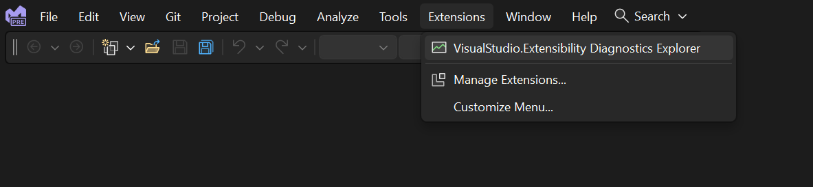
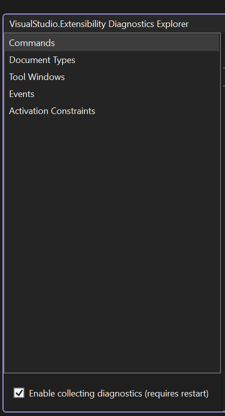
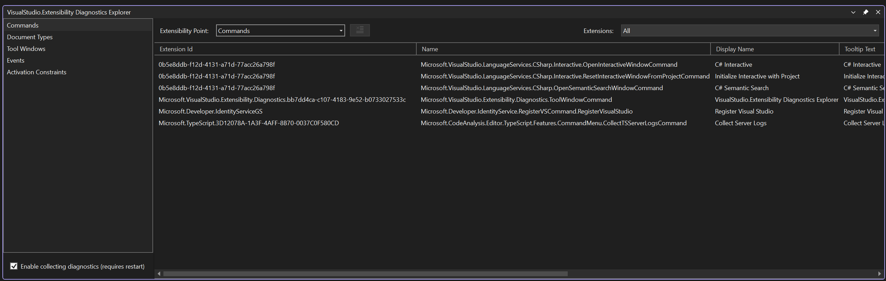
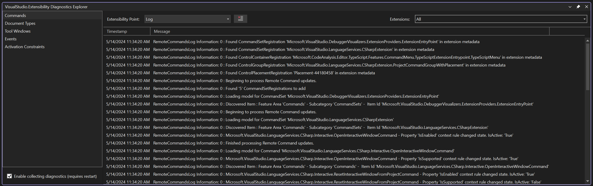
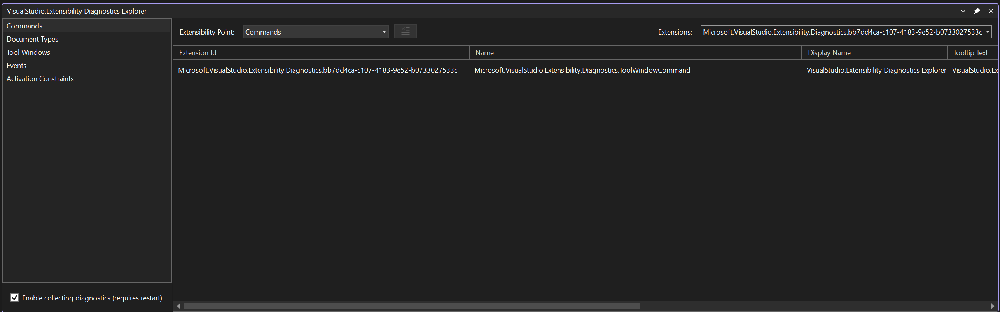
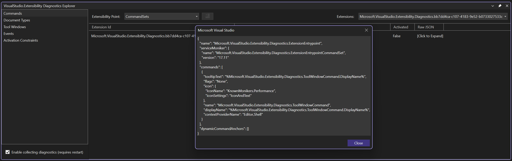
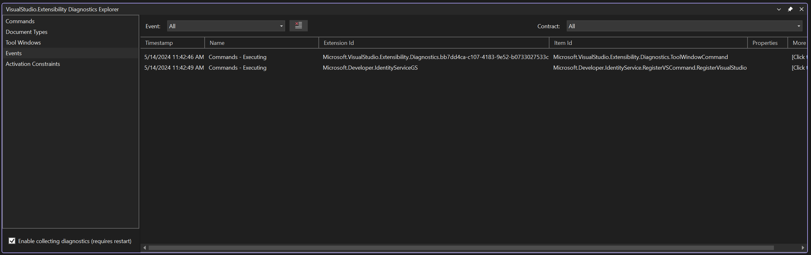
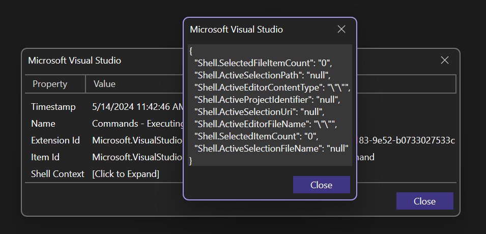
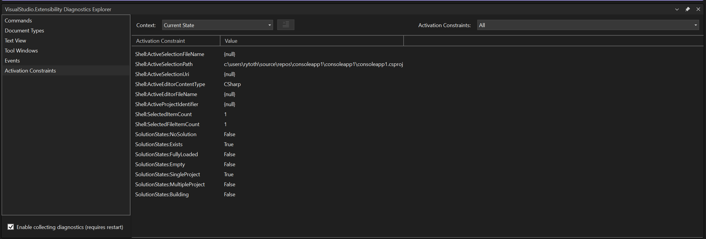
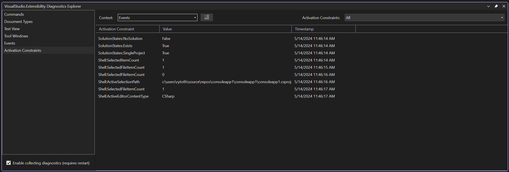

# Overview

The VisualStudio.Extensibility Diagnostics Explorer extension is designed to help debug VisualStudio.Extensibility extensions while developing them. The target audience for this extension is extension authors, not extension consumers. This extension provides an interface for inspecting the extensibility points that extensions are interacting with, and what configuration objects extensions are providing to the IDE, and the metadata of those configuration objects.

## Get Started

Follow these instructions to install, launch, and configure the Diagsnotics Explorer.

### Install the Extension

You can get the Diagnostics Explorer either directly through the Extension Manager in Visual Studio, or from the Visual Studio Marketplace [here](https://aka.ms/VisualStudio.Extensibility/DiagnosticsExplorer).

> [!NOTE]
> The VisualStudio.Extensibility Diagnostics Explorer extension is compatible with Visual Studio 2022 17.12 and higher.

### Open the Diagnostics Explorer in Visual Studio

To launch the Diagnostics Explorer in Visual Studio, select **VisualStudio.Extensibility Diagnostics Explorer** in the **Extensions** menu.

### Enable collection of diagnostics

The Diagnostics Explorer is configured to collect relevant diagnostic data from your extensions by default. If you want to disable or re-enable this data collection, you can toggle the **Enable collecting diagnostics** checkbox at the lower-left corner of the tool window. A restart of Visual Studio is required for any changes to this setting to take effect.

## Diagnostics Pages

The left-hand panel of the Diagnostics Explorer tool window contains a list different *diagnostics pages*. There are two types of diagnostics pages - extensible features and extensibility infrastructure. Extensible features pages provide diagnostic information about a specific extensible component within Visual Studio, like commands. Extensibility infrastructure pages provide diagnostic information that's relevant regardless of which extensibility points your extension plugs into. The [**Events**](#events-page) page, a live viewer for extensibility-related events, and the [**Client Contexts**](#client-contexts-page) page, which shows relevant IDE state to help you craft your activation constraints, are the two extensibility infrastructure pages.

### Extensible Feature Pages

Extensible feature pages have a ComboBox in the top-left for the different **Extensibility Points** in that feature area, each of which can be mapped directly to configuration objects in your extension. For example, in the **Commands** page there's an **Extensibility Point** for **Menus and Toolbars**, which shows you each of the menus and toolbars that Visual Studio discovered in your VisualStudio.Extensibility extensions.

The data updates in real time as properties are updated in extensions. For example, if an extension changes the display name of one of its commands at runtime, the new display name of that command is shown in the cell in the **Display Name** column for that command immediately.

The **Extensibility Point** ComboBox also has an item called **Log**, which shows you a live view of those updates. The **Clear All** button beside the ComboBox can be used to clear all lines currently being displayed in the view.

You can filter the items in the view by using the **Extensions** ComboBox. When **All** is selected in this ComboBox, data for every installed VisualStudio.Extensibility extension is shown. If you change this ComboBox to the ID of a specific extension, only items related to that specific extension are shown. The value of this ComboBox is persisted even when you navigate between extensible feature pages.

Some cells in the DataGrid display **[Click to Expand]**. This message means that the metadata related to that property is too verbose to be neatly displayed in a cell of the DataGrid. Clicking on the cell opens a modal dialog displaying the actual value of that cell.

### Extensible Infrastructure Pages

#### Events Page

The events page shows you when "something happens" in the IDE. Each event appears as a new row in the DataGrid, along with any properties related to that event. For example, when a command is executed, a **Commands - Executing** event appears in the view showing the ID of the extension that the command belongs to and the ID of the command that was executed.

You can use the **Event** ComboBox to filter the view to only contain events with a specific name. When **All** is selected, then all events are shown. If a specific event is selected, all of the properties of the event are shown in the view. Some properties need to be expanded by clicking on **[Click to Expand]** if they're too verbose to be shown in a single cell.

The **Contract** ComboBox filters the view to only show events related to a specific extensible feature. It also filters the `Event` ComboBox to only contain the names of events related to the specific extensible feature.

Clicking the **Clear All** button deletes all the events currently shown in the view.

##### Column Descriptions

###### Extension ID

The **Extension Id** column shows the ID of the extension that the instance of the event is related to. It's possible for this cell to be empty for some events if they don't belong to a specific extension but instead apply to the IDE as a whole.

###### Item ID

The **Item Id** column shows the ID of the extension item that the instance of the event is related to. For example, the **Item Id** for the **Commands - Executing** event would be the ID of the command that was executed.

###### Properties

The **Properties** column shows the set of properties related to that instance of the event that could be displayed in a single cell in a DataGrid. More verbose properties would only be visible from the **More Info** dialog, or by changing the **Event** ComboBox to the name of the specific event that you're interested in.

###### More Info

The **More Info** column displays more verbose metadata related to an event. Clicking a cell in this column opens a modal dialog containing all of the metadata related to the event represented by that row.

#### Client Contexts Page

The client contexts page shows the state of various properties related to the IDE itself. The **Context** ComboBox changes the data in the view to either show all of the activation constraints related to the currently selected item in the **Client Contexts** ComboBox, or a log of all the times these properties changed since the tool window was opened. When the **Events** context is selected, the **Clear All** button can be used to delete all the events currently being displayed in the view.

