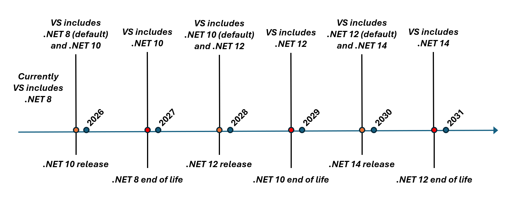
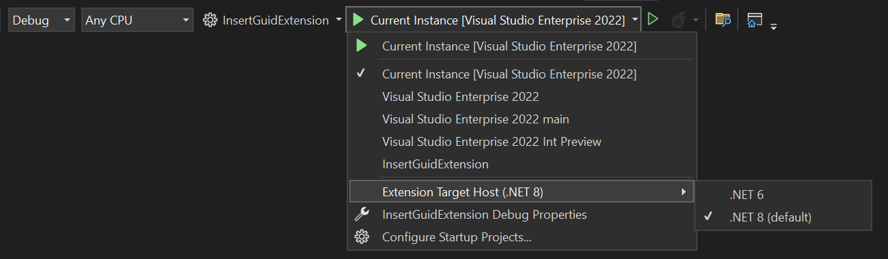

# .NET Compatibility for VisualStudio.Extensibility Extensions

The new VisualStudio.Extensibilty model allows extensions to be run outside the main Visual Studio process in a separate .NET host process. Because .NET is used as the runtime to execute VisualStudio.Extensibility extensions, extensions built using the VisualStudio.Extensibility framework must stay up-to-date with the publicly supported .NET long-term servicing (LTS) runtimes.

## .NET Runtime Support Model

The .NET runtime has its own lifetime and servicing timelines, independent of Visual Studio. The current cadence sees a new .NET release every year, with odd-numbered major releases receiving 18 months of support, and even-numbered releases receiving long-term support (LTS) of 36 months. At any given time, Visual Studio ships with .NET LTS versions still in public support. For the official list of .NET runtimes and their lifetimes, see [here](https://learn.microsoft.com/lifecycle/products/microsoft-net-and-net-core).

The following timeline illustrates an approximation of the different .NET versions shipped with Visual Studio.

By default, VisualStudio.Extensibility extensions target whatever the oldest supported .NET LTS runtime is. However, extension developers can specify in their extension metadata which versions of .NET their extension is known to support. Given this information, Visual Studio chooses an appropriate target based on the extension's declared .NET runtime version and its known end-of-life dates.

It's important to note that developers using VisualStudio.Extensibility should target a current .NET SDK. If an extension is developed for .NET version that is no longer publicly supported - and therefore no longer shipped with Visual Studio - then Visual Studio will choose the oldest publicly supported runtime available to run the extension. Although the likelihood of being affected by a breaking change between major .NET versions is low, isn't guaranteed that an application running on a previous .NET version will work on a newer one, and so the extension isn't guaranteed to work.

## Experiences

### End-user Experience

Visual Studio will choose which .NET runtime to use for an extension based on its declared supported .NET version and the .NET versions available to Visual Studio. There are only two scenarios where users will see any departure from the current experience:

* If an extension is only supported up to a .NET version that is near end-of-life, an info icon will be displayed on the extension tile in the Extension Manager window to inform the user that the extension is in danger of being unsupported.
* If an extension is only supported up to a .NET version that is past end-of-life, a warning icon will be displayed on the extension tile in the Extension Manager window to inform the user that the extension is being run as best-effort on a version of .NET that hasn't declared support for, and may not work correctly.

In both scenarios, the user should contact the extension developer and ask them to ensure the extension works on a supported .NET LTS version and publish the updated extension.

### Developer Experience - Debugging

For developers of VisualStudio.Extensibility extensions, the F5 debugging experience has been updated to allow the selection of the .NET runtime to use when debugging or testing an extension. The objective of this experience is to facilitate compatibility testing of VisualStudio.Extensibility extensions on different .NET runtimes.

Now, when the selected startup project is a VisualStudio.Extensibility project, an additional menu item with a list of the .NET runtimes that are shipped with Visual Studio appears under the debug menu dropdown. Debugging the extension under the chosen runtime ensures that the debugged extension executes on the selected runtime. In the experimental instance, the extension tile in the Extension Manager tool window displays a lab icon and specify the .NET version that it's being evaluated for. In the  following screenshot, this is demonstrated with the `Command Sample` extension.

Note that the example is a contrived scenario where Visual Studio includes .NET 6 and .NET 8. In actual releases only supported LTS versions of .NET will be included with Visual Studio.

### Developer Experience - Extension Configuration

An optional `DotnetTargetVersions` field is available on the `ExtensionConfiguration` for developers to specify one or more .NET runtimes that their extension is able to target. This field takes a list of target framework monikers such as `net8.0` or `netstandard2.0`. If provided, this information allows Visual Studio to determine which runtime should be used to run the extension. If the field is left empty, then the older of the publicly supported runtimes that come with Visual Studio will be set as a default.

The VisualStudio.Extensibility analyzer raises warnings if the target framework monikers specified in the extension project file `<TargetFrameworks>` property are inconsistent with the target framework monikers declared or omitted in the `ExtensionConfiguration`. If no targets are given in the `ExtensionConfiguration`, then a warning is raised if any of the monikers in `<TargetFrameworks>` aren't compatible with the chosen default. If targets are given in the `ExtensionConfiguration`, then a warning is raised if any of the monikers specified in `<TargetFrameworks>` aren't compatible with the provided values.

For example, if an extension builds targeting `netstandard2.0`, then it's compatible with any .NET version. However, if a developer leaves the `DotnetTargetVersions` empty and `net8.0` is chosen as the default, if the extension builds targeting `net6.0` a warning is raised.

The below pictures show an example of an extension which is built targeting .NET 8, but specified .NET 6 in the `DotnetTargetVersions`.

## Testing & Early Access

If you would like to try managing your extension with multiple .NET runtimes see the scripts included in the [VSExtensibility repo](https://github.com/microsoft/VSExtensibility/tree/main/New_Extensibility_Model). The included scripts enable you to update any of your Visual Studio instances with .NET 9. Note that .NET 9 is *not* an LTS version of .NET and that this is *not* a supported scenario, but will provide a sample of the future experience of developing VisualStudio.Extensibility extensions with multiple .NET runtimes available.