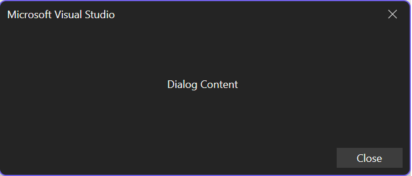

# Dialogs overview

Dialogs are a way to prompt a user for information or to allow for customizations of feature behavior. For example, the Tools/Options dialog has individual pages that let the user control the behavior for features like themes, editors, and document tabs.

## Get started

To get started, follow the [create the project](./../../get-started/create-your-first-extension.md) section in the Getting Started section.

## Work with dialogs

This guide is designed to cover the top user scenarios when working with dialogs:

- [Create a dialog](#create-a-dialog)
- [Customize the dialog title](#customize-the-dialog-title)
- [Customize the dialog buttons](#customize-the-dialog-buttons)
- [Get the dialog result](#get-the-dialog-result)

## Create a dialog

Creating a tool window with the new Extensibility Model is as simple as calling the ShowDialogAsync method from the [ShellExtensibility](https://github.com/microsoft/VSExtensibility/tree/main/docs/new-extensibility-model/api/Microsoft.VisualStudio.Extensibility.md/#T-Microsoft-VisualStudio-Extensibility-Shell-ShellExtensibility) helpers and passing in your dialog content.



### ShowDialogAsync

The ShowDialogAsync method several overloads that you should become familiar with:

#### Overloads

- [`Microsoft.VisualStudio.Extensibility.Shell.ShellExtensibility.ShowDialogAsync(content,cancellationToken)`](https://github.com/microsoft/VSExtensibility/tree/main/docs/new-extensibility-model/api/Microsoft.VisualStudio.Extensibility.md/#M-Microsoft-VisualStudio-Extensibility-Shell-ShellExtensibility-ShowDialogAsync-Microsoft-VisualStudio-RpcContracts-RemoteUI-IRemoteUserControl,System-Threading-CancellationToken-)
- [`Microsoft.VisualStudio.Extensibility.Shell.ShellExtensibility.ShowDialogAsync(content,title,cancellationToken)`](https://github.com/microsoft/VSExtensibility/tree/main/docs/new-extensibility-model/api/Microsoft.VisualStudio.Extensibility.md/#M-Microsoft-VisualStudio-Extensibility-Shell-ShellExtensibility-ShowDialogAsync-Microsoft-VisualStudio-RpcContracts-RemoteUI-IRemoteUserControl,System-String,System-Threading-CancellationToken-)
- [`Microsoft.VisualStudio.Extensibility.Shell.ShellExtensibility.ShowDialogAsync(content,options,cancellationToken)`](https://github.com/microsoft/VSExtensibility/tree/main/docs/new-extensibility-model/api/Microsoft.VisualStudio.Extensibility.md/#M-Microsoft-VisualStudio-Extensibility-Shell-ShellExtensibility-ShowDialogAsync-Microsoft-VisualStudio-RpcContracts-RemoteUI-IRemoteUserControl,Microsoft-VisualStudio-RpcContracts-Notifications-DialogOption,System-Threading-CancellationToken-)
- [`Microsoft.VisualStudio.Extensibility.Shell.ShellExtensibility.ShowDialogAsync(content,title,options,cancellationToken)`](https://github.com/microsoft/VSExtensibility/tree/main/docs/new-extensibility-model/api/Microsoft.VisualStudio.Extensibility.md/#M-Microsoft-VisualStudio-Extensibility-Shell-ShellExtensibility-ShowDialogAsync-Microsoft-VisualStudio-RpcContracts-RemoteUI-IRemoteUserControl,System-String,Microsoft-VisualStudio-RpcContracts-Notifications-DialogOption,System-Threading-CancellationToken-)

#### Parameters

| Name | Type | Description |
| ---- | ---- | ----------- |
| content | [Microsoft.VisualStudio.RpcContracts.RemoteUI.IRemoteUserControl](https://github.com/microsoft/VSExtensibility/tree/main/docs/new-extensibility-model/api/Microsoft.VisualStudio.Extensibility.md#T-Microsoft-VisualStudio-RpcContracts-RemoteUI-IRemoteUserControl 'Microsoft.VisualStudio.RpcContracts.RemoteUI.IRemoteUserControl') | The content of the dialog. |
| title | [System.String](/dotnet/api/System.String 'System.String') | The title of the dialog. |
| options | [Microsoft.VisualStudio.RpcContracts.Notifications.DialogOption](https://github.com/microsoft/VSExtensibility/tree/main/docs/new-extensibility-model/api/Microsoft.VisualStudio.Extensibility.md#T-Microsoft-VisualStudio-RpcContracts-Notifications-DialogOption 'Microsoft.VisualStudio.RpcContracts.Notifications.DialogOption') | The options for displaying the dialog. |
| cancellationToken | [System.Threading.CancellationToken](/dotnet/api/System.Threading.CancellationToken 'System.Threading.CancellationToken') | A [CancellationToken](/dotnet/api/System.Threading.CancellationToken 'System.Threading.CancellationToken') to cancel the dialog. |

```csharp
public override async Task ExecuteCommandAsync(IClientContext context, CancellationToken cancellationToken)
{
	// Ownership of the RemoteUserControl is transferred to Visual Studio, so it shouldn't be disposed by the extension
	#pragma warning disable CA2000 // Dispose objects before losing scope
	var control = new MyDialogControl(null);
	#pragma warning restore CA2000 // Dispose objects before losing scope

	await this.Extensibility.Shell().ShowDialogAsync(control, cancellationToken);
}
```

For more information on creating a RemoteUserControl, see [Remote UI](./../../inside-the-sdk/remote-ui.md).

## Customize the dialog title

When your extension shows a dialog, you can provide a custom title string which will be displayed in the dialog's caption region.


```csharp
public override async Task ExecuteCommandAsync(IClientContext context, CancellationToken cancellationToken)
{
	// Ownership of the RemoteUserControl is transferred to Visual Studio, so it shouldn't be disposed by the extension
	#pragma warning disable CA2000 // Dispose objects before losing scope
	var control = new MyDialogControl(null);
	#pragma warning restore CA2000 // Dispose objects before losing scope

	await this.Extensibility.Shell().ShowDialogAsync(control, "My Dialog Title", cancellationToken);
}
```

## Customize the dialog buttons

When a dialog is shown in the IDE, certain combinations of predefined dialog buttons and default actions can be selected. The predefined button and action combinations can be found in Microsoft.VisualStudio.RpcContracts.Notifications.DialogOption.


Additionally, you can create your own combination of buttons and default actions from:

- Microsoft.VisualStudio.RpcContracts.Notifications.DialogButton

    ```csharp
	public enum DialogButton
	{
		// Hides all of the dialog buttons.
		None,
		// Shows a single close button.
		Close,
		// Shows a single OK button.
		OK,
		// Shows an OK and Cancel button.
		OKCancel
	}
	```

- Microsoft.VisualStudio.RpcContracts.Notifications.DialogResult

	```csharp
    public enum DialogResult
	{
		// The dialog was closed via the System.Threading.CancellationToken or using an
		// action provided by the Microsoft.Visual Studio.RpcContracts.RemoteUI.IRemoteUserControl
		// content.
		None,
		// The user clicked the Close button.
		Close,
		// The user clicked the OK button.
		OK,
		// The user clicked the Cancel button, or clicked the nonclient close button, or
		// pressed the Esc key.
		Cancel
    }
   ```

### Examples

Adding a cancel button:

```csharp
public override async Task ExecuteCommandAsync(IClientContext context, CancellationToken cancellationToken)
{
	// Ownership of the RemoteUserControl is transferred to Visual Studio, so it shouldn't be disposed by the extension
	#pragma warning disable CA2000 // Dispose objects before losing scope
	var control = new MyDialogControl(null);
	#pragma warning restore CA2000 // Dispose objects before losing scope

	await this.Extensibility.Shell().ShowDialogAsync(control, DialogOption.OKCancel. cancellationToken);
}
```

Having no dialog buttons:

```csharp
public override async Task ExecuteCommandAsync(IClientContext context, CancellationToken cancellationToken)
{
	// Ownership of the RemoteUserControl is transferred to Visual Studio, so it shouldn't be disposed by the extension
	#pragma warning disable CA2000 // Dispose objects before losing scope
	var control = new MyDialogControl(null);
	#pragma warning restore CA2000 // Dispose objects before losing scope

	await this.Extensibility.Shell().ShowDialogAsync(control, new DialogOption(DialogButton.None, DialogResult.None), cancellationToken);
}
```

## Get the dialog result

If you need to know whether a user affirmatively closed a dialog or dismissed it, you can await the call to `ShowDialogAsync`, and it will return a `Microsoft.VisualStudio.RpcContracts.Notifications.DialogResult`, which represents the action taken by the user.

```csharp
public override async Task ExecuteCommandAsync(IClientContext context, CancellationToken cancellationToken)
{
	// Ownership of the RemoteUserControl is transferred to Visual Studio, so it shouldn't be disposed by the extension
	#pragma warning disable CA2000 // Dispose objects before losing scope
	var control = new MyDialogControl(null);
	#pragma warning restore CA2000 // Dispose objects before losing scope

	DialogResult result = await this.Extensibility.Shell().ShowDialogAsync(control, "My Dialog Title", DialogOption.OKCancel, cancellationToken);

	if (result == DialogResult.OK)
	{
		// User clicked the OK button
	}
}
```

## Next steps

See the [DialogExtension](https://github.com/Microsoft/VSExtensibility/tree/main/New_Extensibility_Model/Samples/DialogExtension) sample for a full example of creating an extension with a dialog.