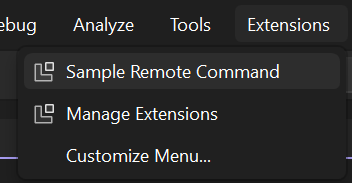

# Using VisualStudio.Extensibility SDK and VSSDK together

While the VisualStudio.Extensibility model was created primarily to host extensions outside of the devenv.exe process, it's possible to use VisualStudio.Extensibility SDK APIs in an extension running in the Visual Studio process and utilizing traditional extensibility APIs provided by the [Microsoft.VisualStudio.Sdk](https://www.nuget.org/packages/Microsoft.VisualStudio.Sdk) packages.

The support of *in-proc* usage is meant to allow early adopters to the new VisualStudio.Extensibility APIs while relying on [Microsoft.VisualStudio.Sdk](https://www.nuget.org/packages/Microsoft.VisualStudio.Sdk) to cover any feature gap.

This document is a quick walkthrough on different options to utilize VisualStudio.Extensibility SDK in-proc.

* If you're developing a new extension, our recommended method is to create a VisualStudio.Extension that is hosted in-process following [this tutorial](#create-your-first-vssdk-compatible-visualstudioextensibility-extension). This method allows you to use full capabilities of VisualStudio.Extensibility SDK in addition to being able to inject VSSDK and MEF services.

* If you have an existing VSSDK extension, you can follow [these tips](#use-visualstudioextensibility-from-existing-vssdk-extensions) to use the new [VisualStudioExtensibility](/dotnet/api/microsoft.visualstudio.extensibility.visualstudioextensibility) instance in your extension.

* If you want to add commands, debug visualizers, tool windows to your existing VSSDK extension by using the VisualStudio.Extensibility SDK, you can refer to [these tips](#add-a-visualstudioextensibility-extension-to-an-existing-vssdk-extension-project) to host both a VSSDK extension and a VisualStudio.Extensibility extension in the same VS extension project.

## Create your first VSSDK-compatible VisualStudio.Extensibility extension

While the VisualStudio.Extensibility model was created primarily to host extensions outside of the devenv.exe process, starting with Visual Studio 2022 17.4 Preview 1 it's possible to build a VisualStudio.Extensibility extension that's hosted within devenv.exe and can use traditional extensibility APIs provided by the [Microsoft.VisualStudio.Sdk](https://www.nuget.org/packages/Microsoft.VisualStudio.Sdk) packages.

### Prerequisites

* Visual Studio 2022 version 17.9 Preview 1 or higher with the `Visual Studio extension development` workload.
* If you're updating from earlier builds, make sure to uninstall VisualStudio.Extensibility Project System to avoid potential conflicts.

### Create the extension project

* Use the *VisualStudio.Extensibility Extension with VSSDK Compatibility* template to create a new solution.


### Debug your extension

* Press `F5` to start debugging, this builds your extension and deploys it to the experimental instance of Visual Studio version you're using. The debugger should attach once your extension is loaded.

* You can find the command in `Extensions` menu as shown in the following image:

  

## Consuming Visual Studio SDK services from a VisualStudio.Extensibility extension

A VS-SDK-compatible extension project references the [Microsoft.VisualStudio.Sdk](https://www.nuget.org/packages/Microsoft.VisualStudio.Sdk) package, which allows access to all Visual Studio SDK's services.

Traditionally, such services are consumed through either [MEF](/visualstudio/extensibility/managed-extensibility-framework-in-the-editor) or the [AsyncServiceProvider](/dotnet/api/microsoft.visualstudio.shell.asyncserviceprovider). A VisualStudio.Extensibility extender is instead encouraged to  [.NET dependency injection](/dotnet/core/extensions/dependency-injection).

The `MefInjection<TService>` and `AsyncServiceProviderInjection<TService, TInterface>` classes (both from the `Microsoft.VisualStudio.Extensibility.VSSdkCompatibility` namespace) allow you to consume the Visual Studio SDK's services by adding them to the constructor of a class that is instantiated through dependency injection (like a command, tool window or extension part).

The following example shows how the `DTE2` and `IBufferTagAggregatorFactoryService` services can be added to a command.

```CSharp
    [VisualStudioContribution]
    public class Command1 : Command
    {
        private TraceSource traceSource;
        private AsyncServiceProviderInjection<DTE, DTE2> dte;
        private MefInjection<IBufferTagAggregatorFactoryService> bufferTagAggregatorFactoryService;

        public Command1(
            VisualStudioExtensibility extensibility,
            TraceSource traceSource,
            AsyncServiceProviderInjection<DTE, DTE2> dte,
            MefInjection<IBufferTagAggregatorFactoryService> bufferTagAggregatorFactoryService)
            : base(extensibility)
        {
            this.dte = dte;
            this.bufferTagAggregatorFactoryService = bufferTagAggregatorFactoryService;
        }
    
        public override CommandConfiguration CommandConfiguration => new("Sample Remote Command")
        {
            Placements = new[] { CommandPlacement.KnownPlacements.ExtensionsMenu },
            Icon = new(ImageMoniker.KnownValues.Extension, IconSettings.IconAndText),
        };
```

## Anatomy of a VSSDK-compatible VisualStudio.Extensibility extension

While using the *VisualStudio.Extensibility Extension with VSSDK Compatibility* template takes care of setting up the entire project, it's useful to know what are the basic components of a VS-SDK-compatible VisualStudio.Extensibility extension and how it differs from the common variant described in the ["create your first extension" guide](create-your-first-extension.md).

### TargetFramework and VssdkCompatibleExtension

The extension project must target the .NET version used by the target Visual Studio version. For Visual Studio 2022, they must target .NET Framework 4.7.2.

The extension project must also contain the `VssdkCompatibleExtension` property set to `true`.

```xml
<PropertyGroup>
  <VssdkCompatibleExtension>true</VssdkCompatibleExtension>
</PropertyGroup>
```

### RequiresInProcessHosting property

The [`Extension`](/dotnet/api/microsoft.visualstudio.extensibility.extension) class must be configured with the `RequiresInProcessHosting = true` property that identifies the extension as being *in-process*.

```CSharp
[VisualStudioContribution]
internal class MyExtension : Extension
{
    public override ExtensionConfiguration? ExtensionConfiguration => new()
    {
        RequiresInProcessHosting = true,
    };

    ...
```

### Package manifest

The extension project must include a [package manifest](/visualstudio/extensibility/vsix-extension-schema-2-0-reference) named `source.extension.vsixmanifest`. The `Installation` tag must have `ExtensionType` set to `VSSDK+VisualStudio.Extensibility`.

```xml
<?xml version="1.0" encoding="utf-8"?>
<PackageManifest Version="2.0.0" xmlns="http://schemas.microsoft.com/developer/vsx-schema/2011" xmlns:d="http://schemas.microsoft.com/developer/vsx-schema-design/2011">
    <Metadata>
        <Identity Id="MyExtensionId.f14b8c45-154f-4584-abd7-9ec22af003e2" Version="1.0" Language="en-US" Publisher="Microsoft" />
        <DisplayName>My extension</DisplayName>
        <Description xml:space="preserve">My extension's description.</Description>
    </Metadata>
    <Installation ExtensionType="VSSDK+VisualStudio.Extensibility">
        <InstallationTarget Id="Microsoft.VisualStudio.Community" Version="[17.9,18.0)">
            <ProductArchitecture>amd64</ProductArchitecture>
        </InstallationTarget>
      <InstallationTarget Id="Microsoft.VisualStudio.Community" Version="[17.9,18.0)">
        <ProductArchitecture>arm64</ProductArchitecture>
      </InstallationTarget>
    </Installation>
    <Prerequisites>
        <Prerequisite Id="Microsoft.VisualStudio.Component.CoreEditor" Version="[17.0,)" DisplayName="Visual Studio core editor" />
    </Prerequisites>
    <Assets>
        <Asset Type="Microsoft.VisualStudio.VsPackage" d:Source="Project" d:ProjectName="%CurrentProject%" Path="|%CurrentProject%;PkgdefProjectOutputGroup|" />
    </Assets>
</PackageManifest>
```

## Use VisualStudio.Extensibility from existing VSSDK extensions

For existing VSSDK extensions, another option is to query for the [VisualStudioExtensibility](/dotnet/api/microsoft.visualstudio.extensibility.visualstudioextensibility) instance via service provider and utilize its methods. This method allows you to use new the API surface area of VisualStudio.Extensibility SDK in your existing components. This option can be useful in situations where you like to use the new API to query project information, document management without creating a new VisualStudio.Extensibility-based extension. 

Here's an example code snippet that shows how one can utilize `VisualStudioExtensibility` within a VSSDK package:

* In your `.csproj` file, include a package reference to VisualStudio.Extensibility APIs:

```XML
  <ItemGroup>
    <PackageReference Include="Microsoft.VisualStudio.Extensibility" Version="17.9.2092" />
  </ItemGroup>
```

* You can now query for [VisualStudioExtensibility](/dotnet/api/microsoft.visualstudio.extensibility.visualstudioextensibility) instance via `GetServiceAsync` method in your package or other components:

```CSharp
...
using Microsoft.VisualStudio.Extensibility;
...

public class VSSDKPackage : AsyncPackage
{
    protected override async Task InitializeAsync(CancellationToken cancellationToken, IProgress<ServiceProgressData> progress)
    {
        VisualStudioExtensibility extensibility = await this.GetServiceAsync<VisualStudioExtensibility, VisualStudioExtensibility>();
        await extensibility.Shell().ShowPromptAsync("Hello from in-proc", PromptOptions.OK, cancellationToken);
        ...
    }
}
```

## Add a VisualStudio.Extensibility extension to an existing VSSDK extension project

If you also want to contribute components like tool windows, editor listeners using the VisualStudio.Extensibility SDK within your existing VSSDK extension, you will have to follow additional steps to create a VisualStudio.Extensibility [Extension](/dotnet/api/microsoft.visualstudio.extensibility.extension) instance in your project.

* You need an SDK style `.csproj` in order to utilize VisualStudio.Extensibility SDK packages. For existing projects, you might need to update your `.csproj` to an SDK style one.

* Remove package reference for `Microsoft.VSSDK.BuildTools` and instead add package references for VisualStudio.Extensibility.

```XML
    <PackageReference Include="Microsoft.VisualStudio.Extensibility.Sdk" Version="17.9.2092" PrivateAssets="all" />
    <PackageReference Include="Microsoft.VisualStudio.Extensibility.Build" Version="17.9.2092" PrivateAssets="all" />
```

* Add `VssdkCompatibleExtension` property to your project file, setting it to `true`. This property will enable some VSSDK features for compatibility.

```XML
<PropertyGroup>
    <VssdkCompatibleExtension>true</VssdkCompatibleExtension>
</PropertyGroup>    
```

* Create a new extension class inheriting from [`Extension`](/dotnet/api/microsoft.visualstudio.extensibility.extension) base class and set [RequiresInProcessHosting](#requiresinprocesshosting-property) property as shown previously.
* Modify the `source.extension.vsixmanifest` file adding `ExtensionType="VSSDK+VisualStudio.Extensibility"` to the `Installation` tag.

```xml
<Installation ExtensionType="VSSDK+VisualStudio.Extensibility">
```

You can now use all capabilities of VisualStudio.Extensibility together with your existing VSSDK extension.
