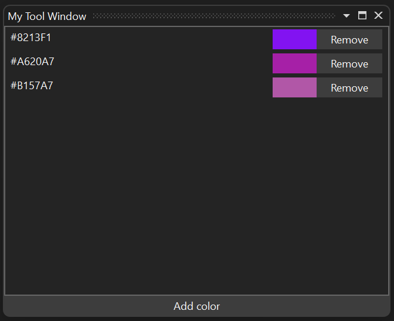
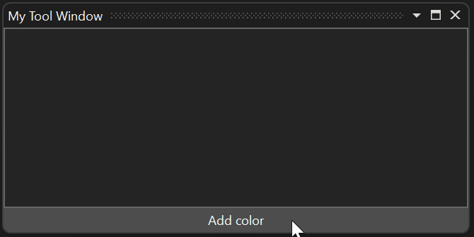
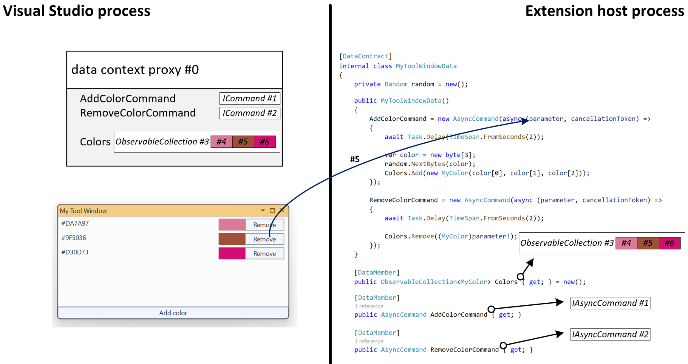
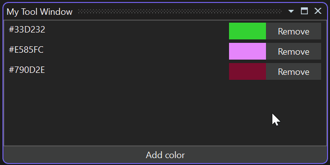
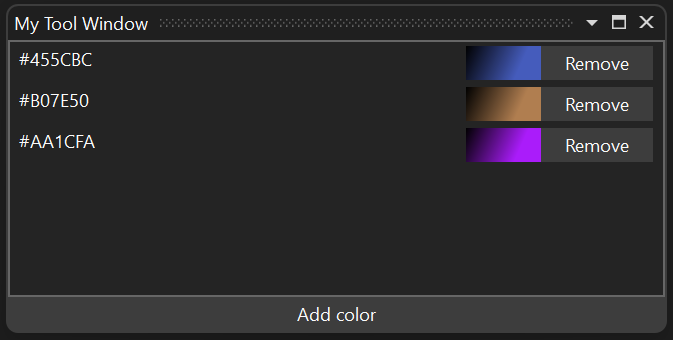

# Tutorial: Advanced remote UI

In this tutorial, you learn about advanced Remote UI concepts by incrementally modifying a tool window that shows a list of random colors:



You'll learn about:

- How multiple *async commands* executions can run in parallel and how to disable UI elements when a command is running.
- How to bind multiple buttons to the same *async command*.
- How reference types are handled in the Remote UI data context and its proxy.
- How to use an *async command* as an event handler.
- How to disable a single button when its *async command*'s callback is executing if multiple buttons are bound to the same command.
- How to use XAML resource dictionaries from a Remote UI control.
- How to use WPF types, like complex brushes, in the Remote UI data context.
- How Remote UI handles threading.

This tutorial is based on the introductory [Remote UI](remote-ui.md) article and expects that you have a working VisualStudio.Extensibility extension including:

1. a `.cs` file for the command that opens the tool window,
1. a `MyToolWindow.cs` file for the [`ToolWindow`](/dotnet/api/microsoft.visualstudio.extensibility.toolwindows.toolwindow) class,
1. a `MyToolWindowContent.cs` file for the [`RemoteUserControl`](/dotnet/api/microsoft.visualstudio.extensibility.ui.remoteusercontrol) class,
1. a `MyToolWindowContent.xaml` embedded resource file for the `RemoteUserControl` xaml definition,
1. a `MyToolWindowData.cs` file for the data context of the `RemoteUserControl`.

To start, update `MyToolWindowContent.xaml` to show a list view and a button":

```xml
<DataTemplate xmlns="http://schemas.microsoft.com/winfx/2006/xaml/presentation"
              xmlns:x="http://schemas.microsoft.com/winfx/2006/xaml"
              xmlns:vs="http://schemas.microsoft.com/visualstudio/extensibility/2022/xaml"
              xmlns:styles="clr-namespace:Microsoft.VisualStudio.Shell;assembly=Microsoft.VisualStudio.Shell.15.0"
              xmlns:colors="clr-namespace:Microsoft.VisualStudio.PlatformUI;assembly=Microsoft.VisualStudio.Shell.15.0">
    <Grid x:Name="RootGrid">
        <Grid.Resources>
            <Style TargetType="ListView" BasedOn="{StaticResource {x:Static styles:VsResourceKeys.ThemedDialogListViewStyleKey}}" />
            <Style TargetType="Button" BasedOn="{StaticResource {x:Static styles:VsResourceKeys.ButtonStyleKey}}" />
            <Style TargetType="TextBlock">
                <Setter Property="Foreground" Value="{DynamicResource {x:Static styles:VsBrushes.WindowTextKey}}" />
            </Style>
        </Grid.Resources>
        <Grid.RowDefinitions>
            <RowDefinition Height="*"/>
            <RowDefinition Height="Auto" />
        </Grid.RowDefinitions>
        <ListView ItemsSource="{Binding Colors}" HorizontalContentAlignment="Stretch">
            <ListView.ItemTemplate>
                <DataTemplate>
                    <Grid>
                        <Grid.ColumnDefinitions>
                            <ColumnDefinition Width="*" />
                            <ColumnDefinition Width="Auto" />
                            <ColumnDefinition Width="Auto" />
                        </Grid.ColumnDefinitions>
                        <TextBlock Text="{Binding ColorText}" />
                        <Rectangle Fill="{Binding Color}" Width="50px" Grid.Column="1" />
                        <Button Content="Remove" Grid.Column="2" />
                    </Grid>
                </DataTemplate>
            </ListView.ItemTemplate>
        </ListView>
        <Button Content="Add color" Command="{Binding AddColorCommand}" Grid.Row="1" />
    </Grid>
</DataTemplate>
```

Then, update the data context class `MyToolWindowData.cs`:

```CSharp
using Microsoft.VisualStudio.Extensibility.UI;
using System.Collections.ObjectModel;
using System.Runtime.Serialization;
using System.Text;
using System.Windows.Media;

namespace MyToolWindowExtension;

[DataContract]
internal class MyToolWindowData
{
    private Random random = new();

    public MyToolWindowData()
    {
        AddColorCommand = new AsyncCommand(async (parameter, cancellationToken) =>
        {
            await Task.Delay(TimeSpan.FromSeconds(2));

            var color = new byte[3];
            random.NextBytes(color);
            Colors.Add(new MyColor(color[0], color[1], color[2]));
        });
    }

    [DataMember]
    public ObservableList<MyColor> Colors { get; } = new();

    [DataMember]
    public AsyncCommand AddColorCommand { get; }

    [DataContract]
    public class MyColor
    {
        public MyColor(byte r, byte g, byte b)
        {
            ColorText = Color = $"#{r:X2}{g:X2}{b:X2}";
        }

        [DataMember]
        public string ColorText { get; }

        [DataMember]
        public string Color { get; }
    }
}
```

There are just a few noteworthy things in this code:

- `MyColor.Color` is a `string` but it's used as a `Brush` when data bound in XAML, this is a capability provided by WPF.
- The `AddColorCommand` async callback contains a 2-second delay to simulate a long-running operation.
- We use [ObservableList\<T\>](/dotnet/api/microsoft.visualstudio.extensibility.ui.observablelist-1), which is an extended [ObservableCollection\<T\>](/dotnet/api/system.collections.objectmodel.observablecollection-1) provided by Remote UI to also support range operations, allowing better performance.
- `MyToolWindowData` and `MyColor` don't implement [INotifyPropertyChanged](/dotnet/api/system.componentmodel.inotifypropertychanged) because, at the moment, all properties are readonly.

## Handle long-running async commands

One of the most important differences between Remote UI and normal WPF is that all operations that involve communication between the UI and the extension are async.

*Async commands* like `AddColorCommand` make this explicit by providing an async callback.

You can see the effect of this if you click the **Add color** button multiple times in a short time: since each command execution takes 2 seconds, multiple executions occur in parallel and multiple colors will appear in the list together when the 2-second delay is over. This might give the impression to the user that the **Add color** button isn't working.



To address this, disable the button while the *async command* is executing. The most straightforward way to do this is to simply set `CanExecute` for the command to false:

```CSharp
AddColorCommand = new AsyncCommand(async (parameter, ancellationToken) =>
{
    AddColorCommand!.CanExecute = false;
    try
    {
        await Task.Delay(TimeSpan.FromSeconds(2));
        var color = new byte[3];
        random.NextBytes(color);
        Colors.Add(new MyColor(color[0], color[1], color[2]));
    }
    finally
    {
        AddColorCommand.CanExecute = true;
    }
});
```

This solution still has imperfect synchronization since, when the user clicks the button, the command callback is executed asynchronously in the extension, the callback sets `CanExecute` to `false`, which is then propagated asynchronously to the proxy data context in the Visual Studio process resulting in the button being disabled. The user could click the button twice in rapid succession before the button is disabled.

A better solution is to use the `RunningCommandsCount` property of *async commands*:

```xml
<Button Content="Add color" Command="{Binding AddColorCommand}" IsEnabled="{Binding AddColorCommand.RunningCommandsCount.IsZero}" Grid.Row="1" />
```

`RunningCommandsCount` is a counter of how many concurrent async executions of the command are currently underway. This counter is incremented on the UI thread as soon as the button is clicked, which allows to synchronously disable the button by binding `IsEnabled` to `RunningCommandsCount.IsZero`.

Because all Remote UI commands execute asynchronously, the best practice is to always use `RunningCommandsCount.IsZero` to disable controls when appropriate, even if the command is expected to complete quickly.

## *Async commands* and data templates

In this section, you implement the **Remove** button, which allows the user to delete an entry from the list. We can either create one *async command* for each `MyColor` object or we can have a single *async command* in `MyToolWindowData` and use a parameter to identify which color should be removed. The latter option is a cleaner design, so let's implement that.

1. Update the button XAML in the data template:

```xml
<Button Content="Remove" Grid.Column="2"
        Command="{Binding DataContext.RemoveColorCommand,
            RelativeSource={RelativeSource FindAncestor, AncestorType={x:Type ListView}}}"
        CommandParameter="{Binding}"
        IsEnabled="{Binding DataContext.RemoveColorCommand.RunningCommandsCount.IsZero,
            RelativeSource={RelativeSource FindAncestor, AncestorType={x:Type ListView}}}" />
```

2. Add the corresponding [`AsyncCommand`](/dotnet/api/microsoft.visualstudio.extensibility.ui.asynccommand) to `MyToolWindowData`:

```CSharp
[DataMember]
public AsyncCommand RemoveColorCommand { get; }
```

3. Set the command's async callback in the constructor of `MyToolWindowData`:

```CSharp
RemoveColorCommand = new AsyncCommand(async (parameter, ancellationToken) =>
{
    await Task.Delay(TimeSpan.FromSeconds(2));

    Colors.Remove((MyColor)parameter!);
});
```

This code uses a `Task.Delay` to simulate a long running *async command* execution.

## Reference types in the data context

In the previous code, a `MyColor` object is received as the parameter of an *async command* and used as parameter of a `List<T>.Remove` call, which employs reference equality (since `MyColor` is a reference type that doesn't override `Equals`) to identify the element to remove. This is possible because, even if the parameter is received from the UI, the exact instance of `MyColor` that is currently part of the data context is received, not a copy.

The processes of

- proxying the data context of a *remote user control*;
- sending `INotifyPropertyChanged` updates from the extension to Visual Studio or vice versa;
- sending observable collection updates from the extension to Visual Studio, or vice versa;
- sending *async command* parameters

all honor the identity of reference type objects. Except for strings, reference type objects are never duplicated when transferred back to the extension.



In the picture, you can see how every reference type object in the data context (the commands, the collection, each `MyColor` and even the entire data context) is assigned a unique identifier by the Remote UI infrastructure. When the user clicks the **Remove** button for the proxy color object *#5*, the unique identifier (*#5*), not the value of the object, is sent back to the extension. The Remote UI infrastructure takes care of retrieving the corresponding `MyColor` object and passing it as parameter to the *async command*'s callback.

## RunningCommandsCount with multiple bindings and event handling

If you test the extension at this point, notice that when one of the **Remove** buttons is clicked, all **Remove** buttons are disabled:


This may be the desired behavior. But, suppose you want only the current button to be disabled and you allow the user to queue multiple colors for removal: we can't use the *async command*'s `RunningCommandsCount` property because we have a single command shared between all the buttons.

We can achieve our goal by attaching a `RunningCommandsCount` property to each button so that we have a separate counter for each color. These features are provided by the `http://schemas.microsoft.com/visualstudio/extensibility/2022/xaml` namespace, which allows you to consume Remote UI types from XAML:

We change the **Remove** button to the following:

```xml
<Button Content="Remove" Grid.Column="2"
        IsEnabled="{Binding Path=(vs:ExtensibilityUICommands.RunningCommandsCount).IsZero, RelativeSource={RelativeSource Self}}">
    <vs:ExtensibilityUICommands.EventHandlers>
        <vs:EventHandlerCollection>
            <vs:EventHandler Event="Click"
                             Command="{Binding DataContext.RemoveColorCommand, ElementName=RootGrid}"
                             CommandParameter="{Binding}"
                             CounterTarget="{Binding RelativeSource={RelativeSource Self}}" />
        </vs:EventHandlerCollection>
    </vs:ExtensibilityUICommands.EventHandlers>
</Button>
```

The `vs:ExtensibilityUICommands.EventHandlers` attached property allows assigning *async commands* to any event (for example, `MouseRightButtonUp`) and can be useful in more advanced scenarios.

`vs:EventHandler` can also have a `CounterTarget`: a `UIElement` to which a `vs:ExtensibilityUICommands.RunningCommandsCount` property should be attached, counting the active executions related to that specific event. Make sure to use parentheses (for example `Path=(vs:ExtensibilityUICommands.RunningCommandsCount).IsZero`) when binding to an attached property.

In this case, we use `vs:EventHandler` to attach to each button its own separate counter of active command executions. By binding `IsEnabled` to the attached property, only that specific button is disabled when the corresponding color is being removed:



## User XAML resource dictionaries

Starting with Visual Studio 17.10, Remote UI supports [XAML resource dictionaries](/windows/apps/design/style/xaml-resource-dictionary). This allows multiple Remote UI controls to share styles, templates, and other resources. It also allows you to define different resources (E.g., strings) for different languages.

Similarly to a Remote UI control XAML, resource files must be configured as embedded resources:

```xml
<ItemGroup>
  <EmbeddedResource Include="MyResources.xaml" />
  <Page Remove="MyResources.xaml" />
</ItemGroup>
```

Remote UI references resource dictionaries in a different way than WPF: they are not added to the control's merged dictionaries (merged dictionaries are not supported at all by Remote UI) but referenced by name in the control's .cs file:

```cs
internal class MyToolWindowContent : RemoteUserControl
{
    public MyToolWindowContent()
        : base(dataContext: new MyToolWindowData())
    {
        this.ResourceDictionaries.AddEmbeddedResource(
            "MyToolWindowExtension.MyResources.xaml");
    }
...
```

`AddEmbeddedResource` takes the full name of the embedded resource which, by default, is composed of the root namespace for the project, any subfolder path it may be under, and the file name. It is possible to override such name by setting a `LogicalName` for the `EmbeddedResource` in the project file.

The resource file itself is a normal WPF resource dictionary:

```xml
<ResourceDictionary xmlns="http://schemas.microsoft.com/winfx/2006/xaml/presentation"
    xmlns:x="http://schemas.microsoft.com/winfx/2006/xaml"
    xmlns:system="clr-namespace:System;assembly=mscorlib">
  <system:String x:Key="removeButtonText">Remove</system:String>
  <system:String x:Key="addButtonText">Add color</system:String>
</ResourceDictionary>
```

You can reference a resource from the resource dictionary in the Remote UI control using `DynamicResource`:

```xml
<Button Content="{DynamicResource removeButtonText}" ...
```

## Localizing XAML resource dictionaries

Remote UI resource dictionaries can be localized in the same way as you would localize embedded resources: you create other XAML files with the same name and a language suffix, for example `MyResources.it.xaml` for Italian resources:

```xml
<ResourceDictionary xmlns="http://schemas.microsoft.com/winfx/2006/xaml/presentation"
    xmlns:x="http://schemas.microsoft.com/winfx/2006/xaml"
    xmlns:system="clr-namespace:System;assembly=mscorlib">
  <system:String x:Key="removeButtonText">Rimuovi</system:String>
  <system:String x:Key="addButtonText">Aggiungi colore</system:String>
</ResourceDictionary>
```

You can use wildcards in the project file to include all localized XAML dictionaries as embedded resources:

```xml
<ItemGroup>
  <EmbeddedResource Include="MyResources.*xaml" />
  <Page Remove="MyResources.*xaml" />
</ItemGroup>
```

## Use WPF types in the data context

Until now, the data context of our *remote user control* has been composed of primitives (numbers, strings, etc.), observable collections and our own classes marked with `DataContract`. it's sometimes useful to include simple WPF types in the data context like complex brushes.

Because a *VisualStudio.Extensibility* extension may not even run in the Visual Studio process, it can't share WPF objects directly with its UI. The extension may not even have access to WPF types since it can target `netstandard2.0` or `net6.0` (not the `-windows` variant).

Remote UI provides the [`XamlFragment`](/dotnet/api/microsoft.visualstudio.extensibility.ui.xamlfragment) type, which allows including a XAML definition of a WPF object in the data context of a *remote user control*:

```CSharp
[DataContract]
public class MyColor
{
    public MyColor(byte r, byte g, byte b)
    {
        ColorText = $"#{r:X2}{g:X2}{b:X2}";
        Color = new(@$"<LinearGradientBrush xmlns=""http://schemas.microsoft.com/winfx/2006/xaml/presentation""
                               StartPoint=""0,0"" EndPoint=""1,1"">
                           <GradientStop Color=""Black"" Offset=""0.0"" />
                           <GradientStop Color=""{ColorText}"" Offset=""0.7"" />
                       </LinearGradientBrush>");
    }

    [DataMember]
    public string ColorText { get; }

    [DataMember]
    public XamlFragment Color { get; }
}
```

With the code above, the `Color` property value is converted to a `LinearGradientBrush` object in the data context proxy:


## Remote UI and threads

*Async command* callbacks (and `INotifyPropertyChanged` callbacks for values updated by the UI through data binding) are raised on random thread pool threads. Callbacks are raised one at a time and won't overlap until the code yields control (using an `await` expression).

This behavior can be changed by passing a [NonConcurrentSynchronizationContext](/dotnet/api/microsoft.visualstudio.threading.nonconcurrentsynchronizationcontext) to the [`RemoteUserControl`](/dotnet/api/microsoft.visualstudio.extensibility.ui.remoteusercontrol) constructor. In that case, you can use the provided synchronization context for all *async command* and `INotifyPropertyChanged` callbacks related to that control.

## Related content

- [Components of a VisualStudio.Extensibility extension](./extension-anatomy.md).
