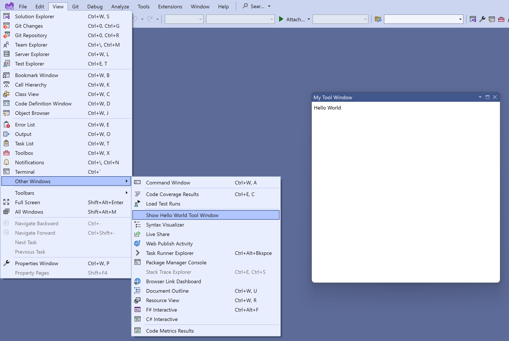
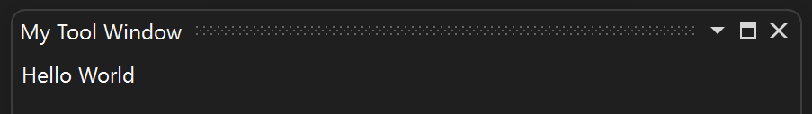
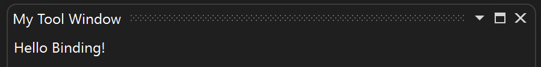
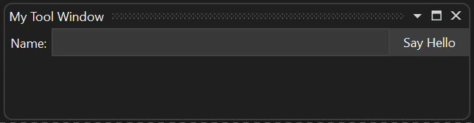
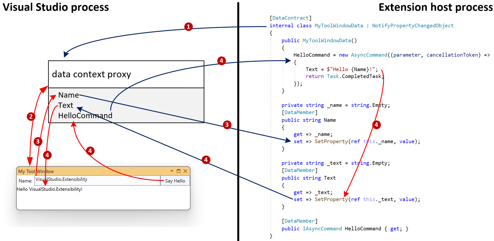

# Why Remote UI

One of the main goals of the VisualStudio.Extensibility model is to allow extensions to run outside of the Visual Studio process. This decision introduces an obstacle for adding UI support to extensions since most UI frameworks are in-process.

Remote UI is a set of classes allowing you to define WPF (Windows Presentation Foundation) controls in an out-of-process extension and showing them as part of the Visual Studio UI.

Remote UI leans heavily towards the [Model-View-ViewModel](/archive/msdn-magazine/2009/february/patterns-wpf-apps-with-the-model-view-viewmodel-design-pattern) design pattern relying on XAML (Extensible Application Markup Language) and data binding, commands (instead of events), and triggers (instead of interacting with the [logical tree](/dotnet/desktop/wpf/advanced/trees-in-wpf) from code-behind).

While Remote UI was developed to support out-of-process extensions, VisualStudio.Extensibility APIs that rely on Remote UI, like [`ToolWindow`](/dotnet/api/microsoft.visualstudio.extensibility.toolwindows.toolwindow), use Remote UI for in-process extensions as well.

The main differences between Remote UI and normal WPF development are:

- Most Remote UI operations, including binding to the data context and command execution, are asynchronous.
- When defining data types to be used in Remote UI data contexts, they must be decorated with the `DataContract` and `DataMember` attributes and their type must be serializable by Remote UI (see [here](#serializable-types-and-remote-ui-data-context) for details).
- Remote UI doesn't allow referencing your own custom controls.
- A *Remote user control* is fully defined in a single XAML file that references a single (but potentially complex and nested) data context object.
- Remote UI doesn't support code behind or event handlers (workarounds are described in the [advanced Remote UI concepts](advanced-remote-ui.md) document).
- A *Remote user control* is instantiated in the Visual Studio process, not the process hosting the extension: the XAML can't reference types and assemblies from the extension but can reference types and assemblies from the Visual Studio process.

## Create a Remote UI Hello World extension

Start by creating the most basic Remote UI extension. Follow the instructions in [Creating your first out-of-process Visual Studio extension](../get-started/create-your-first-extension.md).

You should now have a working extension with a single command. The next step is to add a [`ToolWindow`](/dotnet/api/microsoft.visualstudio.extensibility.toolwindows.toolwindow) and a [`RemoteUserControl`](/dotnet/api/microsoft.visualstudio.extensibility.ui.remoteusercontrol). The `RemoteUserControl` is the Remote UI equivalent of a WPF user control.

You end up with four files:

1. a `.cs` file for the command that opens the tool window,
1. a `.cs` file for the [`ToolWindow`](/dotnet/api/microsoft.visualstudio.extensibility.toolwindows.toolwindow) that provides the [`RemoteUserControl`](/dotnet/api/microsoft.visualstudio.extensibility.ui.remoteusercontrol) to Visual Studio,
1. a `.cs` file for the `RemoteUserControl` that references its XAML definition,
1. a `.xaml` file for the `RemoteUserControl`.

Later on, you add a data context for the [`RemoteUserControl`](/dotnet/api/microsoft.visualstudio.extensibility.ui.remoteusercontrol), which represents the *ViewModel* in the MVVM (Model-View-ViewModel) pattern.

## Update the command

Update the code of the command to show the tool window using [`ShowToolWindowAsync`](/dotnet/api/microsoft.visualstudio.extensibility.shell.shellextensibility.showtoolwindowasync):

```CSharp
public override Task ExecuteCommandAsync(IClientContext context, CancellationToken cancellationToken)
{
    return Extensibility.Shell().ShowToolWindowAsync<MyToolWindow>(activate: true, cancellationToken);
}
```

You can also consider changing [`CommandConfiguration`](/dotnet/api/microsoft.visualstudio.extensibility.commands.commandconfiguration) and `string-resources.json` for a more appropriate display message and placement:

```CSharp
public override CommandConfiguration CommandConfiguration => new("%MyToolWindowCommand.DisplayName%")
{
    Placements = new[] { CommandPlacement.KnownPlacements.ViewOtherWindowsMenu },
};
```

```json
{
  "MyToolWindowCommand.DisplayName": "My Tool Window"
}
```

## Create the tool window

Create a new `MyToolWindow.cs` file and define a `MyToolWindow` class extending [`ToolWindow`](/dotnet/api/microsoft.visualstudio.extensibility.toolwindows.toolwindow).

The [`GetContentAsync`](/dotnet/api/microsoft.visualstudio.extensibility.toolwindows.toolwindow.getcontentasync) method should return an `IRemoteUserControl` that you'll define in the next step. Since the remote user control is disposable, take care of disposing it by overriding the `Dispose(bool)` method.

```CSharp
namespace MyToolWindowExtension;

using Microsoft.VisualStudio.Extensibility;
using Microsoft.VisualStudio.Extensibility.ToolWindows;
using Microsoft.VisualStudio.RpcContracts.RemoteUI;

[VisualStudioContribution]
internal class MyToolWindow : ToolWindow
{
    private readonly MyToolWindowContent content = new();

    public MyToolWindow(VisualStudioExtensibility extensibility)
        : base(extensibility)
    {
        Title = "My Tool Window";
    }

    public override ToolWindowConfiguration ToolWindowConfiguration => new()
    {
        Placement = ToolWindowPlacement.DocumentWell,
    };

    public override async Task<IRemoteUserControl> GetContentAsync(CancellationToken cancellationToken)
        => content;

    public override Task InitializeAsync(CancellationToken cancellationToken)
        => Task.CompletedTask;

    protected override void Dispose(bool disposing)
    {
        if (disposing)
            content.Dispose();

        base.Dispose(disposing);
    }
}
```

## Create the remote user control

Perform this action across three files:

### Remote user control class

The remote user control class, named `MyToolWindowContent`, is straightforward:

```CSharp
namespace MyToolWindowExtension;

using Microsoft.VisualStudio.Extensibility.UI;

internal class MyToolWindowContent : RemoteUserControl
{
    public MyToolWindowContent()
        : base(dataContext: null)
    {
    }
}
```

You don't need a data context yet, so you can set it to `null` for now.

A class extending [`RemoteUserControl`](/dotnet/api/microsoft.visualstudio.extensibility.ui.remoteusercontrol) automatically uses the XAML embedded resource with the same name. If you want to change this behavior, override the [`GetXamlAsync`](/dotnet/api/microsoft.visualstudio.extensibility.ui.remoteusercontrol.getxamlasync) method.

### XAML definition

Next, create a file named `MyToolWindowContent.xaml`:

```xml
<DataTemplate xmlns="http://schemas.microsoft.com/winfx/2006/xaml/presentation"
              xmlns:x="http://schemas.microsoft.com/winfx/2006/xaml"
              xmlns:vs="http://schemas.microsoft.com/visualstudio/extensibility/2022/xaml">
    <Label>Hello World</Label>
</DataTemplate>
```

The XAML definition of the remote user control is normal WPF XAML describing a `DataTemplate`. This XAML is sent to Visual Studio and used to fill the tool window content. We use a special namespace (`xmlns` attribute) for Remote UI XAML: `http://schemas.microsoft.com/visualstudio/extensibility/2022/xaml`.

### Setting the XAML as an embedded resource

Finally, open the `.csproj` file and make sure that the XAML file is treated as an embedded resource:

```xml
<ItemGroup>
  <EmbeddedResource Include="MyToolWindowContent.xaml" />
  <Page Remove="MyToolWindowContent.xaml" />
</ItemGroup>
```

As described previously, the XAML file must have the same name as the *remote user control* class. To be precise, the full name of the class extending [`RemoteUserControl`](/dotnet/api/microsoft.visualstudio.extensibility.ui.remoteusercontrol) must match the name of the embedded resource. For example, if the full name of the *remote user control class* is `MyToolWindowExtension.MyToolWindowContent`, the embedded resource name should be `MyToolWindowExtension.MyToolWindowContent.xaml`. By default, embedded resources are assigned a name that is composed by the root namespace for the project, any subfolder path they may be under, and their file name. This may create problems if your *remote user control class* uses a namespace different from the project's root namespace or if the xaml file isn't in the project's root folder. If necessary, you can force a name for the embedded resource by using the `LogicalName` tag:

```xml
<ItemGroup>
  <EmbeddedResource Include="MyToolWindowContent.xaml" LogicalName="MyToolWindowExtension.MyToolWindowContent.xaml" />
  <Page Remove="MyToolWindowContent.xaml" />
</ItemGroup>
```

## Testing the extension

You should now be able to press `F5` to debug the extension.



## Add support for themes

It's a good idea to write the UI keeping in mind that Visual Studio can be themed resulting in different colors being used.

Update the XAML to use the [styles](/dotnet/api/microsoft.visualstudio.shell.vsresourcekeys) and [colors](/dotnet/api/microsoft.visualstudio.platformui.environmentcolors) used across Visual Studio:

```xml
<DataTemplate xmlns="http://schemas.microsoft.com/winfx/2006/xaml/presentation"
              xmlns:x="http://schemas.microsoft.com/winfx/2006/xaml"
              xmlns:vs="http://schemas.microsoft.com/visualstudio/extensibility/2022/xaml"
              xmlns:styles="clr-namespace:Microsoft.VisualStudio.Shell;assembly=Microsoft.VisualStudio.Shell.15.0"
              xmlns:colors="clr-namespace:Microsoft.VisualStudio.PlatformUI;assembly=Microsoft.VisualStudio.Shell.15.0">
    <Grid>
        <Grid.Resources>
            <Style TargetType="Label" BasedOn="{StaticResource {x:Static styles:VsResourceKeys.ThemedDialogLabelStyleKey}}" />
        </Grid.Resources>
        <Label>Hello World</Label>
    </Grid>
</DataTemplate>
```

The label now uses the same theme as the rest of the Visual Studio UI, and automatically changes color when the user switches to dark mode:



Here, the `xmlns` attribute references the [Microsoft.VisualStudio.Shell.15.0](https://www.nuget.org/packages/Microsoft.VisualStudio.Shell.15.0) assembly, which isn't one of the extension dependencies. This is fine because this XAML is used by the Visual Studio process, which has a dependency on *Shell.15*, not by the extension itself.

In order to get a better XAML editing experience, you can **temporarily** add a `PackageReference` to `Microsoft.VisualStudio.Shell.15.0` to the extension project. **Don't forget to remove it** later since an out-of-process VisualStudio.Extensibility extension shouldn't reference this package!

## Add a data context

Add a data context class for the remote user control:

```CSharp
using System.Runtime.Serialization;

namespace MyToolWindowExtension;

[DataContract]
internal class MyToolWindowData
{
    [DataMember]
    public string? LabelText { get; init; }
}
```

Then update `MyToolWindowContent.cs` and `MyToolWindowContent.xaml` to use it:

```CSharp
internal class MyToolWindowContent : RemoteUserControl
{
    public MyToolWindowContent()
        : base(dataContext: new MyToolWindowData { LabelText = "Hello Binding!"})
    {
    }
```

```xml
<Label Content="{Binding LabelText}" />
```

The content of the label is now set through databinding:



The data context type here is marked with `DataContract` and `DataMember` attributes. This is because the `MyToolWindowData` instance exists in the extension host process while the WPF control created from `MyToolWindowContent.xaml` exists in the Visual Studio process. To make data binding work, the Remote UI infrastructure generates a proxy of the `MyToolWindowData` object in the Visual Studio process. The `DataContract` and `DataMember` attributes indicate which types and properties are relevant for data binding and should be replicated in the proxy.

The data context of the *remote user control* is passed as a constructor parameter of the [`RemoteUserControl`](/dotnet/api/microsoft.visualstudio.extensibility.ui.remoteusercontrol) class: the `RemoteUserControl.DataContext` property is read-only. This doesn't imply that the whole data context is immutable, but the root data context object of a *remote user control* can't be replaced. In the next section, we will make `MyToolWindowData` mutable and observable.

## Serializable types and Remote UI data context

A Remote UI data context can only contain *serializable* types or, to be more precise, only `DataMember` properties of a serializable type can be databound to.

Only the following types are serializable by Remote UI:

- primitive data (most .NET numeric types, enums, `bool`, `string`, `DateTime`)
- extender-defined types that are marked with `DataContract` and `DataMember` attributes (and all their data members are also serializable)
- objects implementing [IAsyncCommand](/dotnet/api/microsoft.visualstudio.extensibility.ui.iasynccommand)
- [XamlFragment](/dotnet/api/microsoft.visualstudio.extensibility.ui.xamlfragment), and [SolidColorBrush](/dotnet/api/system.windows.media.solidcolorbrush) objects, and [Color](/dotnet/api/system.windows.media.color) values
- `Nullable<>` values for a serializable type
- collections of serializable types, including observable collections.

## Lifecycle of a Remote User Control

You can override the [`ControlLoadedAsync`](/dotnet/api/microsoft.visualstudio.extensibility.ui.remoteusercontrol.controlloadedasync) method to be notified when the control is first loaded in a WPF container. If in your implementation, the state of the data context may change independently from UI events, the `ControlLoadedAsync` method is the right place to initialize the content of the data context and start applying changes to it.

You can also override the `Dispose` method to be notified when the control is destroyed and won't be used anymore.

```CSharp
internal class MyToolWindowContent : RemoteUserControl
{
    public MyToolWindowContent()
        : base(dataContext: new MyToolWindowData())
    {
    }

    public override async Task ControlLoadedAsync(CancellationToken cancellationToken)
    {
        await base.ControlLoadedAsync(cancellationToken);
        // Your code here
    }

    protected override void Dispose(bool disposing)
    {
        // Your code here
        base.Dispose(disposing);
    }
}
```

## Commands, observability, and two-way data binding

Next, let's make the data context observable and add a button to the toolbox.

The data context can be made observable by implementing [INotifyPropertyChanged](/dotnet/api/system.componentmodel.inotifypropertychanged). Alternatively, Remote UI provides a convenient abstract class, [`NotifyPropertyChangedObject`](/dotnet/api/microsoft.visualstudio.extensibility.ui.notifypropertychangedobject), that we can extend to reduce boilerplate code.

A data context usually has a mix of readonly properties and observable properties. The data context can be a complex graph of objects as long as they're marked with the `DataContract` and `DataMember` attributes and implement [INotifyPropertyChanged](/dotnet/api/system.componentmodel.inotifypropertychanged) as necessary. It's also possible to have observable collections, or an [ObservableList\<T\>](/dotnet/api/microsoft.visualstudio.extensibility.ui.observablelist-1), which is an extended [ObservableCollection\<T\>](/dotnet/api/system.collections.objectmodel.observablecollection-1) provided by Remote UI to also support range operations, allowing better performance.

We also need to add a command to the data context. In Remote UI, commands implement [`IAsyncCommand`](/dotnet/api/microsoft.visualstudio.extensibility.ui.iasynccommand) but it's often easier to create an instance of the [`AsyncCommand`](/dotnet/api/microsoft.visualstudio.extensibility.ui.asynccommand) class.

[`IAsyncCommand`](/dotnet/api/microsoft.visualstudio.extensibility.ui.iasynccommand) differs from [`ICommand`](/dotnet/api/system.windows.input.icommand) in two ways:

- The `Execute` method is replaced with `ExecuteAsync` because everything in Remote UI is async!
- The `CanExecute(object)` method is replaced by a `CanExecute` property. The `AsyncCommand` class takes care of making `CanExecute` observable.

It's important to note that Remote UI doesn't support event handlers, so all notifications from the UI to the extension must be implemented through databinding and commands.

This is the resulting code for `MyToolWindowData`:

```CSharp
[DataContract]
internal class MyToolWindowData : NotifyPropertyChangedObject
{
    public MyToolWindowData()
    {
        HelloCommand = new((parameter, cancellationToken) =>
        {
            Text = $"Hello {Name}!";
            return Task.CompletedTask;
        });
    }

    private string _name = string.Empty;
    [DataMember]
    public string Name
    {
        get => _name;
        set => SetProperty(ref this._name, value);
    }

    private string _text = string.Empty;
    [DataMember]
    public string Text
    {
        get => _text;
        set => SetProperty(ref this._text, value);
    }

    [DataMember]
    public AsyncCommand HelloCommand { get; }
}
```

Fix the `MyToolWindowContent` constructor:

```CSharp
public MyToolWindowContent()
    : base(dataContext: new MyToolWindowData())
{
}
```

Update `MyToolWindowContent.xaml` to use the new properties in the data context. This is all normal WPF XAML. Even the [`IAsyncCommand`](/dotnet/api/microsoft.visualstudio.extensibility.ui.iasynccommand) object is accessed through a proxy called `ICommand` in the Visual Studio process so it can be data-bound as usual.

```xml
<DataTemplate xmlns="http://schemas.microsoft.com/winfx/2006/xaml/presentation"
              xmlns:x="http://schemas.microsoft.com/winfx/2006/xaml"
              xmlns:vs="http://schemas.microsoft.com/visualstudio/extensibility/2022/xaml"
              xmlns:styles="clr-namespace:Microsoft.VisualStudio.Shell;assembly=Microsoft.VisualStudio.Shell.15.0"
              xmlns:colors="clr-namespace:Microsoft.VisualStudio.PlatformUI;assembly=Microsoft.VisualStudio.Shell.15.0">
    <Grid>
        <Grid.Resources>
            <Style TargetType="Label" BasedOn="{StaticResource {x:Static styles:VsResourceKeys.ThemedDialogLabelStyleKey}}" />
            <Style TargetType="TextBox" BasedOn="{StaticResource {x:Static styles:VsResourceKeys.TextBoxStyleKey}}" />
            <Style TargetType="Button" BasedOn="{StaticResource {x:Static styles:VsResourceKeys.ButtonStyleKey}}" />
            <Style TargetType="TextBlock">
                <Setter Property="Foreground" Value="{DynamicResource {x:Static styles:VsBrushes.WindowTextKey}}" />
            </Style>
        </Grid.Resources>
        <Grid.ColumnDefinitions>
            <ColumnDefinition Width="Auto" />
            <ColumnDefinition Width="*" />
            <ColumnDefinition Width="Auto" />
        </Grid.ColumnDefinitions>
        <Grid.RowDefinitions>
            <RowDefinition Height="Auto" />
            <RowDefinition Height="*"/>
        </Grid.RowDefinitions>
        <Label Content="Name:" />
        <TextBox Text="{Binding Name}" Grid.Column="1" />
        <Button Content="Say Hello" Command="{Binding HelloCommand}" Grid.Column="2" />
        <TextBlock Text="{Binding Text}" Grid.ColumnSpan="2" Grid.Row="1" />
    </Grid>
</DataTemplate>
```



## Understanding asynchronicity in Remote UI

The whole Remote UI communication for this tool window follows these steps:

1. The data context is accessed through a proxy inside the Visual Studio process with its original content,
1. The control created from `MyToolWindowContent.xaml` is data bound to the data context proxy,
1. The user types some text in the text box, which is assigned to the `Name` property of the data context proxy through databinding. The new value of `Name` is propagated to the `MyToolWindowData` object.
1. The user clicks the button causing a cascade of effects:

   - the `HelloCommand` in the data context proxy is executed
   - the async execution of the extender's [`AsyncCommand`](/dotnet/api/microsoft.visualstudio.extensibility.ui.asynccommand) code is started
   - the async callback for `HelloCommand` updates the value of the observable property `Text`
   - the new value of `Text` is propagated to the data context proxy
   - the text block in the tool window is updated to the new value of `Text` through data binding



## Using command parameters to avoid race conditions

All the operations that involve communication between Visual Studio and the extension (blue arrows in the diagram) are asynchronous. It's important to consider this aspect in the overall design of the extension.

For this reason, if consistency is important, it's better to use command parameters, instead of two-way binding, to retrieve data context state at the time of the execution of a command.

Make this change by binding the button's `CommandParameter` to `Name`:

```xml
<Button Content="Say Hello" Command="{Binding HelloCommand}" CommandParameter="{Binding Name}" Grid.Column="2" />
```

Then, modify the command's callback to use the parameter:

```CSharp
HelloCommand = new AsyncCommand((parameter, cancellationToken) =>
{
    Text = $"Hello {(string)parameter!}!";
    return Task.CompletedTask;
});
```

With this approach, the value of the `Name` property is retrieved synchronously from the data context proxy at the time of the button click and sent over to the extension. This avoids any race conditions, especially if the `HelloCommand` callback is changed in the future to yield (have `await` expressions).

## Async commands consume data from multiple properties

Using a command parameter isn't an option if the command needs to consume multiple properties that are settable by the user. For example, if the UI had two textboxes: "First Name" and "Last Name".

The solution in this case is to retrieve, in the *async command* callback, the value of all the properties from the data context before yielding.

Below you can see a sample where the `FirstName` and `LastName` property values are retrieved before yielding to make sure that the value at the time of the command invocation is used:

```CSharp
HelloCommand = new(async (parameter, cancellationToken) =>
{
    string firstName = FirstName;
    string lastName = LastName;
    await Task.Delay(TimeSpan.FromSeconds(1));
    Text = $"Hello {firstName} {lastName}!";
});
```

It's also important to avoid the extension asynchronously updating the value of properties that users can also update. In other words, avoid [TwoWay](/dotnet/api/system.windows.data.bindingmode) data binding.

## Related content

The information here should be enough to build simple Remote UI components. For additional topics related to working with the remote UI model, see [Other Remote UI concepts](other-remote-ui.md). For more advanced scenarios, see [Advanced Remote UI concepts](advanced-remote-ui.md).
