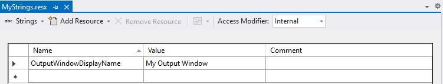

# Write to the Visual Studio output window

The Output window in the Visual Studio IDE is a [Tool Window](./../tool-window/tool-window.md) that can be used to deliver status, diagnostics/logging, or any other informational text to the user. Unlike [User Prompts](./../user-prompt/user-prompts.md), which might display a message box, the messages written to the Output window are only displayed if the user has the Output window visible in the IDE and your channel is selected in the **Show output from** dropdown list. The Output window becomes visible when the user selects **View > Output menu** from the main menu.

## Get started

> [!IMPORTANT]
> The VisualStudio.Extensibility Output window APIs are currently in preview and are subject to change. Any extension that leverages these APIs may fail to work in future versions of Visual Studio and will need to be updated when a newer version of the APIs is released.

To get started, follow the [create the project](./../get-started/create-your-first-extension.md) section in Getting Started section.

## Work with the Output window

This guide is designed to cover the most common things you can do with the Output window:

- [Get an Output window channel](#get-an-output-window-channel)
- [Write to the Output window](#write-to-the-output-window)

## Get an Output window channel

In order to write to the Output window, you need an Output window channel, which can be created by calling [`VisualStudioExtensibility.Views().Output.GetChannelAsync()`](/dotnet/api/microsoft.visualstudio.extensibility.documents.outputwindowextensibility.getchannelasync).

### `OutputWindowExtensibility.GetChannelAsync()`

The [`GetChannelAsync()`](/dotnet/api/microsoft.visualstudio.extensibility.documents.outputwindowextensibility.getchannelasync) method has three parameters:

| Parameter | Type | Required | Description |
| --------- |----- | -------- | ----------- |
| `identifier` | `string` | yes | A unique identifier for the channel. |
| `displayNameResourceId` | `string` | yes | The name of the [resource](/dotnet/core/extensions/resources) that contains the display name of the output window. This is what will be visible in the "Show output from:" dropdown menu in the Output pane.<br /><br />For example, if you had a [`.resx`](/dotnet/core/extensions/resources) resource file called `MyStrings.resx` with a resource named "OutputWindowDisplayName", you would use `nameof(MyStrings.OutputWindowDisplayName)` for this parameter. |
| `cancellationToken` | [`CancellationToken`](/dotnet/api/system.threading.cancellationtoken) | yes | The [`CancellationToken`](/dotnet/api/system.threading.cancellationtoken) for the async operation. |

### Display name resource ID requirements

The current version of the Output window API requires that the display name for the Output window channel be stored in a [resource file](/dotnet/core/extensions/resources):

- Add a [`.resx` file](/dotnet/core/extensions/resources) ([sample](https://github.com/Microsoft/VSExtensibility/tree/main/New_Extensibility_Model/Samples/OutputWindowSample/Strings.resx)) and make sure it's configured with the ResXFileCodeGenerator in your project ([sample](https://github.com/Microsoft/VSExtensibility/tree/main/New_Extensibility_Model/Samples/OutputWindowSample/OutputWindowSample.csproj)).
- Add an [Extension class](../inside-the-sdk/extension-anatomy.md#extension-instance) to your project, if it doesn't have one already ([sample](https://github.com/Microsoft/VSExtensibility/tree/main/New_Extensibility_Model/Samples/OutputWindowSample/OutputWindowSampleExtension.cs))
- In the Extension class, override the [`ResourceManager`](/dotnet/api/microsoft.visualstudio.extensibility.extensioncore.resourcemanager) property to return the ResourceManager corresponding to your .resx file.

### Edit the `.resx` resource file

You can edit the resource file (in this case `MyStrings.resx`) by using the designer UI available in Visual Studio:



Alternatively, you can edit the resource file by editing the raw XML to add the following snippet:

```xml
  <data name="OutputWindowDisplayName" xml:space="preserve">
    <value>My Output window</value>
  </data>
```

### Edit the `.csproj` Project File

Add the following to your `.csproj` project file (if you added the `.resx` file through the IDE, this might already be present):

```xml
  <ItemGroup>
    <Compile Update="MyStrings.Designer.cs">
      <DesignTime>True</DesignTime>
      <AutoGen>True</AutoGen>
      <DependentUpon>MyStrings.resx</DependentUpon>
    </Compile>
  </ItemGroup>
  
  <ItemGroup>
    <EmbeddedResource Update="MyStrings.resx">
      <Generator>ResXFileCodeGenerator</Generator>
      <LastGenOutput>MyStrings.Designer.cs</LastGenOutput>
    </EmbeddedResource>
  </ItemGroup>
```

### Edit or add the Extension class

If your project doesn't already contain a class that derives from [`Extension`](/dotnet/api/microsoft.visualstudio.extensibility.extension), you need to add one like the simple one below (in this case called `MyExtension.cs`):

```csharp
using System.Resources;
using Microsoft.VisualStudio.Extensibility;

namespace MyProject
{
    public class MyExtension : Extension
    {
        protected override ResourceManager? ResourceManager => MyStrings.ResourceManager;
    }
}
```

If your project already contains such a class, you only need to add the line that sets the [`ResourceManager`](/dotnet/api/microsoft.visualstudio.extensibility.extensioncore.resourcemanager) property.

> [!NOTE]
> Make sure that the `MyExtension` class is in the same namespace as the `MyStrings` resource class, which defaults to the name of the project, unless you have overridden it.

### Add the initialization code

This code can be in whichever class you intend to use to show output messages (such as a [Command](./../command/command.md)), but the important thing is that [`GetChannelAsync()`](/dotnet/api/microsoft.visualstudio.extensibility.documents.outputwindowextensibility.getchannelasync) can only be called once for a given Output window channel ID, so consider calling it in a one-time, initialization method such as [`InitializeAsync()`](/dotnet/api/microsoft.visualstudio.extensibility.extensionpart.initializeasync).

```csharp
public override async Task InitializeAsync(CancellationToken cancellationToken)
{
    string id = "MyOutputWindow";
    string displayNameResourceId = nameof(MyStrings.OutputWindowDisplayName);

     // To use this Output window Channel elsewhere in the class, such as the ExecuteCommandAsync() method in a Command, save this result to a field in the class.
    OutputWindow? outputWindow = await this.Extensibility.Views().Output.GetChannelAsync(id, displayNameResourceId, cancellationToken);
}
```

## Write to the Output window

The [`OutputWindow`](/dotnet/api/microsoft.visualstudio.extensibility.documents.outputwindow) instance obtained in [Get an Output window channel](#get-an-output-window-channel) has a [`System.IO.TextWriter`](/dotnet/api/system.io.textwriter) property called `Writer`, which supports familiar operations for writing text, such as:

- [`Write()`](/dotnet/api/system.io.textwriter.write)
- [`WriteAsync()`](/dotnet/api/system.io.textwriter.writeasync)
- [`WriteLine()`](/dotnet/api/system.io.textwriter.writeline)
- [`WriteLineAsync()`](/dotnet/api/system.io.textwriter.writelineasync)

### Example

This snippet could be used wherever you want to display a message in the Output window, such as in the [`ExecuteCommandAsync()`](/dotnet/api/microsoft.visualstudio.extensibility.commands.iexecutablecommand.executecommandasync) method in a [Command](./../command/command.md).

```csharp
if (this.outputWindow != null)
{
    await this.outputWindow.Writer.WriteLineAsync("This is a test of the output window.");
}
```

## Next steps

Learn more:

- Learn more about [commands](./../command/command.md)
- Learn more about exposing functionality in the IDE in a [tool window](./../tool-window/tool-window.md)
- Learn about interacting with the user with [user prompts](./../user-prompt/user-prompts.md)

Look at sample code:

- See the [OutputWindowSample](https://github.com/Microsoft/VSExtensibility/tree/main/New_Extensibility_Model/Samples/OutputWindowSample) sample for a full example of creating an extension that uses the output window.

