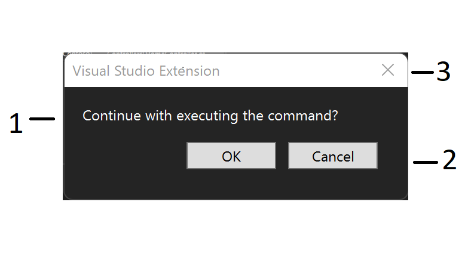
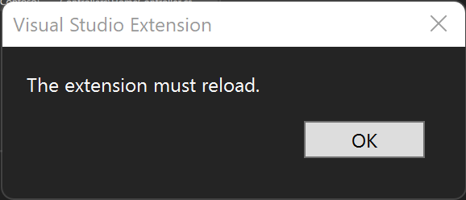
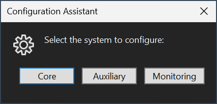
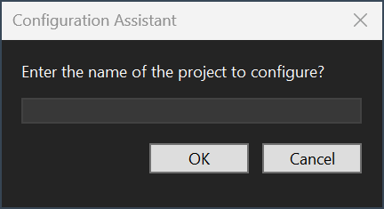

# Create Visual Studio user prompts

User prompts are a simple UI mechanism for prompting the user to make a selection, confirm a message, or provide a single-line string input. Prompting the user creates a dialog box with a message, a title bar, a **Close** button, and an optional icon. When the dialog prompts the user to choose from a set of options, it also contains one to three buttons for the choices.

> [!NOTE]
> The exact UI used to prompt users might change in future versions based on user feedback or other factors.

The user prompt has two variants: option prompts and input prompts.

Common examples of option prompts are requesting confirmation with an OK or Cancel prompt, or asking the user to choose
among a small set of options (no more than three).

The choices presented to the user are mapped to return values of the type defined in the `TResult` type parameter.

To ask the user to provide a single-line string input, such as a project name, use an input prompt.

The user always has the option of dismissing the prompt without making a selection.

## Parts of a user prompt



1. Message
2. Choice buttons
3. Close button

## Get started

To get started, follow steps in [Create your first Visual Studio extension](./../get-started/create-your-first-extension.md).

## Work with user prompts

This article covers the following scenarios for working with user prompts:

- [Display a user prompt](#display-a-user-prompt)
- [Use built-in options](#use-built-in-options)
- [Create a prompt with custom options](#create-a-prompt-with-custom-options)

## Display a user prompt

Creating a user prompt with the new Extensibility model is as simple as calling the [`ShowPromptAsync`](/dotnet/api/microsoft.visualstudio.extensibility.shell.shellextensibility.showpromptasync) method from the [ShellExtensibility](/dotnet/api/microsoft.visualstudio.extensibility.shell.shellextensibility) helpers and passing in your options.

### ShellExtensibility.ShowPromptAsync()

The [`ShowPromptAsync`](/dotnet/api/microsoft.visualstudio.extensibility.shell.shellextensibility.showpromptasync) method takes three parameters:

| Parameter         | Type                                                                  | Required | Description                                                                                                                                    |
|-------------------|-----------------------------------------------------------------------|----------|------------------------------------------------------------------------------------------------------------------------------------------------|
| `message`           | `string`                                                              | Yes      | The text of the message for the prompt.                                                                                                        |
| `options`           | `PromptOptions<TResult>`                                              | Yes      | Defines the user choices, and maps them to return values.                                                                                       |
| `cancellationToken` | [`CancellationToken`](/dotnet/api/system.threading.cancellationtoken) | Yes      | The [`CancellationToken`](/dotnet/api/system.threading.cancellationtoken) for the async operation. When triggered, the prompt is force-closed. |

### Example

The following code inside a [`Command`](/dotnet/api/microsoft.visualstudio.extensibility.commands.command) shows a user prompt with a simple message and an **OK** button.

```csharp
public override async Task ExecuteCommandAsync(IClientContext context, CancellationToken cancellationToken)
{
    await this.Extensibility.Shell().ShowPromptAsync("This is a user prompt.", PromptOptions.OK, cancellationToken))
}
```

## Use built-in options

Several sets of predefined [`PromptOptions`](/dotnet/api/microsoft.visualstudio.extensibility.shell.promptoptions) are available in the SDK.

### OK

| Choice      | Default | Return value |
|-------------|---------|--------------|
| **OK**        | Yes     | `true`         |
| **Close** |         | `false`        |

### OKCancel

| Choice      | Default | Return value |
|-------------|---------|--------------|
| **OK**        | Yes     | `true`         |
| **Cancel**    | No      | `false`        |
| **Close** |         | `false`        |

### RetryCancel

| Choice      | Default | Return value |
|-------------|---------|--------------|
| **Retry**     | Yes     | `true`         |
| **Cancel**    | No      | `false`        |
| **Close** |         | `false`        |

### Confirmations with icon

| Choice      | Default | Return value |
|-------------|---------|--------------|
| **OK**        | Yes     | `true`         |
| **Close** |         | `false`        |

| Option             | Icon                                         |
|--------------------|----------------------------------------------|
| `ErrorConfirm`       | `ImageMoniker.KnownValues.StatusError`       |
| `WarningConfirm`     | `ImageMoniker.KnownValues.StatusWarning`     |
| `AlertConfirm`       | `ImageMoniker.KnownValues.StatusAlert`       |
| `InformationConfirm` | `ImageMoniker.KnownValues.StatusInformation` |
| `HelpConfirm`        | `ImageMoniker.KnownValues.StatusConfirm`     |

### Example



Create a prompt with a single **OK** choice.

```csharp
public override async Task ExecuteCommandAsync(IClientContext context, CancellationToken ct)
{
    // Asking the user to confirm an operation.
    if (!await this.Extensibility.Shell().ShowPromptAsync("Continue with executing the command?", PromptOptions.OKCancel, ct))
    {
      return;
    }
    
    ...
}
```

If the user selects **OK**, [`ShowPromptAsync`](/dotnet/api/microsoft.visualstudio.extensibility.shell.shellextensibility.showpromptasync) returns `true` when awaited. If the user selects the **Close** button, it returns `false`.

#### Change the default choice of a built-in option to cancel

```csharp
public override async Task ExecuteCommandAsync(IClientContext context, CancellationToken ct)
{
  // Asking the user to confirm an operation.
  if (!await this.Extensibility.Shell().ShowPromptAsync("Continue with executing the command?", PromptOptions.OKCancel.WithCancelAsDefault(), ct))
  {
    return;
  }
  
  ...
}
```

## Create a prompt with custom options



You can also customize the choices presented to the user and the return value mapped to each one.

Instead of using the sets defined in [`PromptOptions`](/dotnet/api/microsoft.visualstudio.extensibility.shell.promptoptions), create a new instance of `PromptOptions<TResult>` and pass it to [`ShowPromptAsync`](/dotnet/api/microsoft.visualstudio.extensibility.shell.shellextensibility.showpromptasync).

### Example

Start by creating a value type to define the return values:

```csharp
public enum TokenThemeResult
{
  None,
  Solarized,
  OneDark,
  GruvBox,
}
```

Then create the `PromptOptions<TResult>` instance and pass it to
[`ShowPromptAsync`](/dotnet/api/microsoft.visualstudio.extensibility.shell.shellextensibility.showpromptasync)
along with the required `message` and `cancellationToken` arguments.

Customize the title and icon by setting the `Title` and `Icon` properties.

```csharp
public override async Task ExecuteCommandAsync(IClientContext context, CancellationToken ct)
{
  // Custom prompt
  Systems selectedSystem = await shell.ShowPromptAsync(
      "Select the system to configure:",
      new PromptOptions<Systems>
      {
          Choices =
          {
              { "Core", Systems.CoreSystem },
              { "Auxiliary", Systems.AuxiliarySystem },
              { "Monitoring", Systems.MonitoringSystem },
          },
          DismissedReturns = Systems.CoreSystem,
          DefaultChoiceIndex = 2
          Title = "Configuration Assistant",
          Icon = ImageMoniker.KnownValues.Settings,
      },
      cancellationToken);

  Debug.WriteLine($"Selected system: {selectedSystem}");
}
```

The [`Choices`](/dotnet/api/microsoft.visualstudio.extensibility.shell.promptoptions-1.choices) collection maps the user
choices to values in the custom `Systems` enum. If the user selects the **Close** button, `DismissedReturns` sets the value that's returned. `DefaultChoiceIndex` is a zero-based index into the `Choices` collection that defines the default choice.

## Create an input prompt



```csharp
string? projectName = await shell.ShowPromptAsync(
    "Enter the name of the project to configure?",
    InputPromptOptions.Default with { Title = "Configuration Assistant" },
    cancellationToken);
```

In addition to custom icons like choice prompts, input prompts also support a default value. Set the `DefaultText`
property on the `InputPromptOptions` instance.

If the user selects the **Cancel** button, the **Close** button to dismiss, or the Esc key, the return value is `null`.
If the user leaves the input blank and selects the **OK** button or the Enter key, the return value is the empty string.

Otherwise, the return value is the content of the input when the user confirms their entry.

## Related content

The following samples demonstrate how to work with user prompts:

- [UserPromptSample](https://github.com/Microsoft/VSExtensibility/tree/main/New_Extensibility_Model/Samples/UserPromptSample/)
- [MarkdownLinter](https://github.com/Microsoft/VSExtensibility/tree/main/New_Extensibility_Model/Samples/MarkdownLinter/)
