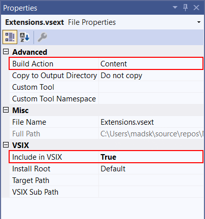

# Create an Extension Pack

This article shows you how to create an Extension Pack. An Extension Pack is a set of extensions that can be installed together. Extension Packs enable you to easily share your favorite extensions with other users or bundle a set of extensions together for a particular scenario.

The following video introduces how to create Extension Packs.
> [!VIDEO https://learn-video.azurefd.net/vod/player?id=00230c46-d0f6-4439-8fa0-a205243e764e]

## Create from project template
The Extension Pack project template creates an Extension Pack with set of extensions that can be installed together.

In the **New Project** dialog, search for *extension* and select **Extension Pack**. For **Project** name, enter *Test Extension Pack*. Select **Create**.

Visual Studio opens the project in Solution Explorer and opens the file **Extensions.vsext** in the editor.

```json
{
  "version": "1.0.0.0",
  "extensions": [
    {
      "vsixId": "OneDarkPro.e1e706e2-05d3-4da9-8754-652cd8ab65f4",
      "name": "One Dark Pro"
    },
    {
      "vsixId": "7fa839e2-b938-4b1c-9277-edaebe6fdeb5",
      "name": "Winter is Coming"
    }
  ]
}
```

## Add to existing extension
In the Solution Explorer, right-click the project node and select **Add > New Item**. Go to the **Visual C# Extensibility** node and select **Extension Pack**. Leave the default file name (ExtensionPack1.cs).

The .vsext file in the root of your project is what turns the project into an extension pack. Just make sure it's *Build Action* is set to *Content* and that *Include in VSIX* is set to *True* as shown below.


