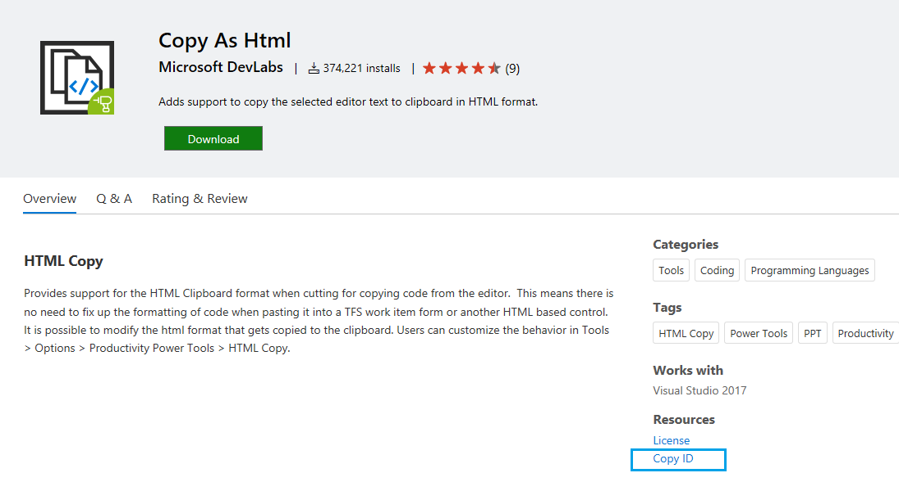
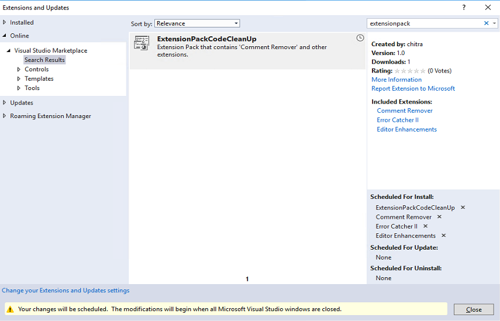

# Walkthrough: Create an Extension Pack

An Extension Pack is a set of extensions that can be installed together. Extension Packs enable you to easily share your favorite extensions with other users or bundle a set of extensions together for a particular scenario.

## Create an extension with an Extension Pack item template

The Extension Pack item template creates an Extension Pack with set of extensions that can be installed together.

1. In the **New Project** dialog, search for "vsix" and select **VSIX Project**. For **Project name**, type "Test Extension Pack". Select **Create**.

2. In the **Solution Explorer**, right-click the project node and select **Add** > **New Item**. Go to the Visual C# **Extensibility** node and select **Extension Pack**. Leave the default file name (ExtensionPack1.cs).

3. ExtensionPack1.vsext file is added which contains the following code

   ```json
   {
    "id": "ExtensionPack1",
    "name": "ExtensionPack1",
    "description": "Read about creating extension packs at https://aka.ms/vsextpack",
    "version": "1.0.0.0",
    "extensions": [  // List of extensions that are included in the Extension Pack.
      {
        "vsixId": "41858b2d-ff0b-4a43-80b0-f1b2d6084935", // The vsix id of the extension you want to   include.
        "name": "AlignAssignments"
      },
      {
          "vsixId": "42374550-426a-400e-96f9-237682e8dea6",
        "name": "CopyAsHtml"
      }
    ]
   }
   ```

4. The vsixid of the extension to include in the Extension Pack can be found on the [Visual Studio Marketplace](https://marketplace.visualstudio.com/). Find the extension you want to include and click on **Copy ID**. You can update the existing **vsixId** in the above file or add another extension to the list.

    

5. Build the project and upload your extension to the Marketplace. See [Publishing a Visual Studio extension](../extensibility/walkthrough-publishing-a-visual-studio-extension.md).

> [!NOTE]
> An Extension pack can only install extensions that are available on the [Visual Studio Marketplace](https://marketplace.visualstudio.com/) or [Private gallery](../extensibility/how-to-create-an-atom-feed-for-a-private-gallery.md).

## Install the Extension Pack from the Visual Studio Marketplace

Now that the extension is published, install it in Visual Studio and test it there.

1. In Visual Studio, on the **Extensions** menu, click **Managed Extensions**.

2. Click **Online** and then search for "Test Extension Pack".

3. Click **Download**. The extension and its list of extensions included in the Extension Pack will then be scheduled for install.

4. Below is a sample Extension Pack download view of the **Manage Extensions** dialog. If you prefer to install only some of the included extensions in the Extension pack, you can modify the extension list in **Scheduled For Install**.

    

5. To complete the installation, close all instances of Visual Studio.

## Remove the extension

To remove the extension from your computer:

1. In Visual Studio, on the **Extensions** menu, click **Managed Extensions**.

2. Select **Test Extension Pack** and then click **Uninstall**. The extension and its list of extensions included in the Extension Pack will then be scheduled for uninstall.

3. To complete the uninstallation, close all instances of Visual Studio.
