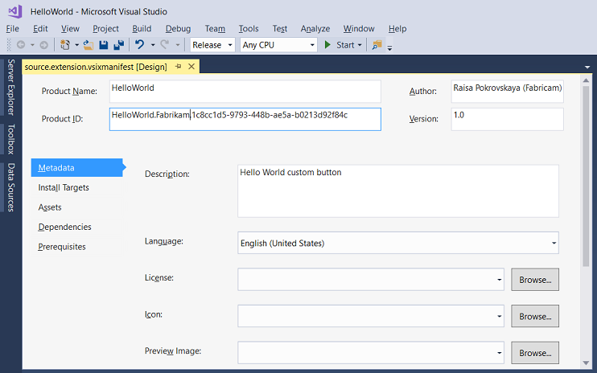
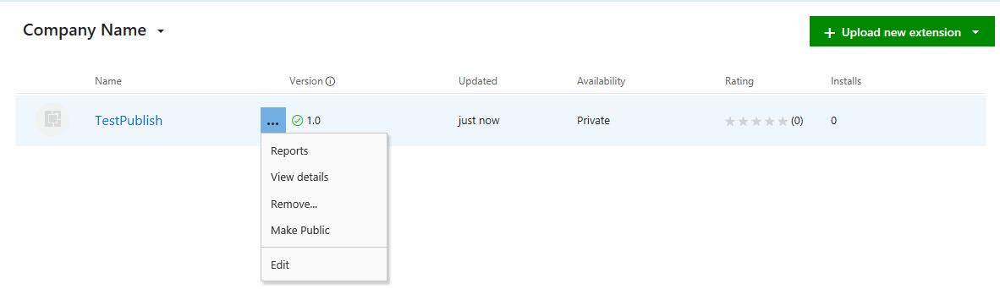
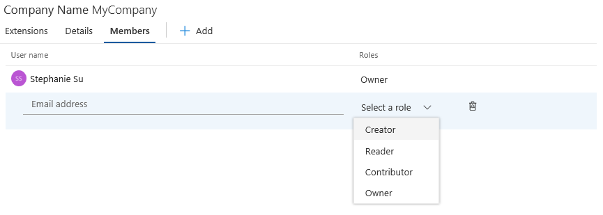

# Walkthrough: Publish a Visual Studio extension

This walkthrough shows you how to publish a Visual Studio extension to Visual Studio Marketplace. When you add your extension to Visual Studio Marketplace, developers can use **Extensions and Updates** to browse for new and updated extensions.

## Prerequisites

 To follow this walkthrough, you must install the Visual Studio SDK. For more information, see [Install the Visual Studio SDK](../extensibility/installing-the-visual-studio-sdk.md).

## Create a Visual Studio extension

This article uses a default VSPackage extension, but the steps are valid for every kind of extension.

- Create a VSPackage in C# named `TestPublish` that has a menu command. For more information, see [Create your first extension: Hello World](../extensibility/extensibility-hello-world.md).

## Package your extension

1. Update the extension *.vsixmanifest* with the correct information about product name, author, and version.

   

2. Build your extension in **Release** mode. Now your extension is packaged as a VSIX in the \bin\Release folder.

3. You can double-click the VSIX to verify the installation.

## Test the extension

 Before you distribute the extension, build and test it to make sure it's installed correctly in the experimental instance of Visual Studio.

1. In Visual Studio, start debugging to open an experimental instance of Visual Studio.

2. In the experimental instance, go to the **Tools** menu and click **Extensions and Updates**. The TestPublish extension should appear in the center pane and be enabled.

3. On the **Tools** menu, make sure you see the test command.

## Publish the extension to Visual Studio Marketplace

1. Make sure that you have built the Release version of your extension and that it's up to date.

2. In a web browser, go to [Visual Studio Marketplace](https://marketplace.visualstudio.com/vs).

3. In the upper-right corner, click **Sign in**.

4. Use your Microsoft account to sign in. If you do not have a Microsoft account, you can create one at this point.

5. Click **Publish extensions**. This option navigates you to the manage page for all your extensions. If you don't have a publisher account, you are prompted to create one at this time.

   

6. Choose the publisher you want to use to upload your extension. You can change publishers by clicking on the publisher names listed on the left. Click **New extension** and select **Visual Studio**.

7. In **1: Upload extension**, you can choose to upload a VSIX file directly to Visual Studio Marketplace or just add a link to your own website. In this example, the extension, *TestPublish.vsix* is uploaded. Drag and drop your extension or use the **click** link to browse for the file. Find your extension in the \bin\Release folder of the project.  Click **Continue**.

8. In **2: Provide extension details**, some fields are auto-populated from the *source.extension.vsixmanifest* file from your extension. Find more details about each below:

    * **Internal Name** is used in the URL of the extension's detail page. For an example, publishing an extension under the publisher name "myname" and specifying the internal name to be "my extension" results in a URL of "marketplace.visualstudio\.com/items?itemName=myname.myextension" for your extension's detail page.

    * **Display Name** of your extension. This name is auto-populated from the *source.extension.vsixmanifest* file.

    * **Version** number of the extension you are uploading. This version is auto-populated from the *source.extension.vsixmanifest* file.

    * **VSIX ID** is the unique identifier that Visual Studio uses for your extension. This identifier is required if you would like to have your extension auto-updated. This identifier is auto-populated from the *source.extension.vsixmanifest* file.

    * **Logo** that is used for your extension. This logo is auto-populated from the *source.extension.vsixmanifest* file if provided.

    * **Short description** of what your extension does. This description is auto-populated from the *source.extension.vsixmanifest* file.

    * **Overview** is a good place to include screenshots and detailed information about what your extension does.

    * **Supported Visual Studio versions** lets you choose which versions of Visual Studio your extension will work on. Your extension is only installed to those versions.

    * **Supported Visual Studio edition** lets you choose which editions of Visual Studio your extension will work on. Your extension is only installed to those editions.

    * **Type**. The most common type of extension is **Tools**.

    * **Categories**. Pick up to three that are a best fit for your extension.

    * **Tags** are keywords that help users find your extension. Tags can help increase the search relevance of your extensions in Visual Studio Marketplace.

    * **Pricing Category** is the cost of your extension.

    * **Source code repository** allows you to share a link to your source code with the community.

    * **Allow Q&A for your extension** lets users leave questions on your extension entry page.

9. Click **Save & Upload**. This option takes you back to your publisher manage page. Your extension has not yet been published.

10. To publish your extension, right-click on your extension and select **Make Public**. To see how your extension will look in Visual Studio Marketplace, select **View Extension**. For acquisition numbers, click on **Reports**. To make changes to your extension, click on **Edit**.

    

11. Click **Make Public**, and your extension is now public. Search Visual Studio Marketplace for your extension.

## Update a published extension in Visual Studio Marketplace

Before you begin, make sure that you've built the new release version of your extension and that it's up to date.

1.  In a web browser, go to [Visual Studio Marketplace](https://marketplace.visualstudio.com/vs).

1.  In the upper-right corner, click **Sign in**, and then sign in with your Microsoft account.

    :::image type="content" source="media/marketplace-upload-extension.png" alt-text="Screenshot that shows selecting an uploaded extension file in File Explorer.":::

1.  Click **Publish extensions**, and then choose the publisher you want to use to upload your updated extension.

    :::image type="content" source="media/marketplace-select-extension-version.png" alt-text="Screenshot of Visual Studio Marketplace with the Publish extensions link highlighted.":::

1.  Next to the extension you want to update, hover your mouse over the three horizontal dots, and then choose **Edit**.

    :::image type="content" source="media/marketplace-select-extension.png" alt-text="Screenshot that shows choosing an extension to edit.":::

1.  In **1: Upload extension**, after your VSIX file name, click the pencil icon to edit your published extension.

     :::image type="content" source="media/marketplace-edit-extension-details.png" alt-text="Screenshot that shows clicking the pencil icon to edit your extension.":::

1.  Browse to your updated extension VSIX file. Click the file, and then click **Open**.

    Your updated extension uploads.

    :::image type="content" source="media/marketplace-upload-extension-notification.png" alt-text="Screenshot of an Uploading file notification after uploading an edited extension.":::

1. In **2: Provide extension details**, some details are read-only for an extension update or they're auto-populated from the *source.extension.vsixmanifest* file from your extension. Here's more information about extension details:

    - **Internal Name**\* is used in the URL of the extension's detail page. For an example, publishing an extension under the publisher name "myname" and specifying the internal name as "my extension" results in a URL of "marketplace.visualstudio.com/items?itemName=myname.myextension" for your extension's detail page.

    - **Display Name**\* of your extension. This name is auto-populated from the *source.extension.vsixmanifest* file.

    - **Version**\* number of the extension you are uploading. This version is auto-populated from the *source.extension.vsixmanifest* file.

    - **VSIX ID**\* is the unique identifier that Visual Studio uses for your extension. This identifier is required if you would like to have your extension auto-updated. This identifier is auto-populated from the *source.extension.vsixmanifest* file.

    - **Logo**\* that is used for your extension. This logo is auto-populated from the *source.extension.vsixmanifest* file if provided.

    - **Short description**\* of what your extension does. This description is auto-populated from the *source.extension.vsixmanifest* file.

    - **Overview** is a good place to include screenshots and detailed information about what your extension does.

    - **Supported Visual Studio versions**\* lets you choose which versions of Visual Studio your extension will work on. Your extension is only installed to those versions.

    - **Supported Visual Studio edition**\* lets you choose which editions of Visual Studio your extension will work on. Your extension is installed only on those editions.

    - **Type**. The most common type of extension is **Tools**.

    - **Categories**. Pick up to three that are a best fit for your extension.

    - **Tags** are keywords that help users find your extension. Tags can help increase the search relevance of your extensions in Visual Studio Marketplace.

    - **Pricing Category** is the cost of your extension.

    - **Source code repository** allows you to share a link to your source code with the community.

    - **Allow Q&A for your extension** lets users leave questions on your extension entry page.

       \* This detail can't be changed for an extension update.

1. Click **Save & Upload**. This option takes you back to your publisher manage page. Your extension has not yet been published.

1. To publish your extension, right-click your extension and select **Make Public**. To see how your extension will look in Visual Studio Marketplace, select **View Extension**. For acquisition numbers, click **Reports**. To make changes to your extension, click **Edit**.

## Add additional users to manage your publisher account

Visual Studio Marketplace supports granting additional users permissions to access and manage a publisher account.

1. Ask the member that you want to add to sign in to their account on Marketplace and get the User ID. The User ID will be visible by hovering over email, as shown in the following image:

   

2. The member can copy the User ID by clicking the copy-to-clipboard button, and then share it with you.

3. Navigate to the publisher account you wish to add additional users to.

4. Select **Members** and click on **Add**.

   

5. You can then specify the User ID of the user you wish to add and grant the right level of access under **Select a role**.  You can choose from the following options:

   * **Creator**: The user can publish extensions, but cannot view or manage extensions published by other users.

   * **Reader**: The user can view extensions, but cannot publish or manage extensions.

   * **Contributor**: The user can publish and manage extensions, but cannot edit publisher settings or manage access.

   * **Owner**: The user can publish and manage extensions, edit publisher settings, and manage access.

### Troubleshoot adding a user to the publisher account

When you add a user to the publisher profile by using their email address, you might see the error `TF14045: The identity could not be found`.

To avoid this error, use the user's user ID instead of an email address to add the user to the publisher account. To find a user's user ID, in Visual Studio Marketplace, hover over the user's name at the top of the pane. Select the copy icon to copy the user ID.

You can then [add the new user](#add-additional-users-to-manage-your-publisher-account) by using their user ID.

## Install the extension from Visual Studio Marketplace

Now that the extension is published, install it in Visual Studio and test it there.

1. In Visual Studio, on the **Tools** menu, click **Extensions and Updates**.

2. Click **Online** and then search for **TestPublish**.

3. Click **Download**. The extension is then scheduled for install.

4. To complete the installation, close all instances of Visual Studio.

## Remove the extension

You can remove the extension from Visual Studio Marketplace and from your computer.

### To remove/unpublish the extension from Visual Studio Marketplace

1. Go to [Visual Studio Marketplace](https://marketplace.visualstudio.com/vs).

2. In the upper-right hand corner, click **Publish** extensions. Pick the publisher that you used to publish (eg: **TestPublish**). The listing for extensions will appear.

3. Click on extension menu button → click **Remove**. You are asked to confirm if you want to remove the extension.

To prevent accidental unpublishing, you must confirm the remove operation by filling extension name in the warning dialog. Note that remove/unpublish action is non-reversible

### To remove the extension from your computer

1. In Visual Studio, on the **Tools** menu, click **Extensions and Updates**.

2. Select **TestPublish** and then click **Uninstall**. The extension is then scheduled for uninstall.

3. To complete the uninstallation, close all instances of Visual Studio.
