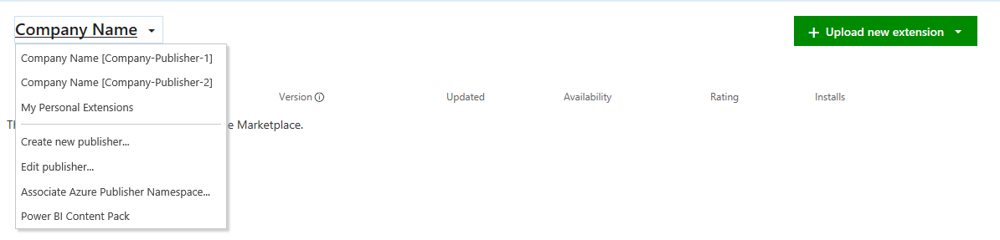

# Walkthrough: Publishing a Visual Studio Extension

This walkthrough shows you how to publish a Visual Studio extension to the Visual Studio Marketplace. When you add your extension to the Marketplace, developers can use **Extensions and Updates** to browse there for new and updated extensions.

## Prerequisites

 To follow this walkthrough, you must install the Visual Studio SDK. For more information, see [Installing the Visual Studio SDK](../extensibility/installing-the-visual-studio-sdk.md).

## Create a Visual Studio Extension

In this case we will use a default VSPackage extension, but the same steps are valid for every kind of extension.

1. Create a VSPackage in C# named "TestPublish" that has a menu command. For more information, see [Creating your First Extension: Hello World](../extensibility/extensibility-hello-world.md).

## Package your Extension

1. Update the extension vsixmanifest with the correct information about product name, author, and version.

  

2. Build your extension in **Release** mode. Now your extension will be packaged as a VSIX in the \bin\Release folder.

3. You can double click the VSIX to verify the installation.

## Test the Extension

 Before you distribute the extension, build, and test it to make sure it is installed correctly in the experimental instance of Visual Studio.

1. In Visual Studio, start debugging. to open an experimental instance of Visual Studio.

2. In the experimental instance, go to the **Tools** menu and click **Extensions and Updates...**. The TestPublish extension should appear in the center pane and be enabled.

3. On the **Tools** menu, make sure you see the test command.

## Publish the Extension to the Visual Studio Marketplace

1. Make sure that you have built the Release version of your extension and that it is up-to-date.

2. In a web browser, open the [Visual Studio Marketplace](https://marketplace.visualstudio.com/vs) website.

3. In the upper-right corner, click **Sign in**.

4. Use your Microsoft account to sign in. If you do not have a Microsoft account, you can create one at this point.

5. Click **Publish extensions**.  This will navigate you to the manage page for all your extensions.  If you don't have a publisher account, you will be prompted to create one at this time.

  

6. Choose the publisher you want to use to upload your extension.  You can change publishers by clicking on the publisher name on the upper-left corner.

  

7. In **1: Upload extension**, you can choose to upload a VSIX file directly to Visual Studio Marketplace or just add a link to your own website. In this case, we will upload our extension, TestPublish.vsix.  Drag and drop your extension or use the **click** link to browse for the file.  Your extension can be found in the \bin\Release folder of the project.  Click **Continue**.

8. In **2: Provide extension details**, some fields are auto-populated from the source.extension.vsixmanifest file from your extension.  More details about each can be found below:

    * **Internal Name** will be used in the URL of the extension's detail page. For an example, publishing an extension under the publisher name "myname" and specifying the internal name to be "myextension" will result in a URL of "marketplace.visualstudio\.com/items?itemName=myname.myextension" for your extension's detail page.
    
    * **Display Name** of your extension.  This is auto-populated from the source.extension.vsixmanifest file.
   
    * **Version** number of the extension you are uploading.  This is auto-populated from the source.extension.vsixmanifest file.
    
    * **VSIX ID** is the unique identifier that Visual Studio uses for your extension.  This is required if you would like to have your extension be auto-updated.  This is auto-populated from the source.extension.vsixmanifest file.
    
    * **Logo** that will be used for your extension.  This will be auto-populated from the source.extension.vsixmanifest file if provided.
    
    * **Short description** of what your extension does.  This will be auto-populated from the source.extension.vsixmanifest file.
    
    * **Overview** is a good place to include screenshots and detailed information about what your extension does.
    
    * **Supported Visual Studio versions** lets you choose which versions of Visual Studio your extension will work on.  Your extension will only be installed to those versions.
    
    * **Supported Visual Studio editions** lets you choose which editions of Visual Studio your extension will work on.  Your extension will only be installed to those editions.
    
    * **Type**.  The most common type of extensions are **Tools**.
    
    * **Categories**.  Pick up to three that are a best fit for your extension.
    
    * **Tags** are keywords that help users find your extension. Tags can help increase the search relevance of your extensions in the Marketplace.
    
    * **Pricing Category** is the cost of your extension.
    
    * **Source code repository** allows you to share a link to your source code with the community.
    
    * **Allow Q&A for your extension** will allow users to leave questions on your extension entry page.

9. Click **Save & Upload**. This will take you back to your publisher manage page.  Your extension has not yet been published.  To publish your extension hover over the entry of your extension and click on **...** and then **Make Public**.  You can view how your extension will look like on Marketplace by selecting **View details**.  For acquisition numbers, click on **Reports**.  To make changes to your extension, click on **Edit*.

  

10. After clicking **Make Public**, your extension is now public.  Search the Visual Studio Marketplace for your extension.

## Install the Extension from the Visual Studio Marketplace

Now that the extension is published, install it in Visual Studio and test it there.

1. In Visual Studio, on the **Tools** menu, click **Extensions and Updates...**.

2. Click **Online** and then search for TestPublish.

3. Click **Download**. The extension will then be scheduled for install.

4. To complete the installation, close all instances of Visual Studio.

## Removing the Extension

You can remove the extension from the Visual Studio Marketplace and from your computer.

### To remove the extension from the Visual Studio Marketplace

1. Open the [Visual Studio Marketplace](https://marketplace.visualstudio.com/vs) website.

2. In the upper-right hand corner, click **Publish** extensions.  Pick the publisher that you used to publish TestPublish.  The listing for TestPublish is displayed.

3. Hover over the extension entry and click on **...** and **Remove...** You will be asked to confirm if you want to remove the extension.  Click **OK**.

### To remove the extension from your computer

1. In Visual Studio, on the **Tools** menu, click **Extension and Updates...**.

2. Select TestPublish and then click **Uninstall**. The extension will then be scheduled for uninstall.

3. To complete the uninstallation, close all instances of Visual Studio.
