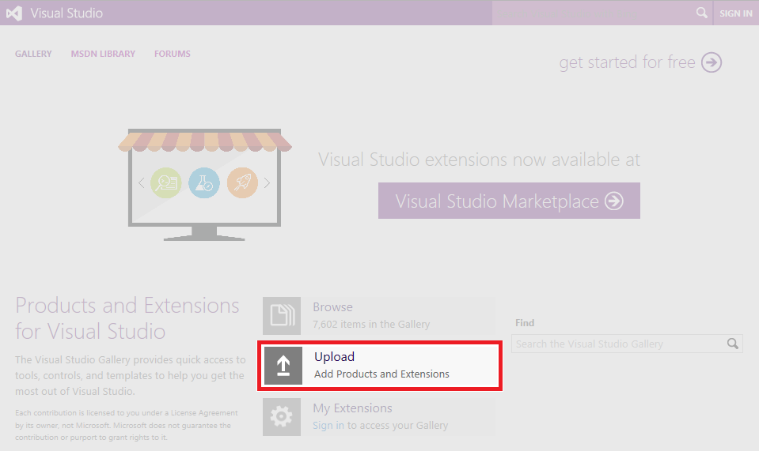

# Walkthrough: Publishing a Visual Studio Extension

This walkthrough shows you how to publish a Visual Studio extension to the Visual Studio Marketplace. When you add your extension to the Marketplace, developers can use **Extensions and Updates** to browse there for new and updated extensions.

## Prerequisites

 To follow this walkthrough, you must install the Visual Studio SDK. For more information, see [Visual Studio SDK](../extensibility/visual-studio-sdk.md).

## Create a Visual Studio Extension

In this case we will use a default VSPackage extension, but the same steps are valid for every kind of extension.

1. Create a VSPackage in C# named "TestPublish" that has a menu command. For more information, see [Creating your First Extension: Hello World](../extensibility/extensibility-hello-world.md).

## Package your Extension

1. Update the extension vsixmanifest with the correct information about product name, author, and version.

  

2. Build your extension in **Release** mode. Now your extension will be packaged as a VSIX in the \bin\Release folder.

3. You can double click the VSIX to verify the installation.

## Test the Extension

 Before you distribute the extension, build and test it to make sure it is installed correctly in the experimental instance of Visual Studio.

1. In Visual Studio, start debugging. to open an experimental instance of Visual Studio.

2. In the experimental instance, go to the **Tools** menu and click **Extensions and Updates...**. The TestPublish extension should appear in the center pane and be enabled.

3. On the **Tools** menu, make sure you see the test command.

## Publish the Extension to the Visual Studio Marketplace

> [!NOTE] 
> We are in the process of migrating the publishing experience to Visual Studio Marketplace.  In the meantime, please continue to use Visual Studio Gallery to publish your extensions.  Your extensions will appear in the Visual Studio Marketplace once it has been published.

1. Make sure that you have built the Release version of your extension and that it is up-to-date.

2. In a web browser, open the [Visual Studio Gallery](http://go.microsoft.com/fwlink/?LinkId=194329) website.

3. In the upper-right corner, click **SIGN IN**.

4. Use your Microsoft account to sign in. If you do not have a Microsoft account, you can create one at this point.

5. Click **Upload**.

  

6. In **Step 1: Extension Type**, select **Tool** and then click **Next**.

7. In **Step 2: Upload**, you can choose to upload directly to Visual Studio Gallery or just add a link to your own website. In this case select **I would like to upload my tool**. The **Select your control** box appears. Click **Browse** and then select TestPublish.vsix in the \bin\Release folder of the project. Click **Next**.

8. In **Step 3: Basic Information**, fields from the source.extension.vsixmanifest file are displayed. Select an appropriate **Category** and add **Tags** to help users find your extension. You may want to add a more detailed summary and description (the description must be at least 280 characters long). Leave **Extension Type** as **Not a Microsoft Extension** and **Cost Category** as **Trial**.

9. Read the Contribution Agreement at the bottom of the page and check **I agree**.

10. Click **Create Contribution**. This displays the page your extension will have on the Visual Studio Gallery, with a message that the page has not yet been published.

11. Click **Publish**.

12. Search the Visual Studio Marketplace for your extension. The listing for the TestPublish extension may take some time before it appears.

## Install the Extension from the Visual Studio Marketplace

Now that the extension is published, install it in Visual Studio and test it there.

1. In Visual Studio, on the **Tools** menu, click **Extensions and Updates...**.

2. Click **Online** and then search for TestPublish. The listing for the TestPublish extension may take some time to appear.

3. Click **Download**. The extension will then be scheduled for install.

4. To complete the installation, close all instances of Visual Studio.

## Removing the Extension

You can remove the extension from the Visual Studio Marketplace and from your computer.

### To remove the extension from the Visual Studio Marketplace

1. Open the [Visual Studio Gallery](http://go.microsoft.com/fwlink/?LinkId=194329) website.

2. On the center, click **My Extensions**. The listing for TestPublish is displayed.

3. Click **Delete**.

### To remove the extension from your computer

1. In Visual Studio, on the **Tools** menu, click **Extension and Updates...**.

2. Select TestPublish and then click **Uninstall**. The extension will then be scheduled for uninstall.

3. To complete the uninstallation, close all instances of Visual Studio.
