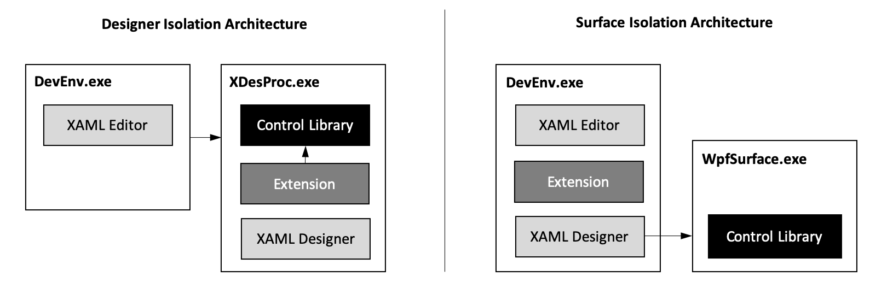

# XAML designer extensibility migration

Starting in Visual Studio 2019 version 16.1 as a public preview, the XAML designer supports two different architectures: the designer isolation architecture and the more recent surface isolation architecture. This architecture transition is required to support target runtimes that can't be hosted in a .NET Framework process. Moving to the surface isolation architecture introduces breaking changes to the third-party extensibility model. This article outlines the changes.

**Designer isolation** is used by the WPF designer for projects that target the .NET Framework and supports *.design.dll* extensions. User code, control libraries, and third-party extensions are loaded in an external process (*XDesProc.exe*) along with the actual designer code and designer panels.

**Surface isolation** is used by the UWP designer. It's also used by the WPF designer for projects that target .NET Core. In surface isolation, only user code and control libraries are loaded in a separate process, while the designer and its panels are loaded in the Visual Studio process (*DevEnv.exe*). The runtime used for executing user code and control libraries is different from that used by the .NET Framework for the actual designer and third-party extensibility code.



Because of this architecture transition, third-party extensions are no longer loaded into the same process as the third-party control libraries. The extensions can no longer have direct dependencies on control libraries or directly access runtime objects. Extensions that were previously written for the designer isolation architecture using the *Microsoft.Windows.Extensibility.dll* API must be migrated to a new approach to work with the surface isolation architecture. In practice, an existing extension will need to be compiled against new extensibility API assemblies. Access to runtime control types via [typeof](/dotnet/csharp/language-reference/keywords/typeof) or runtime instances must be replaced or removed because control libraries are now loaded in a different process.

## New extensibility API assemblies

The new extensibility API assemblies are similar to the existing extensibility API assemblies but follow a different naming scheme in order to differentiate them. Similarly, the namespace names have changed to reflect the new assembly names.

| Designer isolation API assembly            | Surface isolation API assembly                       |
|:------------------------------------------ |:---------------------------------------------------- |
| Microsoft.Windows.Design.Extensibility.dll | Microsoft.VisualStudio.DesignTools.Extensibility.dll |
| Microsoft.Windows.Design.Interaction.dll   | Microsoft.VisualStudio.DesignTools.Interaction.dll   |

## New file extension and discovery

Instead of using the *.design.dll* file extension, new surface extensions will be discovered by using the *.designtools.dll* file extension. *.design.dll* and *.designtools.dll* extensions can exist in the same *Design* subfolder.

While third-party control libraries are compiled for the actual target runtime (.NET Core or UWP), the *.designtools.dll* extension should always be compiled as a .NET Framework assembly.

## Decouple attribute tables from runtime types

The surface isolation extensibility model doesn't allow for extensions to depend on actual control libraries, and therefore, extensions can't reference types from the control library. For example, *MyLibrary.designtools.dll* should not have a dependency on *MyLibrary.dll*.

Such dependencies were most common when registering metadata for types via attribute tables. Extension code that references control library types directly via [typeof](/dotnet/csharp/language-reference/keywords/typeof) ([GetType](/dotnet/visual-basic/language-reference/operators/gettype-operator) in Visual Basic) is substituted in the new APIs by using string-based type names:

```csharp
using Microsoft.VisualStudio.DesignTools.Extensibility.Metadata;
using Microsoft.VisualStudio.DesignTools.Extensibility.Features;
using Microsoft.VisualStudio.DesignTools.Extensibility.Model;

[assembly: ProvideMetadata(typeof(AttributeTableProvider))]

public class AttributeTableProvider : IProvideAttributeTable
{
  public AttributeTable AttributeTable
  {
    get
    {
      AttributeTableBuilder builder = new AttributeTableBuilder();
      builder.AddCustomAttributes("MyLibrary.MyControl", new DescriptionAttribute(Strings.MyControlDescription);
      builder.AddCustomAttributes("MyLibrary.MyControl", new FeatureAttribute(typeof(MyControlDefaultInitializer));
      return builder.CreateTable();
    }
  }
}
```

```vb
Imports Microsoft.VisualStudio.DesignTools.Extensibility.Metadata
Imports Microsoft.VisualStudio.DesignTools.Extensibility.Features
Imports Microsoft.VisualStudio.DesignTools.Extensibility.Model

<Assembly: ProvideMetadata(GetType(AttributeTableProvider))>

Public Class AttributeTableProvider
    Implements IProvideAttributeTable

    Public ReadOnly Property AttributeTable As AttributeTable Implements IProvideAttributeTable.AttributeTable
        Get
            Dim builder As New AttributeTableBuilder
            builder.AddCustomAttributes("MyLibrary.MyControl", New DescriptionAttribute(Strings.MyControlDescription))
            builder.AddCustomAttributes("MyLibrary.MyControl", New FeatureAttribute(GetType(MyControlDefaultInitializer)))
            Return builder.CreateTable()
        End Get
    End Property
End Class
```

## Feature providers and Model API

Feature providers are implemented in extension assemblies and loaded in the Visual Studio process. `FeatureAttribute` will continue to reference feature provider types directly using [typeof](/dotnet/csharp/language-reference/keywords/typeof).

Because feature providers are now loaded in a process different from the actual runtime code and control libraries, they are no longer able to access runtime objects directly. Instead, all such interactions must be converted to use the corresponding Model-based APIs. The Model API has been updated, and access to <xref:System.Type> or <xref:System.Object> is either no longer available or has been replaced with `TypeIdentifier` and `TypeDefinition`.

`TypeIdentifier` represents a string without an assembly name identifying a type. A `TypeIdenfifier` can be resolved to a `TypeDefinition` to query additional information about the type. `TypeDefinition` instances can't be cached in extension code.

```csharp
TypeDefinition type = ModelFactory.ResolveType(
    item.Context, new TypeIdentifier("MyLibrary.MyControl"));
TypeDefinition buttonType = ModelFactory.ResolveType(
    item.Context, new TypeIdentifier("System.Windows.Controls.Button"));
if (type != null && buttonType != type.IsSubclassOf(buttonType))
{
}
```

```vb
Dim type As TypeDefinition = ModelFactory.ResolveType(
    item.Context, New TypeIdentifier("MyLibrary.MyControl"))
Dim buttonType As TypeDefinition = ModelFactory.ResolveType(
    item.Context, New TypeIdentifier("System.Windows.Controls.Button"))
If type?.IsSubclassOf(buttonType) Then

End If
```

APIs removed from the surface isolation extensibility API set:

* `ModelFactory.CreateItem(EditingContext context, object item)`
* `ViewItem.PlatformObject`
* `ModelProperty.DefaultValue`

APIs that use `TypeIdentifier` instead of <xref:System.Type>:

* `ModelFactory.CreateItem(EditingContext context, Type itemType, params object[] arguments)`
* `ModelFactory.CreateItem(EditingContext context, Type itemType, CreateOptions options, params object[] arguments)`
* `ModelFactory.CreateStaticMemberItem(EditingContext context, Type type, string memberName)`
* `ViewItem.ItemType`
* `ModelEvent.EventType`
* `ModelEvent.IsEventOfType(Type type)`
* `ModeItem.IsItemOfType(Type type)`
* `ModelParent.CanParent(EditingContext context, ModelItem parent, Type childType)`
* `ModelParent.FindParent(EditingContext context, Type childType, ModelItem startingItem)`
* `ModelParent.FindParent(Type childType, GestureData gestureData)`
* `ModelProperty.IsPropertyOfType(Type type)`
* `ParentAdpater.CanParent(ModelItem parent, Type childType)`
* `ParentAdapter.RedirectParent(ModelItem parent, Type childType)`

APIs that use `TypeIdentifier` instead of <xref:System.Type> and no longer support constructor arguments:

* `ModelFactory.CreateItem(EditingContext context, TypeIdentifier typeIdentifier, params object[] arguments)`
* `ModelFactory.CreateItem(EditingContext context, TypeIdentifier typeIdentifier, CreateOptions options, params object[] arguments)`

APIs that use `TypeDefinition` instead of <xref:System.Type>:

* `ModelFactory.ResolveType(EditingContext context, TypeIdentifier typeIdentifier)`
* `ValueTranslationService.GetProperties(Type itemType)`
* `ValueTranslationService.HasValueTranslation(Type itemType, PropertyIdentifier identifier)`
* `ValueTranslationService.TranslatePropertyValue(Type itemType, ModelItem item, PropertyIdentifier identifier, object value)`
* `ModelService.Find(ModelItem startingItem, Type type)`
* `ModelService.Find(ModelItem startingItem, Predicate<Type> match)`
* `ModelItem.ItemType`
* `ModelProperty.AttachedOwnerType`
* `ModelProperty.PropertyType`
* `FeatureManager.CreateFeatureProviders(Type featureProviderType, Type type)`
* `FeatureManager.CreateFeatureProviders(Type featureProviderType, Type type, Predicate<Type> match)`
* `FeatureManager.InitializeFeatures(Type type)`
* `FeatureManager.GetCustomAttributes(Type type, Type attributeType)`
* `AdapterService.GetAdapter<TAdapterType>(Type itemType)`
* `AdapterService.GetAdapter(Type adapterType, Type itemType)`

APIs that use `ModelItem` instead of <xref:System.Object>:

* `ModelItemCollection.Insert(int index, object value)`
* `ModelItemCollection.Remove(object value)`
* `ModelItemDictionary.Add(object key, object value)`
* `ModelItemDictionary.ContainsKey(object key)`
* `ModelItemDictionary.Remove(object key)`
* `ModelItemDictionary.TryGetValue(object key, out ModelItem value)`

Known primitive types like `Int32`, `String`, or `Thickness` can be passed to the Model API as .NET Framework instances and will be converted to the corresponding object in the target runtime process. For example:

```csharp
using Microsoft.VisualStudio.DesignTools.Extensibility.Features;
using Microsoft.VisualStudio.DesignTools.Extensibility.Model;

public class MyControlDefaultInitializer : DefaultInitializer
{
  public override void InitializeDefaults(ModelItem item)
  {
    item.Properties["Width"].SetValue(800d);
    base.InitializeDefaults(item);
  }
}
```

```vb
Imports Microsoft.VisualStudio.DesignTools.Extensibility.Features
Imports Microsoft.VisualStudio.DesignTools.Extensibility.Model

Public Class MyControlDefaultInitializer
    Inherits DefaultInitializer

    Public Overrides Sub InitializeDefaults(item As ModelItem)
        item.Properties!Width.SetValue(800.0)
        MyBase.InitializeDefaults(item)
    End Sub
End Class
```

## Limited support for .design.dll extensions

If any *.designtools.dll* extension is discovered for a control library, it is loaded first and discovery for *.design.dll* extensions is skipped.

If no *.designtools.dll* extensions are present but a *.design.dll* extension is found, the XAML Language Service attempts to load this assembly to extract the attribute table information to support basic editor and property inspector scenarios. This mechanism is limited in scope. It doesn't allow loading of designer isolation extensions to execute feature providers but might provide basic support for existing WPF control libraries.
