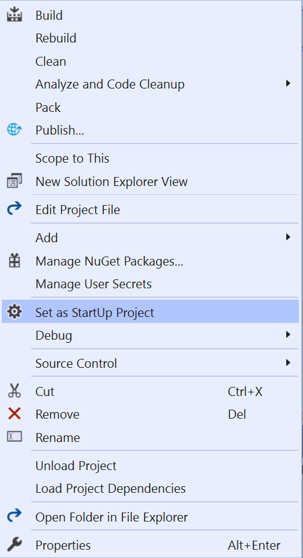
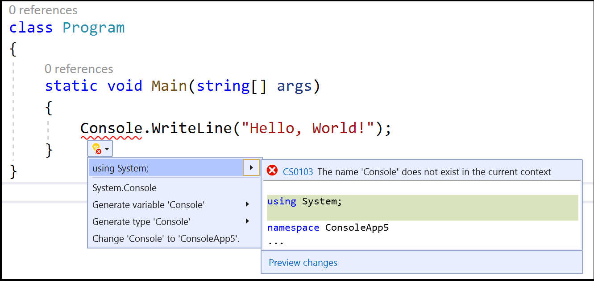
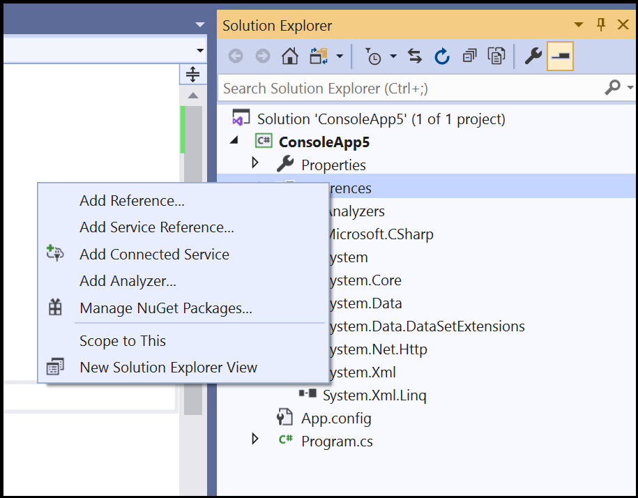
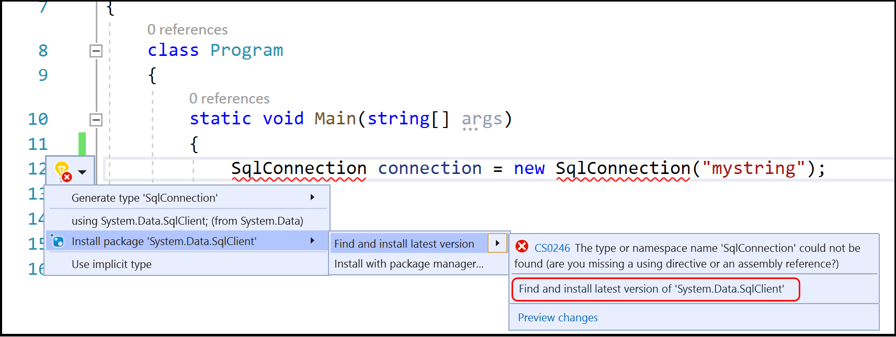

# Run a C# program or app in Visual Studio

How to run a program or start an app depends on what you start from, the type of program or app, and whether you want to run under the debugger. In the simplest case, to build and run an open project in Visual Studio:

- Press **F5**, choose **Debug** > **Start with debugging** from the Visual Studio menu, or select the green **Start** arrow and project name on the Visual Studio toolbar.
- Or, to run without debugging, press **Ctrl**+**F5** or choose **Debug** > **Start without debugging** from the Visual Studio menu.

::: moniker range="<=vs-2019"

::: moniker-end
::: moniker range=">=vs-2022"
:::image type="content" source="media/vs-2022/start-button.png" alt-text="Screenshot that shows the Start button." border="false":::
::: moniker-end

## Start from a project

You can run a C# project (`.csproj` file) if it's a runnable program. If the project contains a C# file with a `Main` method, and its output is an executable or `.exe` file, it will probably run if it builds successfully. If your project output is an executable file, and doesn't have a `Main` method, program executions starts with top-level statements. See [Programs without Main methods](/dotnet/csharp/fundamentals/program-structure/top-level-statements). Some project types, such as class libraries, are not runnable. Class libraries are not runnable on their own, but they can be referenced by other projects.

If you're not sure if the project you have is an executable file, select the project node in Solution Explorer, and open the project properties. Either right-click on the node to bring up the context menu, and choose **Properties**, or press **Alt**+**Enter**. In the **Application** section, look for the **Output type**. If it's **Console Application**, then it's a runnable program.

1. Open the project. To do so, you can double-click or tap on the `.csproj` file in Windows File Explorer, or choose **Open a project** in Visual Studio, browse to find the `.csproj` file, and select the file.

1. After the project loads in Visual Studio, if your Visual Studio solution has more than one project, make sure to set the project with the `Main` method as the startup project. To set the startup project, right-click on the project name or node in **Solution Explorer** and choose **Set as Startup Project** from the context menu.

   ::: moniker range="<=vs-2019"
   
   ::: moniker-end
   ::: moniker range=">=vs-2022"
   :::image type="content" source="media/vs-2022/set-startup-project.png" alt-text="Screenshot that shows setting the startup project." border="false":::
   ::: moniker-end

1. To run the program, press **Ctrl**+**F5**, select **Debug** > **Start without debugging** from the top menu, or select the green **Start** button. 

   Visual Studio tries to build and run your project. At the bottom of the Visual Studio screen, the build output appears in the **Output** window, and any build errors appear in the **Error List** window.

   If the build succeeds, the app runs as appropriate for the type of project. Console apps run in a terminal window, Windows desktop apps start in a new desktop window, and web apps run in a browser hosted by IIS Express.

## Start from code

If have a runnable C# code sample in mind such as [this one](https://www.sanfoundry.com/csharp-program-check-given-number-even-odd/), or a runnable C# code file or files on disk, follow these steps.

First make sure the code is a runnable program from a trusted source. Any app with a `Main` method is probably a runnable program, but with the current version of C#, programs without `Main` methods with top-level statements can also run. You can use the Console Application template to create a project in Visual Studio, and then copy the code intoit.

### A single code file

1. Start Visual Studio, choose **Create a new project**, and choose the C# **Console App** project.
1. Replace all the code in the project `.cs` file with the contents of your code or file. If the code you want to use is on the web, or in a single file, it might be easiest to select the code, copy it to the clipboard, and paste it into a code file in the Visual Studio project.
1. Rename the project `.cs` file to match your code file name.

### Several code files on disk

1. Start Visual Studio, and create a new project of the appropriate type. Use the C# **Console App** if you're not sure.
1. In the new project, replace all the code in the project code file with the contents of your first code listing or file.
1. Rename the project code file to match your code file name.
1. For each remaining code file:
   1. Right-click the project node in **Solution Explorer** and choose **Add** > **Existing Item**, or select the project and press **Shift**+**Alt**+**A**.
   1. Browse to and select the code file to import it into the project.

### Several files in a folder

If you have a folder with many files, first check for a project or solution file. Programs that Visual Studio creates have project and solution files. In Windows File Explorer, look for files with the `.csproj` or `.sln` extension. Double-click the `.csproj` file to open it in Visual Studio. See [Start from a Visual Studio solution or project](#start-from-a-project).

If the code is from another development environment, there's no project file. Open the folder by choosing **Open** > **Folder** in Visual Studio. See [Develop code without projects or solutions](../../ide/develop-code-in-visual-studio-without-projects-or-solutions.md).

## Start from a GitHub or Azure DevOps repo

If the code you want to run is in a GitHub or Azure DevOps repo, you can use Visual Studio to open the project directly from the repo. See [Open a project from a repo](../tutorial-open-project-from-repo.md).

## Run the program

To start building the program, press the green **Start** button on the Visual Studio toolbar, or press **F5** or **Ctrl**+**F5**. Using the **Start** button or **F5** runs the program under the debugger.

Visual Studio attempts to build and run the code in your project. If a build doesn't succeed, see the following sections for some ideas on how to get the project to build successfully.

## Troubleshooting

Your code might have errors. Or the code might be correct, but maybe it depends on missing assemblies or NuGet packages, or targets a different version of .NET. In those cases, you might be able to easily fix the build.

### Add references

To build properly, the code must be correct and have the right references to libraries or other dependencies. Red squiggly underlines in code or entries in the **Error List** show errors even before you compile and run the program. If the errors relate to unresolved names, you probably need to add a reference or a `using` directive, or both. If the code references any missing assemblies or NuGet packages, you need to add those references to the project.

Visual Studio tries to help you identify missing references. When a name is unresolved, a light bulb icon appears in the editor. Select the light bulb to see suggestions on how to fix the issue. Fixes might be to:

- Add a using directive.
- Add a reference to an assembly.
- Install a NuGet package.

#### Add a using directive

Here's an example of a missing `using` directive. You can add `using System;` to the start of the code file to resolve the unresolved name `Console`:

::: moniker range="<=vs-2019"

::: moniker-end
::: moniker range=">=vs-2022"
:::image type="content" source="media/vs-2022/missing-using-directive.png" alt-text="Screenshot of light bulb to add a using directive." border="false":::
::: moniker-end

More recent of C# support implicit using directives for some commonly used namespaces, so if you chose that option when creating a project, you don't need them.

#### Add an assembly reference

.NET references can be assemblies or NuGet packages. In source code, the publisher or author usually explains what assemblies the code requires and what packages it depends on. To add a reference to a project manually, right-click the **References** node in **Solution Explorer** and choose **Add Reference**. In the **Reference Manager**, locate and add the required assembly.

::: moniker range="<=vs-2019"

::: moniker-end
::: moniker range=">=vs-2022"
:::image type="content" source="media/vs-2022/add-reference.png" alt-text="Screenshot of the Add Reference menu." border="false":::
::: moniker-end

You can find assemblies and add references by following the instructions in [Add or remove references by using the Reference Manager](../../ide/how-to-add-or-remove-references-by-using-the-reference-manager.md).

#### Add a NuGet package

If Visual Studio detects a missing NuGet package, a light bulb appears and gives you the option to install the package:

::: moniker range="<=vs-2019"

::: moniker-end
::: moniker range=">=vs-2022"
:::image type="content" source="media/vs-2022/lightbulb-add-package.png" alt-text="Screenshot of a light bulb to install a NuGet package." border="false":::
::: moniker-end

If that doesn't solve the issue or Visual Studio can't locate the package, try searching for the package online. See [Install and use a NuGet package in Visual Studio](/nuget/quickstart/install-and-use-a-package-in-visual-studio).

### Use the right version of .NET

Because different versions of the .NET Framework have some backward compatibility, a newer framework might run code written for an older framework without any changes. But sometimes you need to target a specific .NET Framework version. You might need to install a specific version of the .NET Framework or .NET Core. See [Modify Visual Studio](../../install/modify-visual-studio.md).

To change the target .NET Framework version, see [Change the target framework](../../ide/visual-studio-multi-targeting-overview.md#select-a-target-framework-version). For more information, see [Troubleshooting .NET Framework targeting errors](../../msbuild/troubleshooting-dotnet-framework-targeting-errors.md).

## Next steps

- Explore the Visual Studio development environment by reading [Welcome to the Visual Studio IDE](../visual-studio-ide.md).
- [Create your first C# app](tutorial-console.md).
