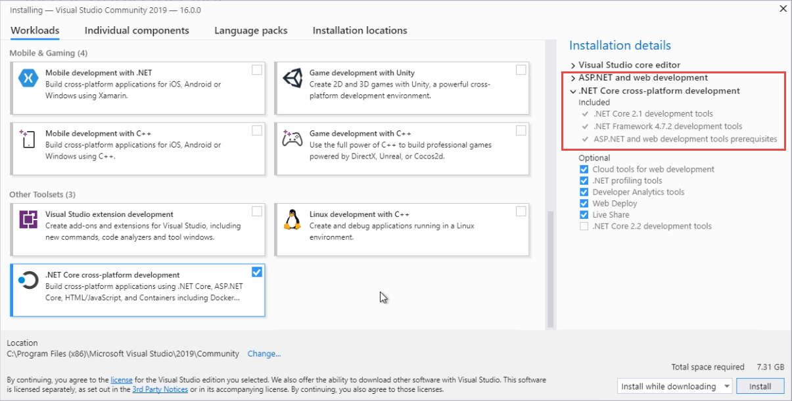

# Tutorial: Install Visual Studio 2019

Learn how to install Visual Studio 2019 with this video tutorial and step-by-step instructions.

_Watch this video and follow along to install Visual Studio and create your first ASP.NET Core app._

> [!Video https://www.youtube.com/embed/Fz_HAqQGLtY]

## Download the Installer

Go to [visualstudio.com](https://visualstudio.com) to find the installer. Locate the Visual Studio 2019 link, and click it to start the download.

## Start the Installer

Once the download has completed, click **Run** to start the installer.

## Choose workloads

Visual Studio can be used for many different kinds of development, and workloads make it easy for you to download everything you need for the kind of apps you want to build. Choose **ASP.NET and Web Development** and **.NET Core cross-platform development** workloads for now. You can always relaunch the installer later to install additional workloads and components.

## Install

Click **Install** and let the installer download and install Visual Studio.

## Run Visual Studio for the first time

Visual Studio should launch automatically when the installer finishes. You may be prompted to sign in, which has some nice features associated with it, but for now you can choose to do so later. Next you can choose your theme and development settings. Once you've made these choices, you'll be ready to start your first project. Click **Create a new project** and then choose **ASP.NET Core Web Application**.

## Explore ASP.NET Core project types

You can choose your project name and location, then pick **Create**. Now choose which template to use for your ASP.NET Core application. You can choose from the following options:

- Empty. An empty project template that lets you start from scratch.
- API. Best for Web APIs.
- Web Application. A standard ASP.NET Core web application built with Razor Pages.
- Web Application (Model-View-Controller). A standard ASP.NET Core web application using the Model-View-Controller pattern.
- Angular.
- React.js.
- React.js / Redux.
- Razor Class Library. Used to share Razor assets between projects.

Note that for most of the project templates you can also choose to enable Docker support by checking a box. You can also add Authentication support by clicking the change Authentication button. From there you can choose from:

- No Authentication.
- Individual User Accounts. These are stored in a local or Azure-based database.
- Work or School Accounts. This option uses Active Directory, Azure AD, or Office 365 for authentication.
- Windows Authentication. Suitable for intranet applications.

Select the standard Web Application template with No Authentication and click **OK**.

## Next steps

In the next video, you'll learn more about your first ASP.NET Core project.

[Tutorial: Creating Your First ASP.NET Core Web App](tutorial-aspnet-core-ef-step-02.md)

## See also

- [Tutorial: Get started with C# and ASP.NET Core](tutorial-aspnet-core.md) A more detailed tutorial without a video walkthrough

