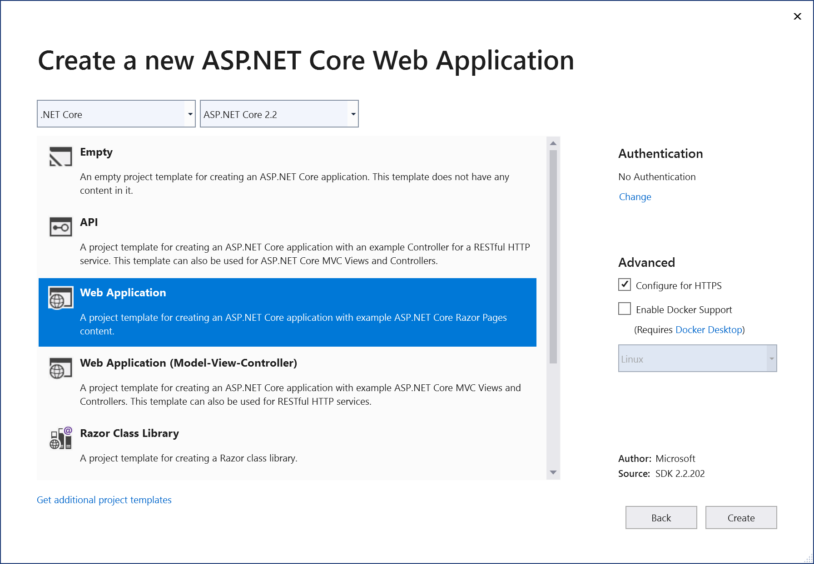
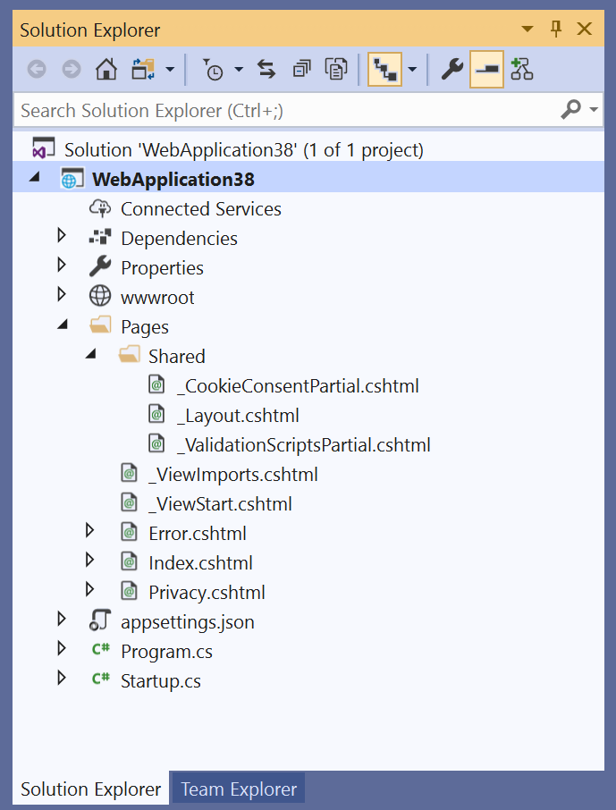
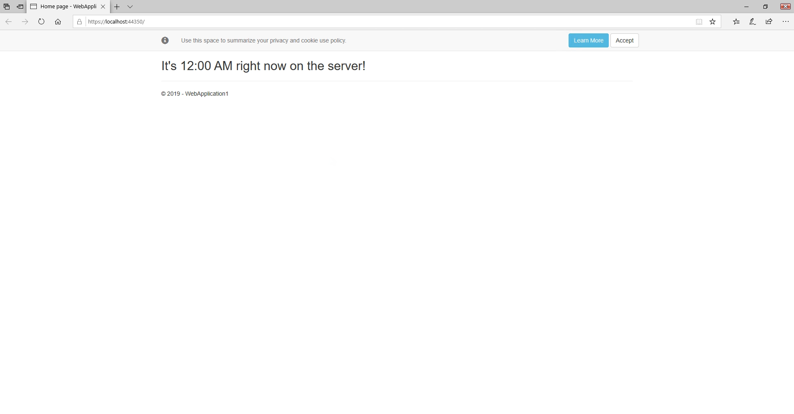
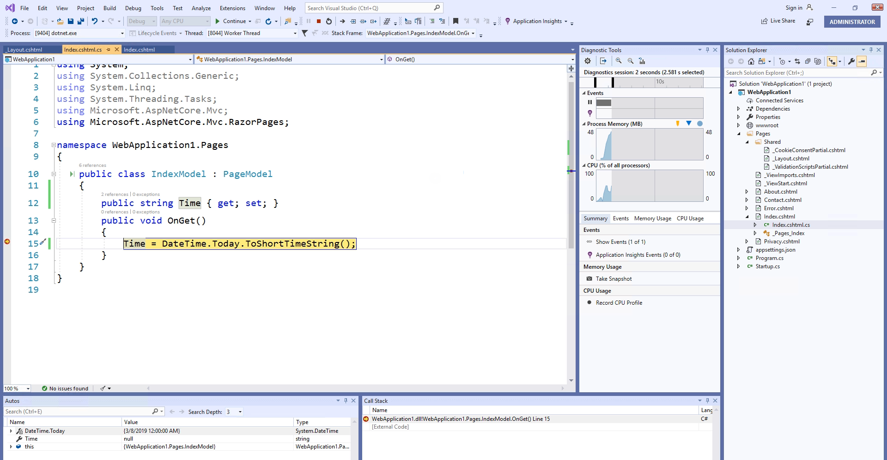
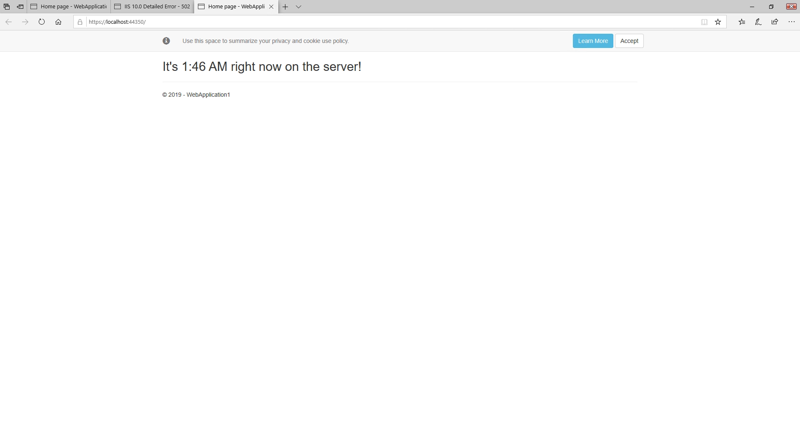

# Step 2: Create your first ASP.NET Core web app

Create your first ASP.NET Core Web App with this video tutorial and step-by-step instructions.

_Watch this video and follow along to create your first ASP.NET Core app._

> [!VIDEO https://www.youtube.com/embed/-79RkpyFB6E]

## Start Visual Studio 2019 and create a new project

Start Visual Studio 2019 and click **Create new project**. Choose **ASP.NET Core Web Application**. Choose the **Web Application** template and keep the default project name and location. In the dropdown with the ASP.NET Core version, choose **ASP.NET Core 2.1** or **ASP.NET Core 2.2**. Click **Create**. For more detailed instructions, refer to [the previous video in this tutorial series](tutorial-aspnet-core-ef-step-01.md).



> [!WARNING]
> Make sure you choose ASP .NET Core 2.1 or ASP.NET Core 2.2. This tutorial is not compatible with ASP.NET Core 3.x.

## Explore the new project

In the solution explorer window on the right, you can view the contents of the new project. They're described here.



### wwwroot

The *wwwroot* folder holds static files that will be publicly accessible from the web application. It typically holds stylesheets, client-side script files, and images.

### Pages

The *Pages* folder holds the site's Razor Pages. The default template provides several pages, including the *Index.cshtml* page that is the application home page, as well as About, Contact, and so on.

### appsettings.json

This file holds configuration settings for the site, in JSON format.

### Program.cs

This file acts as the entry point for the application. When the app is run, its Main method is the first method that is run, and is responsible for creating the Web Host that will contain the application.

### Startup.cs

The Web Host created in *Program.cs* references the Startup class and calls its methods to configure the application. The ConfigureServices method is responsible for setting up any services the app will use. The `Configure` method sets up the app's HTTP request pipeline. Each request goes through this pipeline, interacting with each piece of *middleware* as it does so.

### Index.cshtml

The home page for the site includes some HTML markup and some server side Razor code. It uses Razor to specify the page model, `IndexModel`, which is located in the associated *Index.cshtml.cs* file. It also sets the page title by setting a value in ViewData. This ViewData value is read in the *\_Layout.cshtml* file, located in the Shared folder inside the Pages folder. The Layout file is shared by many Razor Pages and provides the common look and feel for the application. Each page's content is rendered within the Layout file's HTML.

## Run the application

Now run the application and view it in the browser. You can run the application using **Ctrl**+**F5** or by choosing **Debug** > **Start Without Debugging** from Visual Studio's menu.

## Customize the application

Add a property to the *Index.cshtml.cs* file and set its value to the current time in the `OnGet` handler:

```csharp
public string Time { get; set; }
public void OnGet()
{
    Time = DateTime.Today.ToShortTimeString();
}
```

Replace the `<div>` content in *Index.cshtml* with this markup:

```cshtml
<h2>It's @Model.Time right now on the server!</h2>
```

Run the application again. You should see that the page now displays the current time, but it's always midnight! That's not right.



## Debug the application

Add a breakpoint to the `OnGet` method where we're assigning a value to `Time` and this time start debugging the application.

Execution stops on the line, and you can see that `DateTime.Today` includes the date but the time is always midnight because it doesn't include time data. 



Change it to use `DateTime.Now` and continue executing. The new code for `OnGet` should be:

```csharp
public void OnGet()
{
    Time = DateTime.Now.ToShortTimeString();
}
```

You should now see the actual server time in the browser when you navigate to the app.

> [!NOTE]
> Your output might differ from the image, since the output format of ToShortDateTimeString depends on the current culture setting. See <xref:System.DateTime.ToShortTimeString>.



## Next steps

In the next video, you'll learn how to add data support to your app.

[Tutorial: Working with Data in Your ASP.NET Core App](tutorial-aspnet-core-ef-step-03.md)

## See also

- [Tutorial: Create a Razor Pages web app with ASP.NET Core](/aspnet/core/tutorials/razor-pages/?view=aspnetcore-2.1)
