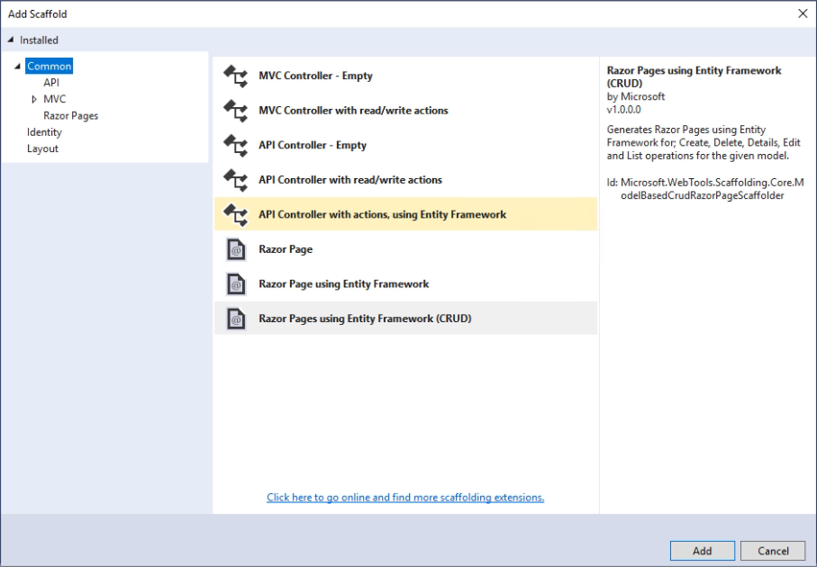
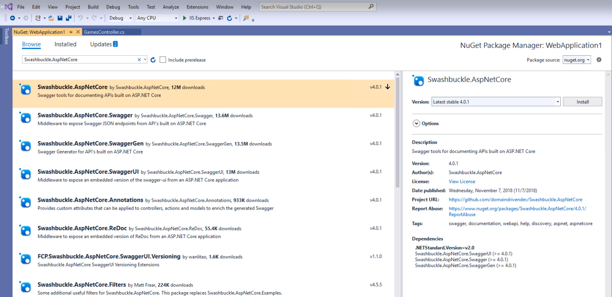

# Step 4: Expose a web API from your ASP.NET Core app

Follow these steps to add a web API to your existing ASP.NET Core app.

_Watch this video and follow along to add web API support to your first ASP.NET Core app._

> [!VIDEO https://www.youtube.com/embed/o_fYPOsAXts]

## Open your project

Open your ASP.NET Core app in Visual Studio 2019. The app should already be using EF Core to manage your model types, as configured in [step 3 of this tutorial series](tutorial-aspnet-core-ef-step-03.md).

## Add an API controller

Right click on the project and add a new folder called *Api*. Then, right click on this folder and choose **Add** > **New Scaffolded Item**. Choose **API Controller with actions, using Entity Framework.** Now choose an existing model class and click **Add**.



## Reviewing the generated controller

The generated code includes a new controller class. At the top of the class definition are two attributes.

```csharp
[Route("api/[controller]")]
[ApiController]
public class GamesController : ControllerBase
```

The first one specifies the route for actions in this controller as being `api/[controller]` which means if the controller is named `GamesController` the route will be `api/Games`.

The second attribute, `[ApiController]`, adds some useful validations to the class, such as ensuring every action method includes its own `[Route]` attribute.

```csharp
public class GamesController : ControllerBase
{
    private readonly AppDbContext _context;

    public GamesController(AppDbContext context)
    {
        _context = context;
    }
```

The controller uses the existing `AppDbContext`, passed into its constructor. Each action will use this field to work with the application's data.

```csharp
// GET: api/Games
[HttpGet]
public IEnumerable<Game> GetGame()
{
    return _context.Game;
}
```

The first method is a simple GET request, as specified using the `[HttpGet]` attribute. It takes no parameters and returns a list of all games in the database.

```csharp
// GET: api/Games/5
[HttpGet("{id}")]
public async Task<IActionResult> GetGame([FromRoute] int id)
{
    if (!ModelState.IsValid)
    {
        return BadRequest(ModelState);
    }

    var game = await _context.Game.FindAsync(id);

    if (game == null)
    {
        return NotFound();
    }

    return Ok(game);
}
```

The next method specifies `{id}` in the route, which will be added to the route following a `/` so the full route will be something like `api/Games/5` as shown in the comment at the top. The `id` input is mapped to the `id` parameter on the method. Inside the method, if the model is invalid, a `BadRequest` result is returned. Otherwise, EF will attempt to find the record matching the provided `id`. If it can't a `NotFound` result is returned, otherwise the appropriate `Game` record is returned.

```csharp
// PUT: api/Games/5
[HttpPut("{id}")]
public async Task<IActionResult> PutGame([FromRoute] int id, [FromBody] Game game)
{
    if (!ModelState.IsValid)
    {
        return BadRequest(ModelState);
    }

    if (id != game.Id)
    {
        return BadRequest();
    }

    _context.Entry(game).State = EntityState.Modified;

    try
    {
        await _context.SaveChangesAsync();
    }
    catch (DbUpdateConcurrencyException)
    {
        if (!GameExists(id))
        {
            return NotFound();
        }
        else
        {
            throw;
        }
    }

    return NoContent();
}
```

Next, an `[HttpPut]` request made to the API is used to perform updates. The new `Game` record is provided in the body of the request. Some validation and error checking is performed, and if everything is successful the record in the database is updated with the values provided in the body of the request. Otherwise an appropriate error response is returned.

```csharp
// POST: api/Games
[HttpPost]
public async Task<IActionResult> PostGame([FromBody] Game game)
{
    if (!ModelState.IsValid)
    {
        return BadRequest(ModelState);
    }

    _context.Game.Add(game);
    await _context.SaveChangesAsync();

    return CreatedAtAction("GetGame", new { id = game.Id }, game);
}
```

An `[HttpPost]` request is used to add new records to the system. As with the `[HttpPut]`, the record is added in the body of the request. If it's valid, EF Core adds the record to the database and the action returns the updated record (with its database generated ID) and a link to the record in the API.

```csharp
// DELETE: api/Games/5
[HttpDelete("{id}")]
public async Task<IActionResult> DeleteGame([FromRoute] int id)
{
    if (!ModelState.IsValid)
    {
        return BadRequest(ModelState);
    }

    var game = await _context.Game.FindAsync(id);
    if (game == null)
    {
        return NotFound();
    }

    _context.Game.Remove(game);
    await _context.SaveChangesAsync();

    return Ok(game);
}
```

Finally, an `[HttpDelete]` route is used with an ID to delete a record. If the request is valid and a record with the given ID exists, EF Core delete it from the database.

## Adding Swagger

Swagger is an API documentation and testing tool that can be added as a set of services and middleware to an ASP.NET Core app. To do so, right-click on the project and choose **Manage NuGet Packages**. Click on **Browse** and search for `Swashbuckle.AspNetCore` and install the corresponding package.



Once installed, open `Startup.cs` and add the following to the end of the `ConfigureServices` method:

```csharp
services.AddSwaggerGen(c =>
{
    c.SwaggerDoc("v1", new Info { Title = "My API", Version = "v1" });
});
```

You'll also need to add `using Swashbuckle.AspNetCore.Swagger;` at the top of the file.

Next, add the following to the `Configure` method, just before `UseMvc`:

```csharp
// Enable middleware to serve generated Swagger as a JSON endpoint.
app.UseSwagger();

// Enable middleware to serve swagger-ui (HTML, JS, CSS, etc.), 
// specifying the Swagger JSON endpoint.
app.UseSwaggerUI(c =>
{
    c.SwaggerEndpoint("/swagger/v1/swagger.json", "My API V1");
});
```

Now you should be able to build and run your app. In the browser, navigate to `/swagger` in the address bar. You should see a list of your app's API endpoints and models. 


Click an endpoint under Games, then `Try it out` and `Execute` to see how the different endpoints behave.

## Next steps

In the next video, you'll learn how to deploy your app to Azure.

[Step 5: Deploying Your ASP.NET Core App to Azure](tutorial-aspnet-core-ef-step-05.md)

## See also

- [Getting Started with Swashbuckle and ASP.NET Core](/aspnet/core/tutorials/getting-started-with-swashbuckle?view=aspnetcore-2.2&tabs=visual-studio)
- [ASP.NET Core web API help pages with Swagger / OpenAPI](/aspnet/core/tutorials/web-api-help-pages-using-swagger?view=aspnetcore-2.2)