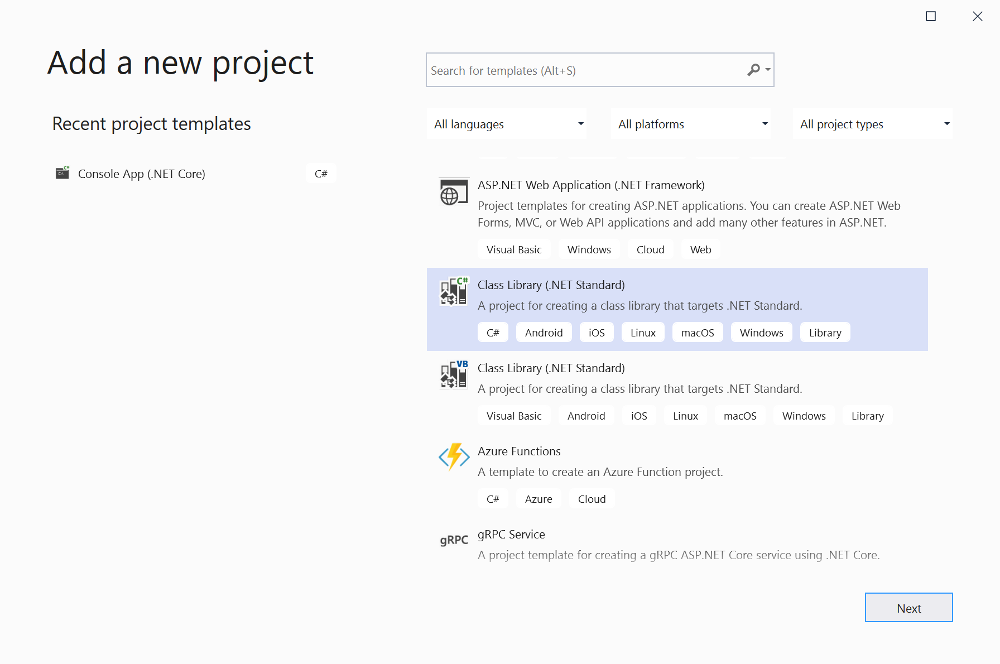
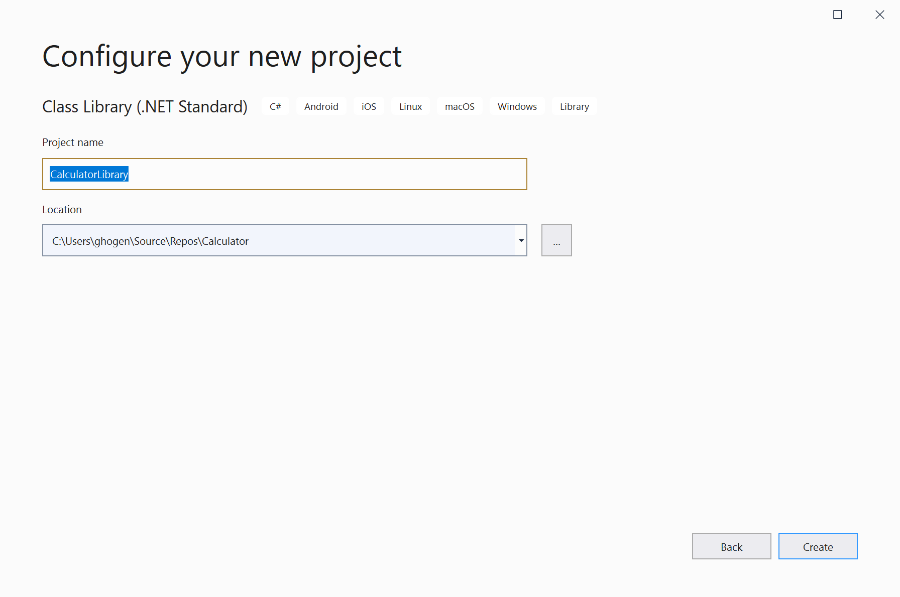
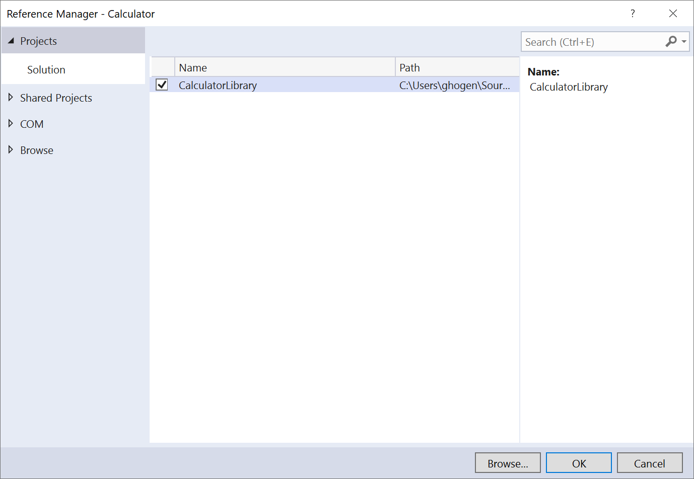
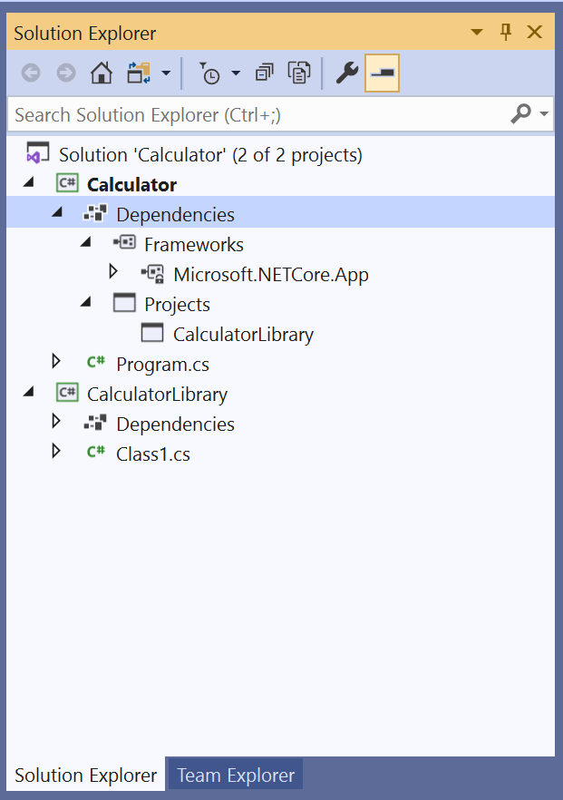
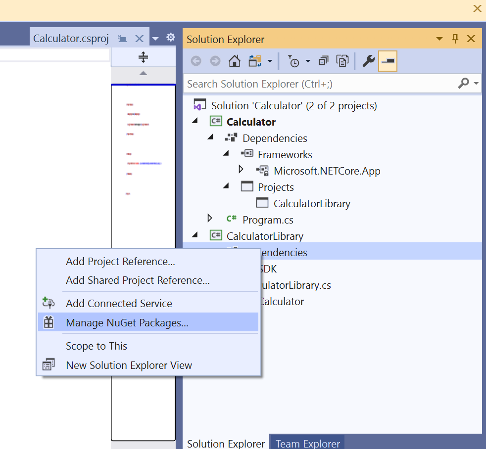
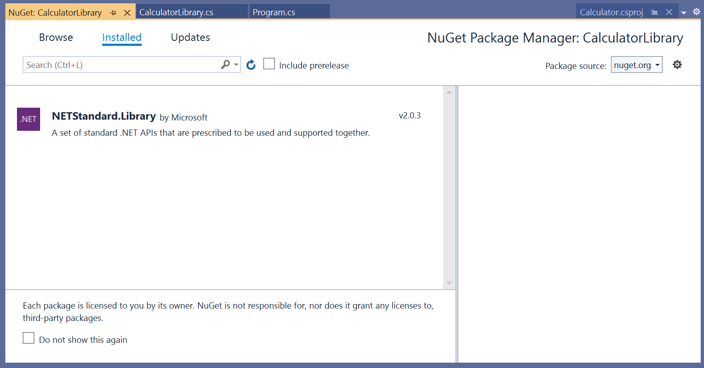

# Tutorial: Extend a simple C# console app

In this tutorial, you'll learn how to use Visual Studio to extend the console app you created in the first part. You'll learn some of the features in Visual Studio that help you be more productive as a developer, such as using advanced editor features, and debugging.

If you just completed the first part of this series, you already have the Calculator console app.  To skip part 1, you can start by opening the project from a GitHub repo.

## Open the Calculator project from a GitHub repo

## Add a new project

Real-world code involves many projects working together in a solution. Now, let's add another project to the Calculator app. This will be a class library that provides some of the calculator functions.

1. In Visual Studio, you can use the top-level menu command **File** > **Add** > **New Project** to add a new project, but you can also right-click on the existing project name (called the "project node") and open up the project's shortcut menu (or context menu). This shortcut menu contains a lot of useful ways to add functionality to your projects. So, right-click on your project node in **Solution Explorer**, and choose **Add** > **New Project**.

1. Choose the C# project template **Class library (.NET Standard)**.

   

1. Type the project name **CalculatorLibrary**, and choose **Create**.

   

   Visual Studio creates the new project and adds it to the solution.

   

1. Instead of having *Class1.cs*, rename the file **CalculatorLibrary.cs**. You can click on the name in **Solution Explorer** to rename it, or right-click and choose **Rename**, or press the **F2** key.

   You might get asked if you want to rename any references to `Class1` in the file. It doesn't matter how you answer, since you'll be replacing the code in a future step.

1. We now have to add a project reference, so that the first project can use APIs exposed by the new class library.  Right-click on the **References** node in the first project and choose **Add Project Reference**.

   

   The **Reference Manager** dialog box appears. This lets you add references to other projects, as well assemblies and COM DLLs that your projects need.

   

1. In the **Reference Manager** dialog box, select the checkbox for the **CalculatorLibrary** project, and choose **OK**.  The project reference appears under a **Projects** node in **Solution Explorer**.

   

1. In *Program.cs*, select the `Calculator` class and all its code, and press **CTRL+X** to cut it from Program.cs. Then in **CalculatorLibrary**, in *CalculatorLibrary.cs*, paste the code into the `CalculatorLibrary` namespace. Then, make the Calculator class `public` to expose it outside the library. The code in *CalculatorLibrary.cs* should now resemble the following:

   ```csharp
   using System;

    namespace CalculatorLibrary
    {
        public class Calculator
        {
            public static double DoOperation(double num1, double num2, string op)
            {
                double result = double.NaN; // Default value is "not-a-number" which we use if an operation, such as division, could result in an error.

                // Use a switch statement to do the math.
                switch (op)
                {
                    case "a":
                        result = num1 + num2;
                        break;
                    case "s":
                        result = num1 - num2;
                        break;
                    case "m":
                        result = num1 * num2;
                        break;
                    case "d":
                        // Ask the user to enter a non-zero divisor.
                        if (num2 != 0)
                        {
                            result = num1 / num2;
                        }
                        break;
                    // Return text for an incorrect option entry.
                    default:
                        break;
                }
                return result;
            }
        }
    }
   ```

1. The first project has a reference, but you'll see an error that the Calculator.DoOperation call doesn't resolve. That's because CalculatorLibrary is in a difference namespace, so add `CalculatorLibrary` namespace for a fully qualified reference.

   ```csharp
   result = CalculatorLibrary.Calculator.DoOperation(cleanNum1, cleanNum2, op);
   ```

   Try adding a using directive to the beginning of the file instead:

   ```csharp
   using CalculatorLibrary;
   ```

   This should let you remove the CalculatorLibrary namespace from the call site, but there's now an ambiguity. Is `Calculator` the class in CalculatorLibrary, or is Calculator the namespace?  To resolve the ambiguity, rename the namespace `CalculatorProgram`.

   ```csharp
   namespace CalculatorProgram
   ```

1. Suppose you now want to add a log of all the operations, and write it out to a text file. The .NET Framework Trace class can do this. (It's useful for basic print debugging techniques as well.)  The Trace class is in System.Diagnostics, so start by adding a using directive:

   ```csharp
   using System.Diagnostics;
   ```

1. Looking at how the Trace class is used, you need to hold onto a reference for the class, which is associated with a filestream. That means, the calculator would work better as an object, so let's add a constructor.

   ```csharp
   public Calculator()
        {
            StreamWriter logFile = File.CreateText("calculator.log");
            Trace.Listeners.Add(new TextWriterTraceListener(logFile));
            Trace.AutoFlush = true;
            Trace.WriteLine("Starting Calculator Log");
            Trace.WriteLine(String.Format("Started {0}", System.DateTime.Now.ToString()));
        }

    public double DoOperation(double num1, double num2, string op)
        {
   ```

1. And we need to change the static `DoOperation` method into a member method.  Let's also add output to each calculation for the log, so that DoOperation looks like this.

   ```csharp
   public double DoOperation(double num1, double num2, string op)
   {
        double result = double.NaN; // Default value is "not-a-number" which we use if an operation, such as division, could result in an error.

        // Use a switch statement to do the math.
        switch (op)
        {
            case "a":
                result = num1 + num2;
                Trace.WriteLine(String.Format("{0} + {1} = {2}", num1, num2, result));
                break;
            case "s":
                result = num1 - num2;
                Trace.WriteLine(String.Format("{0} - {1} = {2}", num1, num2, result));
                break;
            case "m":
                result = num1 * num2;
                Trace.WriteLine(String.Format("{0} * {1} = {2}", num1, num2, result));
                break;
            case "d":
                // Ask the user to enter a non-zero divisor.
                if (num2 != 0)
                {
                    result = num1 / num2;
                    Trace.WriteLine(String.Format("{0} / {1} = {2}", num1, num2, result));
                }
                    break;
            // Return text for an incorrect option entry.
            default:
                break;
        }
        return result;
    }
   ```

1. Now back in Program.cs, the static call is flagged with a red squiggly. To fix it, create a `calculator` variable by adding the following line just before the while loop:

   ```csharp
   Calculator calculator = new Calculator();
   ```

   And modify the call site for DoSomething as follows.

   ```csharp
   result = calculator.DoOperation(cleanNum1, cleanNum2, op);
   ```

1. Run the program again, and when done, right-click on the project node and choose **Open folder in File Explorer**, then navigate down in File Explorer to the output folder. It might be *bin/Debug/netcoreapp3.1*, and open the *calculator.log* file.

    ```output
    Starting Calculator Log
    Started 7/9/2020 1:58:19 PM
    1 + 2 = 3
    3 * 3 = 9
    ```

1. Now suppose we want to output the operations in a JSON format, a popular and portable format for storing object data. To help with this, we will need to reference the NuGet package Newtonsoft.Json. NuGet packages are the primary vehicle for distribution of .NET class libraries. In **Solution Explorer**, right-click on the **References** node for the CalculatorLibrary project, and choose **Manage NuGet Packages**.

   

   The NuGet Package Manager opens.

   

1. Search for Newtonsoft.Json package, and choose **Install**.

   

   The package is dowloaded, and added to your project and a new entry appears in the References node in **Solution Explorer**.

1. Add a using directive for the Newtonsoft.Json package at the beginning of *CalculatorLibrary.cs*.

   ```csharp
   using Newtonsoft.Json;
   ```

1. Now replace the constructor for Calculator with the following code, and create the JsonWriter member object:

   ```csharp
        JsonWriter writer;

        public Calculator()
        {
            StreamWriter logFile = File.CreateText("calculatorlog.json");
            logFile.AutoFlush = true;
            writer = new JsonTextWriter(logFile);
            writer.Formatting = Formatting.Indented;
            writer.WriteStartObject();
            writer.WritePropertyName("Operations");
            writer.WriteStartArray();
        }
   ```

1. Modify the `DoOperation` method to add the JSON writer code:

   ```csharp
        public double DoOperation(double num1, double num2, string op)
        {
            double result = double.NaN; // Default value is "not-a-number" which we use if an operation, such as division, could result in an error.
            writer.WriteStartObject();
            writer.WritePropertyName("Operand1");
            writer.WriteValue(num1);
            writer.WritePropertyName("Operand2");
            writer.WriteValue(num2);
            writer.WritePropertyName("Operation");
            // Use a switch statement to do the math.
            switch (op)
            {
                case "a":
                    result = num1 + num2;
                    writer.WriteValue("Add");
                    break;
                case "s":
                    result = num1 - num2;
                    writer.WriteValue("Subtract");
                    break;
                case "m":
                    result = num1 * num2;
                    writer.WriteValue("Multiply");
                    break;
                case "d":
                    // Ask the user to enter a non-zero divisor.
                    if (num2 != 0)
                    {
                        result = num1 / num2;
                        writer.WriteValue("Divide");
                    }
                    break;
                // Return text for an incorrect option entry.
                default:
                    break;
            }
            writer.WritePropertyName("Result");
            writer.WriteValue(result);
            writer.WriteEndObject();

            return result;
        }
   ```

1. You'll need to add a method to finish the JSON syntax once the user is done entering operation data.

   ```csharp
    public void Finish()
    {
        writer.WriteEndArray();
        writer.WriteEndObject();
        writer.Close();
    }
   ```

1. And in *Program.cs*, add a call to Finish at the end.

   ```csharp
            // And call to close the JSON writer before return
            calculator.Finish();
            return;
        }
   ```

1. Build and run the app, and after you're done entering a few operations, close the app properly by using the 'n' command.  Now, open the consolelog.json file and you should see something like the following:

   ```json
   {
    "Operations": [
        {
        "Operand1": 2.0,
        "Operand2": 3.0,
        "Operation": "Add",
        "Result": 5.0
        },
        {
        "Operand1": 3.0,
        "Operand2": 4.0,
        "Operation": "Multiply",
        "Result": 12.0
        }
    ]
   }
   ```

## Next steps

Congratulations on completing this tutorial! To learn even more, continue with the following tutorials.

> [!div class="nextstepaction"]
> [Continue with more C# tutorials](/dotnet/csharp/tutorials/)

## See also

* [C# IntelliSense](../../ide/visual-csharp-intellisense.md)
* [Learn to debug C# code in Visual Studio](tutorial-debugger.md)
