# Tutorial: Create a simple C# console app in Visual Studio

In this tutorial for C#, you'll use Visual Studio to create and run a console app and explore some features of the Visual Studio integrated development environment (IDE) while you do so.

::: moniker range="vs-2017"

If you haven't already installed Visual Studio, go to the [Visual Studio downloads](https://visualstudio.microsoft.com/vs/older-downloads/?utm_medium=microsoft&utm_source=docs.microsoft.com&utm_campaign=vs+2017+download) page to install it for free.

::: moniker-end

::: moniker range="vs-2019"

If you haven't already installed Visual Studio, go to the [Visual Studio downloads](https://visualstudio.microsoft.com/downloads) page to install it for free.

::: moniker-end

## Create a project

To start, we'll create a C# application project. The project type comes with all the template files you'll need, before you've even added anything!

::: moniker range="vs-2017"

1. Open Visual Studio 2017.

2. From the top menu bar, choose **File** > **New** > **Project**.
   (Alternatively, press **Ctrl**+**Shift**+**N**).

3. In the left pane of the **New Project** dialog box, expand **C#**, and then choose **.NET Core**. In the middle pane, choose **Console App (.NET Core)**. Then name the file ***Calculator***.

   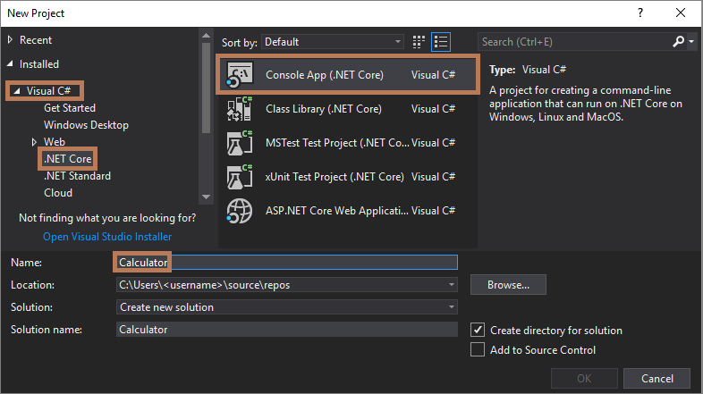

### Add a workload (optional)

If you don't see the **Console App (.NET Core)** project template, you can get it by adding the **.NET Core cross-platform development** workload. Here's how.

#### Option 1: Use the New Project dialog box

1. Choose the **Open Visual Studio Installer** link in the left pane of the **New Project** dialog box.

   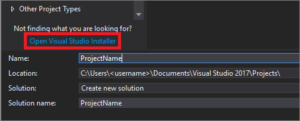

1. The Visual Studio Installer launches. Choose the **.NET Core cross-platform development** workload, and then choose **Modify**.

   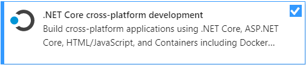

#### Option 2: Use the Tools menu bar

1. Cancel out of the **New Project** dialog box and from the top menu bar, choose **Tools** > **Get Tools and Features**.

1. The Visual Studio Installer launches. Choose the **.NET Core cross-platform development** workload, and then choose **Modify**.

::: moniker-end

::: moniker range="vs-2019"

1. Open Visual Studio 2019.

1. On the start window, choose **Create a new project**.

   

1. On the **Create a new project** window, enter or type *console* in the search box. Next, choose **C#** from the Language list, and then choose **Windows** from the Platform list. 

   After you apply the language and platform filters, choose the **Console App (.NET Core)** template, and then choose **Next**.

   

   > [!NOTE]
   > If you do not see the **Console App (.NET Core)** template, you can install it from the **Create a new project** window. In the **Not finding what you're looking for?** message, choose the **Install more tools and features** link.
   >
   >  
   > 
   > Then, in the Visual Studio Installer, choose the **.NET Core cross-platform development** workload.
   >
   > 
   >
   > After that, choose the **Modify** button in the Visual Studio Installer. You might be prompted to save your work; if so, do so. Next, choose **Continue** to install the workload. Then, return to step 2 in this "[Create a project](#create-a-project)" procedure.

1. In the **Configure your new project** window, type or enter *Calculator* in the **Project name** box. Then, choose **Create**.

   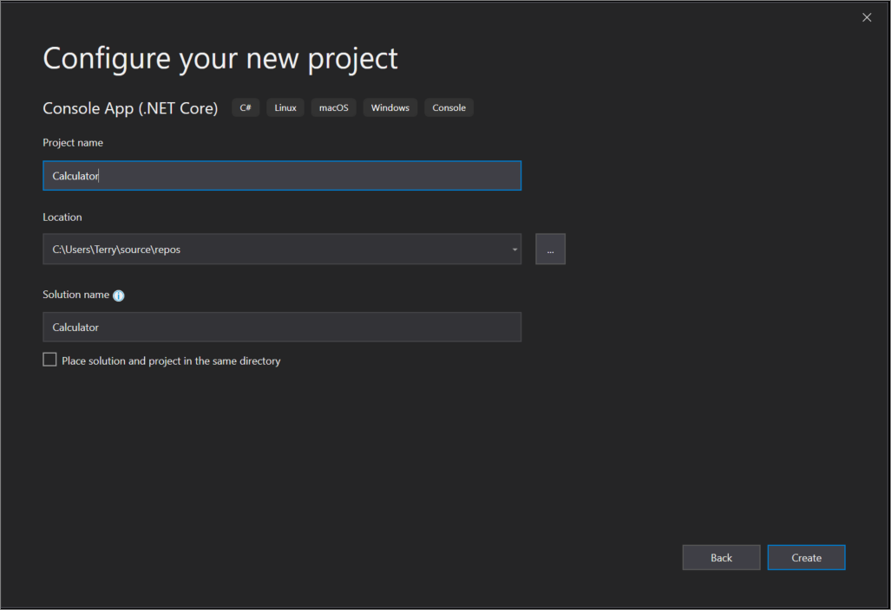

   Visual Studio opens your new project, which includes default "Hello World" code.
   
::: moniker-end

## Create the app

First, we'll explore some basic integer math in C#. Then, we'll add code to create a basic calculator. After that, we'll debug the app to find and fix errors. And finally, we'll refine the code to make it more efficient.

### Explore integer math

Let's start with some basic integer math in C#.

1. In the code editor, delete the default "Hello World" code.

    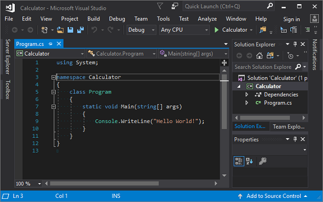

   Specifically, delete the line that says, `Console.WriteLine("Hello World!");`.

1. In its place, type the following code:

    ```csharp
            int a = 42;
            int b = 119;
            int c = a + b;
            Console.WriteLine(c);
            Console.ReadKey();
    ```

    Notice that when you do so, the IntelliSense feature in Visual Studio offers you the option to autocomplete the entry.

    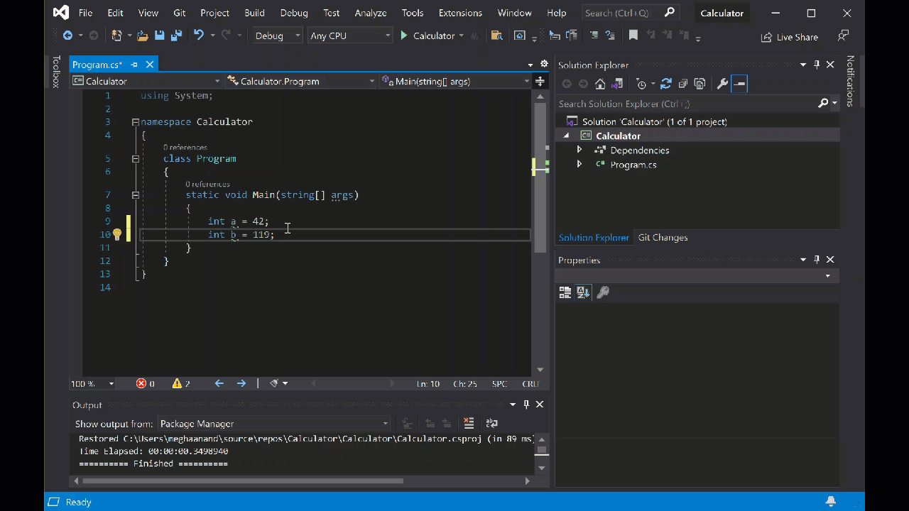

1. Choose the green **Start** button next to **Calculator** to build and run your program, or press **F5**.

   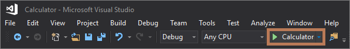

   A console window opens that reveals the sum of 42 + 119, which is **161**.

    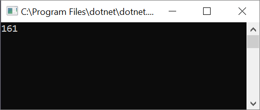

1. **(Optional)** You can change the operator to change the result. For example, you can change the `+` operator in the `int c = a + b;` line of code to `-` for subtraction, `*` for multiplication, or `/` for division. Then, when you run the program, the result changes, too.

1. Close the console window.

### Add code to create a calculator

Let's continue by adding a more complex set of calculator code to your project.

1. Delete all the code you see in the code editor.

1. Enter or paste the following new code into the code editor:

    ```csharp
    using System;

    namespace Calculator
    {
        class Program
        {
            static void Main(string[] args)
            {
                // Declare variables and then initialize to zero.
                int num1 = 0; int num2 = 0;

                // Display title as the C# console calculator app.
                Console.WriteLine("Console Calculator in C#\r");
                Console.WriteLine("------------------------\n");

                // Ask the user to type the first number.
                Console.WriteLine("Type a number, and then press Enter");
                num1 = Convert.ToInt32(Console.ReadLine());

                // Ask the user to type the second number.
                Console.WriteLine("Type another number, and then press Enter");
                num2 = Convert.ToInt32(Console.ReadLine());

                // Ask the user to choose an option.
                Console.WriteLine("Choose an option from the following list:");
                Console.WriteLine("\ta - Add");
                Console.WriteLine("\ts - Subtract");
                Console.WriteLine("\tm - Multiply");
                Console.WriteLine("\td - Divide");
                Console.Write("Your option? ");

                // Use a switch statement to do the math.
                switch (Console.ReadLine())
                {
                    case "a":
                        Console.WriteLine($"Your result: {num1} + {num2} = " + (num1 + num2));
                        break;
                    case "s":
                        Console.WriteLine($"Your result: {num1} - {num2} = " + (num1 - num2));
                        break;
                    case "m":
                        Console.WriteLine($"Your result: {num1} * {num2} = " + (num1 * num2));
                        break;
                    case "d":
                        Console.WriteLine($"Your result: {num1} / {num2} = " + (num1 / num2));
                        break;
                }
                // Wait for the user to respond before closing.
                Console.Write("Press any key to close the Calculator console app...");
                Console.ReadKey();
            }
        }
    }
    ```

1. Choose **Calculator** to run your program, or press **F5**.

   

   A console window opens.

1. View your app in the console window, and then follow the prompts to add the numbers **42** and **119**.

   Your app should look similar to the following screenshot:

    

### Add functionality to the calculator

Let's tweak the code to add further functionality.

### Add decimals

The calculator app currently accepts and returns whole numbers. But, it will be more precise if we add code that allows for decimals.

As in the following screenshot, if you run the app and divide number 42 by the number 119, your result is 0 (zero), which isn't exact.

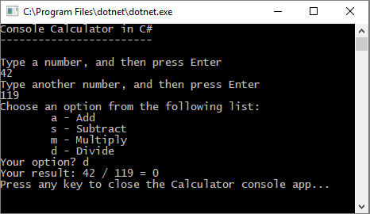

Let's fix the code so that it handles decimals.

1. Press **Ctrl** + **F** to open the **Find and Replace** control.

1. Change each instance of the `int` variable to `float`.

   Make sure that you toggle **Match case** (**Alt**+**C**) and **Match whole word** (**Alt**+**W**) in the **Find and Replace** control.

    

1. Run your calculator app again and divide the number **42** by the number **119**.

   Notice that the app now returns a decimal numeral instead of zero.

    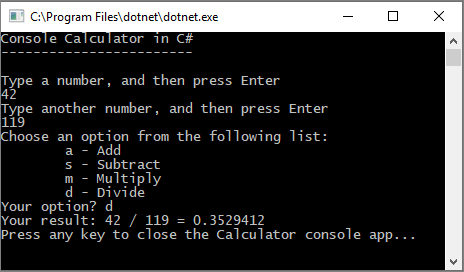

However, the app produces only a decimal result. Let's make a few more tweaks to the code so that the app can calculate decimals too.

1. Use the **Find and Replace** control (**Ctrl** + **F**) to change each instance of the `float` variable to `double`, and to change each instance of the `Convert.ToInt32` method to `Convert.ToDouble`.

1. Run your calculator app and divide the number **42.5** by the number **119.75**.

   Notice that the app now accepts decimal values and returns a longer decimal numeral as its result.

    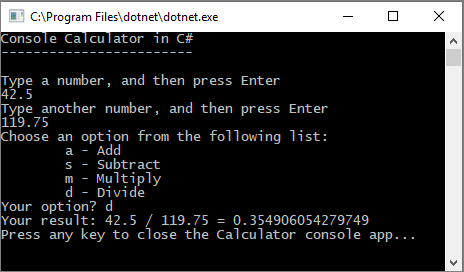

    (We'll fix the number of decimal places in the [Revise the code](#revise-the-code) section.)

## Debug the app

We've improved on our basic calculator app, but it doesn't yet have fail safes in place to handle exceptions, such as user input errors.

For example, if you try to divide a number by zero, or enter an alpha character when the app expects a numeric character (or vice versa), the app stops working and returns an error.

Let's walk through a few common user input errors, locate them in the debugger, and fix them in the code.

>[!TIP]
>For more information about the debugger and how it works, see the [First look at the Visual Studio debugger](../../debugger/debugger-feature-tour.md) page.

### Fix the "divide by zero" error

When you try to divide a number by zero, the console app freezes. Visual Studio then shows you what's wrong in the code editor.

   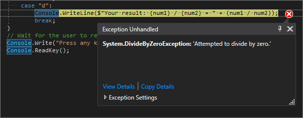

Let's change the code to handle this error.

1. Delete the code that appears directly between `case "d":` and the comment that says `// Wait for the user to respond before closing`.

1. Replace it with the following code:

   ```csharp
            // Ask the user to enter a non-zero divisor until they do so.
                while (num2 == 0)
                {
                    Console.WriteLine("Enter a non-zero divisor: ");
                    num2 = Convert.ToInt32(Console.ReadLine());
                }
                Console.WriteLine($"Your result: {num1} / {num2} = " + (num1 / num2));
                break;
        }
    ```

   After you add the code, the section with the `switch` statement should look similar to the following screenshot:

   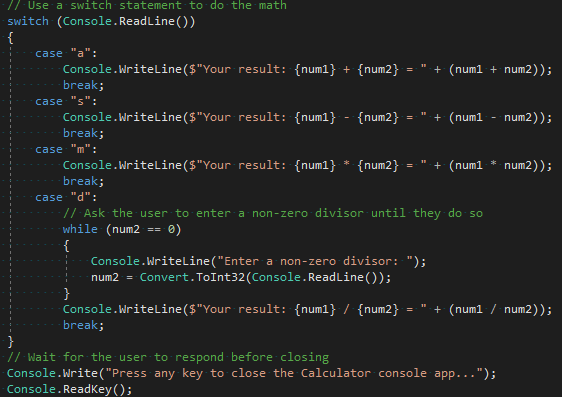

Now, when you divide any number by zero, the app will ask for another number. Even better: It won't stop asking until you provide a number other than zero.

   

### Fix the "format" error

If you enter an alpha character when the app expects a numeric character (or vice versa), the console app freezes. Visual Studio then shows you what's wrong in the code editor.

   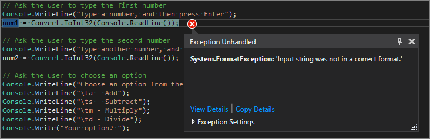

To fix this error, we must refactor the code that we've previously entered.

#### Revise the code

Rather than rely on the `program` class to handle all the code, we'll divide our app into two classes: `Calculator` and `Program`.

The `Calculator` class will handle the bulk of the calculation work, and the `Program` class will handle the user interface and error-capturing work.

Let's get started.

1. Delete everything *after* the following code block:

    ```csharp

    using System;

    namespace Calculator
    {

    ```

1. Next, add a new `Calculator` class, as follows:

    ```csharp
    class Calculator
    {
        public static double DoOperation(double num1, double num2, string op)
        {
            double result = double.NaN; // Default value is "not-a-number" which we use if an operation, such as division, could result in an error.

            // Use a switch statement to do the math.
            switch (op)
            {
                case "a":
                    result = num1 + num2;
                    break;
                case "s":
                    result = num1 - num2;
                    break;
                case "m":
                    result = num1 * num2;
                    break;
                case "d":
                    // Ask the user to enter a non-zero divisor.
                    if (num2 != 0)
                    {
                        result = num1 / num2;
                    }
                    break;
                // Return text for an incorrect option entry.
                default:
                    break;
            }
            return result;
        }
    }

    ```

1. Then, add a new  `Program` class, as follows:

    ```csharp
    class Program
    {
        static void Main(string[] args)
        {
            bool endApp = false;
            // Display title as the C# console calculator app.
            Console.WriteLine("Console Calculator in C#\r");
            Console.WriteLine("------------------------\n");

            while (!endApp)
            {
                // Declare variables and set to empty.
                string numInput1 = "";
                string numInput2 = "";
                double result = 0;

                // Ask the user to type the first number.
                Console.Write("Type a number, and then press Enter: ");
                numInput1 = Console.ReadLine();

                double cleanNum1 = 0;
                while (!double.TryParse(numInput1, out cleanNum1))
                {
                    Console.Write("This is not valid input. Please enter an integer value: ");
                    numInput1 = Console.ReadLine();
                }

                // Ask the user to type the second number.
                Console.Write("Type another number, and then press Enter: ");
                numInput2 = Console.ReadLine();

                double cleanNum2 = 0;
                while (!double.TryParse(numInput2, out cleanNum2))
                {
                    Console.Write("This is not valid input. Please enter an integer value: ");
                    numInput2 = Console.ReadLine();
                }

                // Ask the user to choose an operator.
                Console.WriteLine("Choose an operator from the following list:");
                Console.WriteLine("\ta - Add");
                Console.WriteLine("\ts - Subtract");
                Console.WriteLine("\tm - Multiply");
                Console.WriteLine("\td - Divide");
                Console.Write("Your option? ");

                string op = Console.ReadLine();

                try
                {
                    result = Calculator.DoOperation(cleanNum1, cleanNum2, op);
                    if (double.IsNaN(result))
                    {
                        Console.WriteLine("This operation will result in a mathematical error.\n");
                    }
                    else Console.WriteLine("Your result: {0:0.##}\n", result);
                }
                catch (Exception e)
                {
                    Console.WriteLine("Oh no! An exception occurred trying to do the math.\n - Details: " + e.Message);
                }

                Console.WriteLine("------------------------\n");

                // Wait for the user to respond before closing.
                Console.Write("Press 'n' and Enter to close the app, or press any other key and Enter to continue: ");
                if (Console.ReadLine() == "n") endApp = true;

                Console.WriteLine("\n"); // Friendly linespacing.
            }
            return;
        }
    }
    ```

1. Choose **Calculator** to run your program, or press **F5**.

1. Follow the prompts and divide the number **42** by the number **119**. Your app should look similar to the following screenshot:

    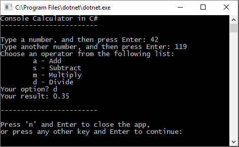

    Notice that you have the option to enter more equations until you choose to close the console app. And, we've also reduced the number of decimal places in the result.

## Close the app

1. If you haven't already done so, close the calculator app.

1. Close the **Output** pane in Visual Studio.

   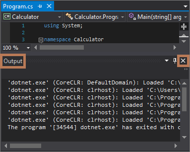

1. In Visual Studio, press **Ctrl**+**S** to save your app.

1. Close Visual Studio.

## Code complete

During this tutorial, we've made a lot of changes to the calculator app. The app now handles computing resources more efficiently, and it handles most user input errors.

Here's the complete code, all in one place:

```csharp

using System;

namespace Calculator
{
    class Calculator
    {
        public static double DoOperation(double num1, double num2, string op)
        {
            double result = double.NaN; // Default value is "not-a-number" which we use if an operation, such as division, could result in an error.

            // Use a switch statement to do the math.
            switch (op)
            {
                case "a":
                    result = num1 + num2;
                    break;
                case "s":
                    result = num1 - num2;
                    break;
                case "m":
                    result = num1 * num2;
                    break;
                case "d":
                    // Ask the user to enter a non-zero divisor.
                    if (num2 != 0)
                    {
                        result = num1 / num2;
                    }
                    break;
                // Return text for an incorrect option entry.
                default:
                    break;
            }
            return result;
        }
    }

    class Program
    {
        static void Main(string[] args)
        {
            bool endApp = false;
            // Display title as the C# console calculator app.
            Console.WriteLine("Console Calculator in C#\r");
            Console.WriteLine("------------------------\n");

            while (!endApp)
            {
                // Declare variables and set to empty.
                string numInput1 = "";
                string numInput2 = "";
                double result = 0;

                // Ask the user to type the first number.
                Console.Write("Type a number, and then press Enter: ");
                numInput1 = Console.ReadLine();

                double cleanNum1 = 0;
                while (!double.TryParse(numInput1, out cleanNum1))
                {
                    Console.Write("This is not valid input. Please enter an integer value: ");
                    numInput1 = Console.ReadLine();
                }

                // Ask the user to type the second number.
                Console.Write("Type another number, and then press Enter: ");
                numInput2 = Console.ReadLine();

                double cleanNum2 = 0;
                while (!double.TryParse(numInput2, out cleanNum2))
                {
                    Console.Write("This is not valid input. Please enter an integer value: ");
                    numInput2 = Console.ReadLine();
                }

                // Ask the user to choose an operator.
                Console.WriteLine("Choose an operator from the following list:");
                Console.WriteLine("\ta - Add");
                Console.WriteLine("\ts - Subtract");
                Console.WriteLine("\tm - Multiply");
                Console.WriteLine("\td - Divide");
                Console.Write("Your option? ");

                string op = Console.ReadLine();

                try
                {
                    result = Calculator.DoOperation(cleanNum1, cleanNum2, op);
                    if (double.IsNaN(result))
                    {
                        Console.WriteLine("This operation will result in a mathematical error.\n");
                    }
                    else Console.WriteLine("Your result: {0:0.##}\n", result);
                }
                catch (Exception e)
                {
                    Console.WriteLine("Oh no! An exception occurred trying to do the math.\n - Details: " + e.Message);
                }

                Console.WriteLine("------------------------\n");

                // Wait for the user to respond before closing.
                Console.Write("Press 'n' and Enter to close the app, or press any other key and Enter to continue: ");
                if (Console.ReadLine() == "n") endApp = true;

                Console.WriteLine("\n"); // Friendly linespacing.
            }
            return;
        }
    }
}

```

## Next steps

Congratulations on completing this tutorial! To learn even more, continue with the following tutorials.

> [!div class="nextstepaction"]
> [Continue with more C# tutorials](/dotnet/csharp/tutorials/)

## See also

* [C# IntelliSense](../../ide/visual-csharp-intellisense.md)
* [Learn to debug C# code in Visual Studio](tutorial-debugger.md)
