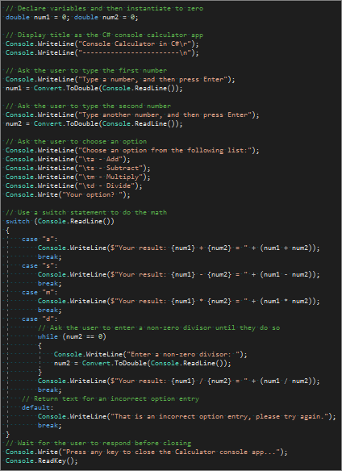

# Tutorial: Get started with a C# console app in Visual Studio

In this tutorial for C#, you'll use Visual Studio to create and run a console app and explore some features of the [Visual Studio integrated development environment (IDE)](visual-studio-ide.md) while you do so.

If you haven't already installed Visual Studio, go to the [Visual Studio downloads](https://visualstudio.microsoft.com/downloads/?utm_medium=microsoft&utm_source=docs.microsoft.com&utm_campaign=button+cta&utm_content=download+vs2017) page to install it for free.

## Create a project

First, we'll create a C# application project. The project type comes with all the template files you'll need, before you've even added anything!

1. Open Visual Studio 2017.

2. From the top menu bar, choose **File** > **New** > **Project**.

3. In the **New Project** dialog box in the left pane, expand **C#**, and then choose **.NET Core**. In the middle pane, choose **Console App (.NET Core)**. Then name the file *Calculator*.

   

### Add a workgroup (optional)

If you don't see the **Console App (.NET Core)** project template, you can get it by adding the **.NET Core cross-platform development** workload. You can add this workload in one of the two following ways, depending on which Visual Studio 2017 updates are installed on your machine.

#### Option 1: Use the New Project dialog box

1. Choose the **Open Visual Studio Installer** link in the left pane of the **New Project** dialog box.

   

1. The Visual Studio Installer launches. Choose the **.NET Core cross-platform development** workload, and then choose **Modify**.

   

#### Option 2: Use the Tools menu bar

1. Cancel out of the **New Project** dialog box and from the top menu bar, choose **Tools** > **Get Tools and Features**.

1. The Visual Studio Installer launches. Choose the **.NET Core cross-platform development** workload, and then choose **Modify**.

## Create a "C# Console Calculator" app

1. After you create the **C# Console Application**, enter or paste the following code into the code editor:

    ```csharp
    using System;

    namespace Calculator
    {
        class Program
        {
            static void Main(string[] args)
            {
                // Declare variables and then instantiate to zero
                double num1 = 0; double num2 = 0;

                // Display title as the C# console calculator app
                Console.WriteLine("Console Calculator in C#\r");
                Console.WriteLine("------------------------\n");

                // Ask the user to type the first number
                Console.WriteLine("Type a number, and then press Enter");
                num1 = Convert.ToDouble(Console.ReadLine());

                // Ask the user to type the second number
                Console.WriteLine("Type another number, and then press Enter");
                num2 = Convert.ToDouble(Console.ReadLine());

                // Ask the user to choose an option
                Console.WriteLine("Choose an option from the following list:");
                Console.WriteLine("\ta - Add");
                Console.WriteLine("\ts - Subtract");
                Console.WriteLine("\tm - Multiply");
                Console.WriteLine("\td - Divide");
                Console.Write("Your option? ");

                // Use a switch statement to do the math
                switch (Console.ReadLine())
                {
                    case "a":
                        Console.WriteLine($"Your result: {num1} + {num2} = " + (num1 + num2));
                        break;
                    case "s":
                        Console.WriteLine($"Your result: {num1} - {num2} = " + (num1 - num2));
                        break;
                    case "m":
                        Console.WriteLine($"Your result: {num1} * {num2} = " + (num1 * num2));
                        break;
                    case "d":
                        // Ask the user to enter a non-zero divisor until they do so
                        while (num2 == 0)
                        {
                            Console.WriteLine("Enter a non-zero divisor: ");
                            num2 = Convert.ToDouble(Console.ReadLine());
                        }
                        Console.WriteLine($"Your result: {num1} / {num2} = " + (num1 / num2));
                        break;
                    // Return text for an incorrect option entry
                    default:
                        Console.WriteLine("That is an incorrect option entry, please try again.");
                        break;
                }
                // Wait for the user to respond before closing
                Console.Write("Press any key to close the Calculator console app...");
                Console.ReadKey();
            }
        }
    }
    ```

   The code that appears after `static void Main(string[] args)` should look like the following screenshot:

   

1. Choose **Calculator** to run your program, or press **F5**.

   

1. View your app in the console window. When you follow the prompts, your app should look similar to the following screenshot:

    

### Close the app

1. Press any key to close the calculator app.

1. Close the **Output** pane in Visual Studio.

   

1. Close Visual Studio.

## Quick answers FAQ

Here's a quick FAQ to highlight some key concepts.

### What is C#?

C# is a type-safe programming language that runs on the .NET Framework and .NET Core. With C#, you can create Windows applications, client-server applications, database applications, XML Web services, distributed components, and more.

### What is Visual Studio?

Visual Studio is an integrated development suite of productivity tools for developers. Think of it as a program you can use to create programs and applications.

### What is a console app?

A console app takes input and displays output in a command-line window, a.k.a. a console.

### What is .NET Core?

.NET Core is the evolutionary next step of the .NET Framework. Where the .NET Framework allowed you to share code across programming languages, .NET Core adds the ability to share code across platforms. Even better, it's open source.

(Both the .NET Framework and .NET Core include libraries of prebuilt functionality. They also include a common language runtime (CLR), which acts as a virtual machine in which to run your code.)

## Next steps

Congratulations on completing this tutorial! To learn even more, continue with the following tutorials.

> [!div class="nextstepaction"]
> [C# Tutorials](/dotnet/csharp/tutorials/)

## See also

* [C# Fundamentals for Absolute Beginners video course](https://mva.microsoft.com/en-us/training-courses/c-fundamentals-for-absolute-beginners-16169)
