# Tutorial: Create your first Universal Windows Platform application in Visual Studio with XAML and C&#35;

In this introduction to the Visual Studio integrated development environment (IDE), you'll create a "Hello World" app that runs on any Windows 10 or later device. To do so, you'll use a Universal Windows Platform (UWP) project template, Extensible Application Markup Language (XAML), and the C# programming language.

::: moniker range="vs-2017"
If you haven't already installed Visual Studio, go to the [Visual Studio downloads](https://visualstudio.microsoft.com/vs/older-downloads/?utm_medium=microsoft&utm_source=docs.microsoft.com&utm_campaign=vs+2017+download) page to install it for free.
::: moniker-end
::: moniker range=">=vs-2019"
If you haven't already installed Visual Studio, go to the [Visual Studio downloads](https://visualstudio.microsoft.com/downloads) page to install it for free.
::: moniker-end

## Create a project

First, create a Universal Windows Platform project. The project type comes with all the template files you need, before you've even added anything!

::: moniker range="vs-2017"
1. Open Visual Studio.

1. From the top menu bar, choose **File** > **New** > **Project**.

1. In the left pane of the **New Project** dialog box, expand **Visual C#**, and then choose **Windows Universal**. In the middle pane, choose **Blank App (Universal Windows)**. Then, name the project *HelloWorld* and choose **OK**.

   > [!NOTE]
   > Make sure that the location of the source project is on a **New Technology File System (NTFS)** formatted drive, such as your Operating System (OS) drive. Otherwise, you might have trouble building and running your project. 

   

   > [!NOTE]
   > If you don't see the **Blank App (Universal Windows)** project template, click the **Open Visual Studio Installer** link in the left pane of the **New Project** dialog box.<br><br><br><br>The Visual Studio Installer launches. Choose the **Universal Windows Platform development** workload, and then choose **Modify**.<br><br>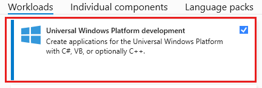

1. Accept the default **Target version** and **Minimum version** settings in the **New Universal Windows Platform Project** dialog box.

   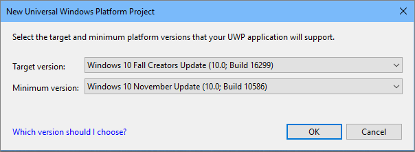
::: moniker-end

::: moniker range="vs-2019"
1. Open Visual Studio, and on the start window, choose **Create a new project**.

1. On the **Create a new project** screen, enter *Universal Windows* in the search box, choose the C# template for **Blank App (Universal Windows)**, and then choose **Next**.

   

   > [!NOTE]
   > If you don't see the **Blank App (Universal Windows)** project template, click the **Install more tools and features** link.<br><br><br><br>The Visual Studio Installer launches. Choose the **Universal Windows Platform development** workload, and then choose **Modify**.<br><br>

1. Give the project a name, _HelloWorld_, and choose **Create**.

   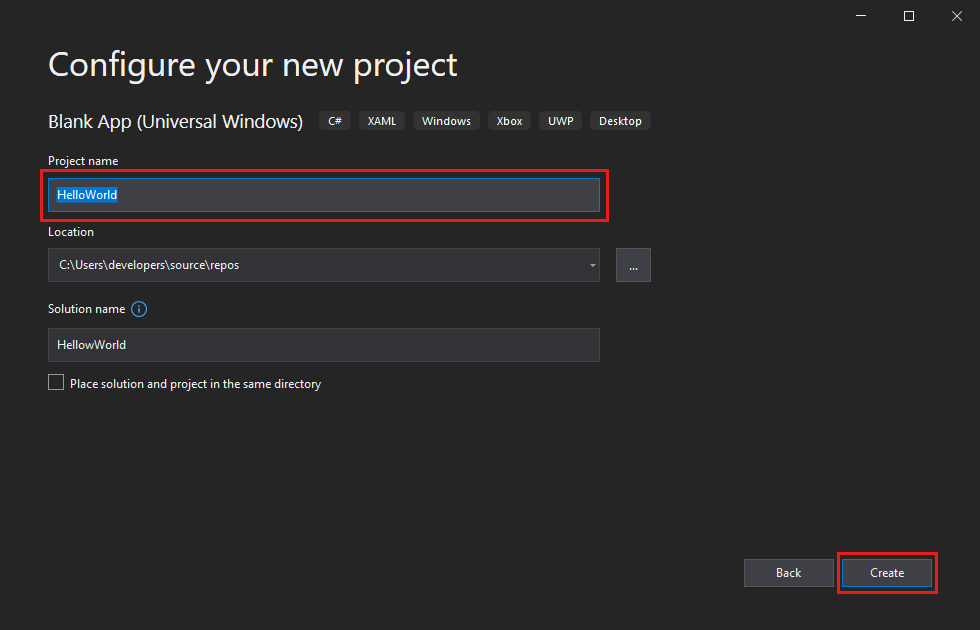

1. Accept the default **Target version** and **Minimum version** settings in the **New Universal Windows Platform Project** dialog box.

   
::: moniker-end

::: moniker range=">=vs-2022"
1. Open Visual Studio, and on the start window, choose **Create a new project**.

1. On the **Create a new project** screen, enter *Universal Windows* in the search box, choose the C# template for **Blank App (Universal Windows)**, and then choose **Next**.

   :::image type="content" source="media/vs-2022/uwp-create-new-project.png" alt-text="Screenshot of the 'Create a new project' dialog with 'Universal Windows' entered in the search box, and the 'Blank App (Universal Windows)' project template highlighted.":::

   > [!NOTE]
   > If you don't see the **Blank App (Universal Windows)** project template, click the **Install more tools and features** link.<br><br>:::image type="content" source="media/vs-2022/uwp-not-finding.png" alt-text="Screenshot of the Create a new project window showing the 'Install more tools and features' link.":::<br><br>The Visual Studio Installer launches. Choose the **Universal Windows Platform development** workload, and then select **Modify**.<br><br>:::image type="content" source="media/vs-2022/uwp-dev-workload.png" alt-text="Screenshot of the Visual Studio Installer showing the Universal Windows Platform development workload.":::

1. Give the project a name, *HelloWorld*, and choose **Create**.

   :::image type="content" source="media/vs-2022/uwp-configure-your-project.png" alt-text="Screenshot of the 'Configure your new project' dialog with 'HelloWorld' entered in the Project name field.":::

1. Accept the default **Target version** and **Minimum version** settings in the **New Universal Windows Platform Project** dialog box.

   :::image type="content" source="media/vs-2022/new-uwp-project-target-minver-dialog.png" alt-text="Screenshot of the New Universal Windows Platform Project dialog box showing the default Target version and Minimum version settings.":::

::: moniker-end

   > [!NOTE]
   > If this is the first time you have used Visual Studio to create a UWP app, a **Settings** dialog box might appear. Choose **Developer mode**, and then choose **Yes**.<br><br>
   > <br><br>Visual Studio installs an additional Developer Mode package for you. When the package installation is complete, close the **Settings** dialog box.

## Create the application

It's time to start developing. You'll add a button control, add an action to the button, and then start the "Hello World" app to see what it looks like.

### Add a button to the Design canvas

::: moniker range="vs-2017"

1. In the **Solution Explorer**, double-click *MainPage.xaml* to open a split view.

   

   There are two panes: The **XAML Designer**, which includes a design canvas, and the **XAML Editor**, where you can add or change code.

   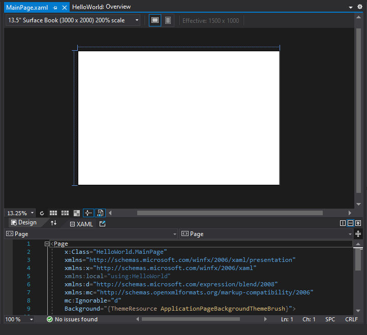

1. Choose **Toolbox** to open the Toolbox fly-out window.

   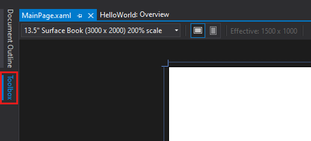

   (If you don't see the **Toolbox** option, you can open it from the menu bar. To do so, choose **View** > **Toolbar**. Or, press **Ctrl**+**Alt**+**X**.)

1. Click the **Pin** icon to dock the Toolbox window.

   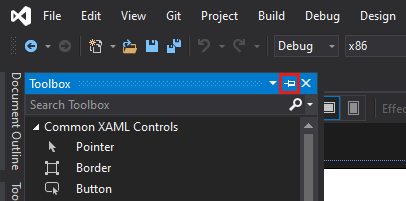

1. Click the **Button** control and then drag it onto the design canvas.

   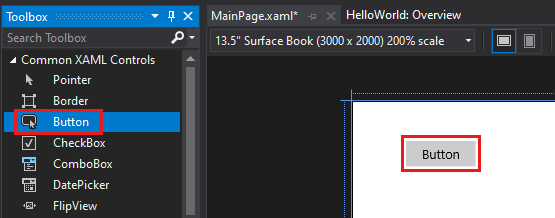

   If you look at the code in the **XAML Editor**, you'll see that the Button has been added there, too:

   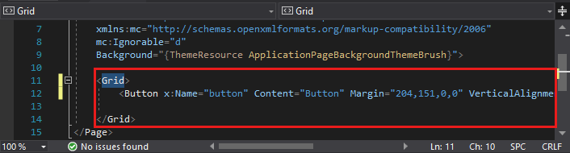

::: moniker-end

::: moniker range="vs-2019"

1. In the **Solution Explorer**, double-click *MainPage.xaml* to open a split view.

   

   There are two panes: The **XAML Designer**, which includes a design canvas, and the **XAML Editor**, where you can add or change code.

   

1. Choose **Toolbox** to open the Toolbox fly-out window.

   

   (If you don't see the **Toolbox** option, you can open it from the menu bar. To do so, choose **View** > **Toolbar**. Or, press **Ctrl**+**Alt**+**X**.)

1. Click the **Pin** icon to dock the Toolbox window.

   

1. Click the **Button** control and then drag it onto the design canvas.

   

   If you look at the code in the **XAML Editor**, you'll see that the Button has been added there, too:

   

::: moniker-end

::: moniker range=">=vs-2022"

1. In the **Solution Explorer**, double-click *MainPage.xaml* to open a split view.

   :::image type="content" source="media/vs-2022/uwp-solution-explorer-mainpage-xaml.png" alt-text="Screenshot of the Solution Explorer window showing the properties, references, assets, and files in the HelloWorld project. The file MainPage.xaml is selected.":::  

   There are two panes: The **XAML Designer**, which includes a design canvas, and the **XAML Editor**, where you can add or change code.

   :::image type="content" source="media/vs-2022/uwp-xaml-editor.png" alt-text="Screenshot showing MainPage.xaml open in the Visual Studio IDE. The XAML Designer pane shows a blank design surface and the XAML Editor pane shows some of the XAML code.":::

1. Choose **Toolbox** to open the Toolbox fly-out window.

   :::image type="content" source="media/vs-2022/uwp-toolbox.png" alt-text="Screenshot showing the tab for the 'Toolbox' fly-out window highlighted on the left side of the XAML Designer Pane.":::

   (If you don't see the **Toolbox** option, you can open it from the menu bar. To do so, choose **View** > **Toolbar**. Or, press **Ctrl**+**Alt**+**X**.)

1. Select the **Pin** icon to dock the Toolbox window.

   :::image type="content" source="media/vs-2022/uwp-toolbox-autohide.png" alt-text="Screenshot showing the Pin icon highlighted in the top bar of the Toolbox window.":::

1. Select the **Button** control and then drag it onto the design canvas.

   :::image type="content" source="media/vs-2022/uwp-toolbox-add-button-control.png" alt-text="Screenshot showing 'Button' highlighted in the Toolbox window and a Button control on the design canvas.":::

   If you look at the code in the **XAML Editor**, you'll see that the Button has been added there, too:

   :::image type="content" source="media/vs-2022/uwp-xaml-control-code-window.png" alt-text="Screenshot showing the code for the newly added Button highlighted in the XAML editor.":::
 
::: moniker-end

### Add a label to the button

::: moniker range="<=vs-2019"

1. In the **XAML Editor**, change Button Content value from "Button" to "Hello World!".

   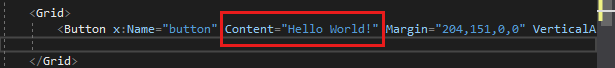

1. Notice that the button in the **XAML Designer** changes, too.

   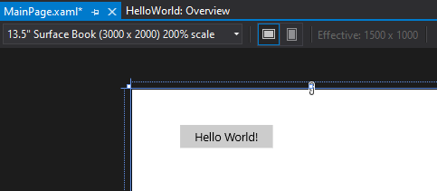

::: moniker-end

::: moniker range=">=vs-2022"

1. In the **XAML Editor**, change Button Content value from "Button" to "Hello World!".

   :::image type="content" source="media/vs-2022/uwp-change-button-text-in-xaml-code-window.png" alt-text="Screenshot showing the XAML code for the Button in the XAML editor. The value of the Content property has been changed to 'Hello World!'.":::

1. Notice that the button in the **XAML Designer** changes, too.

   :::image type="content" source="media/vs-2022/uwp-button-text-change-in-design-canvas.png" alt-text="Screenshot showing the Button control on the canvas of the XAML Designer. The label of the button has been changed to 'Hello World!'.":::

::: moniker-end

### Add an event handler

An "event handler" sounds complicated, but it's just another name for code that is called when an event happens. In this case, it adds an action to the "Hello World!" button.

::: moniker range="vs-2019"

1. Double-click the button control on the design canvas.

1. Edit the event handler code in *MainPage.xaml.cs*, the code-behind page.

   Here is where things get interesting. The default event handler looks like this:

   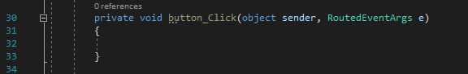

   Let's change it, so it looks like this:

   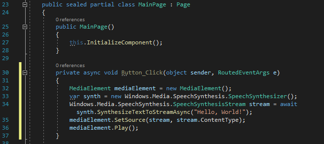

   Here's the code to copy and paste:

   ```C#
   private async void Button_Click(object sender, RoutedEventArgs e)
         {
             MediaElement mediaElement = new MediaElement();
             var synth = new Windows.Media.SpeechSynthesis.SpeechSynthesizer();
             Windows.Media.SpeechSynthesis.SpeechSynthesisStream stream = await synth.SynthesizeTextToStreamAsync("Hello, World!");
             mediaElement.SetSource(stream, stream.ContentType);
             mediaElement.Play();
         }
   ```

::: moniker-end

::: moniker range=">=vs-2022"

1. Double-click the button control on the design canvas.

1. Edit the event handler code in *MainPage.xaml.cs*, the code-behind page.

   Here is where things get interesting. The default event handler looks like this:

   :::image type="content" source="media/vs-2022/uwp-button-click-code.png" alt-text="Screenshot showing the C# code for the default Button_Click event handler.":::

   Let's change it, so it looks like this:

   :::image type="content" source="media/vs-2022/uwp-add-hello-world-async-code.png" alt-text="Screenshot showing the C# code for the new async Button_Click event handler.":::

   Here's the code to copy and paste:

   ```C#
   private async void Button_Click(object sender, RoutedEventArgs e)
         {
             MediaElement mediaElement = new MediaElement();
             var synth = new Windows.Media.SpeechSynthesis.SpeechSynthesizer();
             Windows.Media.SpeechSynthesis.SpeechSynthesisStream stream = await synth.SynthesizeTextToStreamAsync("Hello, World!");
             mediaElement.SetSource(stream, stream.ContentType);
             mediaElement.Play();
         }
   ```

::: moniker-end

#### What did we just do?

The code uses some Windows APIs to create a speech synthesis object and then gives it some text to say. (For more information on using `SpeechSynthesis`, see  <xref:System.Speech.Synthesis>.)

## Run the application

::: moniker range="vs-2017"
It's time to build, deploy, and launch the "Hello World" UWP app to see what it looks and sounds like. Here's how.

1. Use the Play button (it has the text **Local Machine**) to start the application on the local machine.

   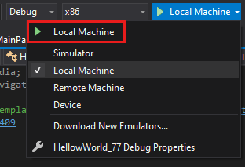

   (Alternatively, you can choose **Debug** > **Start Debugging** from the menu bar or press **F5** to start your app.)

1. View your app, which appears soon after a splash screen disappears. The app should look similar to this:

   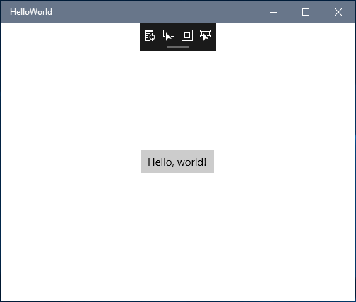

1. Click the **Hello World** button.

   Your Windows 10 or later device will literally say, "Hello, World!"

1. To close the app, click the **Stop Debugging** button in the toolbar. (Alternatively, choose **Debug** > **Stop debugging** from the menu bar, or press **Shift+F5**.)

::: moniker-end
::: moniker range="vs-2019"
It's time to build, deploy, and launch the "Hello World" UWP app to see what it looks and sounds like. Here's how.

1. Use the Play button (it has the text **Local Machine**) to start the application on the local machine.

   

   (Alternatively, you can choose **Debug** > **Start Debugging** from the menu bar or press **F5** to start your app.)

1. View your app, which appears soon after a splash screen disappears. The app should look similar to this:

   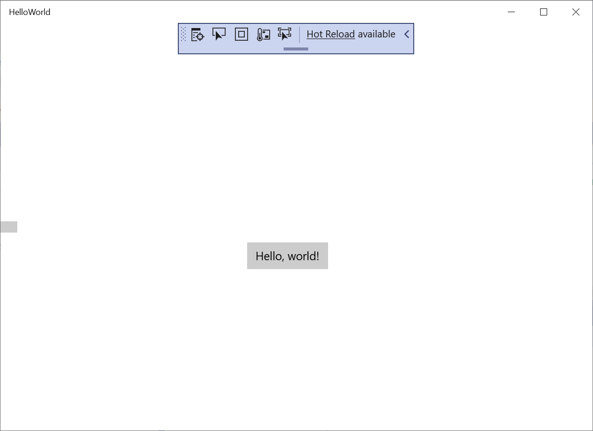

1. Click the **Hello World** button.

   Your Windows 10 or later device will literally say, "Hello, World!"

1. To close the app, click the **Stop Debugging** button in the toolbar. (Alternatively, choose **Debug** > **Stop debugging** from the menu bar, or press **Shift+F5**.)

::: moniker-end

::: moniker range=">=vs-2022"

It's time to build, deploy, and launch the "Hello World" UWP app to see what it looks and sounds like. Here's how.

1. Use the Play button (it has the text **Local Machine**) to start the application on the local machine.

   :::image type="content" source="media/vs-2022/uwp-start-or-debug.png" alt-text="Screenshot showing the drop-down box open next to the Play button with 'Local Machine' selected.":::

   (Alternatively, you can choose **Debug** > **Start Debugging** from the menu bar or press **F5** to start your app.)

1. View your app, which appears soon after a splash screen disappears. The app should look similar to this image:

   :::image type="content" source="media/vs-2022/uwp-hello-world-app.png" alt-text="Screenshot showing the running UWP 'Hello World' application.":::

1. Select the **Hello World** button.

   Your Windows 10 or later device will literally say, "Hello, World!".

1. To close the app, select the **Stop Debugging** button in the toolbar. (Alternatively, choose **Debug** > **Stop debugging** from the menu bar, or press **Shift+F5**.)

::: moniker-end

## Next steps

Congratulations on completing this tutorial! We hope you learned some basics about UWP and the Visual Studio IDE. To learn more, continue with the following tutorial:

> [!div class="nextstepaction"]
> [Create a user interface](/visualstudio/xaml-tools/creating-a-ui-by-using-xaml-designer-in-visual-studio)

## See also

- [UWP overview](/windows/uwp/get-started/universal-application-platform-guide)
- [Get UWP app samples](/windows/uwp/get-started/get-uwp-app-samples)
