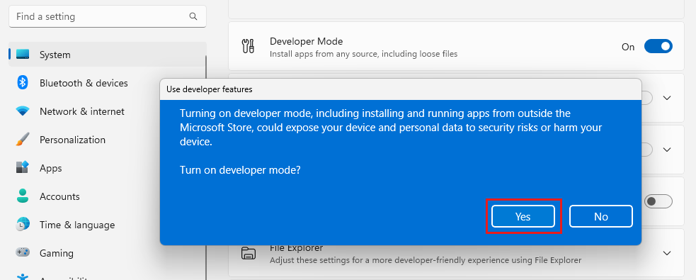

# Tutorial: Create your first Windows App SDK application in Visual Studio with XAML and C&#35;

In this introduction to the Visual Studio integrated development environment (IDE), you'll create a "Hello World" app that runs on any Windows 10 or later device. To do so, you'll use a Windows App SDK (WinUI 3) project template, Extensible Application Markup Language (XAML), and the C# programming language.

> [!NOTE]
> WinUI 3 is the native UI platform component that ships with the [Windows App SDK](/windows/apps/windows-app-sdk/) (completely decoupled from [Windows SDKs](/windows/apps/windows-app-sdk/)). For more information, see [WinUI 3](/windows/apps/winui/winui3/).

If you haven't already installed Visual Studio, go to the [Visual Studio downloads](https://visualstudio.microsoft.com/downloads/?cid=learn-onpage-download-cta) page to install it for free.

::: moniker range=">=vs-2022"
## Prerequisites

- You need Visual Studio to complete this tutorial.
Visit the [Visual Studio downloads page](https://visualstudio.microsoft.com/vs/) for a free version.
- Workloads and components required for developing with WinUI and the Windows App SDK. To verify or install a workload in Visual Studio, select **Tools** > **Get Tools and Features**. For more information, see [Change workloads or individual components](../../install/modify-visual-studio.md#change-workloads-or-individual-components).
    
    On the **Workloads** tab of the Visual Studio Installer, select the following:

    ### [Visual Studio 2022 version 17.10 and later](#tab/vs-2022-17-10)
    
    * For **C#** app development using the Windows App SDK, select **WinUI application development**.
    
    > [!NOTE]
    > _In Visual Studio 17.10 - 17.12, this workload is called **Windows application development**._

    ### [Visual Studio 2022 version 17.1 - 17.9](#tab/vs-2022-17-1)
    
    * For **C#** app development using the Windows App SDK, select **.NET Desktop Development**.
    * Then in the **Installation details** pane of the installation dialog box, select **Windows App SDK C# Templates** (near the bottom of the list).
    * On the **Individual components** tab, in the **SDKs, libraries, and frameworks** section, make sure **Windows 10 SDK (10.0.19041.0)** is selected.
    
    ### [Other Visual Studio versions](#tab/vs-other)

    * For C# app development using the Windows App SDK, select **.NET Desktop Development**.
    * On the **Individual components** tab, in the **SDKs, libraries, and frameworks** section, make sure **Windows 10 SDK (10.0.19041.0)** is selected.

    ---

For details, see [Install tools for the Windows App SDK](/windows/apps/windows-app-sdk/set-up-your-development-environment.)

::: moniker-end

## Create a project

First, create a WinUI 3 project. The project type comes with all the template files you need, before you've even added anything!

::: moniker range="vs-2019"
> [!IMPORTANT]
> Visual Studio 2019 only supports Windows App SDK 1.1 and earlier. Visual Studio 2022 is recommended for developing apps with all versions of the Windows App SDK.

The Windows App SDK 1.1.x templates are available by installing a [Visual Studio extension (VSIX)](/windows/apps/windows-app-sdk/set-up-your-development-environment?tabs=cs-vs-community%2Ccpp-vs-community%2Cvs-other%2Cvs-2019#visual-studio-project-and-item-templates).

> [!NOTE]
> If you have a Windows App SDK Visual Studio extension (VSIX) already installed, then uninstall it before installing another version. For directions, see [Manage extensions for Visual Studio](/visualstudio/ide/finding-and-using-visual-studio-extensions).

- You can install the latest stable 1.1.x release VSIX from Visual Studio. Select **Extensions** > **Manage Extensions**, search for *Windows App SDK*, and download the Windows App SDK extension. Close and reopen Visual Studio, and follow the prompts to install the extension. Make sure to install the templates for Windows App SDK 1.1.
- Alternatively, you can download the extension directly from **Visual Studio Marketplace**, and install it:

> [!div class="button"]
> [Download Windows App SDK C# SDK VS2019 Templates](https://aka.ms/windowsappsdk/1.1/1.1.5/WindowsAppSDK.Cs.Extension.Dev16.vsix)

After the templates extension has been installed, you can create your first project. For more information about Visual Studio 2019 support, see [Install tools for the Windows App SDK](/windows/apps/windows-app-sdk/set-up-your-development-environment?tabs=cs-vs-community%2Ccpp-vs-community%2Cvs-2022-17-10%2Cvs-2022-17-1-b). The rest of this tutorial will assume you're using Visual Studio 2022.

::: moniker-end

1. Open Visual Studio, and on the start window, choose **Create a new project**.

1. On the **Create a new project** screen, enter *WinUI* in the search box, choose the C# template for **Blank App, Packaged (WinUI 3 in Desktop)**, and then choose **Next**.

   :::image type="content" source="media/vs-2022/winui-create-new-project.png" alt-text="Screenshot of the 'Create a new project' dialog with 'WinUI' entered in the search box, and the 'Blank App, Packaged (WinUI 3 in Desktop)' project template highlighted.":::

1. Give the project a name, *HelloWorld*, and choose **Create**.

   :::image type="content" source="media/vs-2022/winui-configure-your-project.png" alt-text="Screenshot of the 'Configure your new project' dialog with 'HelloWorld' entered in the Project name field.":::

   > [!NOTE]
   > If this is the first time you have used Visual Studio to create a Windows App SDK app, a **Settings** dialog box might appear. Choose **Developer mode**, and then choose **Yes**.<br><br>
   > <br><br>Visual Studio installs an additional Developer Mode package for you. When the package installation is complete, close the **Settings** dialog box.

## Create the application

It's time to start developing. You'll add a button control, add an action to the button, and then run the "Hello World" app to see what it looks like.

### Add a button to the Design canvas

1. In the **Solution Explorer**, double-click *MainWindow.xaml* to open the XAML markup editor.

   :::image type="content" source="media/vs-2022/winui-solution-explorer-mainwindow-xaml.png" alt-text="Screenshot of the Solution Explorer window showing the properties, references, assets, and files in the HelloWorld project. The file MainWindow.xaml is selected.":::  

   The **XAML Editor** is where you can add or change markup. Unlike UWP projects, WinUI 3 doesn't have a **Design** view.

   :::image type="content" source="media/vs-2022/winui-xaml-editor.png" alt-text="Screenshot showing MainWindow.xaml open in the Visual Studio IDE. The XAML Editor pane shows the XAML markup for the window.":::

1. Review the **Button** control nested within the **StackPanel** at the root of the **Window**.

   :::image type="content" source="media/vs-2022/winui-button-control.png" alt-text="Screenshot showing 'Button' highlighted in the XAML editor.":::

### Change the label on the button

1. In the **XAML Editor**, change Button Content value from "Click me" to "Hello World!".

   :::image type="content" source="media/vs-2022/winui-change-button-text-in-xaml-code-window.png" alt-text="Screenshot showing the XAML code for the Button in the XAML editor. The value of the Content property has been changed to 'Hello World!'.":::

1. Notice that the button has a **Click** event handler named *myButton_Click* specified, too. We'll get to that in the next step.

   :::image type="content" source="media/vs-2022/winui-button-click-event-highlighted.png" alt-text="Screenshot showing the XAML code for the Button in the XAML editor. The click event of the button has been highlighted.":::

### Modify the event handler

An "event handler" sounds complicated, but it's just another name for code that is called when an event happens. In this case, it adds an action triggered by the "Hello World!" button.

1. In **Solution Explorer**, double-click *MainWindow.xaml.cs*, the code-behind page.

1. Edit the event handler code in the C# editor window that opens.

   Here is where things get interesting. The default event handler looks like this:

   :::image type="content" source="media/vs-2022/winui-button-click-code.png" alt-text="Screenshot showing the C# code for the default myButton_Click event handler.":::

   Let's change it, so it looks like this:

   :::image type="content" source="media/vs-2022/winui-add-hello-world-async-code.png" alt-text="Screenshot showing the C# code for the new async myButton_Click event handler.":::

   Here's the code to copy and paste:

   ```csharp
   private async void myButton_Click(object sender, RoutedEventArgs e)
   {
       var welcomeDialog = new ContentDialog()
       {
           Title = "Hello from HelloWorld",
           Content = "Welcome to your first Windows App SDK app.",
           CloseButtonText = "Ok",
           XamlRoot = myButton.XamlRoot
       };
       await welcomeDialog.ShowAsync();
   }
   ```

#### What did we just do?

The code uses the **ContentDialog** control to display a welcome message in a modal popup control within the current window. (For more information on using `Microsoft.UI.Xaml.Controls.ContentDialog`, see [ContentDialog Class](/windows/windows-app-sdk/api/winrt/microsoft.ui.xaml.controls.contentdialog).)

## Run the application

It's time to build, deploy, and launch the "Hello World" Windows App SDK app to see what it looks like. Here's how.

1. Use the Play button (it has the text **HelloWorld (Package)**) to start the application on the local machine.

   :::image type="content" source="media/vs-2022/winui-start-or-debug.png" alt-text="Screenshot showing the drop-down box open next to the Play button with 'HelloWorld (Package)' selected.":::

   (Alternatively, you can choose **Debug** > **Start Debugging** from the menu bar or press **F5** to start your app.)

1. View your app, which appears soon after a splash screen disappears. The app should look similar to this image:

   :::image type="content" source="media/vs-2022/winui-hello-world-app.png" alt-text="Screenshot showing the running Windows App SDK 'Hello World' application.":::

1. Select the **Hello World** button.

   Your Windows 10 or later device will display a message that says "Welcome to your first Windows App SDK app" with the title "Hello from HelloWorld." Click **Ok** to dismiss the message.

   :::image type="content" source="media/vs-2022/winui-hello-from-hello-world-app.png" alt-text="Screenshot showing the running 'Hello World' application with a popup titled 'Hello from HelloWorld'.":::

1. To close the app, select the **Stop Debugging** button in the toolbar. (Alternatively, choose **Debug** > **Stop debugging** from the menu bar, or press **Shift+F5**.)

## Next steps

Congratulations on completing this tutorial! We hope you learned some basics about Windows App SDK, WinUI 3, and the Visual Studio IDE. To learn more, continue with the following tutorial:

> [!div class="nextstepaction"]
> [Tutorial: Create a simple photo viewer with WinUI 3](/windows/apps/get-started/simple-photo-viewer-winui3)

## See also

- [Writing apps for Windows: Selecting a development technology](/windows/apps/get-started/)
- [Windows App SDK overview](/windows/apps/windows-app-sdk/)
- [Windows App SDK / WinUI 3 samples](/windows/apps/get-started/samples#windows-app-sdk--winui-3-samples)
