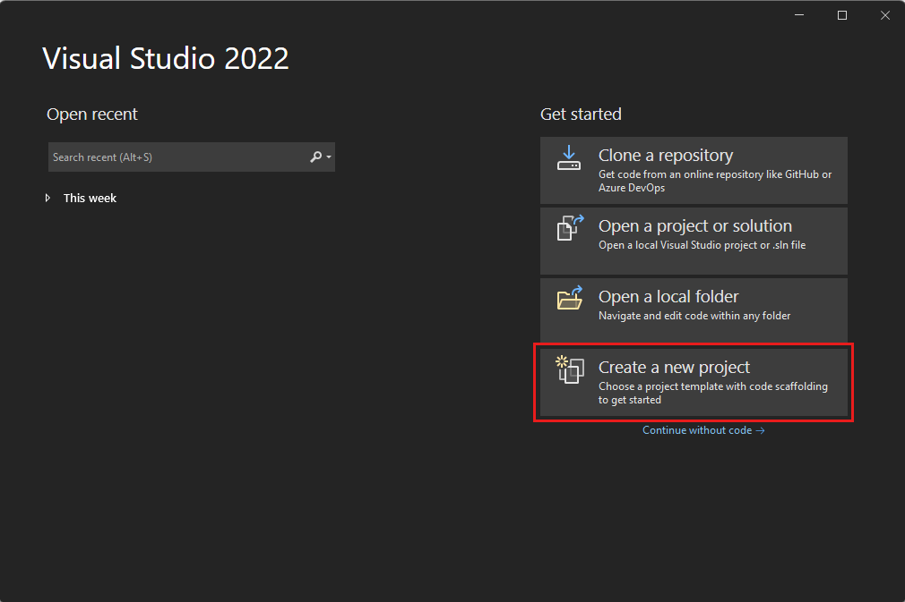
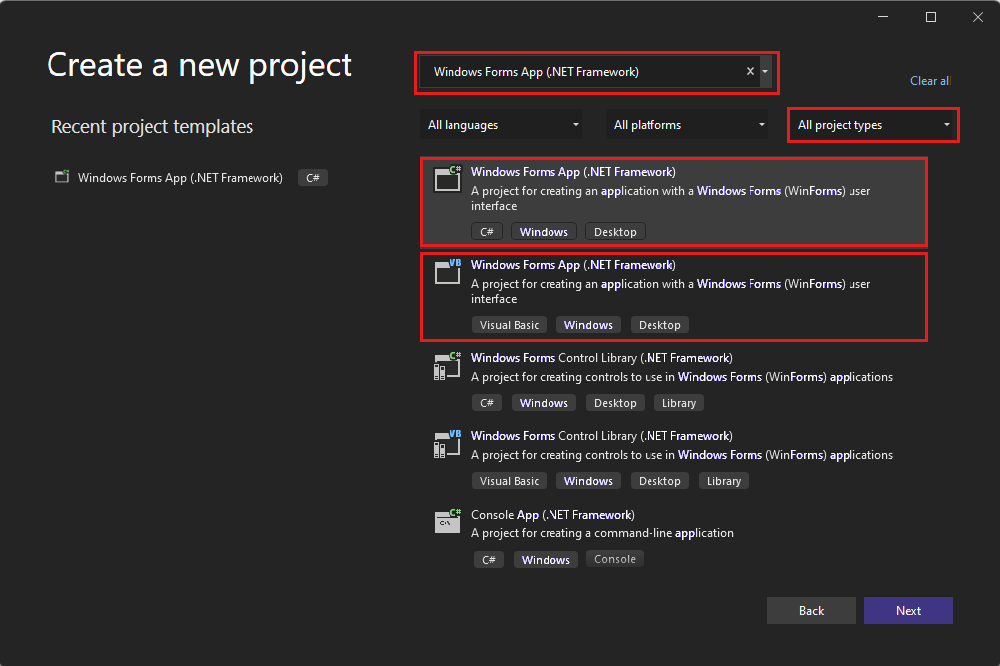
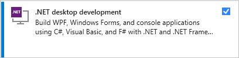
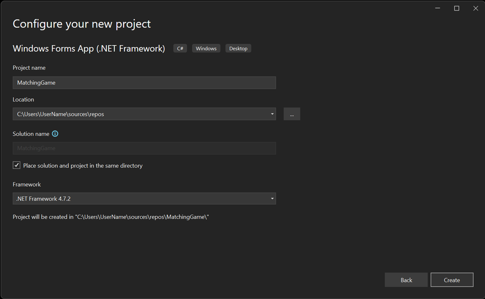

# Tutorial: Create a matching game WinForms app

 [!INCLUDE [Visual Studio](~/includes/applies-to-version/vs-windows-only.md)]

In this series of four tutorials, you build a matching game, where the player matches pairs of hidden icons.

Use these tutorials to learn about the following tasks in the Visual Studio Integrated Design Environment (IDE).

- Store objects, such as icons, in a <xref:System.Collections.Generic.List%601> object.
- Use a `foreach` loop in C# or a `For Each` loop in Visual Basic to iterate through items in a list.
- Keep track of a form's state by using reference variables.
- Build an event handler to respond to events that you can use with multiple objects.
- Make a timer that counts down and then fires an event exactly once after being started.

When you finish, you'll have a complete game.

In this first tutorial, you learn how to:

> [!div class="checklist"]
> - Create a Visual Studio project that uses Windows Forms.
> - Add and format a layout element.
> - Add and format labels to display.

## Prerequisites

You need Visual Studio to complete this tutorial.
Visit the [Visual Studio downloads page](https://visualstudio.microsoft.com/vs/) for a free version.

## Create your Windows Forms match game project

When you create your matching game, the first step is to create a Windows Forms App project.

1. Open Visual Studio.

1. On the start window, select **Create a new project**.

   

1. On the **Create a new project** window, search for *Windows Forms*. Then select **Desktop** from the **All project types** list.

1. Select the **Windows Forms App (.NET Framework)** template for either C# or Visual Basic, and then select **Next**.

   

   > [!NOTE]
   > If you don't see the **Windows Forms App (.NET Framework)** template, you can install it from the **Create a new project** window. In the **Not finding what you're looking for?** message, select the **Install more tools and features** link.
   >
   > 
   >
   > Next, in Visual Studio Installer, select **.NET desktop development**.
   >
   > 
   >
   > Select **Modify** in the Visual Studio Installer. You might be prompted to save your work. Next, select **Continue** to install the workload.

1. In the **Configure your new project** window, name your project *MatchingGame*, then select **Create**.

   

Visual Studio creates a solution for your app.
A solution is a container for all of the projects and files needed by your app.

At this point, Visual Studio displays an empty form in the **Windows Form Designer**.

## Create a layout for your game

In this section, you create the four-by-four grid of the game.

1. Click on the form to select the Windows Forms Designer. The tab reads **Form1.cs [Design]** for C# or **Form1.vb [Design]** for Visual Basic. In the **Properties** window, set the following form properties.

   - Change the **Text** property from **Form1** to **Matching Game**. This text appears at the top of the game window.
   - Set the size of the form. You can change it either by setting the **Size** property to **550, 550**, or by dragging the corner of the form until you see the correct size at the bottom of the Visual Studio IDE.

1. Select the **Toolbox** tab on the left side of the IDE.
   If you don't see it, select **View** > **Toolbox** from the menu bar or **Ctrl**+**Alt**+**X**.

1. Drag a <xref:System.Windows.Forms.TableLayoutPanel> control from the **Containers** category in the toolbox or double-click it.
   Set the following properties for the panel in the **Properties** window.

   - Set the **BackColor** property to **CornflowerBlue**.
     To do set this property, select the arrow next to the **BackColor** property.
     In the **BackColor** dialog box, select **Web**.
     In the available color names, select **CornflowerBlue**.

     > [!NOTE]
     > The colors are not in alphabetical order, and **CornflowerBlue** is near the bottom of the list.

   - Set the **Dock** property to **Fill** from the dropdown list by selecting the large middle button.
     This option spreads the table out so that it covers the entire form.
   - Set the **CellBorderStyle** property to **Inset**.
     This value provides visual borders between each cell on the board.
   - Select the triangle button in the upper-right corner of the TableLayoutPanel to display its task menu.
     On the task menu, select **Add Row** twice to add two more rows.
     Then select **Add Column** twice to add two more columns.
   - On the task menu, select **Edit Rows and Columns** to open the **Column and Row Styles** window.
     For each column, select the **Percent** option, and then set each column's width to *25* percent.
   - Select **Rows** from the list at the top of the window, and then set each row's height to 25 percent.
   - When you're done, select **OK** to save your changes.

Your TableLayoutPanel is now a four-by-four grid with 16 equally-sized square cells.
These rows and columns are where the icons appear later.

## Add and format labels to display

In this section, you create and format labels to display during the game.

1. Be certain that the TableLayoutPanel is selected in the form editor.
   You should see **tableLayoutPanel1** at the top of the **Properties** window.
   If it isn't selected, select the TableLayoutPanel on the form, or select it from the list at the top of the **Properties** window.

1. Open the toolbox, as before, and open the **Common Controls** category.
   Add a <xref:System.Windows.Forms.Label> control to the upper-left cell of the TableLayoutPanel.
   The label control is now selected in the IDE.
   Set the following properties for it.

   - Set the **BackColor** property of the label to **CornflowerBlue**.
   - Set the **AutoSize** property to **False**.
   - Set the **Dock** property to **Fill**.
   - Set the **TextAlign** property to **MiddleCenter** by choosing the drop-down button next to the property, and then selecting the middle button.
     This value ensures the icon appears in the middle of the cell.
   - Select the **Font** property. An ellipsis (**...**) button appears.
     Select the ellipsis and set the **Font** value to **Webdings**, the **Font Style** to **Bold**, and the **Size** to **48**.
   - Set the **Text** property of the label to the letter **c**.

   The upper-left cell of the TableLayoutPanel now contains a black box centered on a blue background.

   > [!NOTE]
   > Webdings is a font of icons that ships with the Windows operating system.
   > In your matching game, the player matches pairs of icons.
   > This font displays the icons to match.
   >
   > Instead of **c**, try different letters in the **Text** property.
   > An exclamation point is a spider, an uppercase N is an eye, and a comma is a chili pepper.

1. Select your Label control and copy it to the next cell in the TableLayoutPanel.
   Select the **Ctrl**+**C** keys, or on the menu bar, **Edit** > **Copy**.
   Then paste it by using **Ctrl**+**V**  or **Edit** > **Paste**.

   A copy of the first Label appears in the second cell of the TableLayoutPanel.
   Paste it again, and another Label appears in the third cell. Keep pasting Label controls until all of the cells are filled.

This step completes the layout for your form.

## Next steps

Advance to the next tutorial to learn how to assign a random icon to each label and add event handlers to labels.
> [!div class="nextstepaction"]
> [Add icons to your Matching Game](tutorial-windows-forms-match-game-icons.md)

