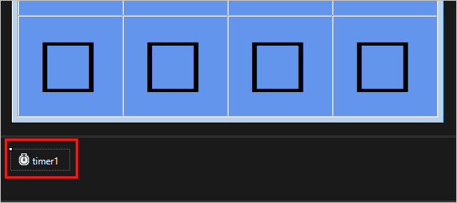

# Tutorial: Add reference variables and a timer control to your matching game WinForms app

In this series of four tutorials, you build a matching game, where the player matches pairs of hidden icons.

Your Matching Game program needs to track which Label controls the player chooses.
After a player chooses the first label, the program should show the icon.
After the second label is chosen, the program should display both icons for a brief time.
Then it hides both icons.

Your program keeps track of which Label you choose first and second by using *reference variables*.
A timer hides the icons and controls how long to show the icons

> [!div class="checklist"]
> - Add label references.
> - Add a timer.

## Prerequisites

This tutorial builds on previous tutorials, [Create a matching game application](tutorial-windows-forms-create-match-game.md) and [Add icons to your matching game](tutorial-windows-forms-match-game-icons.md).
Complete those tutorials first.

## Add label references

In this section, you'll add two *reference variables* to your code.
They keep track of, or refer to Label objects.

1. Add label references to your form by using the following code in `Form1.cs` or `Form1.vb`.

   ### [C#](#tab/csharp)
   :::code language="csharp" source="../../snippets/csharp/VS_Snippets_VBCSharp/vbexpresstutorial4step5/cs/form1.cs" id="Snippet5":::

   ### [VB](#tab/vb)
   :::code language="vb" source="../../snippets/visualbasic/VS_Snippets_VBCSharp/vbexpresstutorial4step5/vb/form1.vb" id="Snippet5":::
   ---
   
   If you're using C#, put the code after the opening curly brace and just after the class declaration (`public partial class Form1 : Form`). If you're using Visual Basic, put the code right after the class declaration (`Public Class Form1`).

   These statements don't cause Label controls to appear on the form because there's no `new` keyword.
   When the program starts, both `firstClicked` and `secondClicked` are set to `null` for C# or `Nothing` for Visual Basic.

2. Modify your <xref:System.Windows.Forms.Control.Click> event handler in `Form1.cs` or `Form1.vb` to use the new `firstClicked` reference variable.
   Remove the last statement in the `label1_Click()` event handler method (`clickedLabel.ForeColor = Color.Black;`) and replace it with the `if` statement as follows.

   ### [C#](#tab/csharp)
   :::code language="csharp" source="../../snippets/csharp/VS_Snippets_VBCSharp/vbexpresstutorial4step5/cs/form1.cs" id="Snippet6":::

   ### [VB](#tab/vb)
   :::code language="vb" source="../../snippets/visualbasic/VS_Snippets_VBCSharp/vbexpresstutorial4step5/vb/form1.vb" id="Snippet6":::
   ---

3. Save and run your program. Choose one of the label controls, and its icon appears.
   Choose the next label control, and notice that nothing happens.

   

   Only the first icon that's chosen appears. The other icons are invisible.

The program is already keeping track of the first label that the player chose.
The reference `firstClicked` isn't `null` in C# or `Nothing` in Visual Basic.
When your `if` statement finds that `firstClicked` isn't equal to `null` or `Nothing`, it runs the statements.

## Add a timer

The Matching Game app uses a <xref:System.Windows.Forms.Timer> control.
A timer waits, and then fires an event, referred to as a *tick*.
A timer can start an action or repeat an action regularly.

In your program, the timer enables a player to choose two icons.
If the icons don't match, it hides the two icons again after a short period of time.

1. Select the **Toolbox** tab, in the **Components** category, double-click or drag the **Timer** component to your form.
   The timer icon, called **timer1**, appears in a space below the form.

   

2. Select the **Timer1** icon to select the timer.
   In the **Properties** window, select the **Properties** button to view properties.

3. Set the  **Interval** property to **750**, which is 750 milliseconds.

   The **Interval** property tells the timer how long to wait between *ticks*, when it triggers its <xref:System.Windows.Forms.Timer.Tick> event.
   Your program calls the <xref:System.Windows.Forms.Timer.Start> method to start the timer after the player chooses the second label.

4. Choose the timer control icon and then press **Enter**, or double-click the timer.
   The IDE adds an empty Tick event handler to `Form1.cs` or `Form1.vb`.
   Replace the code with the following code.

   ### [C#](#tab/csharp)
   :::code language="csharp" source="../../snippets/csharp/VS_Snippets_VBCSharp/vbexpresstutorial4step6/cs/form1.cs" id="Snippet7":::
    
   ### [VB](#tab/vb)
   :::code language="vb" source="../../snippets/visualbasic/VS_Snippets_VBCSharp/vbexpresstutorial4step6/vb/form1.vb" id="Snippet7":::
   ---

   The Tick event handler does three things:
   - It makes sure the timer isn't running by calling the <xref:System.Windows.Forms.Timer.Stop> method.
   - It uses two reference variables, `firstClicked` and `secondClicked`, to make the icons of the two labels that the player chose invisible again.
   - It resets the `firstClicked` and `secondClicked` reference variables to `null` in C# and `Nothing` in Visual Basic.

5. Go to the code editor and add code to the top and bottom of the `label1_Click()` event handler method in `Form1.cs` or `Form1.vb`. 
   This code will check if the timer is enabled, set the `secondClicked` reference variable, and start the timer.
   The `label1_Click()` event handler method now looks as follows:

   ### [C#](#tab/csharp)
   :::code language="csharp" source="../../snippets/csharp/VS_Snippets_VBCSharp/vbexpresstutorial4step6/cs/form1.cs" id="Snippet8":::
    
   ### [VB](#tab/vb)
   :::code language="vb" source="../../snippets/visualbasic/VS_Snippets_VBCSharp/vbexpresstutorial4step6/vb/form1.vb" id="Snippet8":::
   ---

   - The code at the top of the method checks whether the timer was started by checking the value of the **Enabled** property.
   If the player chooses the first and second Label controls and the timer starts, choosing a third label won't do anything.
   - The code at the bottom of the method sets the `secondClicked` reference variable to track the second Label control.
   Then, it sets that label icon color to black to make it visible.
   Then, it starts the timer in one-shot mode, so that it waits 750 milliseconds and then fires a single tick.
   The timer's Tick event handler hides the two icons and resets the `firstClicked` and `secondClicked` reference variables.
   The form is ready for the player to choose another pair of icons.

   > [!NOTE]
   > If you copy and paste the `label1_Click()` code block rather than entering the code manually, be sure to replace the existing `label1_Click()` code.
   > Otherwise, you'll end up with a duplicate code block.

6. Save and run your program.
   Select a square and the icon becomes visible.
   Choose another square.
   The icon appears briefly and then both icons disappear.

Your program now keeps track of the first and second icons that you choose.
It uses the timer to pause before making the icons disappear.

## Next steps

Advance to the next tutorial to learn how to finish your Matching Game.
> [!div class="nextstepaction"]
> [Show congratulations message for your Matching Game](tutorial-windows-forms-match-game-play.md)
