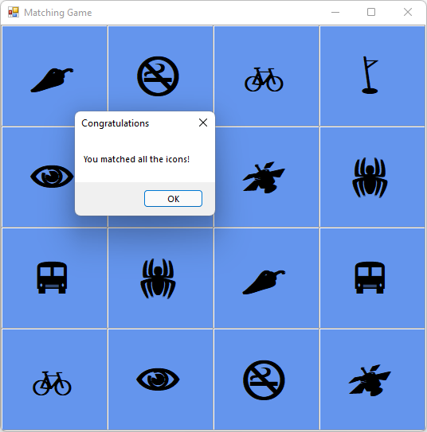

# Tutorial: Display a message in your matching game WinForms app

In this series of four tutorials, you build a matching game, where the player matches pairs of hidden icons.

In this tutorial, you revise your Matching Game to keep matched pairs visible and to display a congratulations message when a player wins.

In this tutorial, you learn how to:

> [!div class="checklist"]
> - Keep pairs visible.
> - Verify if a player won.
> - Try other features.

## Prerequisites

This tutorial builds on these previous tutorials:
1. [Create a matching game application](tutorial-windows-forms-create-match-game.md)
1. [Add icons to your matching game](tutorial-windows-forms-match-game-icons.md)
1. [Add a timer in your matching game](tutorial-windows-forms-match-game-labels.md)

## Keep pairs visible

When a player matches a pair, the game should reset itself so that it no longer keeps track of any labels that use the `firstClicked` and `secondClicked` reference variables.
It should not reset the colors for the two labels that were matched.
Those labels continue to be displayed.

1. Add the following `if` statement to the `label_Click()` event handler method.
   Put it near the end of the code just above the statement where you start the timer.

  ### [C#](#tab/csharp)
  :::code language="csharp" source="../../snippets/csharp/VS_Snippets_VBCSharp/vbexpresstutorial4step7/cs/form1.cs" id="Snippet9":::

  ### [VB](#tab/vb)
  :::code language="vb" source="../../snippets/visualbasic/VS_Snippets_VBCSharp/vbexpresstutorial4step7/vb/form1.vb" id="Snippet9":::
  ---

  The `if` statement checks whether the icon in the first label that the player chooses is the same as the icon in the second label.
  If the icons are the same, the program runs its three statements.
  The first two statements reset the `firstClicked` and `secondClicked` reference variables.
  They no longer keep track of any of the labels.
  The third statement is a `return` statement, which skips the rest of the statements in the method without running them.

2. Run the program, and then start choosing squares on the form.

  

  If you choose a pair that doesn't match, the timer's Tick event triggers.
  Both icons disappear.
    
  If you choose a matching pair, the new `if` statement runs.
  The return statement causes the method to skip the code that starts the timer.
  The icons stay visible.

## Verify if a player won

You've created a fun game.
After a player wins, the game should end.
This section adds a method to verify whether the player won.

1. Add a `CheckForWinner()` method to the bottom of your code, below the `timer1_Tick()` event handler.

  ### [C#](#tab/csharp)
  :::code language="csharp" source="../../snippets/csharp/VS_Snippets_VBCSharp/vbexpresstutorial4step8/cs/form1.cs" id="Snippet10":::

  ### [VB](#tab/vb)
  :::code language="vb" source="../../snippets/visualbasic/VS_Snippets_VBCSharp/vbexpresstutorial4step8/vb/form1.vb" id="Snippet10":::
  ---

  The method uses another `foreach` loop in C# or `For Each` loop in Visual Basic to go through each label in the <xref:System.Windows.Forms.TableLayoutPanel>.
  It checks each label's icon color to verify whether it matches the background.
  If the colors match, the icon remains invisible, and the player hasn't matched all of the remaining icons.
    
  In that case, the program uses a `return` statement to skip the rest of the method.
  If the loop gets through all of the labels without executing the `return` statement, that means that all of the icons on the form were matched.
  The program shows a [MessageBox](/dotnet/api/system.windows.messagebox) to congratulate the player on winning, and then calls the `Close()` method to end the game.
    
2. Have the label's <xref:System.Windows.Forms.Control.Click> event handler call the new `CheckForWinner()` method.

  ### [C#](#tab/csharp)
  :::code language="csharp" source="../../snippets/csharp/VS_Snippets_VBCSharp/vbexpresstutorial4step8/cs/form1.cs" id="Snippet11":::
        
  ### [VB](#tab/vb)
  :::code language="vb" source="../../snippets/visualbasic/VS_Snippets_VBCSharp/vbexpresstutorial4step8/vb/form1.vb" id="Snippet11":::
  ---

  Be sure that your program checks for a winner immediately after it shows the second icon that the player chooses. Look for the line where you set the second chosen icon's color, and then call the `CheckForWinner()` method right after that line.

3. Save and run the program. Play the game and match all of the icons. When you win, the program displays a congratulatory message.

    

    After you select **OK**, the Matching Game closes.

## Try other features

Your Matching Game is complete.
You can add more features to make this game more challenging and interesting.
Here are some options.

- Replace the icons and colors with ones you choose.

  Try looking at the label's [ForeColor](<xref:System.Windows.Forms.Control.ForeColor%2A>) property.

- Add a game timer that tracks how long it takes for the player to win.

  You can add a label to display the elapsed time on the form.
  Place it above the **TableLayoutPanel**.
  Add another timer to the form to track the time.
  Use code to start the timer when the player starts the game, and stop the timer after they match the last two icons.

- Add a sound when the player finds a match, another sound when the player uncovers two icons that don't match, and a third sound when the program hides the icons again.

  To play sounds, you can use the <xref:System.Media> namespace. For more information, see [Play sounds in Windows Forms app (C#)](https://www.youtube.com/watch?v=qOh4ooHg1UU&feature=youtu.be) or [How to play audio in Visual Basic](https://www.youtube.com/watch?v=-4oPDeQrtMs&feature=youtu.be).

- Make the game more difficult by making the board bigger.

  You'll need to do more than just add rows and columns to the TableLayoutPanel.
  You also need to consider the number of icons you create.

- Make the game more challenging by hiding the first icon if the player is too slow to respond.

## Next steps

Congratulations!
You've completed this series of tutorials.
You've done these programming and design tasks in the Visual Studio IDE:

- Stored objects, such as icons, in a list
- Used a loop in C# or Visual Basic to iterate through a list
- Kept track of state by using reference variables
- Built an event handler to respond to events for multiple objects
- Added a timer that counts down and fires an event

Advance to this article for a deep dive into Windows Forms Designer.
> [!div class="nextstepaction"]
> [Tutorial: Get started with Windows Forms Designer](../../designers/walkthrough-windows-forms-designer.md)
