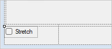
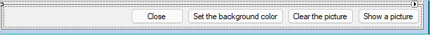
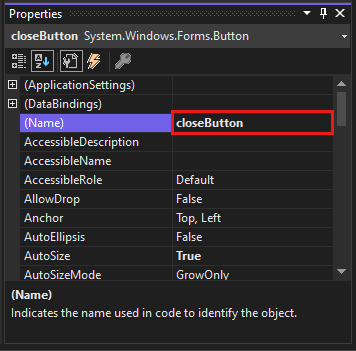
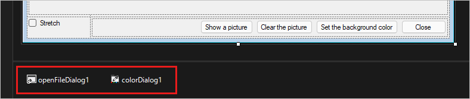

# Tutorial: Add UI controls to the picture viewer Windows Forms app in Visual Studio

 [!INCLUDE [Visual Studio](~/includes/applies-to-version/vs-windows-only.md)]

In this series of three tutorials, you'll create a Windows Forms application that loads a picture and displays it.
The Visual Studio Integrated Design Environment (IDE) provides the tools you need to create the app.
To learn more, see [Welcome to the Visual Studio IDE](../../get-started/visual-studio-ide.md).

This program has a picture box, a checkbox, and several buttons, which you use to control the application.
This tutorial shows you how to add these controls.

In this second tutorial, you learn how to:

> [!div class="checklist"]
> - Add controls to your application
> - Add buttons in a layout panel
> - Change control names and locations
> - Add dialog components

## Prerequisites

This tutorial builds on the previous tutorial, [Create a picture viewer application](tutorial-windows-forms-picture-viewer-layout.md).
If you haven't done that tutorial, go through that one first.

## Add controls to your application
The Picture Viewer app uses a PictureBox control to display a picture.
It uses a checkbox and several buttons to manage the picture and background and to close the app.
You'll add the PictureBox and a checkbox from the Toolbox in the Visual Studio IDE.

1. Open Visual Studio. Your Picture Viewer project appears under **Open recent**.

1. In the **Windows Forms Designer**, select the TableLayoutPanel you added in the previous tutorial.
   Check that **tableLayoutPanel1** appears in the **Properties** window.

1. On the left side of the Visual Studio IDE, select the **Toolbox** tab.
   If you don't see it, select **View** > **Toolbox** from the menu bar or **Ctrl**+**Alt**+**X**.
   In the toolbox, expand **Common Controls**.

1. Double-click **PictureBox** to add a PictureBox control to your form. Visual Studio IDE adds the PictureBox control to the first empty cell of the TableLayoutPanel.

1. Choose the new **PictureBox** control to select it, and then select the black triangle on the new PictureBox control to display its task list.

   

1. Select **Dock in Parent Container**, which sets the PictureBox **Dock** property to **Fill**.
   You can see that value in the **Properties** window.

1. In the **Properties** window for the PictureBox, set the **ColumnSpan** property to **2**.
   The PictureBox now fills both columns.

1. Set the **BorderStyle** property to **Fixed3D**.

1. In the **Windows Forms Designer**, select **TableLayoutPanel**.
   Then, in the **Toolbox**, double-click the **CheckBox** item to add a new CheckBox control.
   Your PictureBox takes up the first two cells in the TableLayoutPanel, so the CheckBox control is added to the lower-left cell.

1. Choose the **Text** property and enter **Stretch**.

    

## Add buttons in a layout panel

The controls so far have been added to the TableLayoutPanel.
These steps show you how to add four buttons to a new layout panel in the TableLayoutPanel.

1. Select the TableLayoutPanel on the form.
   Open the **Toolbox**, select **Containers**.
   Double-click **FlowLayoutPanel** to add a new control to the last cell of the TableLayoutPanel.

1. Set the FlowLayoutPanel's **Dock** property to **Fill**.
   You can set this property by selecting the black triangle, then selecting **Dock in parent container**.

   A <xref:System.Windows.Forms.FlowLayoutPanel> is a container that arranges other controls in a row, one after another.

1. Select the new FlowLayoutPanel, and then open the **Toolbox** and select **Common Controls**.
   Double-click the **Button** item to add a button control called **button1**.

1. Double-click **Button** again to  add another button. The IDE calls the next one **button2**.

1. Add two more buttons this way.
   Another option is to select **button2**, and then select **Edit** > **Copy** or press **Ctrl**+**C**.
   Next, choose **Edit** > **Paste** from the menu bar or press **Ctrl**+**V**.
   To paste a copy of your button. Now paste it again. Notice that the IDE adds **button3** and **button4** to the FlowLayoutPanel.

1. Select the first button and set its **Text** property to **Show a picture**.

1. Set the **Text** properties of the next three buttons to **Clear the picture**, **Set the background color**, and **Close**.

1. To size the buttons and arrange them, select the FlowLayoutPanel. Set the **FlowDirection** property to **RightToLeft**.

   The buttons should align themselves to the right side of the cell, and reverse their order so that the **Show a picture** button is on the right.
   You can drag the buttons around the FlowLayoutPanel to arrange them in any order.

1. Choose the **Close** button to select it. Then, to choose the rest of the buttons at the same time, press and hold the **Ctrl** key and choose them, too.

1. In the **Properties** window, set the **AutoSize** property to **True**.
   The buttons resize to fit their text.

    

You can run your program to see how the controls look. Select the **F5** key, select **Debug** > **Start Debugging**, or select the **Start** button.
The buttons that you added don't do anything, yet.

## Change control names

There are four buttons on your form, named **button1**, **button2**, **button3**, and **button4** in C#.
In Visual Basic, the default first letter of any control name is capitalized, so the buttons are named **Button1**, **Button2**, **Button3**, and **Button4**.
Use these steps to give them more informative names.

1. On the form, choose the **Close** button.
   If you still have all the buttons selected, choose **Esc** to cancel the selection.

1. In the **Properties** window, look for **(Name)**.
   Change the name to **closeButton**.

   

   The IDE doesn't accept names that contain spaces.

1. Rename the other three buttons to **backgroundButton**, **clearButton**, and **showButton**.
   You can verify the names by choosing the control selector drop-down list in the **Properties** window.
   The new button names appear.

You can change the name of any control, such as the TableLayoutPanel or checkbox.

## Add dialog components

Your app can open picture files and choose a background color by using components.
A component is like a control.
You use the **Toolbox** to add a component to your form.
You set its properties using the **Properties** window.

Unlike a control, adding a component to your form doesn't add a visible item.
Instead, it provides certain behaviors that you can trigger with code.
For instance, it's a component that opens an **Open File** dialog box.

In this section, you add an <xref:System.Windows.Forms.OpenFileDialog> component and a <xref:System.Windows.Forms.ColorDialog> component to your form.

1. Select the **Windows Forms Designer** (**Form1.cs [Design]**). Then open the **Toolbox** and select the **Dialogs** group.

1. Double-click **OpenFileDialog** to add a component called **openFileDialog1** to your form.

1. Double-click **ColorDialog** to add a component called **colorDialog1**.
   The components appear at the bottom of **Windows Forms Designer** as icons.

   

1. Choose the **openFileDialog1** icon and set two properties:

   - Set the **Filter** property to the following:

     ```console
     JPEG Files (*.jpg)|*.jpg|PNG Files (*.png)|*.png|BMP Files (*.bmp)|*.bmp|All files (*.*)|*.*
     ```

   - Set the **Title** property to the following: **Select a picture file**

   The **Filter** property settings specify the types that the **Select a picture** dialog box displays.

## Next steps

Advance to the next tutorial to learn how to add code to your application.
> [!div class="nextstepaction"]
> [Tutorial part 3: Add code to your Picture Viewer](tutorial-windows-forms-picture-viewer-code.md)
