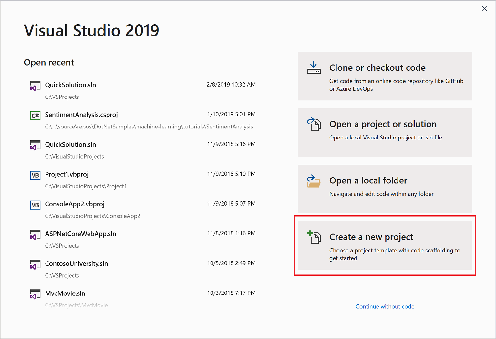

## Create a program

Let's dive in and create a simple program.

::: moniker range="vs-2017"

1. Open Visual Studio. On the menu, choose **File** > **New** > **Project**.

   

2. The **New Project** dialog box shows several project *templates*. A template contains the basic files and settings needed for a given project type. Choose the **.NET Core** category under **Visual C#**, and then choose the **Console App (.NET Core)** template. In the **Name** text box, type **HelloWorld**, and then select the **OK** button.

   

   > [!NOTE]
   > If you don't see the **.NET Core** category, you need to install the **.NET Core cross-platform development** workload. To do this, choose the **Open Visual Studio Installer** link on the bottom left of the **New Project** dialog. After Visual Studio Installer opens, scroll down and select the **.NET Core cross-platform development** workload, and then select **Modify**.

::: moniker-end

::: moniker range=">=vs-2019"

1. Open Visual Studio. The Start window appears with various options for cloning a repo, opening a recent project, or creating a brand new project. That's what we want to do, so choose **Create a new project**.

   

2. The **Create a new project** window opens and shows several project *templates*. A template contains the basic files and settings needed for a given project type. To find the template we want, type or enter **.net core console** in the search box. The list of available templates is automatically filtered based on the keywords you entered. You can further filter the template results by choosing **C#** from the **Language** drop-down list. Select the **Console App (.NET Core)** template, and then choose **Next**.

    

3. In the **Configure your new project** window, enter **HelloWorld** in the **Project name** box, optionally change the directory location for your project files, and then choose **Create**.

   

::: moniker-end

   Visual Studio creates the project. It's a simple "Hello World" application that calls the <xref:System.Console.WriteLine?displayProperty=nameWithType> method to display the literal string "Hello World!" in the console (program output) window.

   Shortly, you should see something like the following:

::: moniker range="vs-2017"

   

::: moniker-end

::: moniker range=">=vs-2019"

   

::: moniker-end

   The C# code for your application shows in the editor window, which takes up most of the space. Notice that the text is automatically colorized to indicate different parts of the code, such as keywords and types. In addition, small, vertical dashed lines in the code indicate which braces match one another, and line numbers help you locate code later. You can choose the small, boxed minus signs to collapse or expand blocks of code. This code outlining feature lets you hide code you don't need, helping to minimize onscreen clutter. The project files are listed on the right side in a window called **Solution Explorer**.

::: moniker range="vs-2017"

   

::: moniker-end

::: moniker range=">=vs-2019"

   

::: moniker-end

   There are other menus and tool windows available, but let's move on for now.

::: moniker range="vs-2017"

3. Now, start the app. You can do this by choosing **Start Without Debugging** from the **Debug** menu on the menu bar. You can also press **Ctrl**+**F5**.

   

   Visual Studio builds the app, and a console window opens with the message **Hello World!**. You now have a running app!

   

::: moniker-end

::: moniker range=">=vs-2019"

3. Now, start the app. You can do this by choosing **Start Without Debugging** from the **Debug** menu on the menu bar. You can also press **Ctrl**+**F5**.

   

   Visual Studio builds the app, and a console window opens with the message **Hello World!**. You now have a running app!

   

::: moniker-end

4. To close the console window, press any key on your keyboard.

5. Let's add some additional code to the app. Add the following C# code before the line that says `Console.WriteLine("Hello World!");`:

   ```csharp
   Console.WriteLine("\nWhat is your name?");
   var name = Console.ReadLine();
   ```

   This code displays **What is your name?** in the console window, and then waits until the user enters some text followed by the **Enter** key.

6. Change the line that says `Console.WriteLine("Hello World!");` to the following code:

   ```csharp
   Console.WriteLine($"\nHello {name}!");
   ```

7. Run the app again by selecting **Debug** > **Start Without Debugging** or by pressing **Ctrl**+**F5**.

   Visual Studio rebuilds the app, and a console window opens and prompts you for your name.

::: moniker range="vs-2017"

8. Enter your name in the console window and press **Enter**.

   

::: moniker-end

::: moniker range=">=vs-2019"

8. Enter your name in the console window and press **Enter**.

   

::: moniker-end

9. Press any key to close the console window and stop the running program.

## Use refactoring and IntelliSense

Let's look at a couple of the ways that [refactoring](../../ide/refactoring-in-visual-studio.md) and [IntelliSense](../../ide/using-intellisense.md) can help you code more efficiently.

First, let's rename the `name` variable:

1. Double-click the `name` variable to select it.

2. Type in the new name for the variable, **username**.

   Notice that a gray box appears around the variable, and a light bulb appears in the margin.

::: moniker range="vs-2017"

3. Select the light bulb icon to show the available [Quick Actions](../../ide/quick-actions.md). Select **Rename 'name' to 'username'**.

   

   The variable is renamed across the project, which in our case is only two places.

   

::: moniker-end

::: moniker range=">=vs-2019"

3. Select the light bulb icon to show the available [Quick Actions](../../ide/quick-actions.md). Select **Rename 'name' to 'username'**.

   

   The variable is renamed across the project, which in our case is only two places.

::: moniker-end

4. Now let's take a look at IntelliSense. Below the line that says `Console.WriteLine($"\nHello {username}!");`, type `DateTime now = DateTime.`.

   A box displays the members of the <xref:System.DateTime> class. In addition, the description of the currently selected member displays in a separate box.

   

5. Select the member named **Now**, which is a property of the class, by double-clicking on it or pressing **Tab**. Complete the line of code by adding a semi-colon to the end.

6. Below that, type in or paste the following lines of code:

   ```csharp
   int dayOfYear = now.DayOfYear;

   Console.Write("Day of year: ");
   Console.WriteLine(dayOfYear);
   ```

   > [!TIP]
   > <xref:System.Console.Write%2A?displayProperty=nameWithType> is a little different to <xref:System.Console.WriteLine%2A?displayProperty=nameWithType> in that it doesn't add a line terminator after it prints. That means that the next piece of text that's sent to the output will print on the same line. You can hover over each of these methods in your code to see their description.

7. Next, we'll use refactoring again to make the code a little more concise. Click on the variable `now` in the line `DateTime now = DateTime.Now;`.

   Notice that a little screwdriver icon appears in the margin on that line.

8. Click the screwdriver icon to see what suggestions Visual Studio has available. In this case, it's showing the [Inline temporary variable](../../ide/reference/inline-temporary-variable.md) refactoring to remove a line of code without changing the overall behavior of the code:

   

9. Click **Inline temporary variable** to refactor the code.

::: moniker range="vs-2017"

10. Run the program again by pressing **Ctrl**+**F5**. The output looks something like this:

   

::: moniker-end

::: moniker range=">=vs-2019"

10. Run the program again by pressing **Ctrl**+**F5**. The output looks something like this:

   

::: moniker-end

## Debug code

When you write code, you need to run it and test it for bugs. Visual Studio's debugging system lets you step through code one statement at a time and inspect variables as you go. You can set *breakpoints* that stop execution of the code at a particular line. You can observe how the value of a variable changes as the code runs, and more.

Let's set a breakpoint to see the value of the `username` variable while the program is "in flight".

1. Find the line of code that says `Console.WriteLine($"\nHello {username}!");`. To set a breakpoint on this line of code, that is, to make the program pause execution at this line, click in the far left margin of the editor. You can also click anywhere on the line of code and then press **F9**.

   A red circle appears in the far left margin, and the code is highlighted in red.

   

1. Start debugging by selecting **Debug** > **Start Debugging** or by pressing **F5**.

1. When the console window appears and asks for your name, type it in and press **Enter**.

   The focus returns to the Visual Studio code editor and the line of code with the breakpoint is highlighted in yellow. This signifies that it's the next line of code that the program will execute.

1. Hover your mouse over the `username` variable to see its value. Alternatively, you can right-click on `username` and select **Add Watch** to add the variable to the **Watch** window, where you can also see its value.

   

1. To let the program run to completion, press **F5** again.

To get more details about debugging in Visual Studio, see [Debugger feature tour](../../debugger/debugger-feature-tour.md).

## Customize Visual Studio

You can personalize the Visual Studio user interface, including change the default color theme. To change to the **Dark** theme:

1. On the menu bar, choose **Tools** > **Options** to open the **Options** dialog.

::: moniker range="vs-2017"

2. On the **Environment** > **General** options page, change the **Color theme** selection to **Dark**, and then choose **OK**.

   The color theme for the entire IDE changes to **Dark**.

   

::: moniker-end

::: moniker range=">=vs-2019"

2. On the **Environment** > **General** options page, change the **Color theme** selection to **Dark**, and then choose **OK**.

   The color theme for the entire IDE changes to **Dark**.

   

::: moniker-end

To learn about other ways you can personalize the IDE, see [Personalize Visual Studio](../../ide/personalizing-the-visual-studio-ide.md).