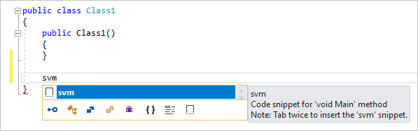
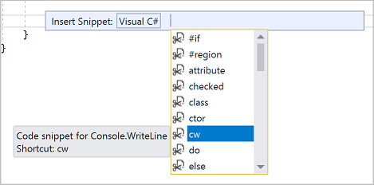
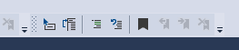
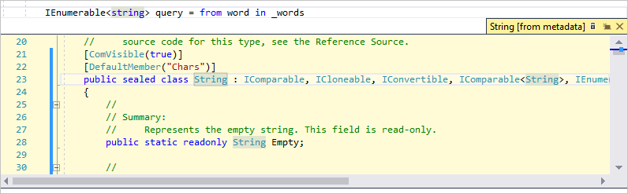
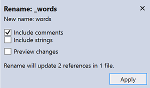

# Learn to use the code editor

In this introduction to the Visual Studio code editor, you’ll add code to a file and explore how Visual Studio helps make writing, navigating, and understanding code easier.

::: moniker range="vs-2019"

> [!TIP]
> If you don't have Visual Studio, go to [Visual Studio downloads](https://aka.ms/vs/download/?cid=learn-onpage-download-cta) to install it for free.

::: moniker-end

::: moniker range=">=vs-2022"

If you haven't already installed Visual Studio, go to the [Visual Studio downloads](https://aka.ms/vs/download/?cid=learn-onpage-download-cta) page to install it for free.

::: moniker-end

This article assumes you're already familiar with a programming language. If you aren't, we suggest you look at one of the programming quickstarts first, such as create a web app with [Python](../ide/quickstart-python.md) or [C#](../get-started/csharp/tutorial-aspnet-core.md), or create a console app with [Visual Basic](visual-basic/tutorial-console.md) or [C++](/cpp/get-started/tutorial-console-cpp).

::: moniker range=">=vs-2022"

## Prerequisites

- Visual Studio with C# development settings configured. To configure settings, see [Select environment settings](csharp/visual-studio-ide.md#select-environment-settings).

::: moniker-end

## Create a new code file

Create a new file and add some code to it.

::: moniker range="vs-2019"

1. Open Visual Studio. Press **Esc** or select **Continue without code** on the start window to open the development environment.

1. From the **File** menu on the menu bar, select **New** > **File**.

1. In the **New File** dialog box, under the **General** category, select **Visual C# Class**, and then select **Open**.

   A new file opens in the editor with the skeleton of a C# class. (Notice that we don't have to create a full Visual Studio project to gain some of the benefits that the code editor offers; all you need is a code file!)

   

::: moniker-end

::: moniker range=">=vs-2022"

1. Open Visual Studio. Select the **Esc** key, or select **Continue without code** on the start window, to open the development environment.

1. From the **File** menu on the menu bar, select **New** > **File**, or select the **Ctrl**+**N** keys.

1. In the **New File** dialog box, under the **General** category, select **C# Class**, and then select **Open**.

   A new file opens in the editor with a basic C# class structure.

   :::image type="content" source="media/vs-2022/tutorial-editor.png" alt-text="Screenshot of a C# code file in Visual Studio 2022.":::

::: moniker-end

::: moniker range=">=vs-2022"

## Use GitHub Copilot

GitHub Copilot acts as an AI pair programmer to provide autocomplete-style code completions and context-aware multi-line code suggestions, as you code, in real-time, right in the editor. GitHub Copilot turns natural language prompts including comments and method names into coding suggestions. You can view and incorporate suggestions from GitHub Copilot directly within the editor.

> [!div class="button"]
> [Try GitHub Copilot](../ide/visual-studio-github-copilot-extension.md#prerequisites)

Let's use Copilot to generate code suggestions:

1. Place your cursor just below the final closing brace **}** in the file.
1. Type a natural language comment: `// Add a method to add two numbers` and **Enter**.
1. GitHub Copilot generates a code suggestion for you. The suggested implementation shows in gray text.
1. To accept the suggestion, select **Tab**.

   :::image type="content" source="media/vs-2022/tutorial-editor/github-copilot-suggestions-visual-studio.gif" alt-text="Animated screenshot that shows the code suggestions generated by GitHub Copilot for the user comment." lightbox="media/vs-2022/tutorial-editor/github-copilot-suggestions-visual-studio.gif":::

Let's use Copilot Chat to submit a coding-related question as a prompt:

1. Select the **GitHub Copilot** badge in the upper-right corner of the IDE.
2. Select **Open Chat Window** from the dropdown.
3. Enter the following prompt in the chat window:

   ```copilot-prompt

   Generate sample code for a simple C# method to add two numbers.
   
   ```

4. Copilot Chat generates sample code in response to your prompt.

GitHub Copilot is powered by AI, so surprises and mistakes are possible. For more information, see [GitHub Copilot FAQs](https://github.com/features/copilot#faq).

Get started with [GitHub Copilot in Visual Studio](../ide/visual-studio-github-copilot-install-and-states.md).

::: moniker-end

## Use code snippets

Visual Studio provides useful code snippets that you can use to quickly generate commonly used code blocks. Code snippets are available for several programming languages, including C#, Visual Basic, and C++. 

Now add the C# `void Main` snippet to your file.

::: moniker range="<=vs-2019"

1. Place your cursor just above the final closing brace **}** in the file, and type the characters `svm`. (`svm` stands for `static void Main`; the [Main()](/dotnet/csharp/programming-guide/main-and-command-args/) method is the entry point for C# applications.)

   A pop-up dialog box appears with information about the `svm` code snippet.

   

1. Press **Tab** twice to insert the code snippet.

   You'll see the `static void Main()` method signature get added to the file.

The available code snippets vary for different programming languages. You can look at the available code snippets for your language by choosing **Edit** > **IntelliSense** > **Insert Snippet**, and then choosing your language's folder. For C#, the list looks like this:



::: moniker-end

::: moniker range=">=vs-2022"

1. Place your cursor just above the final closing brace **`}`** in the file, and type the characters `svm`.

   A pop-up dialog box appears with information about the `svm` code snippet.

   :::image type="content" source="media/vs-2022/tutorial-intellisense-snippet.png" alt-text="Screenshot of an IntelliSense pop-up for a code snippet in Visual Studio 2022.":::

1. Select the **Tab** key twice to insert the code snippet.

   You'll see the `static void Main()` method signature get added to the file. The [Main()](/dotnet/csharp/programming-guide/main-and-command-args/) method is the entry point for C# applications.

Available code snippets vary by programming language. To view the available code snippets for your language, go to **Edit** > **IntelliSense** > **Insert Snippet** or select **Ctrl**+**K**, **Ctrl**+**X** keys, then select the folder for your programming language. For C#, the code snippet list looks like this:

:::image type="content" source="media/vs-2022/tutorial-code-snippet-list.png" alt-text="Screenshot of an IntelliSense pop-up for a C# code snippet list.":::

::: moniker-end

The list includes snippets for creating a [class](/dotnet/csharp/fundamentals/types/classes), a [constructor](/dotnet/csharp/programming-guide/classes-and-structs/constructors), a [for](/dotnet/csharp/language-reference/statements/iteration-statements#the-for-statement) loop, an [if](/dotnet/csharp/language-reference/statements/selection-statements#the-if-statement) or [switch](/dotnet/csharp/language-reference/statements/selection-statements#the-switch-statement) statement, and more.

## Comment out code

::: moniker range="<=vs-2019"

The toolbar, which is the row of buttons under the menu bar in Visual Studio, can help make you more productive as you code. For example, you can toggle IntelliSense completion mode ([IntelliSense](../ide/using-intellisense.md) is a coding aid that displays a list of matching methods, amongst other things), increase or decrease a line indent, or comment out code that you don't want to compile. In this section, we'll comment out some code.



1. Paste the following code into the `Main()` method body.

    ```csharp
    // _words is a string array that we'll sort alphabetically
    string[] _words = {
        "the",
        "quick",
        "brown",
        "fox",
        "jumps"
    };

    string[] morewords = {
        "over",
        "the",
        "lazy",
        "dog"
    };

    IEnumerable<string> query = from word in _words
                                orderby word.Length
                                select word;
    ```

1. We're not using the `morewords` variable, but we may use it later so we don't want to completely delete it. Instead, let's comment out those lines. Select the entire definition of `morewords` to the closing semi-colon, and then choose the **Comment out the selected lines** button on the toolbar. If you prefer to use the keyboard, press **Ctrl**+**K**, **Ctrl**+**C**.

   

   The C# comment characters `//` are added to the beginning of each selected line to comment out the code.

::: moniker-end

::: moniker range=">=vs-2022"

The Text Editor toolbar, the row of buttons under the menu bar in Visual Studio, helps make you more productive as you code. For example, you can toggle [IntelliSense](../ide/using-intellisense.md) completion mode, increase or decrease a line indent, or comment out code you don't want to compile.

:::image type="content" source="media/vs-2022/tutorial-editor-toolbar.png" alt-text="Screenshot of the Text Editor toolbar in Visual Studio 2022.":::

Let's comment out some code.

1. Paste the following code into the `Main()` method body.

    ```csharp
    // someWords is a string array.
    string[] someWords = {
        "the",
        "quick",
        "brown",
        "fox",
        "jumps"
    };

    string[] moreWords = {
        "over",
        "the",
        "lazy",
        "dog"
    };

    // Alphabetically sort the words.
    IEnumerable<string> query = from word in someWords
                                orderby word
                                select word;
    ```

1. The `moreWords` variable isn't currently being used, but you might use it later, so instead of deleting it, you can comment out those lines. Select the entire definition of `moreWords` down to the closing semicolon, and then select the **Comment out the selected lines** button on the Text Editor toolbar, or select **Ctrl**+**K**, **Ctrl**+**C**.

   :::image type="content" source="media/vs-2022/tutorial-comment-out.png" alt-text="Screenshot of the Comment out button in the Text Editor toolbar in Visual Studio 2022.":::

   The C# comment characters `//` are added to the beginning of each selected line to comment out the code.

   To uncomment lines, you can select them, and then select **Uncomment the selected lines** button on the Text Editor toolbar, or select **Ctrl**+**K**, **Ctrl**+**U**.

   :::image type="content" source="media/vs-2022/tutorial-uncomment.png" alt-text="Screenshot of the Uncomment button in the Text Editor toolbar in Visual Studio 2022.":::

::: moniker-end

## Collapse code blocks

::: moniker range="<=vs-2019"

We don't want to see the empty [constructor](/dotnet/csharp/programming-guide/classes-and-structs/constructors) that was generated for `Class1`, so to unclutter our view of the code, let's collapse it. Choose the small gray box with the minus sign inside it in the margin of the first line of the constructor. Or, if you prefer to use the keyboard, place the cursor anywhere in the constructor code and press **Ctrl**+**M**, **Ctrl**+**M**.


The code block collapses to just the first line, followed by an ellipsis (`...`). To expand the code block again, click the same gray box that now has a plus sign in it, or press **Ctrl**+**M**, **Ctrl**+**M** again. This feature is called [Outlining](../ide/outlining.md) and is especially useful when you're collapsing long methods or entire classes.

::: moniker-end

::: moniker range=">=vs-2022"

If you don't want to see the empty [constructor](/dotnet/csharp/programming-guide/classes-and-structs/constructors) that was generated for `Class1`, you can collapse it to unclutter your view of the code. Select the caret sign in the margin of the first line of the constructor. Or, if you prefer to use the keyboard, place the cursor anywhere in the constructor code and select the **Ctrl**+**M**, **Ctrl**+**M** keys.

:::image type="content" source="media/vs-2022/tutorial-collapse-down-arrow.png" alt-text="Screenshot of the Outlining collapse button in the Text Editor toolbar.":::

The code block collapses to just the first line, followed by an ellipsis (`...`). To expand the code block again, select the caret sign (`>`), or select **Ctrl**+**M**, **Ctrl**+**M** again. This feature is called [Outlining](../ide/outlining.md) and is especially useful when you're collapsing long methods or entire classes.

::: moniker-end

## View symbol definitions

::: moniker range="<=vs-2019"

The Visual Studio editor makes it easy to inspect the definition of a type, method, etc. One way is to navigate to the file that contains the definition, for example by choosing **Go to Definition** anywhere the symbol is referenced. An even quicker way that doesn't move your focus away from the file you're working in is to use [Peek Definition](../ide/go-to-and-peek-definition.md#peek-at-a-definition). Let's peek at the definition of the `string` type.

1. Right-click on any occurrence of `string` and choose **Peek Definition** from the content menu. Or, press **Alt**+**F12**.

   A pop-up window appears with the definition of the `String` class. You can scroll within the pop-up window, or even peek at the definition of another type from the peeked code.

   

1. Close the peeked definition window by choosing the small box with an "x" at the top right of the pop-up window.

::: moniker-end

::: moniker range=">=vs-2022"

The Visual Studio editor makes it easy to inspect the definition of a type, method, or variable. One way is to go to the definition, in whichever file has it, by choosing **Go to Definition** or by selecting the **F12** key anywhere a symbol is referenced. An even quicker way that doesn't move your focus away from the code you're working on is to use [Peek Definition](../ide/go-to-and-peek-definition.md#peek-at-a-definition).

Let's peek at the definition of the `string` type.

1. Right-click on any occurrence of `string` and choose **Peek Definition** from the content menu. Or, select the **Alt**+**F12** keys.

   A pop-up window appears with the definition of the `String` class. You can scroll within the pop-up window, or even peek at the definition of another type from the peeked code.

   :::image type="content" source="media/vs-2022/tutorial-symbol-peek-definition.png" alt-text="Screenshot of the Peek definition window in Visual Studio.":::

1. Close the peek definition window by choosing the small box with an "x" at the top right of the pop-up window.

::: moniker-end

## Use IntelliSense to complete words

::: moniker range="<=vs-2019"

[IntelliSense](../ide/using-intellisense.md) is an invaluable resource when you're coding. It can show you information about available members of a type, or parameter details for different overloads of a method. You can also use IntelliSense to complete a word after you type enough characters to disambiguate it. Let's add a line of code to print out the ordered strings to the console window, which is the standard place for output from the program to go.

1. Below the `query` variable, start typing the following code:

   ```csharp
   foreach (string str in qu
   ```

   You see IntelliSense show you **Quick Info** about the `query` symbol.

   

1. To insert the rest of the word `query` by using IntelliSense's word completion functionality, press **Tab**.

1. Finish off the code block to look like the following code. You can even practice using code snippets again by entering `cw` and then pressing **Tab** twice to generate the `Console.WriteLine` code.

   ```csharp
   foreach (string str in query)
   {
      Console.WriteLine(str);
   }
   ```

::: moniker-end

::: moniker range=">=vs-2022"

[IntelliSense](../ide/using-intellisense.md) is an invaluable resource when you're coding. It can show you information about available members of a type, or parameter details for different overloads of a method. You can also use IntelliSense to complete a word after you type enough characters to disambiguate it.

Let's add a line of code to print out the ordered strings to the console window, which is the standard place for output from the program to go.

1. Below the `query` variable, start typing the following code:

   ```csharp
   foreach (string str in qu
   ```

   You'll see an IntelliSense pop-up appear with information about the `query` symbol.

   :::image type="content" source="media/vs-2022/tutorial-intellisense-completion-list.png" alt-text="Screenshot of an IntelliSense word completion pop-up in Visual Studio 2022.":::

   If you're signed in with a GitHub account that has a Copilot subscription, you'll also see code suggestions appear in gray text.

1. To insert the rest of the word `query` by using IntelliSense word completion, select the **Tab** key.

1. Finish off the code block to look like the following code. You can practice further with code snippets by entering `cw` and then selecting **Tab** twice to generate the `Console.WriteLine` statement.

   ```csharp
   foreach (string str in query)
   {
      Console.WriteLine(str);
   }
   ```

::: moniker-end

## Refactor a name

::: moniker range="<=vs-2019"

Nobody gets code right the first time, and one of the things you might have to change is the name of a variable or method. Let's try out Visual Studio's [refactor](../ide/refactoring-in-visual-studio.md) functionality to rename the `_words` variable to `words`.

1. Place your cursor over the definition of the `_words` variable, and choose **Rename** from the right-click or context menu, or press **Ctrl**+**R**, **Ctrl**+**R**.

   A pop-up **Rename** dialog box appears at the top right of the editor.

1. Enter the desired name **words**. Notice that the reference to `words` in the query is also automatically renamed. Before you press **Enter**, select the **Include comments** checkbox in the **Rename** pop-up box.

   

1. Press **Enter**.

   Both occurrences of `words` have been renamed, as well as the reference to `words` in the code comment.

::: moniker-end

::: moniker range=">=vs-2022"

Nobody gets code right the first time, and one of the things you might have to change is the name of a variable or method. Let's try out Visual Studio's [refactor](../ide/refactoring-in-visual-studio.md) functionality to rename the `someWords` variable to `unsortedWords`.

1. Place your cursor over the definition of the `someWords` variable, and choose **Rename** from the right-click or context menu, or select the **F2** key.

   A **Rename** dialog box appears at the top right of the editor.

   :::image type="content" source="media/vs-2022/tutorial-rename-start.png" alt-text="Screenshot of the Rename pop-up box within the editor of Visual Studio 2022.":::

1. Enter the desired name **unsortedWords**. You'll see that the reference to `unsortedWords` in the `query` assignment statement is also automatically renamed. Before you select the **Enter** key, select the **Include comments** checkbox in the **Rename** pop-up box.

   :::image type="content" source="media/vs-2022/tutorial-rename.png" alt-text="Screenshot of the Rename pop-up box in Visual Studio 2022.":::

1. Select the **Enter** key.

   Both occurrences of `someWords` in your code have been renamed, as well as the text `someWords` in your code comment.

::: moniker-end

## Next steps

> [!div class="nextstepaction"]
> [Learn about projects and solutions](../get-started/tutorial-projects-solutions.md)

## See also

- [GitHub Copilot Completions in Visual Studio](../ide/visual-studio-github-copilot-extension.md)
- [GitHub Copilot Chat in Visual Studio](../ide//visual-studio-github-copilot-chat.md)
- [Code snippets](../ide/code-snippets.md)
- [Navigate code](../ide/navigating-code.md)
- [Outlining](../ide/outlining.md)
- [Go To Definition and Peek Definition](../ide/go-to-and-peek-definition.md)
- [Refactoring](../ide/refactoring-in-visual-studio.md)
- [Use IntelliSense](../ide/using-intellisense.md)
