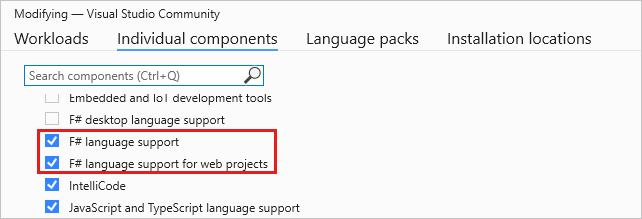
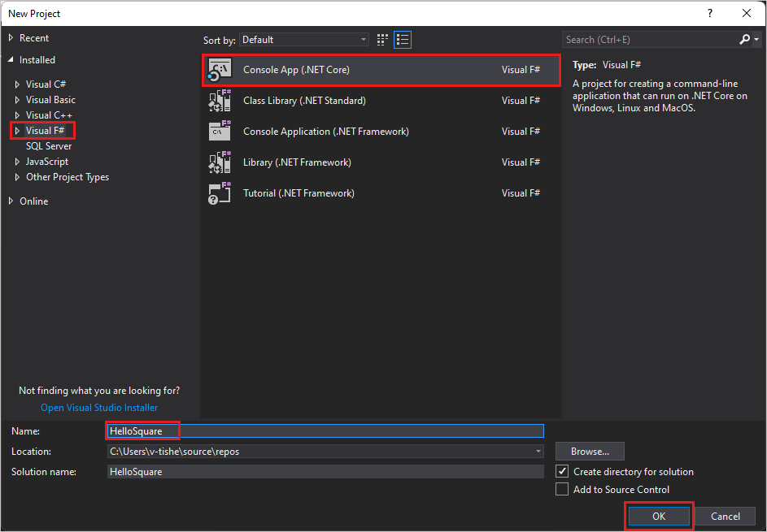
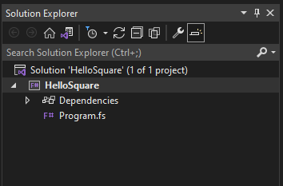
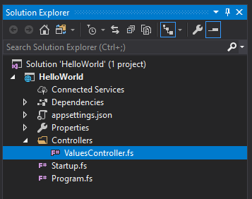

# Tutorial: Create an ASP.NET Core web service in F#

The Visual Studio Integrated Development Environment (IDE) supports F# for several product types.
You can easily create all types of projects, from simple console applications to full web services apps.

In this tutorial, you learn how to:

> [!div class="checklist"]
> - Create a simple Hello World program in F#.
> - Create an ASP.NET Core web service.
> - Add content to the **HttpGet** member.
> - Build and run your programs.

## Prerequisites

::: moniker range="vs-2017"
You need Visual Studio to complete this tutorial.
Visit the [Visual Studio downloads page](https://visualstudio.microsoft.com/vs/older-downloads/?utm_medium=microsoft&utm_source=docs.microsoft.com&utm_campaign=vs+2017+download) for a free version.
::: moniker-end
::: moniker range="vs-2019"
You need Visual Studio to complete this tutorial.
Visit the [Visual Studio downloads page](https://visualstudio.microsoft.com/vs/) for a free version.
::: moniker-end
::: moniker range=">=vs-2022"
You need Visual Studio to complete this tutorial.
Visit the [Visual Studio downloads page](https://visualstudio.microsoft.com/downloads) for a free version.
::: moniker-end

Be sure you have the necessary components installed:

1. Select the **Start** Windows icon and type *Visual Studio Installer*.
1. Select **Modify** to see your installed workloads.
1. Make sure that **ASP.NET and web development** is selected, or add it.

   

1. Select **Individual components** and verify that **F# language support** and **F# language support for web projects** are selected.

   

1. If you made any changes, select **Modify** to install the components.

## Create a console app

This console application finds the square of a hard-coded value and displays the result.

::: moniker range="vs-2017"
1. Open Visual Studio. On the menu bar, select **File** > **New** > **Project**.

1. On the left side of the **New Project** dialog box, select **Visual F#**, and then select **Console App (.NET Core)**.

   

1. For the **Name**, enter *HelloSquare*, and then select **OK**.

   Visual Studio creates the new F# project. You can see it in the Solution Explorer window.

   

1. Select **Program.fs** to open the program file and replace the current code with this code:

   ```fsharp
   module HelloSquare

   let square x = x * x

   [<EntryPoint>]
   let main argv =
       printfn "%d squared is: %d!" 12 (square 12)
       0 // Return an integer exit code
   ```

   > [!NOTE]
   > Spaces are significant in F#.
   > Intellisense highlights problems with indentation.

1. Use one of these methods to run your app:

   - Select the **F5** key.
   - On the menu bar, select **Debug** > **Start Debugging**.
   - On the toolbar, select the **Start** button.

   The app opens a console window and displays the following message:

   ```console
   12 squared is: 144!
   ```

::: moniker-end
::: moniker range=">=vs-2019"
1. Open Visual Studio. On the start window, select **Create a new project**.

1. Select **F#** from the languages list.

1. Select **Console App**. You'll see **F#** in the icon. Then select **Next**.

1. For **Project name**, enter *HelloSquare*, and then select **Next**.

1. Select a framework, and then select **Create**.

   Visual Studio creates the new F# project. You can see it in the Solution Explorer window.

   

1. Select **Program.fs** to open the program file and replace the current code with this code:

   ```fsharp
   module HelloSquare

   let square x = x * x

   [<EntryPoint>]
   let main argv =
       printfn "%d squared is: %d!" 12 (square 12)
       0 // Return an integer exit code
   ```

   > [!NOTE]
   > Spaces are significant in F#.
   > Intellisense highlights problems with indentation.

1. Use one of these methods to run your app:

   - Select the **F5** key.
   - On the menu bar, select **Debug** > **Start Debugging**.
   - On the toolbar, select the **Start** button.

   The app opens a console window and displays the following message:

   ```console
   12 squared is: 144!
   ```

::: moniker-end

For more information about coding in F#, see [What is F#](/dotnet/fsharp/what-is-fsharp).

## Create an ASP.NET Core web service

In this section, you'll create an ASP.NET Core Web API project.
The project type comes with template files that constitute a functional web service, before you've even added anything.
You can use the knowledge from the previous section for this new project.

::: moniker range="vs-2017"
1. From the top menu bar, choose **File** > **New** > **Project**.

1. In the **New Project** dialog box, in the left pane, expand **Visual F#**, then choose **Web**. In the middle pane, select **ASP.NET Core Web Application**.

1. For **Name**, type *FSharpTutorial*, and then select **OK**.

1. In the **New ASP.NET Core Web Application** dialog box, select **ASP.NET Core 2.1**.

   > [!NOTE]
   > ASP.NET Core 2.1 is no longer supported.
   > We don't recommend using unsupported options for production environments.

1. In **Solution Explorer**, expand the **Controllers** folder, then choose **ValuesController.fs** to open it in the editor.

   

1. Next, modify the existing `Get()` member example to match the following code:

   ```fsharp
   [<HttpGet>]
   member this.Get() =
       let values = [|"Hello"; "World"; "First F#/ASP.NET Core web API!"|]
       ActionResult<string[]>(values)
   ```

   This code contains an F# array of values that are is bound to the `values` name.
   It passes the values to the ASP.NET Core model-view-controller framework as an `ActionResult`.
   ASP.NET Core takes care of the rest for you.

1. Select the **F5** key to run your project.
   A browser window opens to display your Hello World message.

::: moniker-end
::: moniker range=">=vs-2019"
1. Select **File** > **New** > **Project** to open the start window.
   If you've previously closed Visual Studio, open it again to see the start window.

   If you have any unsaved work, Visual Studio prompts you to save it.

1. Select **Create a new project**.

1. On the **Create a new project** page, type **f# web** into the search box. Select the **ASP.NET Core Web API** project template, and then select **Next**.

1. In the **Configure your new project** dialog box, for **Project name**, enter *FSharpTutorial*.

1. In the **Additional information** dialog box, select a **Framework**.
   This tutorial uses **.NET 5.0**.

   > [!NOTE]
   > Some of the options in this menu are no longer supported.
   > We don't recommend using unsupported options for production environments.

   Visual Studio creates the new F# project. You can see the project components in the Solution Explorer window.
   Visual Studio presents an **Overview** page.

1. In the **Solution Explorer** toolbar, expand the **Controllers** folder, then choose the controller to open the code file in the editor.

   

1. Next, modify the `Get()` member to be the following code:

   ```fsharp
   [<HttpGet>]
   member this.Get() =
       let values = [|"Hello"; "World"; "First F#/ASP.NET Core web API!"|]
       ActionResult<string[]>(values)
   ```

   This code contains an F# array of values that are is bound to the `values` name.
   It passes the values to the ASP.NET Core model-view-controller framework as an `ActionResult`.
   ASP.NET Core takes care of the rest for you.

1. Select the **F5** key to run your project.
   A browser window opens to display your Hello World message.

::: moniker-end

## Next steps

If you haven't already, check out the [Tour of F#](/dotnet/fsharp/tour).
This tour describes the core features of the F# language.
It provides an overview of some of the capabilities of F# and code samples that you can run.

> [!div class="nextstepaction"]
> [Tour of F#](/dotnet/fsharp/tour)

## See also

- [F# language reference](/dotnet/fsharp/language-reference/index)
- [Type inference](/dotnet/fsharp/language-reference/type-inference)
- [Symbol and operator reference](/dotnet/fsharp/language-reference/symbol-and-operator-reference/index)
